# AI CONTEXT - sec_interp
Automatically generated by Ai-Context-Core

## 📁 PROJECT STRUCTURE

./
    .ai_context_cache.json
    .analyzer_state.json
    .analyzerignore
    .bandit
    .coverage
    .dockerignore
    .flake8
    ... (+32 more)
    i18n/
        SecInterp_de.qm
        SecInterp_de.ts
        SecInterp_es.qm
        SecInterp_es.ts
        SecInterp_fr.qm
        SecInterp_fr.ts
        SecInterp_pt_BR.qm
        ... (+2 more)
    help/
        html/
            .nojekyll
            ARCHITECTURE.html
            DEVELOPMENT_GUIDE.html
            MAINTENANCE_LOG.html
            TECHNICAL_COMPENDIUM.html
            USER_GUIDE.html
            genindex.html
            ... (+118 more)
    scripts/
        .ai_context_cache.json
        AI_CONTEXT.md
        PROJECT_SUMMARY.md
        build_docs.sh
        clean_imports.py
        fix-ui-syntax.sh
        generate_ai_templates.py
        ... (+10 more)
    docs/
        ARCHITECTURE_EN.md
        CHANGELOG.md
        CORE_DISTINCTION_GUIDE.md
        CORE_DISTINCTION_GUIDE_EN.md
        DEVELOPMENT_LOG.md
        LOGGING_GUIDELINES.md
        PLUGIN_ANALYSIS.md
        ... (+1 more)
        images/
            ui_main_dialog.png
            workflow_01_select_dem.png
            workflow_02_select_dem.png

## 🎯 ENTRY POINTS

## 🏗️ DETECTED PATTERNS
No clear design patterns detected.

## 📈 COMPLEXITY AND METRICS
- **Total Modules**: 52
- **Source Lines (SLOC)**: 2,167
- **Total Physical Lines**: 3,798
- **Functions**: 113
- **Classes**: 42
- **Average Complexity**: 4.6
- **Avg Maintenance Index**: 63.3
- **Most Complex Modules**: core/utils/geometry_utils/optimization.py, core/utils/parsing.py, core/utils/spatial.py

## 🔗 PRIMARY DEPENDENCIES
### Third Party (most frequent):
- `qgis` (40 imports)
- `entities` (18 imports)
- `sec_interp` (9 imports)
- `pages` (8 imports)
- `geometry_utils` (7 imports)
- `layer_validator` (6 imports)
- `field_validator` (5 imports)
- `geometry` (5 imports)
- `parsing` (4 imports)
- `profile_exporters` (4 imports)
- `sampling` (4 imports)
- `spatial` (4 imports)
- `drillhole` (3 imports)
- `project_validator` (3 imports)
- `rendering` (3 imports)

## ⚠️ UNUSED IMPORTS
- **__init__.py**: __future__.annotations
- **core/__init__.py**: __future__.annotations
- **core/algorithms.py**: __future__.annotations
- **core/config.py**: __future__.annotations
- **core/domain/entities.py**: __future__.annotations

## 🕸️  DEPENDENCY STRUCTURE
- **Nodes**: 126
- **Edges**: 1
- **Density**: 0.000

## 🕸️ DEPENDENCY DIAGRAM (Conceptual)

```mermaid
graph TD
    init --> py
    classDef module fill:#f9f,stroke:#333,stroke-width:2px;
    exceptions
    class exceptions module;
    dialog_template
    class dialog_template module;
    algorithms
    class algorithms module;
    init
    class init module;
    entities
    class entities module;
    init
    class init module;
    preview_interface
    class preview_interface module;
    algorithm_template
    class algorithm_template module;
    init
    class init module;
    performance_metrics
    class performance_metrics module;
    structure_interface
    class structure_interface module;
    init
    class init module;
    profile_interface
    class profile_interface module;
    enums
    class enums module;
    geology_interface
    class geology_interface module;
    eda_template
    class eda_template module;
    config
    class config module;
    drillhole_interface
    class drillhole_interface module;
    access_control_service
    class access_control_service module;
    reproduce_proxy
    class reproduce_proxy module;
```

## 💡 OPTIMIZATION RECOMMENDATIONS
### core/performance_metrics.py
- **complexity_refactoring**: Consider breaking down large logic

## 🔄 GIT AND EVOLUTION
### Top Hotspots:
- `gui/main_dialog.py` (63 commits)
- `gui/main_dialog_preview.py` (50 commits)
- `gui/preview_renderer.py` (42 commits)
- `core/services/geology_service.py` (36 commits)
- `core/algorithms.py` (32 commits)
### Recent Churn (30 days):
- Total lines changed: 193303

## 🔑 PROJECT KEYWORDS
- **Technologies**: .json, .py, .md, .txt, .csv, .qm, .ts, .log
