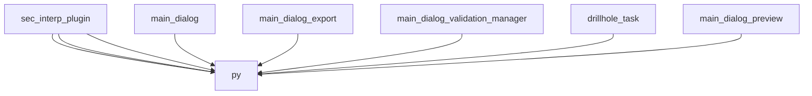

# AI CONTEXT - sec_interp
Automatically generated by Ai-Context-Core

## 📁 PROJECT STRUCTURE

./
    .analyzer_state.json
    .analyzerignore
    .coverage
    .dockerignore
    .gitattributes
    .gitignore
    .pre-commit-config.yaml
    ... (+33 more)
    i18n/
        SecInterp_de.qm
        SecInterp_de.ts
        SecInterp_es.qm
        SecInterp_es.ts
        SecInterp_fr.qm
        SecInterp_fr.ts
        SecInterp_pt_BR.qm
        ... (+6 more)
    help/
        html/
            genindex.html
            index.html
            modules.html
            objects.inv
            search.html
            searchindex.js
            sec_interp.analyze_project_optfixed.html
            ... (+111 more)
    scripts/
        build_docs.sh
        clean_imports.py
        fix-ui-syntax.sh
        inspect_qgs_api.py
        package-for-qgis.sh
        run_benchmarks.py
        run_tests_in_qgis.py
        ... (+2 more)
    docs/
        CHANGELOG.md
        DEVELOPMENT_LOG.md
        LOGGING_GUIDELINES.md
        PLUGIN_ANALYSIS.md
        release_process_ai.md
        images/
            ui_main_dialog.png
            workflow_01_select_dem.png
            workflow_02_select_dem.png
            workflow_03_select_section_line.png
            workflow_04_preview_generated.png

## 🎯 ENTRY POINTS

## 🏗️ DETECTED PATTERNS
No clear design patterns detected.

## 📈 COMPLEXITY AND METRICS
- **Total Modules**: 108
- **Lines of Code**: 17,583
- **Functions**: 615
- **Classes**: 115
- **Average Complexity**: 12.4
- **Most Complex Modules**: core/services/drillhole_service.py, gui/preview_layer_factory.py, gui/main_dialog_preview.py

## 🔗 PRIMARY DEPENDENCIES

### Third Party (most frequent):
- `qgis` (117 imports)
- `sec_interp` (72 imports)
- `pages` (8 imports)
- `geometry_utils` (7 imports)
- `layer_validator` (7 imports)
- `field_validator` (5 imports)
- `geometry` (5 imports)
- `profile_exporters` (4 imports)
- `spatial` (4 imports)
- `dataclasses` (3 imports)
- `drillhole` (3 imports)
- `parsing` (3 imports)
- `project_validator` (3 imports)
- `rendering` (3 imports)
- `sampling` (3 imports)

## 💡 OPTIMIZATION RECOMMENDATIONS

### core/exceptions.py
- **functions_too_long**: Very long functions (average 59.0 lines/function).

### core/data_cache.py
- **complexity_refactoring**: High complexity (19) with several functions. Consider breaking down large logic.

### core/services/profile_service.py
- **functions_too_long**: Very long functions (average 90.0 lines/function).

### core/controller.py
- **complexity_refactoring**: High complexity (22) with several functions. Consider breaking down large logic.

### core/services/preview_service.py
- **functions_too_long**: Very long functions (average 66.8 lines/function).

## 🕸️  DEPENDENCY STRUCTURE
- **Nodes**: 108
- **Edges**: 130
- **Density**: 0.011
- **Acyclic Graph**: Yes
- **Connected Components**: 36

## 🕸️ DEPENDENCY DIAGRAM (Conceptual)

## 🔑 PROJECT KEYWORDS
- **Technologies**: .py, .dat, .pyc, .pyi, .sip, .qml, .so, .txt
