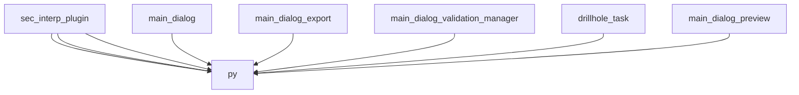

# AI CONTEXT - sec_interp
Automatically generated by Ai-Context-Core

## 📁 PROJECT STRUCTURE

./
    .analyzer_state.json
    .analyzerignore
    .coverage
    .dockerignore
    .gitattributes
    .gitignore
    .pre-commit-config.yaml
    ... (+22 more)
    i18n/
        SecInterp_de.qm
        SecInterp_de.ts
        SecInterp_es.qm
        SecInterp_es.ts
        SecInterp_fr.qm
        SecInterp_fr.ts
        SecInterp_pt_BR.qm
        ... (+6 more)
    help/
        html/
            .nojekyll
            ARCHITECTURE.html
            DEVELOPMENT_GUIDE.html
            MAINTENANCE_LOG.html
            TECHNICAL_COMPENDIUM.html
            USER_GUIDE.html
            genindex.html
            ... (+118 more)
    scripts/
        build_docs.sh
        clean_imports.py
        fix-ui-syntax.sh
        generate_ai_templates.py
        inspect_qgs_api.py
        package-for-qgis.sh
        run_benchmarks.py
        ... (+5 more)
    docs/
        ARCHITECTURE_EN.md
        CHANGELOG.md
        CORE_DISTINCTION_GUIDE.md
        CORE_DISTINCTION_GUIDE_EN.md
        DEVELOPMENT_LOG.md
        LOGGING_GUIDELINES.md
        PLUGIN_ANALYSIS.md
        release_process_ai.md
        images/
            ui_main_dialog.png
            workflow_01_select_dem.png
            workflow_0

## 🎯 ENTRY POINTS

## 🏗️ DETECTED PATTERNS
No clear design patterns detected.

## 📈 COMPLEXITY AND METRICS
- **Total Modules**: 107
- **Lines of Code**: 17,779
- **Functions**: 628
- **Classes**: 115
- **Average Complexity**: 12.8
- **Most Complex Modules**: core/services/drillhole_service.py, gui/preview_layer_factory.py, gui/main_dialog_settings.py

## 🔗 PRIMARY DEPENDENCIES

### Third Party (most frequent):
- `qgis` (117 imports)
- `sec_interp` (72 imports)
- `pages` (8 imports)
- `geometry_utils` (7 imports)
- `layer_validator` (7 imports)
- `field_validator` (5 imports)
- `geometry` (5 imports)
- `profile_exporters` (4 imports)
- `spatial` (4 imports)
- `dataclasses` (3 imports)
- `drillhole` (3 imports)
- `parsing` (3 imports)
- `project_validator` (3 imports)
- `rendering` (3 imports)
- `sampling` (3 imports)

## 💡 OPTIMIZATION RECOMMENDATIONS

### .gemini-temp/reproduce_proxy.py
- **low_documentation_coverage**: Low docstring coverage (0/5 functions).

### core/exceptions.py
- **functions_too_long**: Very long functions (average 59.0 lines/function).

### core/data_cache.py
- **complexity_refactoring**: High complexity (19) with several functions. Consider breaking down large logic.

### core/services/profile_service.py
- **functions_too_long**: Very long functions (average 92.0 lines/function).

### core/controller.py
- **complexity_refactoring**: High complexity (22) with several functions. Consider breaking down large logic.

## 🕸️  DEPENDENCY STRUCTURE
- **Nodes**: 107
- **Edges**: 129
- **Density**: 0.011
- **Acyclic Graph**: Yes
- **Connected Components**: 35

## 🕸️ DEPENDENCY DIAGRAM (Conceptual)

## 🔑 PROJECT KEYWORDS
- **Technologies**: .py, .pyc, .dat, .pyi, .sip, .qml, .html, .so
