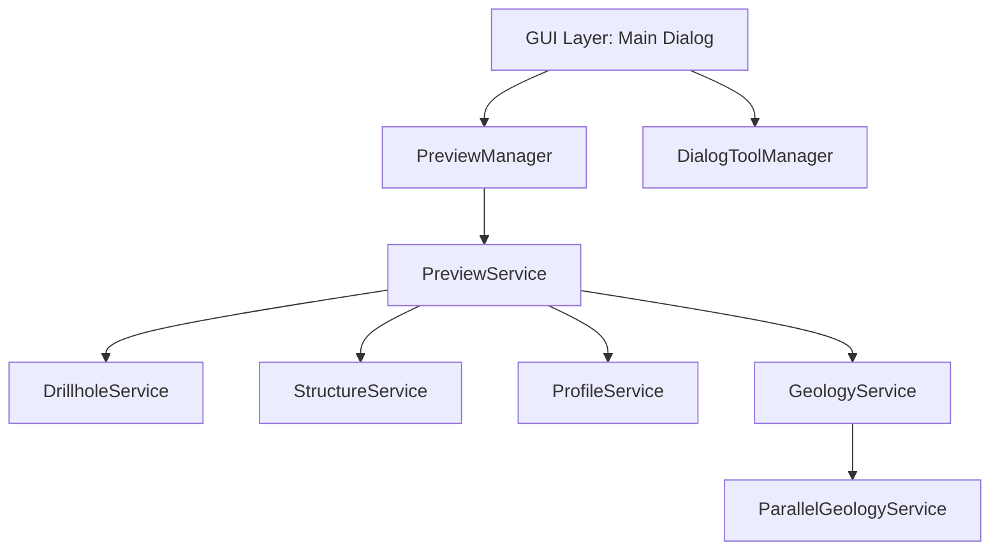

# Arquitectura de SecInterp

Este documento describe la arquitectura técnica del plugin SecInterp para QGIS, enfocándose en su diseño desacoplado y orientado a servicios.

## 🏗️ Visión General
SecInterp sigue un patrón de diseño que separa estrictamente la lógica de negocio (Core) de la interfaz de usuario (GUI), permitiendo una mayor mantenibilidad y testabilidad.

## 📂 Estructura de Capas

### 🎨 Capa de UI (gui/)
Responsable de la interacción con el usuario y la visualización.
- **`main_dialog.py`**: Orquestador delgado de la interfaz. Delego el trabajo pesado a managers especializados.
- **`main_dialog_preview.py` (PreviewManager)**: Gestiona la generación de previsualizaciones, el caché por hash y los estados de renderizado.
- **`main_dialog_tools.py` (DialogToolManager)**: Gestiona las herramientas de mapa (medición, snapping) y eventos de usuario.
- **`preview_renderer.py`**: Renderiza geometrías nativas de QGIS en el canvas del plugin.

### ⚙️ Capa de Negocio (core/services/)
Contiene la lógica pura de procesamiento geológico y geométrico.
- **`preview_service.py`**: Orquestador de datos para la previsualización. Implementa LOD para topografía.
- **`drillhole_service.py`**: Procesamiento de sondajes, cálculo de trayectorias e interpolación de intervalos. Optimizado con `QgsSpatialIndex`.
- **`geology_service.py`**: Interperetación de geología de superficie a partir de contactos.
- **`structure_service.py`**: Proyección de medidas estructurales (Azimuth/Dip) sobre la sección.

### 🛠️ Utilidades (core/utils/)
Funciones atómicas y puras.
- **`geometry_utils/`**: Modularizado en `extraction`, `processing` y `filtering`.
- **`sampling.py`**: Muestreo de elevación sobre DEMs.
- **`parsing.py`**: Parsers para datos estructurales y geológicos.

### 🌍 Internacionalización (i18n/)
- Soporte multilingüe (ES, FR, DE, RU, PT_BR).
- Uso de `QCoreApplication.translate` para evitar errores de inicialización en Qt.
- Compilación automatizada de archivos `.ts` a `.qm` vía Makefile.

## 🚀 Optimizaciones de Rendimiento
1. **Hash-Based Caching**: En `PreviewManager`, los datos pesados solo se regeneran si los parámetros de entrada (capas, campos, distancias) cambian.
2. **Topography LOD**: El muestreo de elevación se adapta dinámicamente según el ancho del canvas para mantener la fluidez en el zoom.
3. **Spatial Indexing**: Uso de `QgsSpatialIndex` en el filtrado de sondajes y estructuras.
4. **Parallel Processing**: Procesamiento de geología realizado en hilos secundarios (`ParallelGeologyService`).

## 🛡️ Estándares y Calidad
- **Core Decoupling**: El núcleo no tiene dependencias de `PyQt` o `qgis.gui` (SOLID).
- **Static Analysis**: Cumplimiento con Ruff (vía pre-commit) y Pylint.
- **Métricas**: Seguimiento automático de calidad (`quality_score`) en cada análisis.

---
**Version**: 2.4.0 | **Updated**: 2025-12-25
