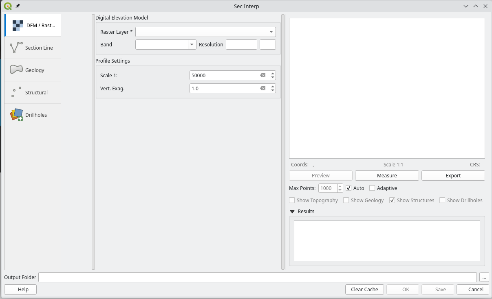
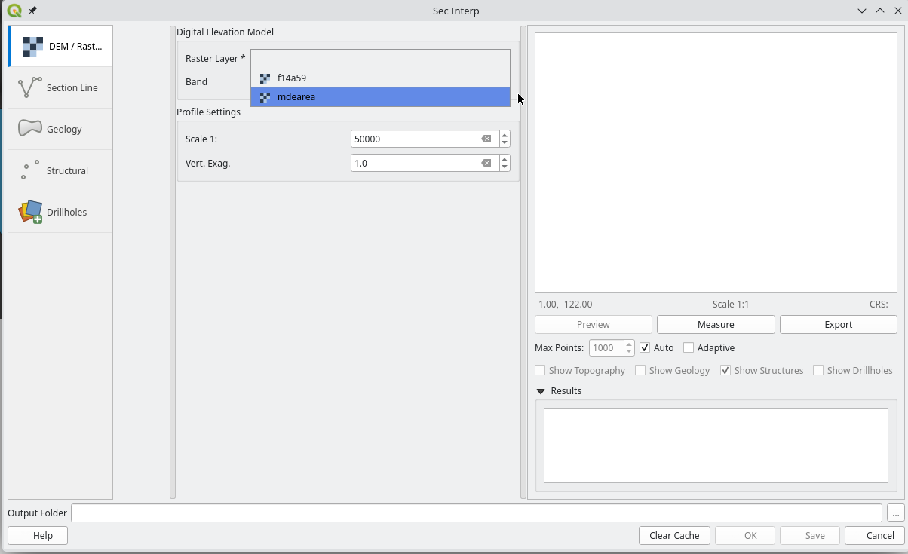
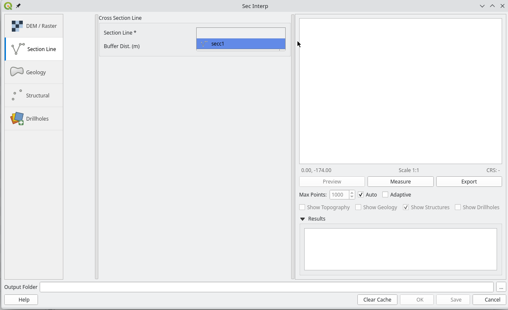
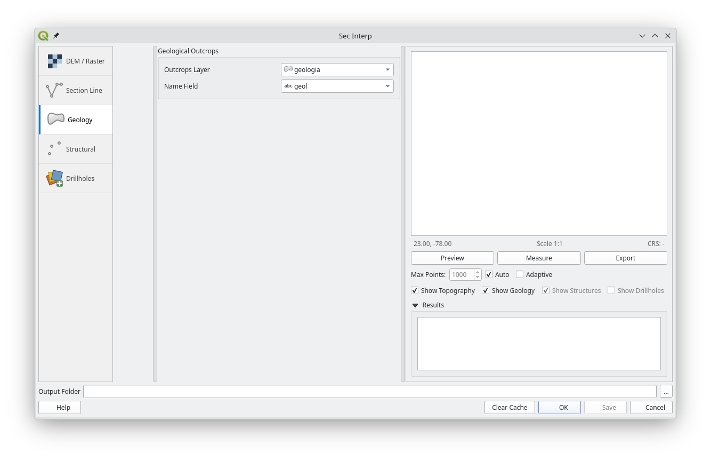
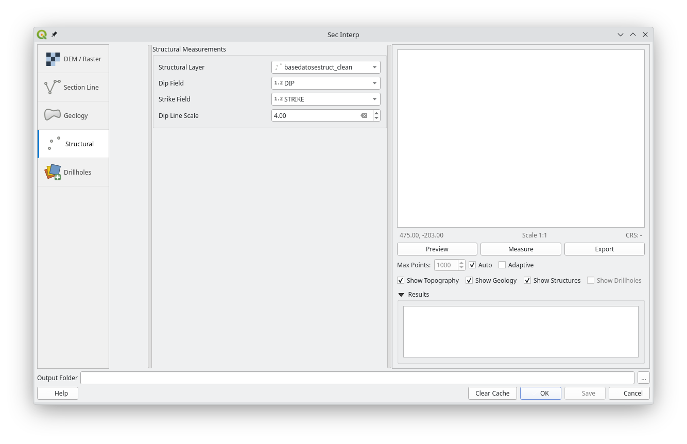
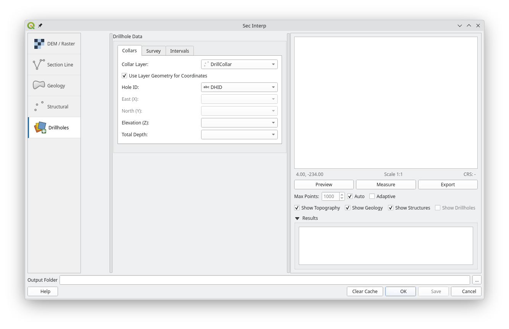
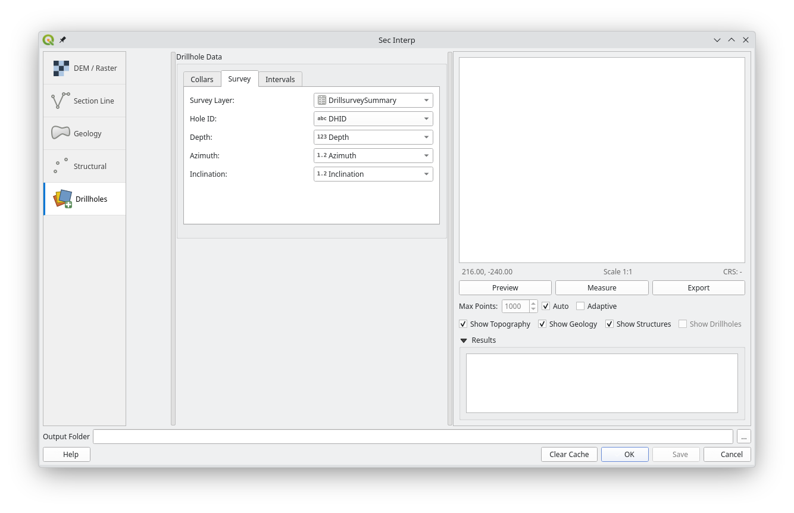
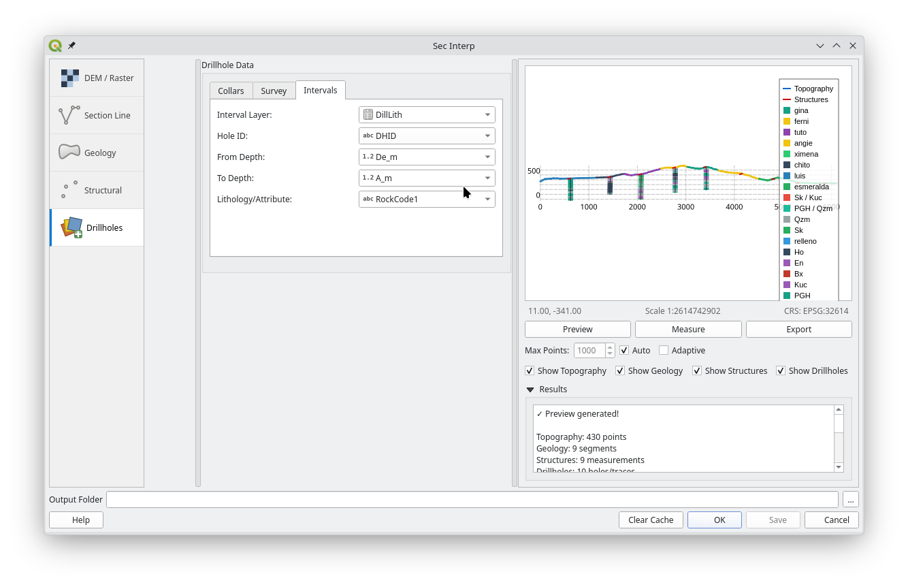
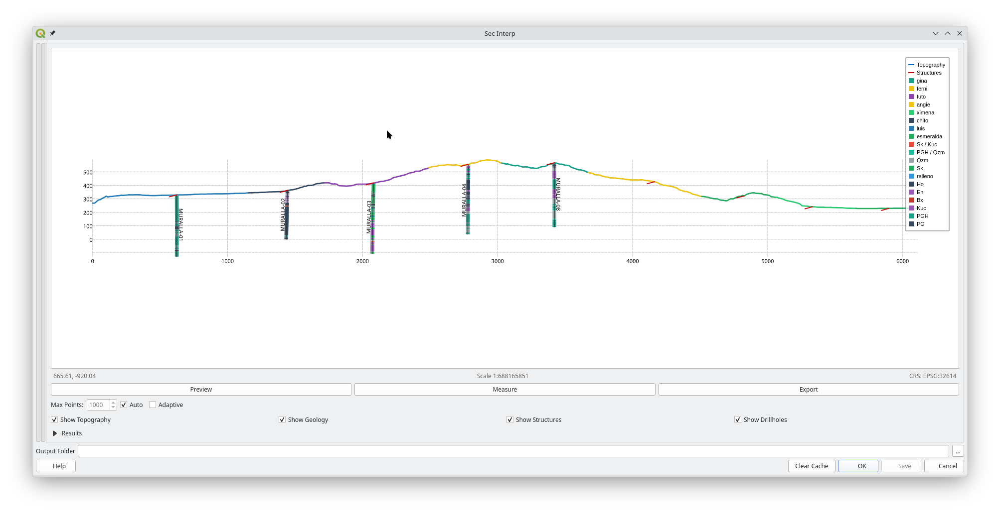

# SecInterp — Geological Interpretation for QGIS


**SecInterp** (Section Interpreter) is a professional QGIS plugin designed for industrial-grade extraction and visualization of geological data. It empowers geologists to generate high-fidelity topographic profiles, project outcrops with structural integrity, and perform complex 3D drillhole analysis within a unified 2D cross-section environment.


*SecInterp v2.7.0: Professional Geological Interpretation with Integrated High-Fidelity Profiles.*

---

---

## 🆕 What's New in v2.7.0
**Phase: Operational Excellence & UI Modernization**

- **🎨 Modernized UI**: A new premium sidebar-based navigation and native QGIS icons provide a cohesive, professional experience.
- **🌍 Full i18n Support**: Core architecture and all UI elements are fully translated and prepared for multi-language support (English and Spanish base).
- **🛡️ 3-Level Robust Validation**: Implementing a tiered validation system (Type, Business Logic, and Domain) to ensure data integrity and prevent crashes.
- **🐳 Dockerized QA**: Continuous testing infrastructure using Docker to run 340+ tests in an official QGIS environment.
- **📚 Automated API Docs**: Clean, external documentation generated with Sphinx for enhanced developer maintainability.
- **🧊 Enhanced 3D Export**: Improved projection algorithms for both drillhole traces (`LineStringZ`) and geological intervals (`PolygonZ`).

See [CHANGELOG.md](docs/CHANGELOG.md) for complete details.

---

## 🌟 Key Features

### 1. Interactive Preview System
*   **Real-time Visualization**: Instantly view topography, geology, and structures along any drawn section line.
*   **Performance**: Uses **Parallel Processing** to handle complex geological intersections without freezing QGIS.
*   **Adaptive Level of Detail (LOD)**: Automatically adjusts data density based on zoom level for smooth navigation.
*   **Measurement Tools**: Measure distances and calculate slopes/gradients directly on the profile view with automatic **Snapping** to vertices.
*   **Drillhole Support**: Project 3D drillhole traces and geological intervals (sondajes) onto the 2D cross-section plane.


*Fig 1. Main interface showing topography and projected geology.*

### 2. Data Extraction
*   **Topography**: Extracts elevation profiles from any DEM raster.
*   **Geology**: Projects polygon outcrops onto the section line, respecting valid lithological boundaries.
*   **Structure**: Projects dip/strike measurements with configurable buffer zones and apparent dip calculations.

### 3. Geological Interpretation
*   **Interactive Drawing**: Draw interpretation polygons directly on the profile view.
*   **Smart Snapping**: Accurately snap vertices to existing topographic or geological features.
*   **Auto-Color**: Automatically assigns vivid colors to distinguish new interpretations.
*   **Undo/Redo**: Flexible editing with right-click undo support during drawing.

### 4. Professional Export
*   **Formats**: Export directly to **SHP**, **CSV**, **DXF**, **PDF**, **SVG**, or **PNG**.
*   **Layout**: Results are ready for CAD integration or reporting.

---

## 📋 Requirements

Before installing **SecInterp**, ensure your system meets the following requirements:

*   **QGIS**: 3.28 LTR or superior.
*   **Python**: 3.10 or superior (included with QGIS).
*   **Dependencies**: The plugin uses standard QGIS and PyQt5 libraries. Advanced analysis and development tools (like `qgis-plugin-analyzer` and `ai-context-core`) are only required for developers and auditors.

---

## 🚀 Installation

### From QGIS Repository
1. Open QGIS.
2. Go to **Plugins > Manage and Install Plugins**.
3. Search for `SecInterp`.
4. Click **Install Plugin**.

### From ZIP File
1. Download the latest `sec_interp_v2.7.0.zip` from releases.
2. Open QGIS.
3. Go to **Plugins > Manage and Install Plugins > Install from ZIP**.
4. Select the file and click **Install**.

---

## 📖 Quick Start Guide

For detailed instructions, please see the [**User Guide**](docs/source/USER_GUIDE.md).

1. **Prepare Data**: Load your DEM (Raster), Geology (Polygons), and Structure (Points) layers in QGIS.
2. **Launch Plugin**: Click the **SecInterp** icon in the toolbar.
3. **Configure Layers**:
    *   **DEM**: Select your elevation raster and band.

        

    *   **Cross-section**: Select the line layer that defines your profile.

        

    *   **Geology**: Select the outcrop layer and the lithology attribute field.

        

    *   **Structure**: Select the point layer and dip/strike fields.

        

    *   **Drillholes (Optional)**: Configure Collars, Survey, and Intervals in the **Drillholes** page to project 2D drillhole traces.

        

        

        

4. **Preview**: Click **Preview Profile**. The view will update asynchronously.

    

    *   *Tip: Use the scroll wheel to zoom in/out. The detail level will adapt automatically.*
    *   *Tip: Colapse panels to the left, and Results colapse down to save space.*

    

5. **Export**: Use the **Export** button in the preview toolbar or go to the **Settings** page for batch export configuration.

---

## 🛠 For Developers

This plugin is open-source and welcomes contributions.

- **Source Code**: [GitHub Repository](https://github.com/geociencio/sec_interp)
- **Documentation**:
  - [**User Guide**](https://geociencio.github.io/sec_interp_docs/USER_GUIDE.html): How to use the plugin.
  - [**Architecture**](https://geociencio.github.io/sec_interp_docs/ARCHITECTURE.html): Technical design and patterns.
  - [**Development Guide**](https://geociencio.github.io/sec_interp_docs/DEVELOPMENT_GUIDE.html): Code standards and setup.
  - [**Maintenance Log**](https://geociencio.github.io/sec_interp_docs/MAINTENANCE_LOG.html): Changelog and release procedures.
  - [**Technical Compendium**](https://geociencio.github.io/sec_interp_docs/TECHNICAL_COMPENDIUM.html): Geophysical research and details.
- **Development Setup**: Use the `Makefile` and `DEVELOPMENT_GUIDE.md`.
- **Testing with Docker** (Recommended):
  Esta suite ejecuta los **361 tests** del proyecto dentro de un contenedor QGIS oficial (`qgis/qgis:latest`), garantizando un entorno reproducible y libre de conflictos de dependencias locales.
  ```bash
  make docker-build  # Build the test image
  make docker-test   # Run the full test suite inside a container
  ```

---

## 📄 License

This project is licensed under the GNU General Public License v3.0. See `LICENSE` for details.
