# SecInterp — Geological Interpretation for QGIS


[](https://plugins.qgis.org/plugins/sec_interp/)


**SecInterp** (Section Interpreter) is a professional QGIS plugin for extracting and
visualising geological data along cross-sections. It builds high-fidelity topographic
profiles, projects outcrops and structural measurements with CRS-aware sampling, and
places 3D drillhole traces and intervals on a unified 2D section — with live symbology,
configurable legends and 2D/3D interpretation export.

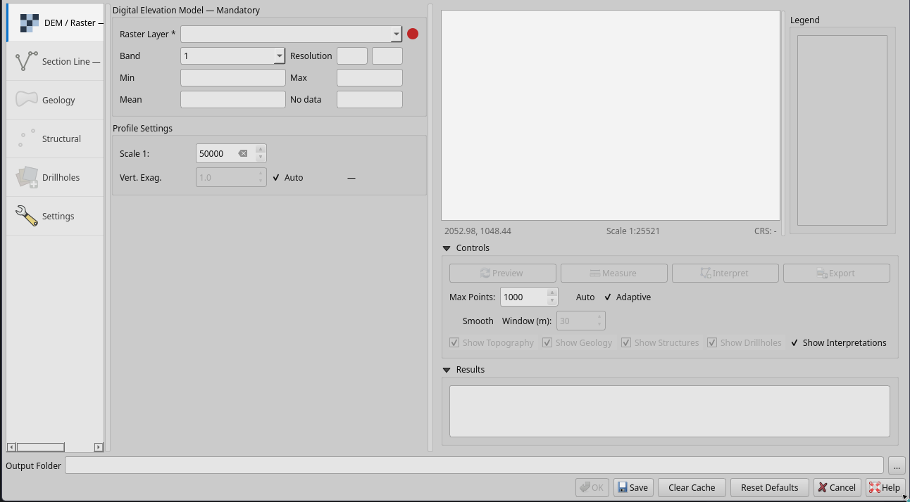
*The SecInterp workspace: six sections, an interactive preview and a project-aware legend.*

**Latest release:** v3.12.0 · [QGIS plugin repository](https://plugins.qgis.org/plugins/sec_interp/) ·
[User Guide](https://geociencio.github.io/sec_interp_docs/USER_GUIDE.html)

---

## 🆕 What's New in v3.12.0

### 🎯 Choose the exact section line
The Section page now lists only **single-part lines with exactly two vertices** in an
`fid — label` selector, and lets you pick the **label field** (`Auto` or any attribute).
The chosen `section_feature_id` is forwarded to topography, geology, structures,
drillholes, level-of-detail and the async tasks, so changing the feature changes the
sampled section.

### ⚙️ Interpretation settings, now part of Settings
`InterpretationPage` is now the **Interpretation Settings** tab inside **Settings**
(Default, Advanced, Symbology, Interpretation, Plugin Information). It exposes the
interpretation storage source (project JSON or an external vector layer), custom
attributes and geology/drillhole attribute inheritance. Existing projects, persisted
keys and consumers keep working — no migration required.

### 🧠 A QGIS-agnostic core
`core/` no longer imports `qgis.*` or `qgis.PyQt`: translations, settings and map-settings
factories are injected through ports/adapters. The architecture allowlist is **empty**,
and the core imports in a plain Python environment without QGIS.

### 🧩 Smaller, safer modules
The controller (465 → 295 lines), geometry adapter (598 → 69), preview layer factory
(535 → 202), 3D exporter (472 → 155) and preview renderer (438 → 335) are now thin
facades over focused helpers. **No module exceeds 400 lines**, and the CC ≤ 10 gate stays
green.

### 📚 Documentation and tooling
The User Guide ships with **22 refreshed screenshots** (six-section sidebar, Symbology and
Interpretation tabs) and the Spanish catalog is complete. Development uses
`qgis-manage` 0.12.0 with `--repo-check` packaging and manual releases.

See [CHANGELOG.md](docs/CHANGELOG.md) for the full list.

---

## 🌟 Key Features

### 1. Interactive Preview System
- **Real-time visualisation** of topography, geology, structures and drillholes along any
  section line.
- **Adaptive level of detail (LOD)** and parallel processing keep large sections smooth.
- **Measurement tools** with snapping to vertices, plus distance, slope and gradient.
- **Collapsible panels** for a larger canvas and a project-aware legend.

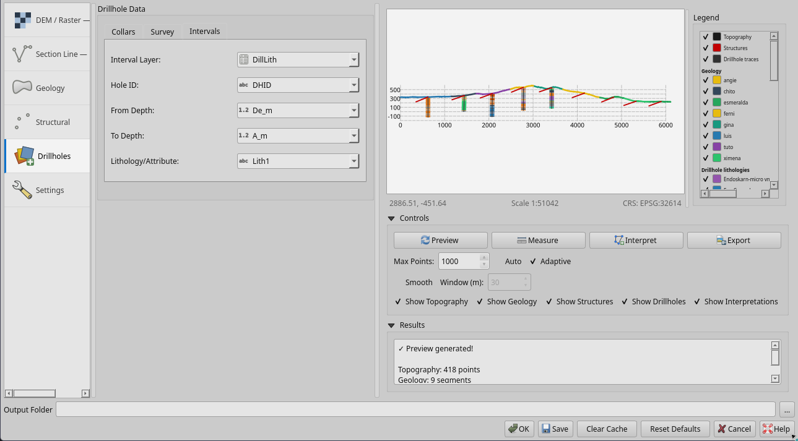
*Preview with topography, geology, structures and drillholes.*

### 2. Data Extraction
- **Topography**: elevation profiles from any DEM, with CRS-aware line → raster sampling.
- **Geology**: polygon outcrops projected onto the section, preserving valid boundaries.
- **Structure**: dip/strike measurements with buffer zones and apparent-dip calculations.
- **Drillholes**: collars, surveys and intervals projected as traces and interval
  cylinders.

### 3. Geological Interpretation & 3D
- **Interactive drawing** of interpretation polygons on the profile, with snapping to
  topography, drillhole contacts and existing vertices.
- **Attribute inheritance** from geology overlaps and nearby drillhole intervals, with
  manual overrides.
- **PolygonZ export**: 2D interpretations become real 3D geometries on the section plane.

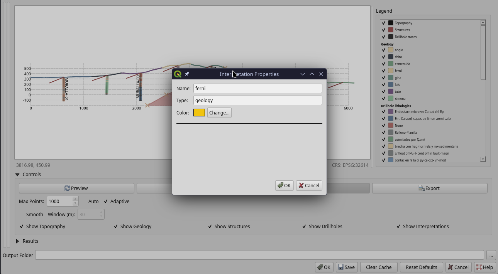
*Digitising an interpretation polygon and its properties.*

### 4. Live Symbology & Legend
- **Symbology tab**: live styling of topography, structures, drillhole traces and
  interpretations without modifying the source layers.
- **Per-unit editor**: hide, recolour, rename and reorder geological and drillhole units.
- **Legend layout**: position, font size and a maximum number of items; geology units and
  drillhole lithologies are grouped separately.

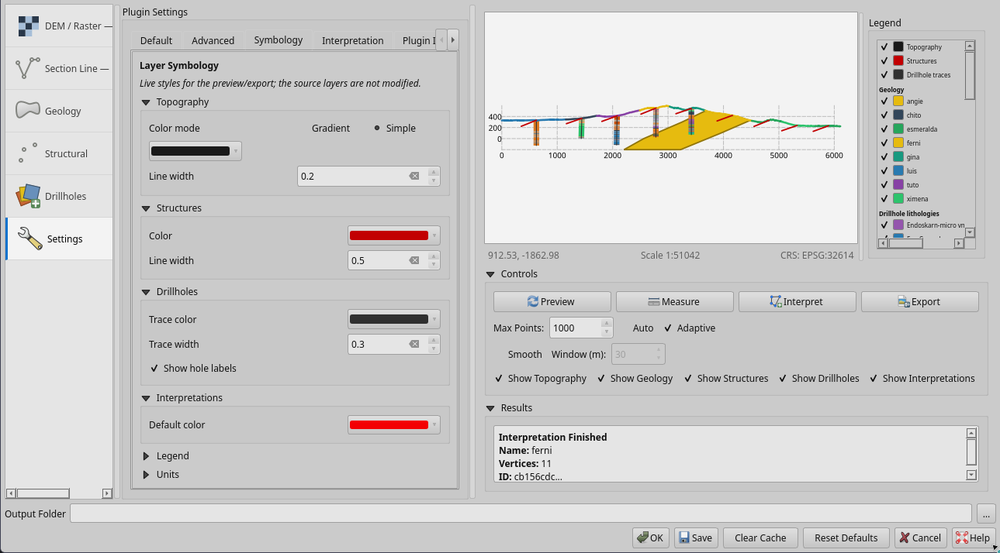
*Symbology tab: styles apply live to the preview and the exported section.*

### 5. Professional Export
- **Formats**: **SHP**, **CSV**, **DXF**, **PDF**, **SVG**, **PNG** and **GeoPackage**.
- **Layout**: map-ready output for CAD, reports and publications, with the configured
  legend and symbology.

---

## 📋 Requirements

- **QGIS**: 3.28 LTR or newer, including **QGIS 4.x**.
- **Python**: 3.9+ (the version bundled with QGIS 3.28; development uses 3.12).
- **Qt**: Qt5 and Qt6 through `qgis.PyQt` (no separate runtime dependency).
- **Dependencies**: none beyond QGIS. The analysis/context tools used by maintainers are
  development-only.

---

## 🚀 Installation

### From the QGIS plugin repository
1. Open QGIS.
2. Go to **Plugins → Manage and Install Plugins**.
3. Search for `SecInterp` and click **Install Plugin**.

### From a ZIP file
1. Download `sec_interp.3.12.0.zip` from the
   [releases page](https://github.com/geociencio/sec_interp/releases).
2. Open QGIS → **Plugins → Manage and Install Plugins → Install from ZIP**.
3. Select the file and click **Install**.

---

## 📖 Quick Start

The full walkthrough is in the [**User Guide**](https://geociencio.github.io/sec_interp_docs/USER_GUIDE.html).

1. **Prepare data**: load a DEM (raster), geology (polygons), structures (points) and,
   optionally, drillholes.
2. **Open SecInterp** from the toolbar.
3. **Configure the sections**:
   - **DEM / Raster**: select the elevation raster and band.

     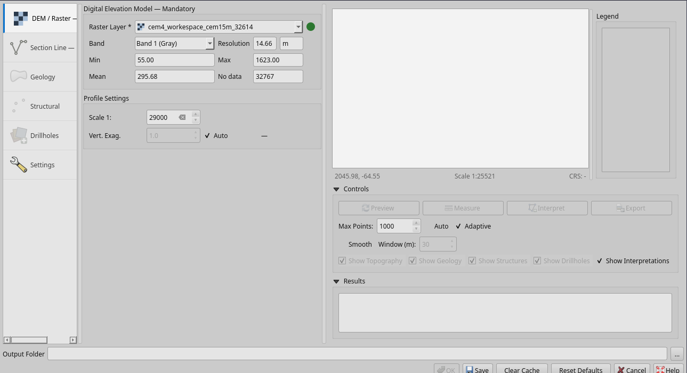

   - **Section Line**: choose the `fid — label` feature, its label field and the buffer.

     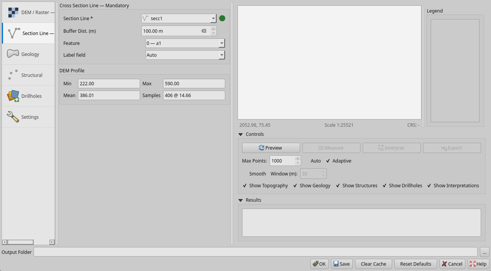

   - **Geology**: select the outcrop layer and its name field.

     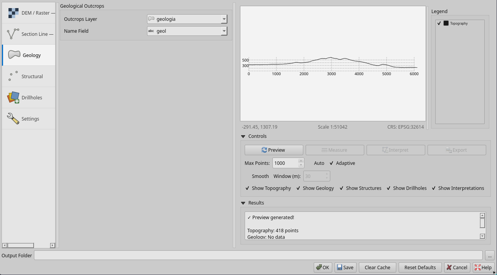

   - **Structural**: select the layer and the dip/strike fields.

     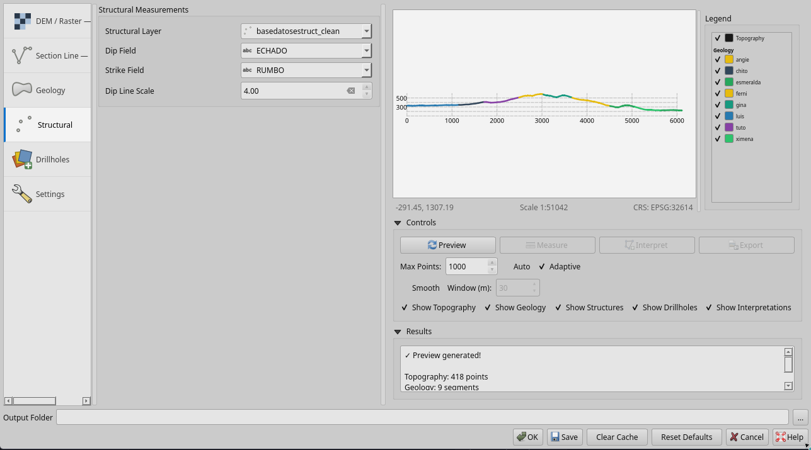

   - **Drillholes** (optional): configure collars, surveys and intervals.

     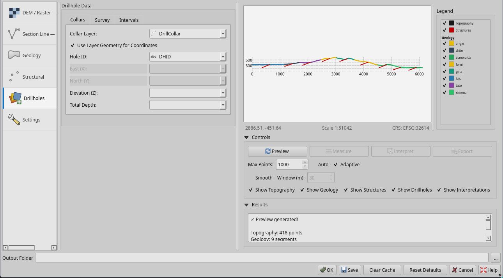

     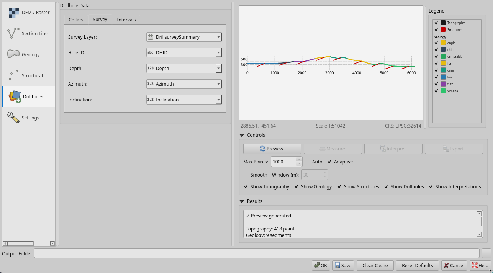

     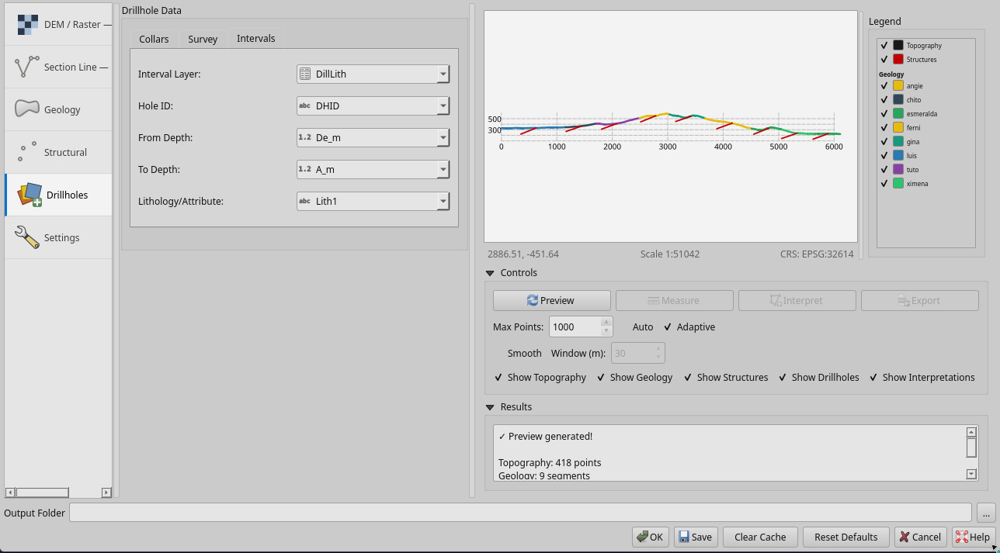

4. **Preview**: click **Preview**. Zoom with the wheel; the detail level adapts
   automatically. Collapse the left panel and the Results section for more canvas.

   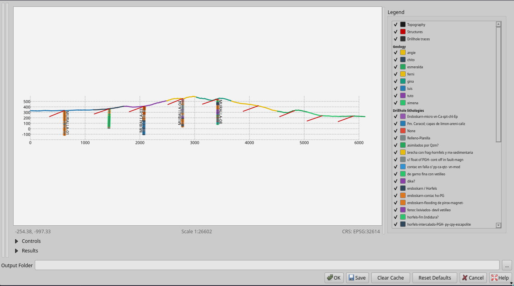

5. **Style and export**: use **Settings → Symbology** for live styles and the legend, then
   **Export** (image/vector) or **Save** (profile data and 3D outputs).

---

## 🛠 For Developers

Contributions are welcome.

- **Source**: [github.com/geociencio/sec_interp](https://github.com/geociencio/sec_interp)
- **Documentation**:
  - [User Guide](https://geociencio.github.io/sec_interp_docs/USER_GUIDE.html)
  - [Architecture](https://geociencio.github.io/sec_interp_docs/ARCHITECTURE.html)
  - [Development Guide](https://geociencio.github.io/sec_interp_docs/DEVELOPMENT_GUIDE.html)
  - [Maintenance Log](https://geociencio.github.io/sec_interp_docs/MAINTENANCE_LOG.html)
  - [Technical Compendium](https://geociencio.github.io/sec_interp_docs/TECHNICAL_COMPENDIUM.html)
- **Setup and tests** (Python 3.12 + `uv`):
  ```bash
  uv sync                          # install the development environment
  PYTHONPATH=.. uv run python3 -m unittest discover tests
  make pre-release                 # mypy, analyzer, i18n, Qt6, security and Docker tests
  ```
- **Deploy to QGIS 4** for manual testing:
  ```bash
  make deploy QGIS_VERSION=4       # builds docs/resources and deploys to the local profile
  ```
- **Docker tests** run the suite inside the official QGIS image:
  ```bash
  make docker-build
  make docker-test
  ```
- **Releases** are manual from `main`; see
  [docs/releases/SCHEDULE.md](docs/releases/SCHEDULE.md).

---

## 📄 License

This project is licensed under the GNU General Public License v3.0. See
[LICENSE](LICENSE) for details.
