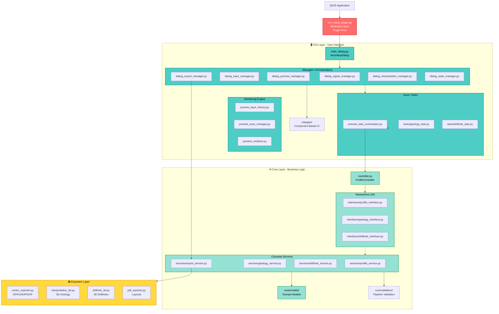

# SecInterp - Detailed Project Architecture

> **Comprehensive Technical Documentation for the SecInterp QGIS Plugin**
> Version 3.4.0 | Last Updated: 2026-03-29

---

## 📑 Table of Contents

1. [Overview](#overview)
2. [Directory Structure](#directory-structure)
3. [System Architecture](#system-architecture)
4. [GUI Layer - User Interface](#gui-layer---user-interface)
5. [Core Layer - Business Logic](#core-layer---business-logic)
6. [Exporters Layer - Data Export](#exporters-layer---data-export)
7. [Main Data Flows](#main-data-flows)
8. [Design Patterns](#design-patterns)
9. [External Dependencies](#external-dependencies)
10. [Performance Optimizations](#performance-optimizations)
11. [Project Metrics](#project-metrics)

---

## 🎯 Overview

**SecInterp** (Section Interpreter) is a QGIS plugin designed for extracting and visualizing geological data in cross-sections. The plugin allows geologists to generate topographic profiles, project geological outcrops, and analyze structural data in a unified 2D view.

### Key Features

- ✅ **Interactive Preview System** with real-time rendering.
- ✅ **Parallel Processing** for complex geological intersections.
- ✅ **Adaptive LOD** (Level of Detail) based on zoom.
- ✅ **Measurement Tools** with automatic snapping.
- ✅ **Drillhole Support** with 3D→2D trajectory projection.
- ✅ **Multi-format Export** (SHP, GPKG, DXF, CSV, PDF, SVG).

---

## 📂 Directory Structure

The project organization follows a highly modular architecture based on the **Separation of Concerns** (SoC) principle, decoupling the interface, business logic, and export formats.

```
sec_interp/
├── __init__.py                 # Plugin entry point
├── sec_interp_plugin.py        # Root class (SecInterp)
├── metadata.txt                # QGIS Metadata
├── Makefile                    # Automation (deploy, tests, docs)
│
├── core/                       # ⚙️ Business Logic (Core Layer)
│   ├── controller.py           # Orchestrator (ProfileController)
│   ├── interfaces/             # [NEW] Abstract Base Classes for DI
│   ├── models/                 # [NEW] Domain Models and Settings
│   ├── services/               # Specialized Services
│   │   ├── export_service.py   # [NEW] Unified Export Orchestration
│   │   ├── access_control.py   # [NEW] Permission and Feature logic
│   │   ├── drillhole/          # Drillhole Processing Sub-system
│   │   ├── geology/            # Geology Processing Sub-system
│   │   └── preview_service.py  # Preview Orchestrator
│   ├── validation/             # Modular validation package
│   ├── domain/                 # Domain Layer (Entities & DTOs)
│   └── utils/                  # Utilities (Geometry, Spatial, i18n)
│
├── gui/                        # 🖥️ User Interface (GUI Layer)
│   ├── main_dialog.py          # Main Dialog (Manager Orchestrator)
│   ├── dialog_signal_manager.py# Centralized Signal Handling
│   ├── dialog_preview_manager.py# Preview and Canvas Lifecycle
│   ├── dialog_export_manager.py# Export UI Logic
│   ├── tasks/                  # [NEW] QgsTask Background Workers
│   ├── renderers/              # [NEW] Specialized Canvas Renderers
│   ├── ui/                     # Layouts and Components
│   │   └── pages/              # Tab-based Page components
│   └── tools/                  # QgsMapTool Implementations
│
├── exporters/                  # 📤 Export Layer
│   ├── vector_exporter.py      # [NEW] Unified Vector (SHP/GPKG/DXF)
│   ├── interpretation_3d.py    # [NEW] 3D Geologic Export
│   └── csv_exporter.py         # Raw Data Export
├── docs/                       # 📚 ADRs, Manuals, and Technical Logs
├── tests/                      # 🧪 Test Suite (Core/GUI/Integration)
└── resources/                  # 🎨 Icons, Styles, and Qt Resources
```

---

## 🏗️ System Architecture

### Complete Architecture Diagram



---

## 🖥️ GUI Layer - User Interface

### 1. Manager-Based Orchestration (main_dialog.py)

**Main Class**: `SecInterpDialog`
**Responsibility**: The main dialog no longer contains business logic. It coordinates specialized **Managers** that handle specific lifecycle events and UI state.

#### Key Managers

| Manager | Responsibility |
|---------|----------------|
| `DialogSignalManager` | Centralizes all signal/slot connections to avoid spaghetti code. |
| `DialogInputManager` | Manages input layer selection and schema validation. |
| `PreviewManager` | Coordinates the preview canvas, axes, and LOD calculation. |
| `ExportManager` | Maps UI selections to the `ExportService` in the Core layer. |
| `InterpretationManager` | Handles 2D/3D geological interpretation state. |
| `DialogStateManager` | Manages persistence and session-based UI defaults. |

---

### 2. Rendering Engine & Async Tasks

**Responsibility**: Decouples heavy rendering logic from the main thread using `QgsTask`.

- **PreviewLayerFactory**: Generates temporary memory layers for previewing.
- **PreviewTaskOrchestrator**: Manages a queue of background tasks to keep the UI responsive.
- **LOD Calculator**: Implements adaptive simplification for large geological datasets.

---

## ⚙️ Core Layer - Business Logic

### 1. Interface-Driven Design (interfaces/)

**Pattern**: Dependency Injection (DI)
**Responsibility**: All services are defined as Abstract Base Classes (ABCs). The `ProfileController` consumes interfaces, allowing for easy mocking during testing and replacement of logic without affecting the GUI.

```python
class IGeologyService(abc.ABC):
    @abc.abstractmethod
    def calculate_intersections(self, profile: ProfileData) -> List[GeologySegment]:
        pass
```

### 2. ProfileController (controller.py)

**Responsibility**: Orchestrates the interaction between services through their interfaces.

| Service | Responsibility |
|---------|----------------|
| `ProfileService` | Topography extraction and sampling logic. |
| `GeologyService` | Core intersection algorithms (Outcrops/Polygons). |
| `DrillholeService` | 3D trajectory calculation and 2D section projection. |
| `ExportService` | Central orchestrator for the Exporters layer. |
| `AccessControlService` | Validates licenses and feature availability. |

---

## 📤 Exporters Layer

The Exporters layer has been modernized to support a wider range of engineering and geoscientific formats.

- **Unified Vector Exporter**: A single entry point for SHP, GeoPackage, and DXF.
- **3D Geospatial Export**: Specialized logic for exporting geological interpretations and drillholes as 3D geometries (Z-aware).
- **Format Decoupling**: Exporters only consume DTOs from the `core/domain` package.

---

## 🖥️ GUI Layer - User Interface

### 1. SecInterpDialog (main_dialog.py)

**Main Class**: `SecInterpDialog`
**Inherits from**: `SecInterpMainWindow`
**Responsibility**: Simplified main dialog that coordinates components via specialized Managers.

#### Key Components

```python
class SecInterpDialog(SecInterpMainWindow):
    """Dialog for the SecInterp QGIS plugin."""

    def __init__(self, iface=None, plugin_instance=None, parent=None):
        # Logic Managers
        self.signal_manager = DialogSignalManager(self)
        self.data_aggregator = DialogDataAggregator(self)

        # Operation Managers
        self.validator = DialogValidator(self)
        self.preview_manager = PreviewManager(self)
        self.export_manager = ExportManager(self)
        self.status_manager = DialogStatusManager(self)
        self.settings_manager = DialogSettingsManager(self)

        # Widgets
        self.legend_widget = LegendWidget(self.preview_widget.canvas)
        self.pan_tool = QgsMapToolPan(self.preview_widget.canvas)
        self.measure_tool = ProfileMeasureTool(self.preview_widget.canvas)
```

---

### 2. PreviewRenderer (preview_renderer.py)

**Responsibility**: Renders the preview canvas using native PyQGIS.

#### LOD Optimization Methods

| Method | Purpose | Algorithm |
|--------|---------|-----------|
| `_decimate_line_data()` | Line simplification | Douglas-Peucker |
| `_calculate_curvature()` | Local curvature calculation | Angle between segments |
| `_adaptive_sample()` | Adaptive sampling | Curvature-based |

---
## 🎨 Design Principles

SecInterp v3.4.0 follows industry-standard architectural patterns to ensure high quality and testability.

### Core Architectural Patterns
- **Manager Pattern (GUI)**: Decouples the main window from individual feature logic (Export, Preview, etc.).
- **Dependency Injection (Core)**: Uses `core/interfaces` to decouple the `ProfileController` from concrete service implementations.
- **Factory Pattern (Exporters)**: The `ExportService` dynamically selects the appropriate `BaseExporter` subclass.
- **Observer Pattern (Signals)**: Extensive use of `PyQt5.QtCore.pyqtSignal` for asynchronous communication between Core and GUI.
- **DTO Pattern (Data Transfer Objects)**: All data passing between layers is encapsulated in immutable DTOs from `core/domain`.

### SOLID & Clean Code
- **Interface Segregation**: Clients only depend on the specific service interfaces they need.
- **Single Responsibility**: Each Manager and Service handles a unique, atomic part of the plugin workflow.
- **Thread Safety**: Long-running operations only use `QgsTask` to avoid blocking the QGIS main thread.

---

## 🚀 Extensibility

### Adding a New Service
1. Define the interface in `core/interfaces/` (inheriting from `abc.ABC`).
2. Implement the concrete service in `core/services/`.
3. Register the service in `controller.py` and inject it into the `ProfileController`.

### Adding a New Export Format
1. Inherit from `BaseExporter` in `exporters/`.
2. Implement the `export()` method using QGIS-agnostic logic.
3. Update the `ExportService` to include the new format in its registry.

---

## 📊 Project Metrics

| Metric | Value |
|--------|-------|
| **Python Modules** | 121 |
| **Source Lines of Code (SLOC)** | ~12,633 |
| **Core Layer** | ~55% |
| **GUI Layer** | ~30% |
| **Export Layer** | ~15% |

---

## 📝 Final Notes

This document provides a detailed overview of the SecInterp plugin architecture. For development information, please refer to [README_DEV.md](file:///home/jmbernales/qgispluginsdev/sec_interp/README_DEV.md).

**Last Updated**: 2026-03-29
**Plugin Version**: 3.4.0
**Author**: Juan M. Bernales
