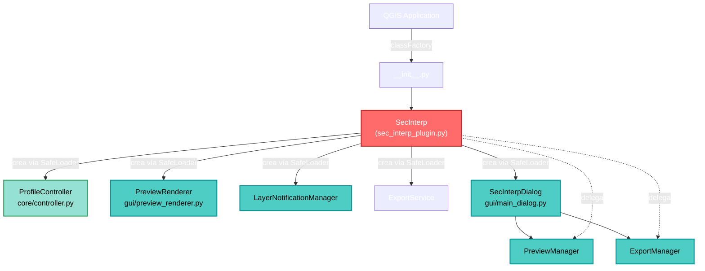
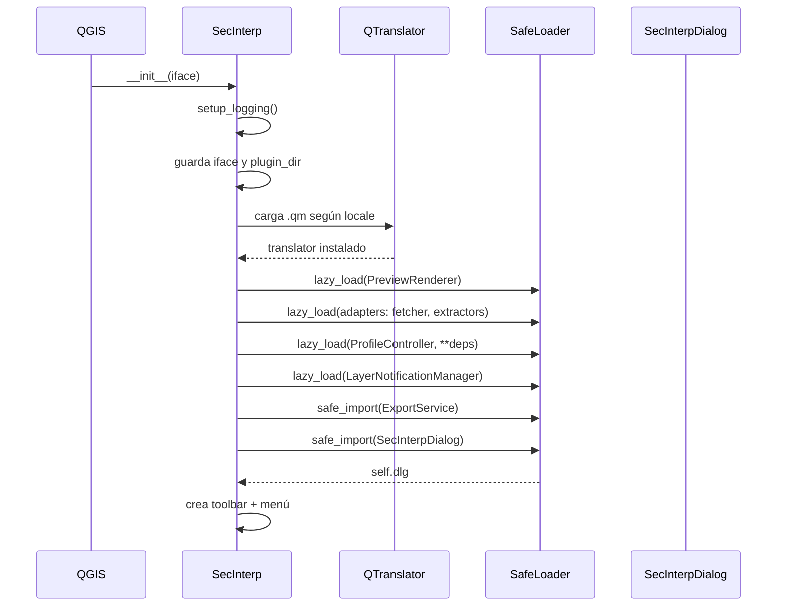
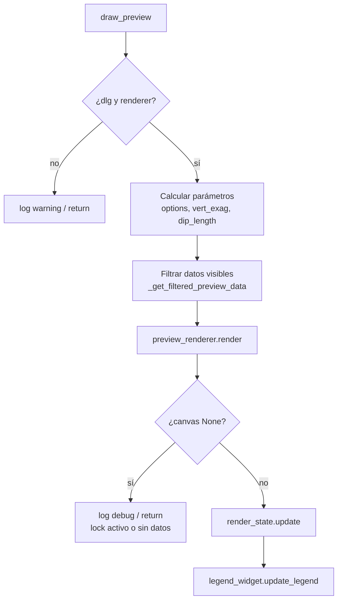

---
tags:
  - secinterp
  - code-walkthrough
  - entry-point
  - plugin-lifecycle
  - di
aliases:
  - sec_interp_plugin.py
  - SecInterp Class
  - Clase SecInterp
cssclass: secinterp-note
---

# 01 — `sec_interp_plugin.py`

> [!abstract] Resumen en una línea
> Es el **punto de entrada** del plugin: define la clase `SecInterp`, que QGIS instancia al cargar, y orquesta todo su **ciclo de vida** (inicialización, GUI, ejecución, descarga).

**Ruta**: `sec_interp_plugin.py` (507 líneas)
**Clase principal**: `SecInterp(TranslatableMixin)`
**Capa**: Entry point / Root (raíz del plugin)
**Tags**: #secinterp #entry-point #di #i18n

---

## 🎯 ¿Por qué existe este archivo?

En QGIS, todo plugin debe exponer:

1. Un **entry point** que QGIS carga (normalmente `__init__.py` → `classFactory`).
2. Una **clase raíz** con tres métodos obligatorios:
   - `initGui()` — construye menús y toolbar.
   - `unload()` — limpia todo al desactivar el plugin.
   - `run()` — se ejecuta al pulsar el botón.

`sec_interp_plugin.py` implementa esa clase raíz. **No contiene lógica de negocio ni de UI compleja**: delega.

> [!important] Principio clave
> Esta clase es un **Composition Root**: aquí se construyen e inyectan las dependencias (servicios, controller, dialog) y se cablean entre sí. Es el único lugar donde "todo se conoce".

---

## 🧬 Diagrama de relaciones



---

## 📦 Imports — lectura arquitectónica

```python
from qgis.core import QgsMapLayer                          # ①
from qgis.PyQt.QtCore import QCoreApplication, QSettings, QTranslator
from qgis.PyQt.QtGui import QIcon
from qgis.PyQt.QtWidgets import QAction

from sec_interp.core.domain import PreviewParams           # ②
from sec_interp.core.exceptions import SecInterpError
from sec_interp.core.utils.i18n import TranslatableMixin
from sec_interp.core.utils.safe_loader import SafeLoader
from sec_interp.gui.adapters.layer_resolver import resolve_layer  # ③
from sec_interp.logger_config import get_logger, setup_logging
```

| # | Observación |
|---|-------------|
| ① | Importa `qgis.core`/`qgis.PyQt` → **permitido** porque está en la capa GUI/root, no en `core/`. |
| ② | De `core` solo importa **DTOs, excepciones y utilidades puras** — nunca servicios concretos directamente. |
| ③ | `resolve_layer` vive en `gui/adapters/` porque usa `QgsProject.instance()`. Respeta el patrón *Extract-then-Compute*. |

> [!note] Detalle de estilo
> Usa `from __future__ import annotations` (requerido por las coding-standards) para tipado diferido.

---

## 🔄 Ciclo de vida del plugin

### 1. `__init__(self, iface)` — Inicialización

Es el método más importante. Orden de operaciones:



#### 1.1 Logging primero
```python
setup_logging()
```
La primera acción es habilitar el logging. Si algo falla después, queda registrado.

#### 1.2 Localización (i18n)
```python
user_locale = QSettings().value("locale/userLocale", "en")
locale_path = self.plugin_dir / f"i18n/SecInterp_{user_locale}.qm"

MIN_LOCALE_LENGTH = 2
if not locale_path.exists() and user_locale and len(user_locale) > MIN_LOCALE_LENGTH:
    locale_short = user_locale[0:2]                      # "pt_BR" → "pt"
    locale_path = self.plugin_dir / f"i18n/SecInterp_{locale_short}.qm"

if locale_path.exists():
    self.translator = QTranslator()
    self.translator.load(str(locale_path))
    QCoreApplication.installTranslator(self.translator)
```

> [!tip] Estrategia de fallback de idioma
> 1. Intenta el locale completo (`pt_BR`).
> 2. Si no existe, cae al código de 2 letras (`pt`).
> 3. Si tampoco, se queda en inglés (por defecto).

#### 1.3 Inyección de dependencias (DI) vía `SafeLoader`

El orden **importa** porque hay dependencias en cadena:

```python
# 1. Preview Renderer (componente GUI pesado)
self.preview_renderer = SafeLoader.lazy_load(
    "sec_interp.gui.preview_renderer", "PreviewRenderer"
)

# 2. Adapters de la fase "Extract" (QGIS → DTOs)
data_fetcher       = SafeLoader.lazy_load("...feature_fetcher", "DataFetcher")
structure_extractor= SafeLoader.lazy_load("...structure_extractor", "StructureExtractor")
geology_extractor  = SafeLoader.lazy_load("...geology_extractor", "GeologyExtractor")
profile_extractor  = SafeLoader.lazy_load("...profile_extractor", "ProfileExtractor")
drillhole_extractor= SafeLoader.lazy_load(
    "...drillhole_extractor", "DrillholeExtractor", data_fetcher=data_fetcher
)

# 3. Controller (lógica de negocio) — recibe los adapters por constructor
self.controller = SafeLoader.lazy_load(
    "sec_interp.core.controller", "ProfileController",
    data_fetcher=data_fetcher,
    structure_extractor=structure_extractor,
    geology_extractor=geology_extractor,
    profile_extractor=profile_extractor,
    drillhole_extractor=drillhole_extractor,
)
```

> [!important] Por qué `SafeLoader` y no `import` directo
> - **Tolerancia a fallos**: si un módulo opcional no carga, el plugin **no crashea**; registra el error y sigue.
> - **Lazy loading**: los imports pesados se resuelven en runtime, acelerando el arranque.
> - Ver [[17 - core_utils_safe_loader]] para el detalle del helper.

> [!warning] Acoplamiento observado
> `ProfileController` recibe adapters **de la capa GUI** (`gui/adapters/*`) por constructor.
> Conceptualmente el controller es `core`, pero se le inyectan extractores que sí dependen de QGIS.
> Esto es el patrón **Ports & Adapters**: el controller consume "puertos" (interfaces/objetos con contrato) sin importar QGIS directamente.

#### 1.4 ExportService (carga en dos pasos)

```python
export_mod   = SafeLoader.safe_import("sec_interp.core.services.export_service")
export_klass = SafeLoader.get_class(export_mod, "ExportService")
self.export_service = export_klass(self.controller) if export_klass else None
```
Aquí se usa `safe_import` + `get_class` (en lugar de `lazy_load`) porque necesita el módulo y la clase por separado. Recibe `self.controller` como dependencia.

#### 1.5 Diálogo principal
```python
dialog_mod   = SafeLoader.safe_import("sec_interp.gui.main_dialog")
dialog_klass = SafeLoader.get_class(dialog_mod, "SecInterpDialog")
self.dlg     = dialog_klass(self.iface, self) if dialog_klass else None

if self.dlg:
    self.dlg.plugin_instance = self
else:
    logger.error("Failed to initialize main dialog. ...")
```
El diálogo recibe `iface` y `self` (referencia circular controlada para que el dialog pueda llamar al plugin).

#### 1.6 Toolbar y estado inicial
```python
self.first_start = True
self.actions = []
self.menu = self.tr("&Sec Interp")
self.toolbar = self.iface.addToolBar(self.tr("Sec Interp"))
self.toolbar.setObjectName("SecInterp")
self.toolbar.setVisible(True)
```

---

### 2. `add_action(...)` — Helper de acciones

Crea un `QAction` y lo registra en toolbar + menú. Parámetros clave:

| Parámetro | Uso |
|-----------|-----|
| `icon_path` | Ruta al icono |
| `text` | Texto del ítem de menú |
| `callback` | Función a ejecutar (`self.run`) |
| `add_to_toolbar` | Añade a toolbar personalizada **y** a la de Plugins |
| `add_to_menu` | Añade a `Plugins > Sec Interp` |

Devuelve el `QAction` y lo acumula en `self.actions` (para limpieza posterior).

---

### 3. `initGui()` — Construcción de la GUI

```python
def initGui(self):  # noqa: N802 (nombre impuesto por QGIS)
    icon_path = str(self.plugin_dir / "icon.png")
    self.add_action(
        icon_path,
        text=self.tr("Geological data extraction"),
        callback=self.run,
        parent=self.iface.mainWindow(),
    )
    self.first_start = True
```

> [!note] `# noqa: N802`
> El nombre `initGui` no cumple snake_case, pero **QGIS lo exige**. Se silencia el linter.

---

### 4. `run()` — Ejecución al pulsar el botón

```python
def run(self):
    if not self.dlg:
        QMessageBox.critical(...)   # diálogo falló al inicializar
        return

    if self.first_start:
        self.first_start = False
        if self.preview_renderer:
            self.preview_renderer.canvas = self.dlg.preview_widget.canvas
        self.dlg.accepted.connect(self.process_data)

    if hasattr(self.dlg, "signal_manager"):
        self.dlg.signal_manager.connect_all()   # idempotente

    self.dlg._load_interpretations()
    self.dlg._load_user_settings()
    self.dlg.show()
    self.dlg.exec()
```

> [!important] Patrón "re-conectar siempre"
> `signal_manager.connect_all()` se llama en **cada** `run()` de forma idempotente. Así las herramientas siguen funcionando tras múltiples sesiones abrir/cerrar, sin duplicar conexiones.

---

### 5. `unload()` — Limpieza al desactivar

```python
def unload(self):
    self.disconnect_signals()                 # 1. desconectar señales
    for action in self.actions:               # 2. quitar menús/toolbar
        self.iface.removePluginMenu(self.tr("&Sec Interp"), action)
        self.iface.removeToolBarIcon(action)
    if self.toolbar:                          # 3. eliminar toolbar custom
        with contextlib.suppress(Exception):
            self.iface.mainWindow().removeToolBar(self.toolbar)
        del self.toolbar
        self.toolbar = None
```

> [!warning] Prevención de memory leaks
> Desconectar señales antes de destruir objetos es **crítico** en PyQt. Ver [[01 - sec_interp_plugin#6. Gestión de señales]] más abajo.

---

## 🧩 Métodos de delegación (thin wrappers)

Esta clase **no implementa lógica**: delega a los managers del diálogo.

### `process_data(inputs=None)`
```python
success, message = self.dlg.preview_manager.generate_preview()
if not success:
    logger.warning(f"Data processing failed: {message}")
    return None
cache = self.dlg.preview_manager.cached_data
return cache["topo"], cache["geol"], cache["struct"]
```
Delega en `PreviewManager` y devuelve datos cacheados por compatibilidad.

### `save_profile_line()`
```python
self.dlg.export_manager.export_data()
```
Delega en `ExportManager`.

---

## 🎨 `draw_preview(...)` — Render del perfil

Método más extenso de la clase. Flujo:



### 5.1 `_get_filtered_preview_data(...)`
Devuelve un dict con solo los datos visibles según los flags de `options`:
`show_topo`, `show_geol`, `show_struct`, `show_drillholes`, `show_interpretations`.

### 5.2 `_calculate_dip_length(struct_data)`
Calcula la longitud visual de las líneas de buzamiento:
```python
dip_scale = self.dlg.page_struct.scale_spin.value()
raster_layer = self.dlg.page_dem.raster_combo.currentLayer()
if raster_layer and raster_layer.isValid():
    res = raster_layer.rasterUnitsPerPixelX()
    if res > 0:
        return res * dip_scale
```
> [!tip] Por qué multiplicar por la resolución del raster
> Así la longitud de la línea de dip es **proporcional a la escala del mapa**, no un valor arbitrario en píxeles.

---

## 🔐 Gestión de señales

```python
def disconnect_signals(self):
    self._disconnect_actions()
    self._disconnect_dialog()
    self._disconnect_layer_notifications()
```

| Método | Qué desconecta |
|--------|----------------|
| `_disconnect_actions` | `action.triggered` de cada acción |
| `_disconnect_dialog` | `dlg.accepted` + llama `dlg.cleanup()` si existe |
| `_disconnect_layer_notifications` | `layer_notification_manager.disconnect()` |

Todos usan `contextlib.suppress(TypeError, RuntimeError)` o `suppress(Exception)` para ser **tolerantes**: desconectar algo ya desconectado no debe romper el unload.

> [!important] Regla de oro PyQt
> Toda señal que se conecta debe desconectarse al descargar. SecInterp llegó a **cero signal leaks** en v3.0.1 (desde 22 iniciales).

---

## 🔗 `_collect_active_layers(params)` y `_get_and_validate_inputs()`

### `_get_and_validate_inputs()`
1. Lee valores del diálogo (`get_selected_values`, `get_preview_options`).
2. Construye un `PreviewParams` (DTO).
3. `params.validate()`.
4. Valida con `ProjectValidator.validate_all(build_validation_params(params))`.
5. Manejo de errores **granular**:
   - `SecInterpError` → error de configuración.
   - `(ValueError, TypeError, KeyError, AttributeError)` → error de input.
   - `(MemoryError, SystemError, KeyboardInterrupt)` → **re-lanza** (críticos).
   - `Exception` → catch-all con `logger.exception`.

> [!note] Por qué re-lanzar excepciones críticas
> `MemoryError`/`KeyboardInterrupt` no son errores de usuario: deben propagarse para no dejar el proceso en estado inconsistente.

### `_collect_active_layers(params)`
Construye un mapa `bucket → QgsMapLayer` usando `resolve_layer()` (adapter GUI), para que `LayerNotificationManager` vigile cambios en las capas activas.

| bucket | parámetro |
|--------|-----------|
| `topo` | `raster_layer` |
| `section` | `line_layer` |
| `geol` | `outcrop_layer` |
| `struct` | `struct_layer` |
| `drill_collar` | `collar_layer` |
| `drill_survey` | `survey_layer` |
| `drill_interval` | `interval_layer` |

---

## 🏛️ Patrones de diseño presentes

| Patrón | Dónde | Propósito |
|--------|-------|-----------|
| **Composition Root** | `__init__` | Construir y cablear todas las dependencias |
| **Dependency Injection** | `lazy_load(..., **deps)` | Inyectar adapters/controller |
| **Lazy Loading** | `SafeLoader.lazy_load` | Cargar componentes solo cuando se necesitan |
| **Fault Tolerance / Circuit** | `SafeLoader.safe_import` | No crashear si un módulo falla |
| **Delegation / Facade** | `process_data`, `draw_preview` | La clase raíz delega en managers |
| **Mixin** | `TranslatableMixin` | Provee `tr()` sin heredar de `QObject` |
| **Template Method (Qt)** | `initGui` / `unload` | Hooks de ciclo de vida de QGIS |

---

## 🌐 Internacionalización

```python
class SecInterp(TranslatableMixin):
    ...
    self.menu = self.tr("&Sec Interp")
```

`TranslatableMixin` (en [[18 - core_utils_i18n]]) define:
```python
def tr(self, message: str) -> str:
    return QCoreApplication.translate(self.__class__.__name__, message)
```

> [!tip] Contexto de traducción
> El "context" es el **nombre de la clase** (`SecInterp`), lo que permite tener traducciones específicas por clase sin colisiones.

---

## 🧾 Resumen de la API pública

| Método | Tipo | Responsabilidad |
|--------|------|-----------------|
| `__init__(iface)` | lifecycle | Init, i18n, DI, toolbar |
| `initGui()` | lifecycle | Menú + toolbar (QGIS hook) |
| `run()` | lifecycle | Abre el diálogo (QGIS hook) |
| `unload()` | lifecycle | Limpieza total (QGIS hook) |
| `add_action(...)` | helper | Crea `QAction` y la registra |
| `disconnect_signals()` | cleanup | Desconecta todo |
| `process_data(...)` | delegación | → `PreviewManager` |
| `save_profile_line()` | delegación | → `ExportManager` |
| `draw_preview(...)` | render | Orquesta render del perfil |
| `_get_and_validate_inputs()` | validación | Construye/valida `PreviewParams` |
| `_collect_active_layers(...)` | helper | Mapa bucket→layer |
| `_get_filtered_preview_data(...)` | helper | Filtra por visibilidad |
| `_calculate_dip_length(...)` | helper | Longitud de líneas de dip |

---

## 👀 Observaciones y notas

> [!success] Fortalezas
> - DI explícita y ordenada; fácil de testear/mockear.
> - Tolerancia a fallos con `SafeLoader` (un módulo roto no tumba el plugin).
> - i18n robusto con fallback de locale.
> - Limpieza de señales cuidadosa (cero leaks).

> [!warning] Puntos de atención
> - **Acoplamiento**: el controller (core) recibe adapters GUI; es deliberado pero conviene vigilar que no se filtre QGIS hacia `core/services`.
> - `draw_preview` tiene ~40 líneas y varios pasos; candidato a extraer si crece más.
> - Acceso a atributos privados del diálogo (`self.dlg._load_interpretations()`, `_load_user_settings()`): rompe encapsulación. Podrían exponerse como métodos públicos.
> - `# noinspection PyBroadException` + `contextlib.suppress(Exception)` en `unload` silencian errores; aceptable en cleanup, pero conviene loguear.

> [!question] Preguntas abiertas
> - ¿Debería `_get_and_validate_inputs` vivir en un validador dedicado en `core/validation/`?
> - ¿El `self.dlg` debería crearse de forma perezosa (lazy) solo al primer `run()` para acelerar la carga?

---

## 🔗 Notas relacionadas

- [[00 - Index]] — índice de la bóveda
- [[17 - core_utils_safe_loader]] — `SafeLoader` (DI tolerante)
- [[18 - core_utils_i18n]] — `TranslatableMixin`
- [[10 - core_controller]] — `ProfileController`
- [[20 - gui_main_dialog]] — `SecInterpDialog`
- [[21 - gui_dialog_preview_manager]] — `PreviewManager`
- [[22 - gui_dialog_export_manager]] — `ExportManager`
- [[25 - gui_adapters]] — adapters de la fase Extract
- [[ARCHITECTURE_EN]] — arquitectura general

---

*Nota 01 de la bóveda SecInterp Code Walkthrough — v3.8.0*
