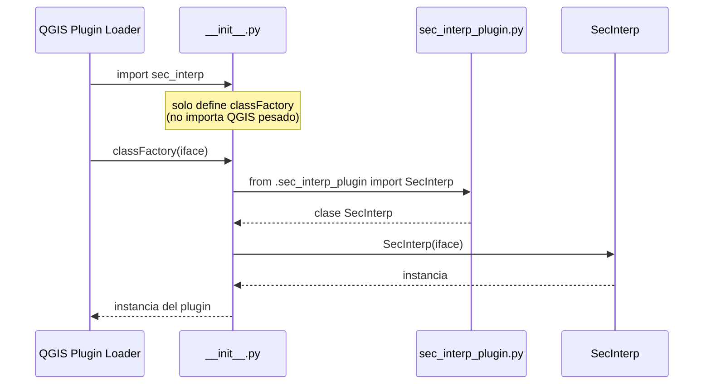

---
tags:
  - secinterp
  - code-walkthrough
  - entry-point
  - plugin-factory
  - lazy-import
aliases:
  - __init__.py
  - classFactory
  - SecInterp factory
cssclass: secinterp-note
---

# 02 — `__init__.py`

> [!abstract] Resumen en una línea
> Es el **entry point oficial** del plugin: QGIS importa este paquete y llama a `classFactory(iface)` para obtener la instancia de `SecInterp`.

**Ruta**: `__init__.py` (49 líneas)
**Función principal**: `classFactory(iface)`
**Capa**: Entry point (bootstrap)
**Tags**: #secinterp #entry-point #lazy-import

---

## 🎯 ¿Por qué existe este archivo?

QGIS no sabe nada de la clase `SecInterp`. Su **contrato de carga** es:

1. Busca un paquete Python con el nombre del plugin (la carpeta `sec_interp/`).
2. Importa su `__init__.py`.
3. Busca y llama a la función **`classFactory(iface)`**.
4. Usa el objeto devuelto como instancia del plugin.

Este archivo cumple ese contrato. Es **deliberadamente mínimo**: solo importa y construye.

> [!important] Contrato QGIS
> El nombre `classFactory` es **obligatorio y case-sensitive**. No puede renombrarse.

---

## 🧬 Diagrama de flujo de carga



---

## 📦 El código, línea por línea

### 1. Docstring del paquete

```python
from __future__ import annotations

"""SecInterp QGIS Plugin.

This plugin provides tools for cross-section generation and geological interpretation
data extraction from QGIS layers.
"""
```

> [!warning] Detalle sutil de estilo
> El docstring está **después** de `from __future__ import annotations`.
> Técnicamente, un módulo docstring debe ser la **primera** sentencia para que `__doc__` se asigne.
> Aquí el string queda como una expresión suelta (no como docstring del módulo).
> Funciona, pero `sec_interp.__doc__` será `None`. Es un detalle menor, heredado del Plugin Builder.

### 2. Cabecera de licencia (GPL v2+)

Bloque de comentarios generado por el **Plugin Builder** con:
- Autoría: Juan M Bernales
- Fecha: 2025-11-15
- `git sha: $Format:%H$` (placeholder de Git)
- Licencia GPL v2 o posterior

> [!note] `$Format:%H$`
> Es una palabra clave de Git. Si se activa un filtro `ident`, se sustituye por el hash del commit.
> Normalmente permanece literal.

### 3. Import de tipo bajo `TYPE_CHECKING`

```python
from typing import TYPE_CHECKING

if TYPE_CHECKING:
    from qgis.gui import QgsInterface
```

> [!tip] Por qué no importar `QgsInterface` directamente
> - `qgis.gui` es un módulo pesado.
> - El tipo solo se necesita para **type checkers** (mypy/pyright), no en runtime.
> - `TYPE_CHECKING` es `False` en ejecución → el import nunca ocurre en producción.
> - Evita cargar QGIS durante el análisis estático o tests que no lo requieren.

### 4. La función `classFactory`

```python
# noinspection PyPep8Naming
def classFactory(iface: QgsInterface):  # pylint: disable=invalid-name
    """Load SecInterp class from file SecInterp.

    Args:
        iface: A QGIS interface instance.

    Returns:
        SecInterp: An instance of the plugin.

    """
    from .sec_interp_plugin import SecInterp

    return SecInterp(iface)
```

| Elemento | Explicación |
|----------|-------------|
| `# noinspection PyPep8Naming` | Silencia a PyCharm por el nombre camelCase |
| `# pylint: disable=invalid-name` | Silencia a Pylint por la misma razón |
| `from .sec_interp_plugin import SecInterp` | **Import diferido**: ocurre *dentro* de la función |
| `return SecInterp(iface)` | Construye y devuelve la instancia |

> [!important] Por qué el import es diferido (lazy)
> Si `from .sec_interp_plugin import SecInterp` estuviera **arriba** del módulo, se ejecutaría
> al importar el paquete — antes de que QGIS esté listo, y arrastrando todo el árbol de dependencias.
> Al ponerlo **dentro** de `classFactory`, el import ocurre solo cuando QGIS pide la instancia.
> Beneficios:
> - Arranque más rápido del gestor de plugins.
> - Menos errores de import circular.
> - La carga pesada se concentra en un único punto controlado.

---

## 🔗 Relación con la nota 01

`classFactory` es el **primer eslabón** de la cadena de carga:

```
QGIS → __init__.classFactory(iface)          ← esta nota (02)
        └─> SecInterp.__init__(iface)         ← nota 01
             └─> SafeLoader.lazy_load(...)     ← DI
                  └─> ProfileController, Dialog, ...
```

Ver [[01 - sec_interp_plugin]] para el ciclo de vida completo.

---

## 🏛️ Patrones de diseño presentes

| Patrón | Dónde | Propósito |
|--------|-------|-----------|
| **Factory Function** | `classFactory` | Encapsular la creación de la instancia |
| **Lazy Import** | import dentro de la función | Diferir carga pesada de QGIS |
| **Type-only Import** | `if TYPE_CHECKING:` | Tipado sin costo en runtime |
| **Plugin Contract** | nombre `classFactory` | Cumplir el contrato de QGIS |

---

## 🧾 Resumen de la API

| Símbolo | Tipo | Responsabilidad |
|---------|------|-----------------|
| `classFactory(iface)` | función | Devuelve una instancia de `SecInterp` |
| `QgsInterface` | tipo (TYPE_CHECKING) | Anotación del parámetro `iface` |

---

## 👀 Observaciones y notas

> [!success] Fortalezas
> - Extremadamente simple y alineado al contrato QGIS.
> - Import diferido → arranque limpio.
> - Tipado sin dependencia en runtime.

> [!warning] Puntos de atención
> - El docstring del módulo está después de `from __future__` → `__doc__` queda `None`. Se podría mover arriba (respetando que `from __future__` debe ir primero... en realidad el docstring debe ir **antes** de cualquier import, incluido `__future__`, para ser válido). Reordenar a: docstring → `from __future__`.
> - El nombre `SecInterp` en el docstring dice "from file SecInterp" (heredado del builder); el archivo real es `sec_interp_plugin.py`. Detalle cosmético.

> [!question] Preguntas abiertas
> - ¿Conviene usar `importlib.import_module` para máxima tolerancia (consistente con `SafeLoader`)?
>   No: aquí un fallo de import **debe** propagarse para que QGIS marque el plugin como no cargable.

---

## 🔗 Notas relacionadas

- [[00 - Index]] — índice de la bóveda
- [[01 - sec_interp_plugin]] — clase `SecInterp` y ciclo de vida
- [[03 - logger_config]] — logging centralizado
- [[17 - safe_loader]] — carga tolerante a fallos (contraste con este import estricto)

---

*Nota 02 de la bóveda SecInterp Code Walkthrough — v3.8.0*
