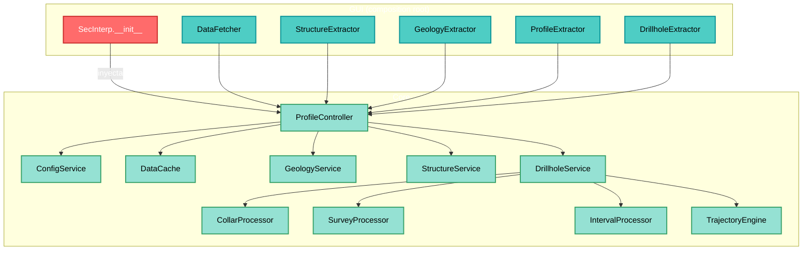
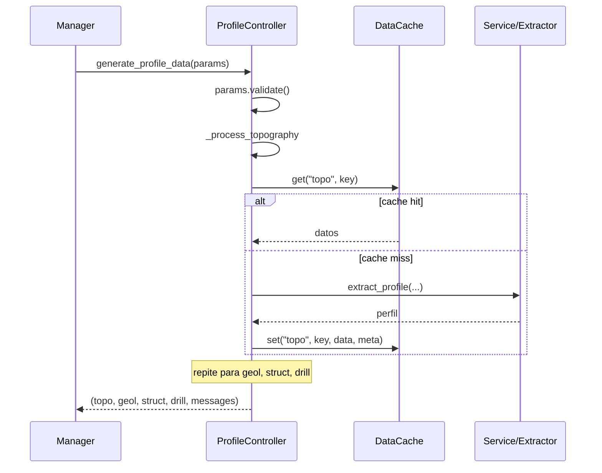

---
tags:
  - secinterp
  - code-walkthrough
  - core
  - orchestrator
  - caching
  - di
aliases:
  - controller.py
  - ProfileController
  - Controlador de perfil
cssclass: secinterp-note
---

# 10 — `core/controller.py`

> [!abstract] Resumen en una línea
> Es el **orquestador central** del core: coordina los servicios (topografía, geología, estructuras, sondajes) a través de **adapters inyectados** y gestiona un **caché granular** por componente.

**Ruta**: `core/controller.py` (425 líneas)
**Clase principal**: `ProfileController(TranslatableMixin)`
**Capa**: Core (QGIS-agnóstico)
**Tags**: #secinterp #core #orchestrator #caching #di

---

## 🎯 ¿Por qué existe este archivo?

El controller es el **punto de entrada de la lógica de negocio**. Su misión:

1. **Orquestar** cuatro dominios de datos (topo, geología, estructuras, sondajes).
2. **Cachear** cada componente por separado (evita recomputar lo que no cambió).
3. **Inyectar** los adapters GUI (fase *Extract*) sin depender directamente de QGIS.
4. **Acumular mensajes** de estado para la UI.

> [!important] QGIS-agnóstico verificado
> `controller.py` **no importa nada de `qgis.*`**.
> Toda interacción con capas ocurre vía los *extractors* inyectados (`gui/adapters/*`).
> Esto respeta el patrón **Extract-then-Compute** y hace el core testeable sin QGIS.

---

## 🧬 Arquitectura de orquestación



---

## 📦 Imports — lectura arquitectónica

```python
import hashlib
import time
from typing import Any

from sec_interp.core.config import ConfigService          # ①
from sec_interp.core.data_cache import DataCache
from sec_interp.core.domain import (                       # ②
    DrillholeProjection, GeologySegment, PreviewParams, StructureMeasurement,
)
from sec_interp.core.exceptions import ProcessingError
from sec_interp.core.utils.i18n import TranslatableMixin
from sec_interp.core.utils.safe_loader import SafeLoader
from sec_interp.logger_config import get_logger
```

| # | Observación |
|---|-------------|
| ① | Solo dependencias internas del core + stdlib. **Cero `qgis.*`**. |
| ② | Los DTOs del dominio (`PreviewParams`, `GeologySegment`…) definen los contratos de datos. |

---

## 🔧 `__init__` — Inyección de dependencias

```python
def __init__(
    self,
    data_fetcher=None,
    structure_extractor=None,
    geology_extractor=None,
    profile_extractor=None,
    drillhole_extractor=None,
) -> None:
    self.config_service = ConfigService()
    self.data_cache = DataCache()
    self.settings = self.config_service.get_all_settings()

    # Adapters inyectados desde el composition root (GUI)
    self.data_fetcher = data_fetcher
    self.structure_extractor = structure_extractor
    self.geology_extractor = geology_extractor
    self.profile_extractor = profile_extractor
    self.drillhole_extractor = drillhole_extractor
    ...
```

### Servicios internos (lazy + seguros)

```python
# Procesadores de sondajes
self.collar_processor   = SafeLoader.lazy_load("...collar_processor", "CollarProcessor")
self.survey_processor   = SafeLoader.lazy_load("...survey_processor", "SurveyProcessor")
self.interval_processor = SafeLoader.lazy_load("...interval_processor", "IntervalProcessor")
self.trajectory_engine  = SafeLoader.lazy_load("...trajectory_engine", "TrajectoryEngine")

# Servicios QGIS-agnósticos
self.geology_service  = SafeLoader.lazy_load("...geology_service", "GeologyService")
self.structure_service= SafeLoader.lazy_load("...structure_service", "StructureService")
self.drillhole_service= SafeLoader.lazy_load(
    "...drillhole_service", "DrillholeService",
    collar_processor=self.collar_processor,
    survey_processor=self.survey_processor,
    interval_processor=self.interval_processor,
    data_fetcher=self.data_fetcher,
    trajectory_engine=self.trajectory_engine,
)
```

> [!tip] Composición de servicios
> `DrillholeService` recibe sus 4 colaboradores por constructor (Facade).
> Ver [[15 - drillhole_service]] para el desglose del sub-sistema.

> [!note] `data_fetcher` cruza capas
> El `DataFetcher` (GUI) se pasa **dos veces**: al controller y a `DrillholeService`.
> Es el adapter de más bajo nivel para obtener features de QGIS.

---

## 🔄 `generate_profile_data(params)` — Orquestación principal

```python
def generate_profile_data(self, params: PreviewParams) -> tuple[...]:
    params.validate()
    messages: list[str] = []
    cache_meta = {
        "max_points": params.max_points,
        "canvas_width": params.canvas_width,
        "timestamp": time.time(),
    }

    profile_data   = self._process_topography(params, cache_meta, messages)   # 1
    geol_data      = self._process_geology(params, cache_meta, messages)      # 2
    struct_data    = self._process_structures(params, cache_meta, messages)   # 3
    drillhole_data = self._process_drillholes(params, cache_meta, messages)   # 4

    return profile_data, geol_data, struct_data, drillhole_data, messages
```



> [!important] Caché granular por componente
> Cada dominio tiene su **propio namespace** en `DataCache`: `topo`, `geol`, `struct`, `drill` (y `main`).
> Si solo cambia la geología, la topografía se sirve de caché — no se recalcula.

---

## 🔑 `_get_cache_sub_key(param_values)` — Clave de caché

```python
def _get_cache_sub_key(self, param_values: list[Any]) -> str:
    hasher = hashlib.md5()  # nosec B324
    for val in param_values:
        if hasattr(val, "id"):     # capas QGIS → usar su ID
            val = val.id()
        hasher.update(str(val).encode("utf-8"))
    return hasher.hexdigest()
```

| Detalle | Razón |
|---------|-------|
| **MD5** | No es seguridad, es una clave de caché → `# nosec B324` (Bandit) |
| `hasattr(val, "id")` | Una capa QGIS se identifica por su `id()`, no por su `repr` |
| `str(val)` | Normaliza cualquier tipo (int, float, str) a texto |

> [!warning] `MD5` y el linter de seguridad
> Bandit marca `hashlib.md5` como `B324` (hash inseguro) por defecto.
> Aquí **no** es criptografía: es una clave de caché. El comentario `# nosec B324` documenta y suprime la alerta.

> [!caution] Nota de rigor
> `hashlib.md5()` sin argumento falla en **FIPS mode**. Para producción extrema podría usarse `hashlib.md5(usedforsecurity=False)` (Python 3.9+) en lugar de `# nosec`.

---

## 1️⃣ `_process_topography(...)`

```python
topo_key = self._get_cache_sub_key([params.band_num, params.max_points])
profile_data = self.data_cache.get("topo", topo_key)

if not profile_data:
    if not line_lyr or not raster_lyr:
        raise ProcessingError(self.tr("Required layers for topography are missing."))
    if not self.profile_extractor:
        raise ProcessingError(self.tr("Topography service failed to load."))
    profile_data = self.profile_extractor.extract_profile(line_lyr, raster_lyr, params.band_num)
    if not profile_data:
        raise ProcessingError(self.tr("No topographic profile data was generated."))

self.data_cache.set("topo", topo_key, profile_data, cache_meta)
messages.append(self.tr("✓ Data processed successfully!\n\nTopography: {0} points").format(...))
```

| Característica | Detalle |
|----------------|---------|
| **Obligatorio** | A diferencia de los otros, la topografía **lanza `ProcessingError`** si falta |
| **Clave** | `[band_num, max_points]` |
| **Adapter** | `profile_extractor.extract_profile(...)` (fase Extract) |

> [!note] Por qué topografía es "obligatoria"
> Es la base de la sección. Sin perfil topográfico no hay nada que mostrar, por eso falla rápido en vez de devolver `None`.

---

## 2️⃣ `_process_geology(...)`

```python
if not params.outcrop_layer:
    return None                       # opcional

geol_key = self._get_cache_sub_key(
    [params.outcrop_layer, params.outcrop_name_field, params.band_num]
)
geol_data = self.data_cache.get("geol", geol_key)

if not geol_data:
    context = self.geology_extractor.extract_context(...)   # EXTRACT
    geol_data = self.geology_service.build_segments(context) # COMPUTE
```

> [!important] Patrón Extract-then-Compute explícito
> - `geology_extractor.extract_context(...)` → convierte capas QGIS en un *context* puro.
> - `geology_service.build_segments(context)` → **cálculo puro**, sin QGIS.
> Ver [[14 - geology_service]].

---

## 3️⃣ `_process_structures(...)`

```python
ctx = self.structure_extractor.extract_section_and_structures(line_lyr, struct_lyr, params.buffer_dist)
if ctx is None:
    return None

def elevation_sampler(x: float, y: float) -> float:
    return self.structure_extractor.sample_elevation(raster_lyr, x, y, params.band_num)

struct_data = self.structure_service.project_structures(
    line_points=ctx.line_points,
    struct_data=ctx.structures,
    elevation_sampler=elevation_sampler,   # ← inyección de callback
    line_az=ctx.line_azimuth,
    dip_field=params.dip_field,
    strike_field=params.strike_field,
)
```

> [!tip] Closure como estrategia de muestreo
> `elevation_sampler` es una **closure** que encapsula el acceso al raster.
> Así `structure_service.project_structures` (core puro) puede obtener elevaciones
> **sin conocer QGIS**: solo llama a `elevation_sampler(x, y)`.
> Es inversión de dependencias en acción.

---

## 4️⃣ `_process_drillholes(...)`

```python
if not params.collar_layer:
    return None                       # opcional

drill_key = self._get_cache_sub_key(
    [params.collar_layer, params.survey_layer, params.interval_layer, params.buffer_dist]
)
drillhole_data = self.data_cache.get("drill", drill_key)
if drillhole_data:
    return drillhole_data

survey_fields   = {"id": ..., "depth": ..., "azim": ..., "incl": ...}
interval_fields = {"id": ..., "from": ..., "to": ..., "lith": ...}

context = self.drillhole_extractor.extract_context(
    params.line_layer, params.buffer_dist, params.collar_layer, params.collar_id_field, ...
)
if context is None:
    return None

_, drillhole_data = self.drillhole_service.process_context(context)   # COMPUTE
```

| Característica | Detalle |
|----------------|---------|
| **Clave** | `[collar_layer, survey_layer, interval_layer, buffer_dist]` |
| **Campos** | Se agrupan en dicts `survey_fields` / `interval_fields` |
| **Retorno** | `process_context` devuelve una tupla; solo interesa el segundo elemento |

> [!note] Por qué `_, drillhole_data = ...`
> `process_context` devuelve `(algo, drillhole_data)`. Usar `_` descarta explícitamente lo que no se necesita.

---

## 🗄️ Estrategia de caché

`DataCache` se usa con **namespaces** y **claves**:

| Namespace | Clave | Contenido |
|-----------|-------|-----------|
| `main` | hash de `inputs` (dict) | Resultado completo (API pública legacy) |
| `topo` | hash `[band_num, max_points]` | Perfil topográfico |
| `geol` | hash `[outcrop_layer, name_field, band_num]` | Segmentos geológicos |
| `struct` | hash `[struct_layer, buffer, dip, strike, band_num]` | Mediciones proyectadas |
| `drill` | hash `[collar, survey, interval, buffer]` | Sondajes proyectados |

> [!important] Caché *cache-aside*
> El patrón es: **consultar → si miss, calcular → almacenar**.
> `cache_meta` (max_points, canvas_width, timestamp) se guarda junto al dato para invalidación por LOD.

---

## 🏛️ Patrones de diseño presentes

| Patrón | Dónde | Propósito |
|--------|-------|-----------|
| **Orchestrator / Facade** | `generate_profile_data` | Coordina 4 dominios con una sola entrada |
| **Dependency Injection** | `__init__` | Recibe los extractors desde el composition root |
| **Cache-Aside** | `_process_*` | Consultar / calcular / almacenar |
| **Template Method** | `_process_*` | Misma estructura: key → cache → compute → message |
| **Strategy (callback)** | `elevation_sampler` | Inyecta el muestreo de elevación |
| **Fault-tolerant Factory** | `SafeLoader.lazy_load` | Servicios opcionales sin crash |
| **Mixin** | `TranslatableMixin` | `self.tr()` en mensajes |

---

## 🧾 Resumen de la API

| Método | Tipo | Responsabilidad |
|--------|------|-----------------|
| `__init__(...)` | constructor | DI de extractors + servicios lazy |
| `reload_settings()` | config | Recarga settings desde `ConfigService` |
| `get_cached_data(inputs)` | cache | Lee del namespace `main` |
| `cache_data(inputs, data)` | cache | Escribe en el namespace `main` |
| `generate_profile_data(params)` | principal | Orquesta los 4 dominios |
| `_get_cache_sub_key(values)` | helper | Clave MD5 normalizada |
| `_process_topography(...)` | privado | Topografía (obligatoria) |
| `_process_geology(...)` | privado | Geología (opcional) |
| `_process_structures(...)` | privado | Estructuras (opcional) |
| `_process_drillholes(...)` | privado | Sondajes (opcional) |

---

## 👀 Observaciones y notas

> [!success] Fortalezas
> - **Cero QGIS** en el controller → testeable sin entorno QGIS.
> - Caché granular: cambiar un dominio no invalida los demás.
> - DI limpia: los adapters entran por constructor.
> - Inversión de dependencias real (`elevation_sampler`).

> [!warning] Puntos de atención
> - `_process_*` comparten firma y estructura repetitiva (candidatos a un template genérico).
> - `_get_cache_sub_key` usa `md5` (no FIPS-safe); considerar `usedforsecurity=False`.
> - `get_cached_data`/`cache_data` (namespace `main`) parecen legacy frente a las sub-claves.
> - Mezcla de idiomas/errores: topografía **lanza** excepción; el resto devuelve `None`. Inconsistente.
> - Los mensajes de UI (`✓ Data processed...`) se construyen en el core; idealmente la UI formatearía.

> [!question] Preguntas abiertas
> - ¿Unificar el manejo de "opcional" vs "obligatorio" con una política explícita?
> - ¿Mover el formateo de mensajes a la capa GUI?

---

## 🔗 Notas relacionadas

- [[00 - Index]] — índice de la bóveda
- [[01 - sec_interp_plugin]] — composition root que inyecta los adapters
- [[11 - domain]] — DTOs (`PreviewParams`, `GeologySegment`…)
- [[12 - exceptions]] — `ProcessingError`
- [[13 - profile_service]] — topografía
- [[14 - geology_service]] — geología
- [[15 - drillhole_service]] — sondajes
- [[25 - adapters]] — extractors de la fase Extract
- [[ARCHITECTURE_EN]] — arquitectura general

---

*Nota 10 de la bóveda SecInterp Code Walkthrough — v3.8.0*
