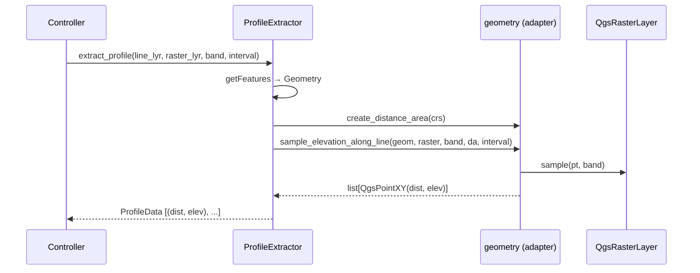

---
tags:
  - secinterp
  - code-walkthrough
  - gui
  - adapters
  - profile
  - extract-phase
aliases:
  - profile_extractor.py
  - ProfileExtractor
  - profile_service
cssclass: secinterp-note
---

# 13 — `profile_extractor.py` / `ProfileService`

> [!abstract] Resumen en una línea
> Es el **adapter de extracción topográfica** (fase *Extract*): lee la línea de sección y muestrea el DEM, devolviendo un `ProfileData` puro — sin tocar el core.

**Ruta real**: `gui/adapters/profile_extractor.py` (86 líneas)
**Clase**: `ProfileExtractor`
**Ruta histórica**: `core/services/profile_service.py` (migrado a GUI en v3.8)
**Capa**: GUI · Adapters
**Tags**: #secinterp #gui #adapters #profile #extract-phase

> [!note] Aclaración de nombres
> El índice lista `13 - profile_service`. Desde v3.8 la lógica **vive en el adapter** `ProfileExtractor` (GUI). No queda un `ProfileService` en `core/`; la extracción es pura *Extract*, el cómputo posterior (si existe) se hace en el core con datos ya desacoplados. Esta nota documenta `profile_extractor.py`.

---

## 🎯 ¿Por qué existe este archivo?

La topografía es la **base obligatoria** de la sección. Este adapter resuelve:

| Problema | Solución |
|----------|----------|
| Necesitas elevaciones del DEM a lo largo de la línea | `extract_profile()` densifica + muestrea |
| LOD (nivel de detalle) según ancho de canvas | `calculate_lod_interval()` deriva el intervalo |
| No meter `QgsRasterLayer` en el core | Devuelve `ProfileData = list[tuple[float, float]]` |

> [!important] Extract-then-Compute puro
> Este adapter **no calcula** en el core; *extrae* y transforma a primitivas. El core (`[[10 - controller]]`) solo recibe `ProfileData` listo.

---

## 🧬 Flujo de extracción



---

## 🧱 Método 1 — `calculate_lod_interval()`

```python
def calculate_lod_interval(self, line_lyr: QgsVectorLayer, canvas_width: int) -> float | None:
    line_feat = next(line_lyr.getFeatures(), None)
    if not line_feat:
        return None
    line_geom = line_feat.geometry()
    if not line_geom or line_geom.isNull():
        return None

    line_len = line_geom.length()
    max_pts = max(200, int(canvas_width * 2))
    return line_len / max_pts if max_pts > 0 else None
```

| Detalle | Explicación |
|---------|-------------|
| **`canvas_width * 2`** | ~2 puntos por píxel → densidad visual sin exceso |
| **`max(200, ...)`** | Mínimo garantizado con canvas muy pequeño |
| **Retorno `None`** | Si la línea está vacía, el llamador decide fallback |

> [!tip] LOD = Level of Detail
> Intervalo pequeño → más puntos → más detalle; ancho de canvas grande → más puntos.

---

## 🧱 Método 2 — `extract_profile()`

```python
def extract_profile(
    self,
    line_lyr: QgsVectorLayer,
    raster_lyr: QgsRasterLayer,
    band_number: int = 1,
    interval: float | None = None,
) -> ProfileData:
    line_feat = next(line_lyr.getFeatures(), None)
    if not line_feat:
        raise DataMissingError(self.tr("Line layer has no features"), {"layer": line_lyr.name()})

    geom = line_feat.geometry()
    if not geom or geom.isNull():
        raise GeometryError(self.tr("Line geometry is not valid"), {"layer": line_lyr.name()})

    da = geometry.create_distance_area(line_lyr.crs())
    points = geometry.sample_elevation_along_line(
        geom, raster_lyr, band_number, da, interval=interval
    )
    return [(round(p.x(), 1), round(p.y(), 1)) for p in points]
```

### Paso a paso

| Paso | Qué hace | Helpers en `geometry.py` |
|------|----------|--------------------------|
| 1. Obtener feature | `next(line_lyr.getFeatures())` | — |
| 2. Validar | `isNull()` | — |
| 3. Crear `QgsDistanceArea` | Para medir distancias geodésicas | `create_distance_area(crs)` |
| 4. Densificar + muestrear | Inserta vértices cada `interval` y muestrea elevación | `sample_elevation_along_line(...)` |
| 5. Aplanar | `QgsPointXY(dist, elev)` → `tuple` redondeado a 0.1 | `round(p.x(), 1)` |

> [!warning] Redondeo a `0.1`
> Se trunca la precisión a decímetros. Suficiente para visualización; para cálculo científico
> podría conservarse `float` completo y redondear solo en render.

> [!important] Dependientes de `geometry.py`
> - `create_distance_area` respeta el CRS y el elipsoide.
> - `sample_elevation_along_line` densifica con `_densify_line_points` (matemática pura) y acumula `distance` con `da.measureLine`.
> - Si `interval` es `None`, usa `raster.rasterUnitsPerPixelX()` (resolución nativa).

---

## 🧱 Errores y `tr()`

```python
def tr(self, message: str) -> str:
    return QCoreApplication.translate("ProfileExtractor", message)
```

| Excepción | Cuándo |
|-----------|--------|
| `DataMissingError` | Capa de línea sin features |
| `GeometryError` | Geometría nula |

> [!note] `QCoreApplication.translate("ProfileExtractor", ...)`
> No hereda de `QObject` ni usa `TranslatableMixin`; implementa un `tr()` local con contexto = nombre de la clase. Mínimo y explícito.

---

## 🏛️ Patrones de diseño presentes

| Patrón | Dónde | Propósito |
|--------|-------|-----------|
| **Adapter (Extract)** | `extract_profile` | QGIS → primitivas (`ProfileData`) |
| **Façade** | delega en `geometry.*` | Reúsa helpers de muestreo/densificación |
| **Fail-fast** | `raise` temprano | Valida geometría antes de muestrear |
| **LOD Strategy** | `calculate_lod_interval` | Ajusta detalle al canvas |

---

## 🧾 Resumen de la API

| Método | Devuelve | Usa |
|--------|----------|-----|
| `calculate_lod_interval(line_lyr, canvas_width)` | `float | None` | `QgsGeometry.length()` |
| `extract_profile(line_lyr, raster_lyr, band=1, interval=None)` | `ProfileData` | `geometry.sample_elevation_along_line` |
| `tr(message)` | `str` | `QCoreApplication.translate` |

---

## 👀 Observaciones y notas

> [!success] Fortalezas
> - Adapter **mínimo** y focalizado (86 líneas).
> - Retorna tipo del dominio (`ProfileData`) → contrato estable.
> - Errores tipados con contexto (`layer`).

> [!warning] Puntos de atención
> - Asume **primer feature** de la capa (`next(...)`) → ignora multi-líneas/multi-features.
> - `_densify_line_points` en `geometry.py` es matemática pura pero consume `math.hypot` por segmento (OK para perfiles cortos).
> - No valida `band_number` (lo hace `PreviewParams.validate` y el controller).

> [!question] Preguntas abiertas
> - ¿Soportar selección de feature o `id` de línea en vez de "la primera"?
> - ¿Mover el redondeo `round(..., 1)` al renderer (preservar precisión en datos)?

---

## 🔗 Notas relacionadas

- [[00 - Index]] — índice de la bóveda
- [[10 - controller]] — orquesta `extract_profile` en `_process_topography`
- [[11 - domain]] — `ProfileData`
- [[12 - exceptions]] — `DataMissingError`, `GeometryError`
- [[25 - adapters]] — familia de extractors
- `gui/adapters/geometry.py` — helpers de muestreo/densificación

---

*Nota 13 de la bóveda SecInterp Code Walkthrough — v3.8.0*
