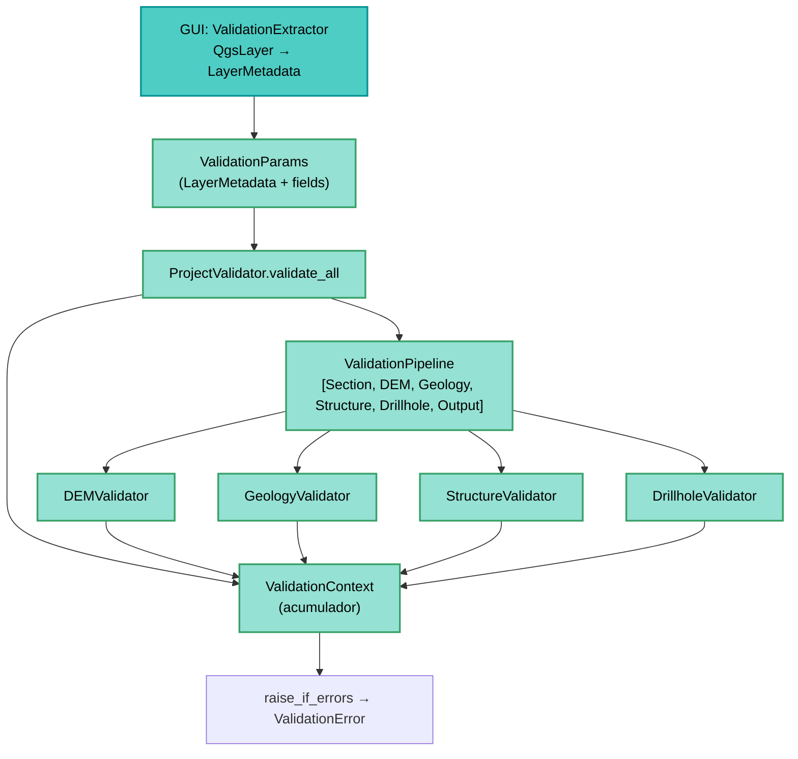

---
tags:
  - secinterp
  - code-walkthrough
  - core
  - validation
  - pipeline
aliases:
  - core/validation
  - Validation Pipeline
  - LayerMetadata
cssclass: secinterp-note
---

# 16 — `core/validation/`

> [!abstract] Resumen en una línea
> Es el **pipeline de validación** QGIS-agnóstico: acumula errores por dominio y valida capas, campos, CRS, bandas y rangos sin tocar QGIS.

**Ruta**: `core/validation/` (paquete · 12 archivos)
**Claves**: `LayerMetadata`, `ValidationParams`, `ValidationPipeline`, `ValidationContext`, `IValidator`, `ProjectValidator`
**Capa**: Core · Validation
**Tags**: #secinterp #core #validation #pipeline

---

## 🎯 ¿Por qué existe este paquete?

Validar en la GUI mezcla QGIS con lógica de negocio. Este paquete **desacopla**:

| Problema | Solución |
|----------|----------|
| Validadores necesitan `QgsVectorLayer` | Trabajan con `LayerMetadata` desacoplado |
| Falla rápida oculta errores múltiples | `ValidationContext` **acumula** errores |
| Validación dispersa por el diálogo | `ProjectValidator.validate_all()` centralizado |
| Validar rangos/CRS/fields | Helpers `field_validator`, `layer_validator`, `path_validator` |

> [!important] QGIS-agnóstico
> Ningún validador importa `qgis.*`. La GUI produce `LayerMetadata` vía `ValidationExtractor` (Extract).

---

## 🧬 Arquitectura del pipeline



---

## 🧱 `LayerMetadata` — DTO desacoplado

```python
@dataclass
class LayerMetadata:
    name: str = ""
    is_valid: bool = False
    kind: str = KIND_VECTOR | KIND_RASTER | KIND_UNKNOWN
    geometry_type: str | None = GEOMETRY_POINT | GEOMETRY_LINE | GEOMETRY_POLYGON
    field_names: list[str] = ...
    field_types: dict[str, FieldType] = ...
    band_count: int = 0
    feature_count: int = 0
    crs_authid: str | None = None
```

> [!tip] Bridge
> La GUI extrae `LayerMetadata` de capas QGIS; el core valida solo este DTO.

---

## 🧱 `ValidationParams` + `ProjectValidator`

```python
@dataclass
class ValidationParams:
    raster_layer: LayerMetadata | None = None
    band_number: int | None = None
    line_layer: LayerMetadata | None = None
    outcrop_layer: LayerMetadata | None = None
    outcrop_field: str | None = None
    struct_layer: LayerMetadata | None = None
    collar_layer: LayerMetadata | None = None
    collar_id: str | None = None
    # ... survey/interval, scale, vert_exag, buffer, output_path
```

```python
class ProjectValidator:
    @classmethod
    def validate_all(cls, params: ValidationParams) -> bool:
        context = ValidationContext()
        pipeline = ValidationPipeline([
            SectionValidator(), DEMValidator(),
            GeologyValidator(), StructureValidator(),
            DrillholeValidator(), OutputValidator(),
        ])
        pipeline.execute(params, context)
        context.raise_if_errors()
        return True
```

| Método | Alcance |
|--------|---------|
| `validate_all` | Pipeline completo (6 validadores) |
| `validate_preview_requirements` | Solo `Section + DEM` (preview mínimo) |

---

## 🧱 `IValidator` + `ValidationPipeline`

```python
class IValidator(ABC):
    @abstractmethod
    def validate(self, params: ValidationParams, context: ValidationContext) -> None: ...

class ValidationPipeline:
    def __init__(self, validators: Iterable[IValidator] | None = None): ...
    def add_validator(self, validator: IValidator) -> None: ...
    def execute(self, params, context) -> None:
        for validator in self._validators:
            validator.validate(params, context)
```

> [!note] Orden importa
> `SectionValidator` → `DEMValidator` → … El pipeline ejecuta en secuencia.

---

## 🧱 `ValidationContext` — acumulador

```python
@dataclass
class RichValidationError:
    message: str
    field_name: str | None = None
    severity: str = "error"   # error / warning / info
    context: dict[str, Any] = ...

class ValidationContext:
    def add_error(self, message, field_name=None, **kwargs): ...
    def add_warning(self, message, field_name=None, **kwargs): ...
    @property
    def has_errors(self) -> bool: ...
    @property
    def errors(self) -> list[RichValidationError]: ...
    def raise_if_errors(self): ...  # → ValidationError con lista
```

| Característica | Detalle |
|----------------|---------|
| **Acumulación** | No falla rápido; recoge todos los errores |
| **Severidad** | `error` bloqueante vs `warning` informativo |
| **Raise** | `raise_if_errors()` lanza un único `ValidationError` con el agregado |

> [!warning] `raise_if_errors`
> Centraliza el `raise` — los validadores solo **añaden** al contexto.

---

## 🧱 Validadores de dominio

| Módulo | Funciones |
|--------|-----------|
| `field_validator.py` | `validate_numeric_input`, `validate_integer_input`, `validate_field_exists`, `validate_field_type`, `validate_angle_range` |
| `layer_validator.py` | `validate_layer_has_features`, `validate_layer_geometry`, `validate_raster_band`, `validate_structural_requirements`, `validate_crs_compatibility` |
| `path_validator.py` | `validate_output_path`, `validate_safe_output_path` |
| `project_validators/` | `Section/DEM/Geology/Structure/Drillhole/OutputValidator` (cada uno `IValidator`) |

---

## 🏛️ Patrones de diseño presentes

| Patrón | Dónde | Propósito |
|--------|-------|-----------|
| **Pipeline / Chain** | `ValidationPipeline` | Orquesta validadores en secuencia |
| **Strategy** | `IValidator` | Cada dominio con su regla |
| **Context Object** | `ValidationContext` | Acumula errores sin lanzar |
| **DTO Bridge** | `LayerMetadata` | Desacopla QGIS del core |

---

## 👀 Observaciones y notas

> [!success] Fortalezas
> - Validación **centralizada** y testeable sin QGIS.
> - `LayerMetadata` reutilizable para otras validaciones.
> - Mensajes por `RichValidationError` con campo y severidad.

> [!warning] Puntos de atención
> - `field_validator` devuelve `(bool, msg, value)` — estilo tripla, distinto de `ValidationContext`.
> - `ProjectValidator` es `@classmethod` puro (stateless) → podría ser función.
> - Algunos validadores mezclan `error` y `warning` sin guía clara.

---

## 🔗 Notas relacionadas

- [[00 - Index]] — índice de la bóveda
- [[10 - controller]] — invoca `ProjectValidator.validate_all(build_validation_params(params))`
- [[11 - domain]] — `FieldType`, `ValidationResult`
- [[12 - exceptions]] — `ValidationError`, `ParameterError`
- [[25 - adapters]] — `ValidationExtractor` (productor de `LayerMetadata`)

---

*Nota 16 de la bóveda SecInterp Code Walkthrough — v3.8.0*
