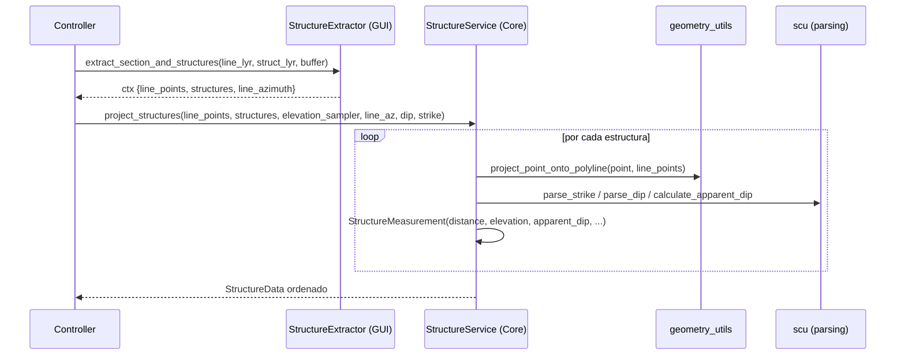

---
tags:
  - secinterp
  - code-walkthrough
  - core
  - structure
  - services
aliases:
  - structure_service.py
  - StructureService
cssclass: secinterp-note
---

# 19 — `core/services/structure_service.py`

> [!abstract] Resumen en una línea
> Es el **servicio puro de estructuras**: proyecta puntos estructurales a la línea de sección, muestrea elevación y calcula **buzamiento aparente** — sin tocar QGIS.

**Ruta**: `core/services/structure_service.py` (187 líneas)
**Clase**: `StructureService(IStructureService, TranslatableMixin)`
**Interface**: `IStructureService` → `project_structures(line_points, struct_data, elevation_sampler, line_az, dip_field, strike_field) -> StructureData`
**Capa**: Core · Services
**Tags**: #secinterp #core #structure #services

---

## 🎯 ¿Por qué existe este archivo?

Las estructuras llegan como **puntos con strike/dip**. Este servicio las proyecta ortogonalmente a la sección y corrige el buzamiento:

| Entrada (adapter) | Salida |
|-------------------|--------|
| `struct_data: list[{"point": (x,y), "attributes": {strike_field, dip_field, ...}}]` | `StructureData = list[StructureMeasurement]` ordenados por `distance` |

> [!important] QGIS-agnóstico total
> Solo depende de `project_point_onto_polyline`, `parse_strike/dip` y `calculate_apparent_dip` (matemática pura) + el `elevation_sampler` inyectado.

---

## 🧬 Relación Extract → Compute



---

## 🧱 `project_structures()` — orquestador

```python
def project_structures(self, line_points, struct_data, elevation_sampler, line_az, dip_field, strike_field):
    projected_structs = []
    for item in struct_data:
        measurement = self._process_single_structure(
            item, line_points, elevation_sampler, line_az, dip_field, strike_field,
        )
        if measurement:
            projected_structs.append(measurement)
    projected_structs.sort(key=lambda x: x.distance)
    logger.info(self.tr("Processed {0} structural measurements").format(len(projected_structs)))
    return projected_structs
```

---

## 🧱 `_process_single_structure()` — por punto

```python
def _process_single_structure(self, data, line_points, elevation_sampler, line_az, dip_field, strike_field):
    point = data.get("point")
    if point is None:
        return None
    proj_dist, proj_pt = project_point_onto_polyline(point, line_points)
    elev = elevation_sampler(proj_pt[0], proj_pt[1])

    parsed = self._parse_structural_data(data.get("attributes", {}), strike_field, dip_field, line_az)
    if not parsed:
        return None
    strike, dip_angle, app_dip = parsed

    return StructureMeasurement(
        distance=round(proj_dist, 1),
        elevation=round(elev, 1),
        apparent_dip=round(app_dip, 1),
        original_dip=dip_angle,
        original_strike=strike,
        attributes=data.get("attributes", {}),
    )
```

| Paso | Qué hace |
|------|----------|
| 1 | `project_point_onto_polyline(point, line_points)` → `(dist, proj_pt)` |
| 2 | `elevation_sampler(proj_pt.x, proj_pt.y)` → `elev` |
| 3 | `_parse_structural_data(attributes, strike_field, dip_field, line_az)` → `(strike, dip, app_dip)` o `None` |
| 4 | Crea `StructureMeasurement` redondeado a 0.1 |

> [!tip] `elevation_sampler` es la closure del controller
> Evita que el core importe `QgsRasterLayer`: el adapter inyecta `lambda (x,y): sample_elevation`.

---

## 🧱 `_parse_structural_data()` — strike/dip → aparente

```python
def _parse_structural_data(self, attributes, strike_field, dip_field, line_az):
    strike_raw = attributes.get(strike_field)
    dip_raw = attributes.get(dip_field)
    strike = scu.parse_strike(strike_raw)
    dip_angle, _ = scu.parse_dip(dip_raw)
    if strike is None or dip_angle is None:
        return None
    if not (0 <= strike <= 360) or not (0 <= dip_angle <= 90):
        return None
    app_dip = scu.calculate_apparent_dip(strike, dip_angle, line_az)
    return strike, dip_angle, app_dip
```

| Helper | Rol |
|--------|-----|
| `scu.parse_strike` | Tolera `N30E`, `30`, `030°`, etc. |
| `scu.parse_dip` | Tolera `45SE`, `45`, vacío → tupla |
| `scu.calculate_apparent_dip` | `atan(tan(dip) * sin(strike - line_az))` |

> [!warning] Validación de rangos
> Descarta silenciosamente si `strike∉[0,360]` o `dip∉[0,90]` → `return None`.

---

## 🏛️ Patrones de diseño presentes

| Patrón | Dónde | Propósito |
|--------|-------|-----------|
| **Strategy pura (Compute)** | clase completa | Cálculo sin QGIS |
| **Template por punto** | `_process_single_structure` | Fail-soft por estructura |
| **Callback (Strategy)** | `elevation_sampler` | Inversión de dependencias |

---

## 🧾 Resumen de la API

| Método | Firma |
|--------|-------|
| `project_structures` | `(line_points, struct_data, elevation_sampler, line_az, dip_field, strike_field) -> StructureData` |
| `_process_single_structure` | `(data, line_points, elevation_sampler, line_az, dip_field, strike_field) -> StructureMeasurement | None` |

---

## 👀 Observaciones y notas

> [!success] Fortalezas
> - QGIS-agnóstico y testeable con datos fabricados.
> - Fail-soft por medición (una mala no tumba el lote).

> [!warning] Puntos de atención
> - `attributes` pasa por referencia (mutabilidad); mejor copiar.
> - Redondeo a `0.1` pierde precisión científica.

---

## 🔗 Notas relacionadas

- [[00 - Index]] — índice de la bóveda
- [[10 - controller]] — orquesta `_process_structures` (closure de elevación)
- [[11 - domain]] — `StructureMeasurement`, `StructureData`
- [[25 - adapters]] — `StructureExtractor` (productor de datos desacoplados)

---

*Nota 19 de la bóveda SecInterp Code Walkthrough — v3.8.0*
