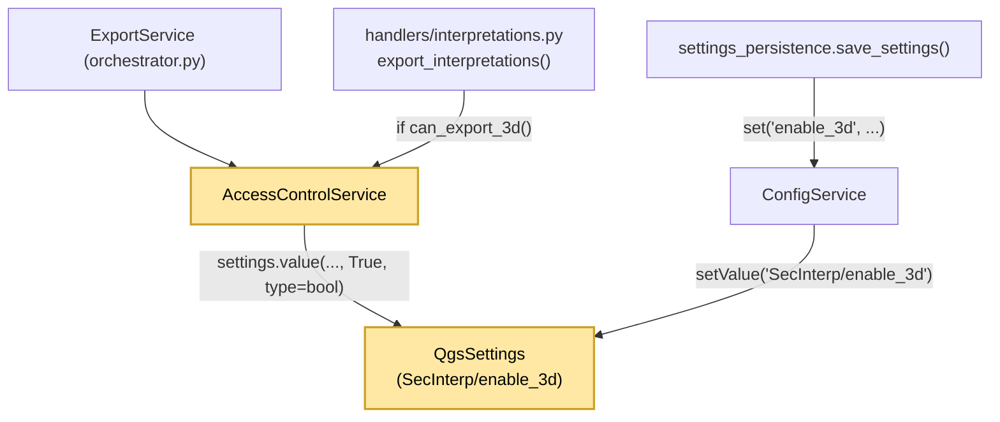
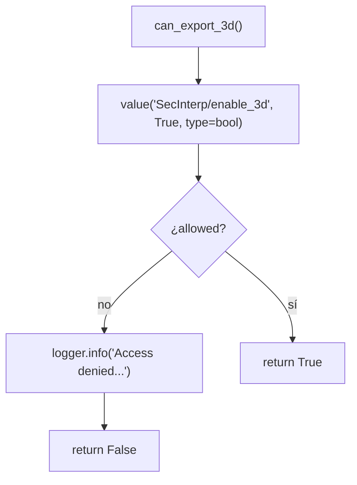

---
tags:
  - secinterp
  - code-walkthrough
  - core
  - access-control
aliases:
  - access_control_service.py
  - AccessControlService
cssclass: secinterp-note
---

# `core/services/access_control_service.py`

> [!abstract] Resumen en una línea
> Consulta el flag `SecInterp/enable_3d` en `QgsSettings` para decidir si el usuario puede ejecutar la **exportación 3D**; por defecto habilitado.

**Ruta**: `core/services/access_control_service.py` (36 líneas)
**Clase**: `AccessControlService`
**Capa**: Core · Services — ⚠️ con dependencia `qgis.core` (área gris)
**Tags**: #secinterp #core #access-control

---

## 🎯 ¿Por qué existe este archivo?

La exportación 3D es una **feature restringida**: el usuario puede desactivarla desde Settings. En lugar de esparcir `if settings.value("enable_3d")` por los exporters, se centraliza en un único punto de decisión.

| Problema | Solución |
|----------|----------|
| Cada handler consultaría el flag a su manera | Un solo método `can_export_3d()` |
| La clave de settings quedaría hardcodeada y dispersa | Constante implícita `"SecInterp/enable_3d"` en un lugar |
| Se necesita trazabilidad cuando se deniega | `logger.info(...)` en el camino de rechazo |
| Default ambiguo | Explícito: `True` (opt-out) |

> [!warning] Área gris de la frontera Core
> `core/AGENTS.md` prohíbe `qgis.core` en `/core`. Este archivo **importa `QgsSettings`** directamente. Es una de las excepciones pragmáticas documentadas: la persistencia QGIS se considera infraestructura, no lógica de dominio. Debe señalarse como deuda arquitectónica.

---

## 🧬 Diagrama de relaciones



> [!tip] Cómo leer
> Los nodos amarillos marcan la dependencia QGIS. La UI escribe el flag vía `ConfigService`; el gate solo lo **lee**.

---

## 📦 Imports — lectura arquitectónica

```python
from qgis.core import QgsSettings

from sec_interp.logger_config import get_logger

logger = get_logger(__name__)
```

| # | Observación |
|---|-------------|
| ① | `QgsSettings` es la **única** razón por la que este módulo no es QGIS-agnóstico. |
| ② | No importa `core/domain` ni interfaces: el gate no tiene contrato abstracto. |
| ③ | Usa el logger centralizado (`SecInterp.*`) para dejar rastro de las denegaciones. |

---

## 🧱 `AccessControlService` — el gate

```python
class AccessControlService:
    """Service to manage access to restricted features."""

    def __init__(self) -> None:
        """Initialize the access control service."""
        self.settings = QgsSettings()

    def can_export_3d(self) -> bool:
        """Check if the user has permission to export 3D data."""
        # Linked to the UI toggle in Settings persisted via QgsSettings.
        # Defaults to enabled (True); users can opt out via the toggle.
        allowed = self.settings.value("SecInterp/enable_3d", True, type=bool)

        if not allowed:
            logger.info("Access denied for restricted feature: 3D Export")

        return bool(allowed)
```

| Elemento | Rol |
|----------|-----|
| `__init__` | Instancia un `QgsSettings` propio (sin inyección) |
| `settings.value(..., True, type=bool)` | Lee el flag con **default `True`** y coerción de tipo |
| `if not allowed` | Registra la denegación a nivel `INFO` |
| `return bool(allowed)` | Normaliza a `bool` puro para el llamador |

### Flujo de decisión



---

## 🏛️ Patrones de diseño presentes

| Patrón | Dónde | Propósito |
|--------|-------|-----------|
| **Feature Flag / Policy** | `can_export_3d` | Interruptor de funcionalidad centralizado |
| **Guard / Gatekeeper** | llamadas `if access_control.can_export_3d()` | Impide ejecutar el export 3D |
| **Service** | `AccessControlService` | Objeto de dominio con responsabilidad única |
| **Fail-Open Default** | `default=True` | La ausencia de config habilita, no bloquea |

---

## 🧾 Resumen de la API

| Símbolo | Firma / Hereda | Uso típico |
|---------|----------------|------------|
| `AccessControlService` | `class` (sin herencia) | Instanciado por `ExportService` (`self.access_control`) |
| `__init__` | `() -> None` | Crea el `QgsSettings` interno |
| `can_export_3d` | `() -> bool` | `if access_control and access_control.can_export_3d():` |

---

## 👀 Observaciones y notas

> [!success] Fortalezas
> - **Punto único de decisión**: el gate se consulta en un solo método.
> - **Default sensato**: opt-out; el 3D funciona recién instalado.
> - **Trazabilidad**: cada denegación queda en el log del plugin.

> [!warning] Puntos de atención
> - **Violación de la frontera Core**: `QgsSettings` en `/core` contradice `core/AGENTS.md`. Lo correcto sería un `Protocol` inyectado y un adaptador en la capa GUI.
> - **Sin interfaz**: no existe `IAccessControlService`; los consumidores dependen de la clase concreta.
> - **Sin caché**: cada llamada crea/consulta settings; aceptable por baja frecuencia, pero innecesario.
> - `bool(allowed)` sobre un valor ya coercido a `bool` es redundante (defensa barata).

> [!question] Preguntas abiertas
> - ¿Se migrará a `core/interfaces` con un adaptador `QgsSettingsAccessControl` en GUI?
> - ¿Debería el default alinearse con `ConfigService` (`enable_3d` no está en `_load_from_qgs_settings`)?
> - ¿Conviene un enum `RestrictedFeature` en vez de un método por feature?

---

## 🔗 Notas relacionadas

- [[Index]] — índice de la bóveda
- [[export_package]] — orquestador que lo instancia
- [[export_service]] — shim histórico que consultaba el gate
- [[config]] — servicio de settings con el mismo patrón `QgsSettings`
- [[layer_gui_ui_pages_settings]] — UI que escribe el toggle 3D
- [[settings_page]] — página de Settings que persiste `enable_3d`

---

*Nota de la bóveda SecInterp Code Walkthrough — v3.8.0*
