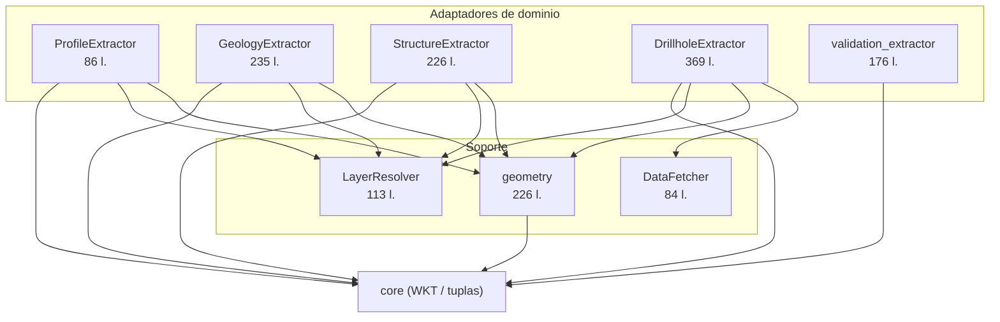

---
tags:
  - secinterp
  - code-walkthrough
  - gui
  - adapters
  - extract-phase
aliases:
  - gui/adapters
  - Adapters
  - Extract phase
cssclass: secinterp-note
---

# `gui/adapters/`

> [!abstract] Resumen en una línea
> Es la **fase Extract**: ocho módulos que traducen el mundo de objetos QGIS (capas, features, rasters) a DTOs y primitivas que el core consume sin tocar `qgis.*`.

**Ruta**: `gui/adapters/` (8 módulos + `__init__.py` · ~1522 líneas)
**Claves**: `ProfileExtractor`, `GeologyExtractor`, `StructureExtractor`, `DrillholeExtractor`, `DataFetcher`, `LayerResolver`, `geometry`, `validation_extractor`
**Capa**: GUI · Adapters
**Tags**: #secinterp #gui #adapters #extract-phase

---

## 🎯 ¿Por qué existe este paquete?

Es la frontera **QGIS ↔ Core**. El patrón es siempre el mismo: leer objetos QGIS vivos y devolver datos serializables.

| Problema | Solución |
|----------|----------|
| El core debe ser QGIS-agnóstico y thread-safe | Cada adapter convierte a `ProfileData`, `GeologyContext`, `DrillholeContext`, `LayerMetadata`… |
| Las referencias de capa llegan como ID/nombre/objeto | `LayerResolver` centraliza y cachea |
| Los surveys/intervalos exigen N lecturas | `DataFetcher.fetch_bulk_data` en una sola pasada |
| La geometría QGIS se repite en todos los extractores | `geometry.py` como caja de herramientas compartida |
| Los `QVariant` de QGIS no cruzan hilos | Todo se sanea a `int/float/str/bool/None` |

> [!important] La única capa con `QgsProject`/`QgsGeometry`
> Si un módulo de `core/` necesita geometría, la recibe como WKT o como primitivas. Nunca importa `qgis.*`.

---

## 🧬 Mapa del paquete



---

## 📦 Imports — lectura arquitectónica

```python
from qgis.core import (QgsProject, QgsGeometry, QgsFeatureRequest, QgsRaster,
                       QgsDistanceArea, QgsWkbTypes, QgsVectorLayer, QgsRasterLayer)
from qgis.PyQt.QtCore import QCoreApplication
from sec_interp.core.domain.task_inputs import GeologyContext, DrillholeContext, OutcropSegments
from sec_interp.core.domain import ProfileData, FieldType
from sec_interp.core.exceptions import DataMissingError, GeometryError, ValidationError
```

| # | Observación |
|---|-------------|
| ① | `QgsProject` aparece solo en `layer_resolver` y `validation_extractor` (resolución de referencias). |
| ② | `QgsGeometry`/`QgsDistanceArea` están concentrados en `geometry.py`, que el resto importa como módulo. |
| ③ | Los DTOs (`GeologyContext`, `DrillholeContext`, `LayerMetadata`) vienen de `sec_interp.core.*`: el adapter nunca los redefine. |
| ④ | `QCoreApplication` se usa en cada `tr()` para i18n. |

---

## 🧱 `profile_extractor.py` (86 l.) — `ProfileExtractor`

```python
def extract_profile(self, line_lyr, raster_lyr, band_number=1, interval=None) -> ProfileData:
    line_feat = next(line_lyr.getFeatures(), None)
    if not line_feat:
        raise DataMissingError(self.tr("Line layer has no features"), ...)
    geom = line_feat.geometry()
    if not geom or geom.isNull():
        raise GeometryError(self.tr("Line geometry is not valid"), ...)
    da = geometry.create_distance_area(line_lyr.crs())
    points = geometry.sample_elevation_along_line(geom, raster_lyr, band_number, da, interval=interval)
    return [(round(p.x(), 1), round(p.y(), 1)) for p in points]
```

| Método | Rol |
|--------|-----|
| `calculate_lod_interval(line_lyr, canvas_width)` | `line_len / max(200, canvas_width * 2)` para LOD adaptativo |
| `extract_profile(...)` | Perfil topográfico `[(dist, elev)]` |

> [!note] `ProfileData = list[tuple[float, float]]`
> Es un alias de tipo del core, no un objeto QGIS. El redondeo a 1 decimal reduce el tamaño del payload.

---

## 🧱 `structure_extractor.py` (226 l.) — `StructureExtractor` + `SectionContext`

| Método | Rol |
|--------|-----|
| `extract_section_and_structures(line_lyr, struct_lyr, buffer_m)` | Punto de entrada → `SectionContext \| None` |
| `extract_line(line_geom)` | Vértices + inicio + azimuth |
| `detach_structures(struct_lyr, line_geom, buffer_m)` | `buffer(buffer_m, 25)` + filtro bbox + `intersects` |
| `sample_elevation(raster_lyr, x, y, band_number=1)` | Muestreo puntual del DEM (se inyecta como closure) |

> Detalle completo en [[structure_extractor]].

---

## 🧱 `geology_extractor.py` (235 l.) — `GeologyExtractor`

| Método | Rol |
|--------|-----|
| `extract_context(...)` | Punto de entrada → `GeologyContext` |
| `_generate_master_profile(...)` | Densifica por `rasterUnitsPerPixelX()` y muestrea el DEM |
| `_extract_outcrop_data(...)` | Outcrops en el bbox de la línea → WKT |
| `_intersect_outcrop(...)` | `line.intersection(polygon)` → tramos `(d0, d1, wkt)` |

> Detalle completo en [[geology_extractor]].

---

## 🧱 `drillhole_extractor.py` (369 l.) — `DrillholeExtractor`

| Método | Rol |
|--------|-----|
| `extract_context(...)` | Punto de entrada → `DrillholeContext \| None` |
| `_detach_collars(...)` | Buffer + CRS + pre-muestreo Z |
| `_prepare_feature_request(...)` | bbox + `setDestinationCrs` con el `transformContext` |
| `_validate_fields(...)` | Validación de campos collar/survey/interval |

> `DEFAULT_BUFFER_SEGMENTS = 8`. Detalle completo en [[drillhole_extractor]].

---

## 🧱 `validation_extractor.py` (176 l.) — metadata de validación

| Función | Rol |
|---------|-----|
| `resolve_layer_metadata(layer_ref)` | Resolver + extraer en un paso |
| `extract_layer_metadata(layer)` | Dispatch vector/raster/desconocido |
| `extract_vector_metadata` / `extract_raster_metadata` | Campos, geometría, bandas, CRS |
| `build_validation_params(params)` | `PreviewParams` → `ValidationParams` (DTOs) |

> Detalle completo en [[validation_extractor]].

---

## 🧱 `feature_fetcher.py` (84 l.) — `DataFetcher`

```python
def fetch_bulk_data(self, layer, hole_ids, fields) -> dict[Any, list[tuple[Any, ...]]]:
    if not self._validate_fields(layer, fields):
        return {}
    id_f = fields["id"]
    is_survey = "depth" in fields
    ids_str = ", ".join([f"'{hid!s}'" for hid in hole_ids])
    request = QgsFeatureRequest().setFilterExpression(f'"{id_f}" IN ({ids_str})')
    for feat in layer.getFeatures(request):
        hole_id = feat[id_f]
        data = self._extract_data_tuple(feat, fields, is_survey)
        if data:
            result_map.setdefault(hole_id, []).append(data)
    if is_survey:
        for h_id in result_map:
            result_map[h_id].sort(key=lambda x: x[0])   # ordenar por profundidad
    return result_map
```

| Aspecto | Detalle |
|---------|---------|
| Detección survey vs interval | `"depth" in fields` |
| Tupla survey | `(depth, azim, incl)` como `float` |
| Tupla interval | `(from, to, lith)` como `float, float, str` |
| Orden | Surveys se ordenan por profundidad |
| Validación | `_validate_fields` comprueba `id` + campos requeridos |

> [!warning] Expresión `IN` por interpolación
> `ids_str` se construye con `f"'{hid!s}'"`. Funciona para IDs numéricos y de texto simple; IDs con comillas podrían romper la expresión.

---

## 🧱 `layer_resolver.py` (113 l.) — `LayerResolver`

```python
@classmethod
def resolve(cls, layer_ref, use_cache=True) -> QgsMapLayer | None:
    if layer_ref is None:
        return None
    if not isinstance(layer_ref, str):
        return layer_ref if hasattr(layer_ref, "isValid") and layer_ref.isValid() else None
    ref_str = str(layer_ref)
    cached = cls._resolve_from_cache(ref_str, use_cache)
    if cached: return cached
    project = QgsProject.instance()
    layer = cls._resolve_by_id(project, ref_str)
    return layer or cls._resolve_by_name(project, ref_str)
```

| Método | Rol |
|--------|-----|
| `resolve(ref, use_cache=True)` | Objeto / ID / nombre → `QgsMapLayer` |
| `_resolve_from_cache` | Cachea e invalida entradas rotas |
| `_resolve_by_id` | Cachea por ID **y** por nombre |
| `_resolve_by_name` | Cachea por nombre **e** ID |
| `clear_cache()` / `invalidate(layer_id)` | Gestión explícita de la caché |

> [!note] Caché de clase
> `_cache` es un `dict` de clase (estado compartido). `resolve_layer(ref)` es el wrapper legacy que delega aquí.

---

## 🧱 `geometry.py` (226 l.) — caja de herramientas QGIS

| Función | Rol |
|---------|-----|
| `create_distance_area(crs)` | `QgsDistanceArea` con CRS + elipsoide |
| `extract_all_vertices(geometry)` | Vértices de cualquier geometría |
| `get_line_vertices(geometry)` | Vértices de línea (valida `LineGeometry`) |
| `extract_lines_from_geometry(geometry)` | Separa MultiLine en `QgsGeometry` |
| `densify_line_by_interval(geometry, interval)` | Densifica con `_densify_line_points` (matemática pura) |
| `calculate_segment_range(seg_geom, line_start, da)` | `(dist_start, dist_end)` normalizado |
| `sample_point_elevation(raster, point, band=1)` | Muestreo puntual del raster |
| `sample_elevation_along_line(...)` | Perfil muestreado a lo largo de la línea |
| `prepare_profile_context(line_lyr)` | `(geom, line_start, da)` con errores claros |
| `line_length(line_lyr)` | Longitud de la primera feature |

> [!tip] La única dependencia QGIS de la geometría
> Al concentrar aquí `QgsGeometry`/`QgsDistanceArea`, los demás adapters (y el core) quedan limpios. `_densify_line_points` es matemática pura sin QGIS.

---

## 🏛️ Patrones de diseño presentes

| Patrón | Dónde | Propósito |
|--------|-------|-----------|
| **Adapter / Bridge** | todo el paquete | QGIS → DTOs |
| **Facade** | `extract_context` / `extract_profile` | Un único punto de entrada |
| **Strategy / inyección** | `DataFetcher`, `elevation_sampler` | Comportamiento inyectable |
| **Singleton / Cache** | `LayerResolver._cache` | Evitar `mapLayer()` repetidos |
| **Fail-fast** | `_validate_inputs`, `_validate_fields` | Errores antes de extraer |
| **Graceful degradation** | fallbacks (`return []`, `0.0`, DEM opcional) | Robustez |

---

## 🧾 Resumen de la API

| Módulo | Símbolo principal | Salida |
|--------|-------------------|--------|
| `profile_extractor` | `ProfileExtractor.extract_profile` | `ProfileData` |
| `geology_extractor` | `GeologyExtractor.extract_context` | `GeologyContext` |
| `structure_extractor` | `StructureExtractor.extract_section_and_structures` | `SectionContext` |
| `drillhole_extractor` | `DrillholeExtractor.extract_context` | `DrillholeContext` |
| `validation_extractor` | `build_validation_params` | `ValidationParams` |
| `feature_fetcher` | `DataFetcher.fetch_bulk_data` | `dict[id, list[tuple]]` |
| `layer_resolver` | `LayerResolver.resolve` | `QgsMapLayer \| None` |
| `geometry` | `sample_elevation_along_line` y helpers | primitivas / `QgsGeometry` |

---

## 👀 Observaciones y notas

> [!success] Fortalezas
> - Frontera única y clara entre QGIS y el core.
> - Toda la geometría QGIS vive en un solo módulo (`geometry.py`).
> - Inyección de dependencias (`DataFetcher`, sampler) facilita los mocks.

> [!warning] Puntos de atención
> - Los buffers (`buffer_m`, `buffer_width`) se interpretan en **unidades de capa**, no siempre metros.
> - `LayerResolver._cache` es estado de clase: hay que invalidarlo al recargar capas.
> - `DataFetcher` construye expresiones `IN` por interpolación de strings.
> - Las firmas largas de `DrillholeExtractor.extract_context` sugieren un dataclass de parámetros.

> [!question] Preguntas abiertas
> - ¿Deberían todos los extractores compartir una interfaz común (`extract() -> DTO`)?
> - ¿Conviene unificar `validation_extractor._resolve_layer` con `LayerResolver`?

---

## 🔗 Notas relacionadas

- [[structure_extractor]] — adapter de estructuras en detalle
- [[geology_extractor]] — adapter de geología en detalle
- [[drillhole_extractor]] — adapter de sondajes en detalle
- [[validation_extractor]] — adapter de validación en detalle
- [[layer_gui_adapters]] — índice de la capa GUI · adapters
- [[controller]] — consume los contextos en el pipeline clásico
- [[tasks]] — los DTOs cruzan a los `QgsTask`
- [[domain]] — definición de los DTOs
- [[Index]] — índice de la bóveda

---

*Nota de la bóveda SecInterp Code Walkthrough — v3.8.0*
