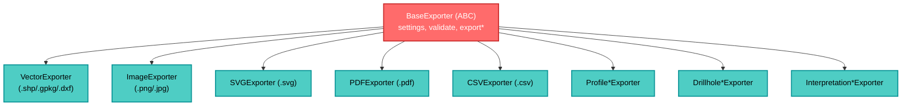

---
tags:
  - secinterp
  - code-walkthrough
  - exporters
  - base-exporter
  - template-method
aliases:
  - base_exporter.py
  - BaseExporter
cssclass: secinterp-note
---

# `exporters/base_exporter.py`

> [!abstract] Resumen en una línea
> Es la **clase base abstracta** de todos los exporters: define el contrato `export()` y provee validación segura de rutas y acceso a settings.

**Ruta**: `exporters/base_exporter.py` (137 líneas)
**Clase**: `BaseExporter(ABC)`
**Capa**: Exporters
**Tags**: #secinterp #exporters #base-exporter #template-method

---

## 🎯 ¿Por qué existe este archivo?

Sin base común, cada exporter re-implementaría validación de rutas y gestión de settings. Esta clase resuelve:

| Problema | Solución |
|----------|----------|
| Contrato inconsistente entre exporters | `export(path, data, layer_name?) -> bool` abstracto |
| Path traversal / directorios no escribibles | `validate_export_path()` con `resolve()` y `validate_safe_output_path` |
| Settings dispersos | `self.settings` + `get_setting(key, default)` |
| Extensiones no validadas | `get_supported_extensions()` + `validate_path()` |

> [!important] La Factory vive en `exporters/__init__.py`
> `get_exporter(extension, settings)` elige la subclase concreta por extensión.

---

## 🧬 Jerarquía



---

## 🧱 Contrato — `export()`

```python
class BaseExporter(ABC):
    def __init__(self, settings: dict[str, Any]) -> None:
        self.settings = settings

    @abstractmethod
    def export(self, output_path: Path, data: Any, layer_name: str | None = None) -> bool: ...

    @abstractmethod
    def get_supported_extensions(self) -> list[str]: ...
```

| Parámetro | Rol |
|-----------|-----|
| `output_path` | Destino en disco (`Path`) |
| `data` | Datos a exportar (formato depende del exporter: `list[dict]`, `QgsMapSettings`, etc.) |
| `layer_name` | Nombre conceptual dentro de contenedores (GeoPackage) |
| **Retorno** | `True/False` (no lanza salvo fallo grave) |

---

## 🧱 Validación — `validate_export_path()`

```python
def validate_export_path(self, output_path: Path, base_dir: Path | None = None) -> tuple[bool, str]:
    resolved_path = output_path.resolve()
    if base_dir and not str(resolved_path).startswith(str(base_dir.resolve())):
        return False, "Path traversal detected: {path} is outside of {base}"

    parent_dir = output_path.parent
    is_valid, error, _ = validate_safe_output_path(
        str(parent_dir), base_dir=base_dir, must_exist=False, create_if_missing=True,
    )
    if not is_valid:
        return False, f"Invalid export path: {error}"
    return True, ""
```

> [!tip] Defensa en profundidad
> `resolve()` neutraliza `../` y symlinks → compara con `base_dir`.
> Luego valida el directorio padre (permisos, creación).

---

## 🧱 Helpers — `validate_path()` y `get_setting()`

```python
def validate_path(self, path: Path) -> bool:
    return path.suffix.lower() in self.get_supported_extensions()

def get_setting(self, key: str, default: Any = None) -> Any:
    return self.settings.get(key, default)
```

> [!note] `get_supported_extensions` es abstracto
> Cada subclase declara su lista (p. ej. `[".shp", ".gpkg", ".dxf"]`).

---

## 🧱 Factory — `get_exporter()`

En `exporters/__init__.py`:

```python
def get_exporter(extension: str, settings: dict) -> BaseExporter:
    extension = extension.lower()
    if extension in [".png", ".jpg", ".jpeg"]: return ImageExporter(settings)
    if extension == ".svg":  return SVGExporter(settings)
    if extension == ".pdf":  return PDFExporter(settings)
    if extension == ".csv":  return CSVExporter(settings)
    if extension in [".shp", ".gpkg", ".dxf"]: return VectorExporter(settings)
    raise ValueError(f"Unsupported file extension: {extension}")
```

> [!tip] Factory centralizada
> El `ExportManager` (`[[dialog_export_manager]]`) no conoce clases concretas; solo la extensión.

---

## 🏛️ Patrones de diseño presentes

| Patrón | Dónde | Propósito |
|--------|-------|-----------|
| **Template Method** | `BaseExporter` | Contrato común + validación compartida |
| **Factory** | `get_exporter` | Selección por extensión |
| **Strategy** | cada subclase | Formato específico |

---

## 🔗 Notas relacionadas

- [[Index]] — índice de la bóveda
- [[dialog_export_manager]] — consume `BaseExporter` y la factory
- [[vector_exporter]] — implementación vectorial genérica
- `core/validation/path_validator.py` — `validate_safe_output_path`

---

*Nota de la bóveda SecInterp Code Walkthrough — v3.8.0*
