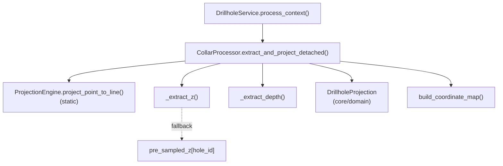

---
tags:
  - secinterp
  - code-walkthrough
  - core
  - drillhole
aliases:
  - collar_processor.py
  - CollarProcessor
cssclass: secinterp-note
---

# `core/services/drillhole/collar_processor.py`

> [!abstract] Resumen en una línea
> Proyecta **collares desacoplados** (dicts con `point`/`attributes`) sobre la línea de sección, extrae Z y profundidad con tolerancia y filtra por `buffer_width`.

**Ruta**: `core/services/drillhole/collar_processor.py` (100 líneas)
**Clase**: `CollarProcessor`
**Capa**: Core · Drillhole (QGIS-agnóstico)
**Tags**: #secinterp #core #drillhole

---

## 🎯 ¿Por qué existe este archivo?

La GUI extrae los collares de la capa y los entrega como **datos primitivos** (`{"id", "point", "attributes"}`). Alguien tiene que convertir ese dict crudo en un `DrillholeProjection` válido sin volver a tocar QGIS.

| Problema | Solución |
|----------|----------|
| El collar puede no traer ID o punto | Guard clauses: `return None` temprano |
| La elevación Z puede faltar o ser basura | `_extract_z()` con fallback a `pre_sampled_z` |
| Collares fuera del buffer de sección | Filtro `offset <= buffer_width` |
| Se necesita el mapa ID→coordenada para otros pasos | `build_coordinate_map()` |

> [!important] Frontera Core
> Recibe primitivos y devuelve un DTO de `core/domain`. La única dependencia "externa" es `ProjectionEngine` (también puro). **Nunca importa `qgis`.**

---

## 🧬 Diagrama de relaciones



---

## 📦 Imports — lectura arquitectónica

```python
import contextlib
from typing import Any

from sec_interp.core.domain import DrillholeProjection
from sec_interp.core.services.drillhole.projection_engine import ProjectionEngine
```

| # | Observación |
|---|-------------|
| ① | `contextlib.suppress` se usa para parsear floats sin `try/except` ruidoso. |
| ② | `DrillholeProjection` viene de `core/domain` → el processor **produce DTOs**, no objetos QGIS. |
| ③ | `ProjectionEngine` es estático (se invoca sin instanciar); sin `qgis.*` ni `PyQt` → cumple `core/AGENTS.md`. |

---

## 🧱 `extract_and_project_detached()` — el flujo principal

```python
def extract_and_project_detached(
    self, collar_data, line_points, buffer_width,
    collar_id_field, collar_z_field, collar_depth_field, pre_sampled_z=None,
) -> DrillholeProjection | None:
    point = collar_data.get("point")
    if not point:
        return None

    attrs = collar_data.get("attributes", {})
    hole_id = collar_data.get("id")
    if not hole_id:
        hole_id = attrs.get(collar_id_field)
    if not hole_id:
        return None

    z = self._extract_z(attrs, collar_z_field, hole_id, pre_sampled_z)
    depth = self._extract_depth(attrs, collar_depth_field)

    dist_along, offset = ProjectionEngine.project_point_to_line(point, line_points)

    if offset <= buffer_width:
        return DrillholeProjection(
            hole_id=str(hole_id), distance=dist_along, elevation=z,
            offset=offset, total_depth=depth,
        )
    return None
```

| Paso | Rol |
|------|-----|
| Guard `point` | Sin coordenada no hay proyección posible |
| Guard `hole_id` | Prueba `collar_data["id"]` y, si falta, `attrs[collar_id_field]` |
| `_extract_z` / `_extract_depth` | Parsing tolerante de atributos + fallback Z |
| `ProjectionEngine.project_point_to_line` | Devuelve `(dist_along, offset)` |
| Filtro `offset <= buffer_width` | Solo collares dentro de la banda de sección |
| `DrillholeProjection` | DTO con `hole_id` normalizado a `str` |

---

## 🧱 Helpers privados

```python
def _extract_z(self, attrs, z_field, hole_id, pre_sampled) -> float:
    z = 0.0
    if z_field:
        with contextlib.suppress(ValueError, TypeError):
            z = float(attrs.get(z_field, 0.0))
    if z == 0.0 and pre_sampled and hole_id in pre_sampled:
        z = pre_sampled[hole_id]
    return z

def _extract_depth(self, attrs, depth_field) -> float:
    depth = 0.0
    if depth_field:
        with contextlib.suppress(ValueError, TypeError):
            depth = float(attrs.get(depth_field, 0.0))
    return depth
```

| Helper | Estrategia |
|--------|------------|
| `_extract_z` | Campo Z → si `0.0`, elevación pre-muestreada del DEM |
| `_extract_depth` | Campo profundidad → `0.0` si vacío/ inválido |

### `build_coordinate_map()`

Recorre `collar_data` y construye `{id: point}` omitiendo entradas sin `id` o sin `point`. Es el índice `hole_id -> (x, y)` que otros pasos usan sin volver a la capa.

---

## 🏛️ Patrones de diseño presentes

| Patrón | Dónde | Propósito |
|--------|-------|-----------|
| **Adapter (Extract boundary)** | `extract_and_project_detached` | Dict crudo → DTO de dominio |
| **Guard Clauses** | `if not point`, `if not hole_id` | Salidas tempranas y explícitas |
| **Strategy / Static Utility** | `ProjectionEngine` | Matemática intercambiable y sin estado |
| **Fallback Chain** | `_extract_z` | Campo → pre-muestreo → `0.0` |
| **Null Object** | `return None` | "Collar no proyectable" sin excepción |

---

## 🧾 Resumen de la API

| Símbolo | Firma / Hereda | Uso típico |
|---------|----------------|------------|
| `CollarProcessor` | `class` (sin herencia) | Inyectado en `DrillholeService` |
| `extract_and_project_detached` | `(collar_data, line_points, buffer_width, collar_id_field, collar_z_field, collar_depth_field, pre_sampled_z=None) -> DrillholeProjection \| None` | Proyecta un collar |
| `build_coordinate_map` | `(collar_data: list[dict]) -> dict[Any, tuple[float, float]]` | Índice ID→XY |
| `_extract_z` | `(attrs, z_field, hole_id, pre_sampled) -> float` | Resolución de elevación |
| `_extract_depth` | `(attrs, depth_field) -> float` | Resolución de profundidad |

---

## 👀 Observaciones y notas

> [!success] Fortalezas
> - **Tolerante a datos sucios**: `contextlib.suppress` evita crashes por strings no numéricos.
> - **Sin QGIS**: testeable con dicts y listas de tuplas.
> - **Normaliza el ID** a `str`, unificando collares numéricos y textuales.

> [!warning] Puntos de atención
> - Un `Z` legítimo de `0.0` (cota al nivel del mar) se confunde con "Z ausente" y dispara el fallback a `pre_sampled_z`. Es una ambigüedad de diseño.
> - `_extract_depth` no tiene fallback: si el campo falta, `total_depth = 0.0`.
> - El filtro es inclusivo (`<=`), por lo que un collar justo en el borde entra.

> [!question] Preguntas abiertas
> - ¿Debería `z is None` distinguirse de `z == 0.0`, y devolverse el motivo del descarte?

---

## 🔗 Notas relacionadas

- [[Index]] — índice de la bóveda
- [[projection_engine]] — matemática de proyección usada aquí
- [[drillhole_service]] — lo llama por cada collar
- [[trajectory_engine]] — recibe `DrillholeProjection.elevation`/`total_depth`
- [[domain]] — define `DrillholeProjection`
- [[layer_core_services_drillhole]] — subcapa del pipeline

---

*Nota de la bóveda SecInterp Code Walkthrough — v3.8.0*
