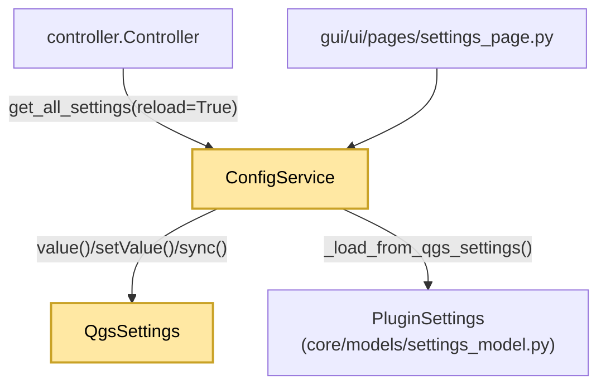

---
tags:
  - secinterp
  - code-walkthrough
  - core
  - config
  - settings
aliases:
  - config.py
  - ConfigService
  - PluginSettings
cssclass: secinterp-note
---

# `core/config.py`

> [!abstract] Resumen en una línea
> Servicio de configuración que lee/escribe `QgsSettings` bajo `SecInterp/`, cachea y valida un `PluginSettings` tipado, y expone `get`/`set`/`reset_defaults`.

**Ruta**: `core/config.py` (250 líneas)
**Clase**: `ConfigService`
**Modelo**: `PluginSettings` en `core/models/settings_model.py`
**Capa**: Core · Config (⚠️ con `QgsSettings` y `QCoreApplication`)
**Tags**: #secinterp #core #config #settings

---

## 🎯 ¿Por qué existe este archivo?

Sin un servicio, cada manager leería `QgsSettings` con claves sueltas (`"SecInterp/buffer_dist"`) y defaults duplicados. `ConfigService` centraliza claves, defaults, validación y traducción.

| Problema | Solución |
|----------|----------|
| Claves y defaults dispersos | `PREFIX = "SecInterp/"` + constantes `DEFAULT_*` |
| Diccionarios sin validar | `PluginSettings.from_dict()` con dataclasses validantes |
| Relectura costosa de settings | Caché `_current_settings` + flag `reload` |
| Mensajes sin traducir | `tr()` vía `QCoreApplication.translate("ConfigService", ...)` |

> [!warning] Área gris de la frontera Core
> Importa `QgsSettings` (persistencia QGIS) y `QCoreApplication` (i18n Qt). `core/AGENTS.md` prohíbe dependencias QGIS/Qt en `/core`; este servicio es una excepción pragmática reconocida.

---

## 🧬 Diagrama de relaciones



> [!tip] Cómo leer
> `ConfigService` es un **repository** sobre `QgsSettings` que produce un DTO validado (`PluginSettings`). El controlador fuerza `reload=True` cuando la UI cambia algo.

---

## 🧱 Constantes de clase

`PREFIX = "SecInterp/"`; defaults: `DEFAULT_SCALE=50000.0`, `DEFAULT_BUFFER_DIST=100.0`, `DEFAULT_VERT_EXAG=1.0`, `DEFAULT_DPI=300`, `DEFAULT_MAX_POINTS=10000`, `DEFAULT_DEM_BAND=1`, `DEFAULT_SAMPLING_INTERVAL=10.0`, `DEFAULT_EXPORT_QUALITY=95`, `DEFAULT_PREVIEW_WIDTH=800`, `DEFAULT_PREVIEW_HEIGHT=600`; soportados: `SUPPORTED_IMAGE_FORMATS`, `SUPPORTED_VECTOR_FORMATS`, `SUPPORTED_DOCUMENT_FORMATS`. `PREFIX` se antepone a toda clave; los `DEFAULT_*` evitan números mágicos; los `SUPPORTED_*` filtran formatos en diálogos.

---

## 🧱 `get_all_settings()` — caché y recarga

```python
def get_all_settings(self, reload: bool = False) -> PluginSettings:
    if reload or self._current_settings is None:
        self._current_settings = self._load_from_qgs_settings()
    return self._current_settings
```

| Caso | Comportamiento |
|------|----------------|
| Primera llamada (`None`) / `reload=True` | Carga o fuerza recarga desde `QgsSettings` |
| Sucesivas | Devuelve la instancia cacheada |

---

## 🧱 `_load_from_qgs_settings()` — mapeo a DTO

Construye un dict anidado por categorías (`section`, `dem`, `geology`, `structure`, `drillhole`, `interpretation`, `preview`, `export`) y lo valida con `PluginSettings.from_dict`.

| Detalle | Valor |
|---------|-------|
| `custom_fields` | JSON parseado con `try/except (ValueError, TypeError)` → `[]` |
| Fallo de validación | `logger.exception(...)` + `PluginSettings()` por defecto |

> [!important] Fail-safe
> Si `PluginSettings.from_dict` lanza, se registra y se devuelve el modelo por defecto: **el plugin nunca queda sin settings**.

---

## 🧱 `get()` — doble default y coerción

```python
def get(self, key: str, default: Any = None) -> Any:
    full_key = self.PREFIX + key
    static_defaults = { "scale": self.DEFAULT_SCALE, "dh_use_geom": True, ... }
    if default is None:
        default = static_defaults.get(key)
    value = self.settings.value(full_key, None)
    if value is None:
        value = self.settings.value("/SecInterp/" + key, default)   # compat barra inicial
    if isinstance(value, str):
        return value.lower() == "true" if value.lower() in ("true", "false") else value
    return value
```

| Característica | Razón |
|----------------|-------|
| `static_defaults` | Compatibilidad hacia atrás para claves antiguas |
| Fallback `"/SecInterp/" + key` | Instalaciones que guardaron con barra inicial |
| Coerción `"true"/"false"` | `QgsSettings` a veces devuelve strings en lugar de bools |

---

## 🧱 `set()`, `reset_defaults()` y `tr()`

```python
def set(self, key: str, value: Any) -> None:
    self.settings.setValue(self.PREFIX + key, value)
    self.settings.sync()
    self._current_settings = None          # invalida la caché
    logger.debug(f"Config set: {self.PREFIX + key} = {value}")

def reset_defaults(self) -> None:           # re-escribe 15 defaults conocidos
    logger.info(self.tr("Configuration reset to defaults initiated"))
    self.set("scale", self.DEFAULT_SCALE)
```

| Método | Efecto |
|--------|--------|
| `set` | Persiste, hace `sync()` y **invalida** la caché |
| `reset_defaults` | Re-escribe explícitamente los defaults conocidos |
| `tr()` | `QCoreApplication.translate("ConfigService", message)` — contexto fijo de i18n |

---

## 🏛️ Patrones de diseño presentes

| Patrón | Dónde | Propósito |
|--------|-------|-----------|
| **Repository / DAO** | `get`/`set` sobre `QgsSettings` | Aislar la persistencia |
| **DTO Mapper** | `_load_from_qgs_settings` | Dict → `PluginSettings` validado |
| **Cache-Aside** | `_current_settings` + `reload` | Evitar relecturas |
| **Fail-safe** | `try/except` → `PluginSettings()` | Nunca dejar sin configuración |

---

## 🧾 Resumen de la API

| Símbolo | Firma / Hereda | Uso típico |
|---------|----------------|------------|
| `get_all_settings` | `(reload: bool = False) -> PluginSettings` | `cfg.get_all_settings(reload=True)` |
| `get` / `set` | `(key, default=None) -> Any` / `(key, value) -> None` | Leer/persistir una clave |
| `reset_defaults` | `() -> None` | Restaurar configuración |
| `tr` | `(message: str) -> str` | Traducir mensajes del servicio |

---

## 👀 Observaciones y notas

> [!success] Fortalezas
> - **Una sola fuente de verdad** para claves y defaults; validación centralizada vía dataclasses.
> - **Degradación segura**: settings corruptos no rompen el arranque.

> [!warning] Puntos de atención
> - **Doble sistema de defaults**: constantes `DEFAULT_*` y `static_defaults` dentro de `get()`; pueden divergir.
> - `_load_from_qgs_settings` es un método largo (~100 líneas) que viola el umbral de complejidad recomendado.
> - `get()` mezcla lógica legacy (barra inicial, coerción de strings) con el modelo moderno.

> [!question] Preguntas abiertas
> - ¿Debería `ConfigService` implementar un `Protocol` en `core/interfaces` y mover `QgsSettings` a un adaptador, descomponiendo `_load_from_qgs_settings`?

---

## 🔗 Notas relacionadas

- [[Index]] — índice de la bóveda
- [[controller]] — `config_service` + `reload_settings()`
- [[layer_core_models]] — define `PluginSettings` y sus dataclasses
- [[settings_page]] — UI que persiste vía `ConfigService`
- [[access_control_service]] — otro consumidor directo de `QgsSettings`
- [[domain]] — DTOs de dominio del plugin

---

*Nota de la bóveda SecInterp Code Walkthrough — v3.8.0*
