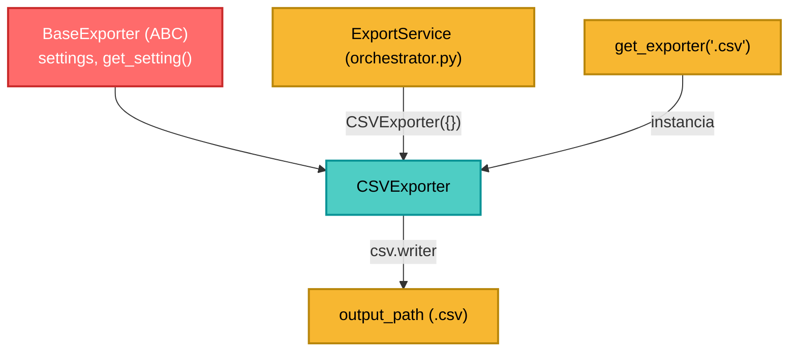

---
tags:
  - secinterp
  - code-walkthrough
  - exporters
  - csv
  - tabular
aliases:
  - csv_exporter.py
  - CSVExporter
cssclass: secinterp-note
---

# `exporters/csv_exporter.py`

> [!abstract] Resumen en una línea
> Exporta datos tabulares **puros** (`headers` + `rows`) a CSV con `csv.writer`, sin tocar QGIS: es el exporter más simple del paquete.

**Ruta**: `exporters/csv_exporter.py` (58 líneas)
**Clase**: `CSVExporter(BaseExporter)`
**Capa**: Exporters (Python puro, QGIS-agnóstico)
**Tags**: #secinterp #exporters #csv #tabular

---

## 🎯 ¿Por qué existe este archivo?

Las capas de perfil (topografía, geología, estructuras, sondajes) se resumen en **tablas** que el usuario quiere abrir en Excel/CSV. Ese formato no necesita render ni CRS: solo filas y columnas.

| Problema | Solución |
|----------|----------|
| Formatos tabulares dispersos por cada handler | Un único `CSVExporter` reutilizable |
| Encoding roto con tildes/geología | `encoding="utf-8"` explícito |
| Saltos de línea corruptos en Windows | `newline=""` al abrir el archivo |
| Datos incompletos revientan la exportación | Guard clauses para `headers`/`rows` |

> [!important] Nota arquitectónica
> Es el único exporter que **no importa `qgis`**. Recibe un `dict` con `headers`/`rows` y escribe con la librería estándar `csv`. Esto lo hace testeable sin QGIS (ver `tests/exporters/test_exporters.py`).

---

## 🧬 Diagrama de relaciones



---

## 📦 Imports — lectura arquitectónica

```python
import csv
from pathlib import Path
from typing import Any

from sec_interp.logger_config import get_logger

from .base_exporter import BaseExporter
```

| # | Observación |
|---|-------------|
| ① | `csv` es librería estándar → cero dependencias de QGIS/Qt |
| ② | `get_logger(__name__)` cuelga el logger de `SecInterp.*` (ver [[logger_config]]) |
| ③ | Hereda de `BaseExporter` para reutilizar `get_setting()` y la validación de rutas |

---

## 🧱 `get_supported_extensions()` — declaración de formato

```python
def get_supported_extensions(self) -> list[str]:
    """Get supported CSV extension."""
    return [".csv"]
```

`BaseExporter.validate_path()` compara esta lista contra `path.suffix.lower()`; la factory `get_exporter(".csv", settings)` es su consumidor.

---

## 🧱 `export()` — el corazón del módulo

```python
def export(
    self, output_path: Path, data: dict[str, Any], layer_name: str | None = None
) -> bool:
    if not data:
        return False

    try:
        headers = data.get("headers")
        rows = data.get("rows")
        if not headers or not rows:
            return False

        with output_path.open("w", newline="", encoding="utf-8") as f:
            writer = csv.writer(f)
            writer.writerow(headers)
            writer.writerows(rows)

    except Exception:
        logger.exception(f"CSV export failed for {output_path}")
        return False
    else:
        return True
```

| Paso | Qué hace |
|:----:|----------|
| 1 | Descarta `data` vacío/`None` sin abrir archivo |
| 2 | Exige **ambas** claves: sin `headers` o sin `rows` → `False` |
| 3 | Abre en modo texto con `utf-8` y `newline=""` |
| 4 | `writerow(headers)` + `writerows(rows)` |
| 5 | Cualquier excepción se **loguea con traceback** y retorna `False` |
| 6 | El `else` devuelve `True` solo si no hubo excepción |

> [!tip] `try/except/else`
> El `else` corre **solo si no hubo excepción**; así el `return True` no queda atrapado dentro del `try` y el `except` no puede devolver `True` por accidente.

> [!warning] `layer_name` se ignora y no se valida la ruta
> La firma acepta `layer_name` por compatibilidad con `BaseExporter`, pero el CSV es plano. La seguridad de ruta la aporta `validate_export_path()` (invocado por el orquestador), no este método.

---

## 🏛️ Patrones de diseño presentes

| Patrón | Dónde | Propósito |
|--------|-------|-----------|
| **Template Method** | Hereda de `BaseExporter` | Reutiliza `get_setting()` / validación |
| **Strategy** | `CSVExporter` | Estrategia concreta tabular |
| **Guard Clause** | `if not data` / `if not headers or not rows` | Salida temprana y barata |
| **Fail-safe** | `try/except` + `logger.exception` | Nunca propaga fallos de disco |

---

## 🧾 Resumen de la API

| Símbolo | Firma / Hereda | Uso típico |
|---------|----------------|------------|
| `CSVExporter` | `class CSVExporter(BaseExporter)` | Exportador CSV |
| `get_supported_extensions()` | `-> [".csv"]` | Validación de extensión |
| `export(output_path, data, layer_name=None)` | `-> bool` | Escribe `{"headers": [...], "rows": [...]}` |
| `get_setting(key, default)` | heredado | Acceso al dict de settings |

Contrato de `data`:

```python
data = {"headers": ["distance", "elevation", "unit"],
        "rows": [(0.0, 120.5, "Unit A"), (10.0, 118.2, "Unit B")]}
```

---

## 👀 Observaciones y notas

> [!success] Fortalezas
> - **QGIS-agnóstico**: testeable con `unittest` puro, sin `xvfb` ni mocks de QGIS.
> - **Robusto a datos incompletos**: guard clauses evitan archivos basura.
> - **Encoding correcto** (`utf-8`), clave con nombres geológicos.
> - **Log con traceback** vía `logger.exception`.

> [!warning] Puntos de atención
> - `except Exception` silencia errores de programación (p. ej. `rows` no iterable) devolviendo `False`.
> - No valida que `rows` sea una secuencia de secuencias.
> - No hace flush/`fsync`; delega en el cierre del `with` (correcto para CSV no crítico).

> [!question] Preguntas abiertas
> - ¿Un `delimiter` configurable (`;` para Excel en español) vía `get_setting("delimiter", ",")`?
> - ¿Añadir BOM (`utf-8-sig`) para que Excel detecte UTF-8 automáticamente?

---

## 🔗 Notas relacionadas

- [[Index]] — índice de la bóveda
- [[base_exporter]] — contrato abstracto y validación de rutas
- [[vector_exporter]] — homólogo vectorial (SHP/GPKG/DXF)
- [[export_package]] — orquestador que instancia `CSVExporter`
- [[logger_config]] — origen de `get_logger(__name__)`
- [[controller]] — fuente de los datos tabulares

---

*Nota de la bóveda SecInterp Code Walkthrough — v3.8.0*
