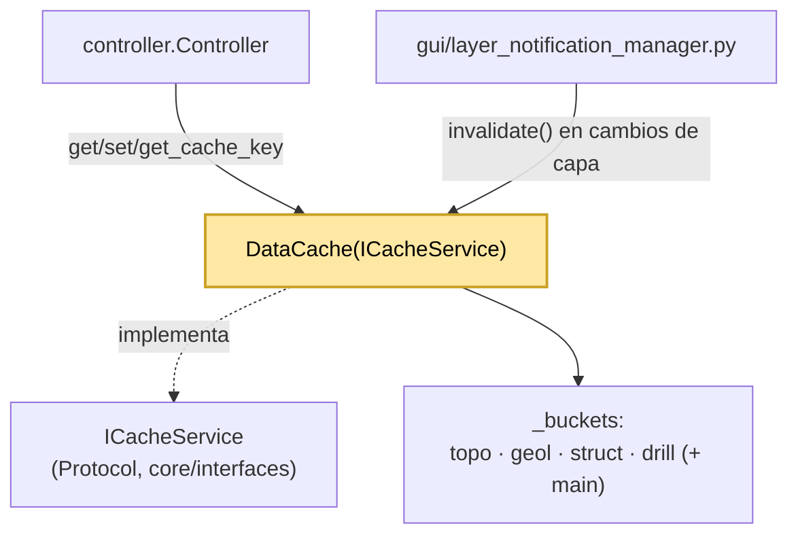

---
tags:
  - secinterp
  - code-walkthrough
  - core
  - cache
aliases:
  - data_cache.py
  - DataCache
cssclass: secinterp-note
---

# `core/data_cache.py`

> [!abstract] Resumen en una línea
> Caché en memoria por **buckets** (`topo/geol/struct/drill`) con claves SHA256, TTL configurable por entrada y metadata para LOD.

**Ruta**: `core/data_cache.py` (169 líneas)
**Clase**: `DataCache(ICacheService)`
**Capa**: Core · Cache (⚠️ usa `QCoreApplication` para i18n)
**Tags**: #secinterp #core #cache

---

## 🎯 ¿Por qué existe este archivo?

Cada preview o exportación puede recalcular topografía, geología, estructuras y sondajes. Sin caché, mover el canvas o cambiar un toggle implica recomputar todo. `DataCache` guarda los resultados indexados por parámetros.

| Problema | Solución |
|----------|----------|
| Recalcular todo en cada preview | Buckets por dominio con `get`/`set` |
| Los parámetros no son hashables (capas QGIS) | `get_cache_key()` usa `id()`/`source()` |
| Datos obsoletos acumulados | `DEFAULT_TTL_SECONDS = 3600` + `expiry` por entrada |
| Se necesita recordar LOD/sampling usado | Campo `metadata` por entrada |
| Invalidar al cambiar una capa | `invalidate(bucket, key)` / `clear()` |

> [!warning] Área gris de la frontera Core
> Importa `QCoreApplication` de `qgis.PyQt.QtCore` solo para `tr()`. Es una excepción pragmática a `core/AGENTS.md` (que prohíbe Qt en `/core`), igual que en `config.py`.

---

## 🧬 Diagrama de relaciones



> [!tip] Cómo leer
> El controlador es el cliente principal (patrón *cache-aside*). `layer_notification_manager` invalida cuando una capa cambia. El bucket `main` aparece en `controller` aunque no esté en el dict inicial: `set()` lo crea al vuelo.

---

## 🧱 `get_cache_key()` — hash de parámetros

```python
def get_cache_key(self, params: dict[str, Any]) -> str:
    key_parts = []
    for k, v in sorted(params.items()):
        if hasattr(v, "id"):        key_parts.append(f"{k}:{v.id()}")       # capas QGIS
        elif hasattr(v, "source"):  key_parts.append(f"{k}:{v.source()}")
        else:                       key_parts.append(f"{k}:{v!s}")
    return hashlib.sha256("".join(key_parts).encode("utf-8")).hexdigest()
```

| Característica | Detalle |
|----------------|---------|
| Orden | `sorted(params.items())` → hash estable |
| Capas QGIS | `hasattr(v, "id")` → `v.id()` (no se hashea el objeto) |
| Algoritmo | **SHA256**, aunque el docstring dice "MD5" (deuda de documentación) |

---

## 🧱 `get()` — lectura con TTL

```python
def get(self, bucket: str, key: str) -> Any | None:
    if bucket not in self._buckets:
        return None
    entry = self._buckets[bucket].get(key)
    if not entry:
        return None
    expiry = entry.get("expiry")
    if expiry and time.time() > expiry:          # entrada expirada
        logger.debug(f"Cache miss (TTL expired): {bucket}/{key}")
        del self._buckets[bucket][key]
        return None
    return entry.get("data")
```

| Situación | Retorno |
|-----------|---------|
| Bucket o clave inexistente | `None` |
| Entrada expirada | Borra y devuelve `None` |
| Entrada válida | `entry["data"]` |

---

## 🧱 `set()` — escritura con metadata

```python
def set(self, bucket, key, data, metadata=None) -> None:
    if bucket not in self._buckets:
        self._buckets[bucket] = {}               # bucket dinámico (p. ej. "main")
    ttl = (metadata or {}).get("ttl", self.default_ttl)
    expiry = time.time() + ttl if ttl > 0 else None
    self._buckets[bucket][key] = {
        "data": data, "expiry": expiry,
        "metadata": metadata or {}, "timestamp": time.time(),
    }
```

| Campo | Significado |
|-------|-------------|
| `data` | Resultado cacheado |
| `expiry` | `None` si `ttl <= 0` (sin expiración) |
| `metadata` | Contexto LOD/sampling (`max_points`, `canvas_width`) |
| `timestamp` | Momento de escritura |

---

## 🧱 `invalidate()`, `clear()`, `get_metadata()` y `get_cache_size()`

| Método | Granularidad |
|--------|--------------|
| `invalidate(bucket, key)` | Una entrada |
| `invalidate(bucket)` | Un bucket completo |
| `invalidate()` / `clear()` | Toda la caché (`clear` es alias de `invalidate`) |
| `get_metadata(bucket, key)` | Metadata de una entrada |
| `get_cache_size()` | Conteo por bucket (diagnóstico) |

---

## 🏛️ Patrones de diseño presentes

| Patrón | Dónde | Propósito |
|--------|-------|-----------|
| **Cache-Aside** | `controller` → `get`/`set` | El cliente decide qué cachear |
| **Strategy por bucket** | `_buckets` | Separar dominios de datos |
| **Protocol / Interface** | `ICacheService` | Contrato `runtime_checkable` |
| **TTL / Expiry** | `expiry` + `time.time()` | Evitar datos obsoletos |
| **Metadata Envelope** | `{"data","expiry","metadata","timestamp"}` | Enriquecer la entrada |

---

## 🧾 Resumen de la API

| Símbolo | Firma / Hereda | Uso típico |
|---------|----------------|------------|
| `DataCache` | `(ICacheService)` · `DEFAULT_TTL_SECONDS = 3600` | `self.data_cache = DataCache()` |
| `get_cache_key` | `(params: dict[str, Any]) -> str` | Hash de parámetros |
| `get` / `set` | `(bucket, key) -> Any \| None` / `(bucket, key, data, metadata=None)` | Leer/escribir con TTL |
| `invalidate` / `clear` | `(bucket=None, key=None)` / `()` | Borrado selectivo/total |
| `get_metadata` / `get_cache_size` | `(bucket, key)` / `() -> dict[str, int]` | Metadata y conteo |

---

## 👀 Observaciones y notas

> [!success] Fortalezas
> - **Contrato explícito** vía `ICacheService` (Protocol).
> - **Claves estables**: orden + `id()`/`source()` hacen el hash reproducible.
> - **TTL flexible** por entrada, con `None` para entradas permanentes.

> [!warning] Puntos de atención
> - Docstring "MD5" vs. implementación `sha256` (deuda de documentación).
> - No hay **límite de tamaño** ni política de desalojo (LRU): solo TTL.
> - No es thread-safe explícitamente; si se usa desde `QgsTask`, requiere cuidado (el GIL ayuda, pero no hay lock).

> [!question] Preguntas abiertas
> - ¿Debería migrarse a un `TTLCache`/LRU de stdlib con límite de entradas, y exponerse `default_ttl` desde `ConfigService`?

---

## 🔗 Notas relacionadas

- [[Index]] — índice de la bóveda
- [[controller]] — principal cliente (`get`/`set` por dominio)
- [[config]] — otro servicio con dependencia Qt en core
- [[layer_core_interfaces]] — define `ICacheService`
- [[layer_notification_manager]] — invalida la caché ante cambios de capa
- [[sec_interp_plugin]] — inyecta `controller.data_cache`

---

*Nota de la bóveda SecInterp Code Walkthrough — v3.8.0*
