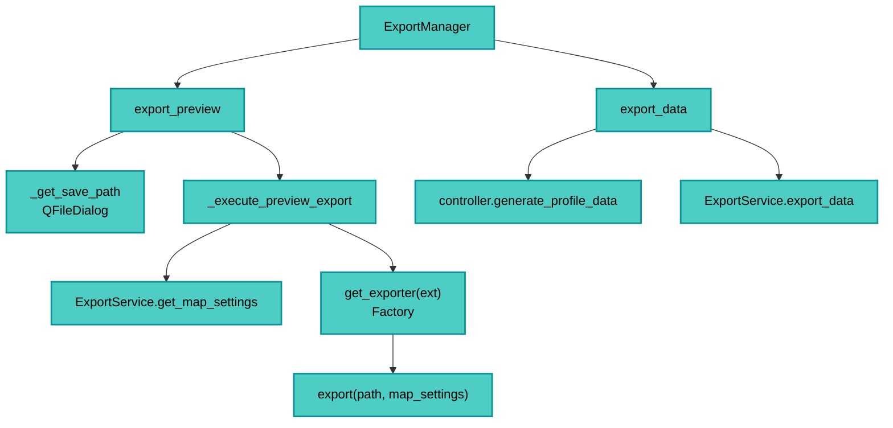

---
tags:
  - secinterp
  - code-walkthrough
  - gui
  - export-manager
  - orchestrator
aliases:
  - dialog_export_manager.py
  - ExportManager
cssclass: secinterp-note
---

# 22 — `gui/dialog_export_manager.py`

> [!abstract] Resumen en una línea
> Es el **orquestador de exportación**: decide qué y cómo exportar (preview PNG/PDF/SVG o datos SHP/CSV/3D) y delega en `ExportService` + `get_exporter`.

**Ruta**: `gui/dialog_export_manager.py` (218 líneas)
**Clase**: `ExportManager`
**Capa**: GUI · Managers
**Tags**: #secinterp #gui #export-manager #orchestrator

---

## 🎯 ¿Por qué existe este archivo?

La exportación mezcla **UI (diálogos, settings)**, **render (QgsMapSettings)** y **negocio (SHP/CSV/3D)**. Este manager separa:

| Flujo | Método | Delega a |
|-------|--------|----------|
| **Preview** (imagen del canvas) | `export_preview()` → `_execute_preview_export()` | `export_service.get_map_settings()` + `get_exporter(ext)` |
| **Datos** (SHP/CSV/3D) | `export_data()` | `controller.generate_profile_data()` + `export_service.export_data()` |

> [!important] GUI decide *cuándo/qué*; Core decide *cómo escribir disco*.

---

## 🧬 Diagrama



---

## 🧱 `export_preview()` — imagen del canvas

```python
def export_preview(self) -> bool:
    if not self.dialog.render_state.canvas:
        self._show_export_error(self.dialog.tr("No preview available..."))
        return False
    layers = self.dialog.render_state.canvas.layers()
    if not layers: ...
    output_path = self._get_save_path()
    if not output_path: return False

    with PerformanceTimer("Total Preview Export Time", self.metrics):
        success = self._execute_preview_export(output_path, layers)
        if success:
            self.dialog.push_message(self.dialog.tr("Success"),
                self.dialog.tr("Preview exported to {}").format(output_path.name),
                level=Qgis.MessageLevel.Success)
        return success
```

### `_get_save_path()`

```python
def _get_save_path(self) -> Path | None:
    last_dir = QgsSettings().value("SecInterp/lastExportDir", "", type=str)
    default_path = str(Path(last_dir) / "preview.png") if last_dir else "preview.png"
    file_filter = "PNG Image (*.png);;JPEG Image (*.jpg);;PDF (*.pdf);;SVG Vector (*.svg)"
    path_str, _ = QFileDialog.getSaveFileName(self.dialog, ..., default_path, file_filter)
    if not path_str: return None
    path = Path(path_str)
    QgsSettings().setValue("SecInterp/lastExportDir", str(path.parent))
    return path
```

> [!tip] Persistencia de última carpeta
> Usa `QgsSettings("SecInterp/lastExportDir")` para recordar la ubicación.

### `_execute_preview_export(path, layers)`

```python
def _execute_preview_export(self, path: Path, layers: list) -> bool:
    ext = path.suffix.lower()
    width, height, dpi = self._get_export_dimensions(ext)

    opts = self.dialog.get_preview_options()
    export_params = {
        "width": width, "height": height, "dpi": dpi,
        "background_color": QColor(255,255,255),
        "show_legend": opts.get("show_legend", True),
        "legend_renderer": getattr(self.dialog.plugin_instance, "preview_renderer", None),
        "title": self.dialog.tr("Section Interpretation Preview"),
        "extent": self.dialog.render_state.canvas.extent(),
    }

    map_settings = self.export_service.get_map_settings(
        layers, export_params["extent"],
        self.dialog.preview_widget.canvas.size(),
        export_params["background_color"],
    )
    if ext in [".png", ".jpg", ".jpeg"]:
        map_settings.setOutputSize(QSize(width, height))

    exporter = get_exporter(ext, export_params)
    return exporter.export(path, map_settings)
```

| Ext | Dimensiones | DPI |
|-----|-------------|-----|
| `.png/.jpg/.jpeg` | `canvas*3` | 300 |
| `.pdf/.svg` | `canvas` | 96 |

> [!note] `get_exporter(ext)` es **Factory** en `exporters/__init__.py` — elige PNG/JPG/PDF/SVG exporter.

---

## 🧱 `export_data()` — SHP/CSV/3D

```python
def export_data(self) -> bool:
    params = self.dialog.plugin_instance._get_and_validate_inputs()
    if not params: return False
    self.dialog.state_manager.save_settings()          # auto-save válidos

    values = self.dialog.get_selected_values()
    output_folder = Path(values["output_path"])

    profile_data, geol_data, struct_data, drillhole_data, _ = \
        self.dialog.plugin_instance.controller.generate_profile_data(params)

    if not profile_data:
        self.dialog.push_message(self.dialog.tr("Error"),
            self.dialog.tr("No profile data generated."), level=Qgis.MessageLevel.Critical)
        return False

    export_options = {
        "exp_topo": values.get("exp_topo", True),
        "exp_geol": values.get("exp_geol", True),
        "exp_struct": values.get("exp_struct", True),
        "exp_drill": values.get("exp_drill", True),
        "exp_interp": values.get("exp_interp", True),
        "drill_3d_traces": values.get("drill_3d_traces", True),
        "drill_3d_intervals": values.get("drill_3d_intervals", True),
        "drill_3d_original": values.get("drill_3d_original", True),
        "drill_3d_projected": values.get("drill_3d_projected", False),
    }

    result_msg = self.export_service.export_data(
        output_folder, params, profile_data, geol_data, struct_data,
        drillhole_data, interp_data=self.dialog.interpretations,
        export_options=export_options,
    )
    self.dialog.preview_widget.results_text.setPlainText("\n".join(result_msg))
    return True
```

| Paso | Qué hace |
|------|----------|
| 1 | Valida `PreviewParams` (`_get_and_validate_inputs`) + `save_settings` |
| 2 | `controller.generate_profile_data(params)` → datos frescos (no del caché de preview) |
| 3 | `export_service.export_data(output_folder, params, topo/geol/struct/drill/interp, options)` |
| 4 | Muestra mensajes de resultado |

> [!warning] Diferencia con preview
> Export regenera datos **desde cero** vía controller, no reusa `cached_data` del preview.

---

## 🏛️ Patrones de diseño presentes

| Patrón | Dónde | Propósito |
|--------|-------|-----------|
| **Orchestrator** | ambos flujos | Coordina UI → core → disco |
| **Factory** | `get_exporter(ext)` | Elige exporter por extensión |
| **Façade** | `ExportService.get_map_settings` | Construye `QgsMapSettings` |

---

## 🧾 Resumen de la API

| Método | Flujo |
|--------|-------|
| `export_preview()` | Validación canvas → diálogo → `_execute_preview_export` |
| `_get_save_path()` | `QgsSettings` + `QFileDialog` |
| `_execute_preview_export` | dimensiones + `get_map_settings` + `get_exporter` |
| `export_data()` | Validar → generar → `export_service.export_data` |

---

## 👀 Observaciones y notas

> [!success] Fortalezas
> - Separa claramente **preview (imagen)** de **datos (capas)**.
> - Recuerda última carpeta.
> - Auto-guarda settings válidos.

> [!warning] Puntos de atención
> - `export_data` llama a `controller.generate_profile_data` de nuevo (podría reutilizar caché con invalidación).
> - `export_options` construido a mano desde `values` → frágil al añadir opciones.
> - `get_exporter(ext, export_params)` recibe `legend_renderer` opcional (acoplamiento GUI).

---

## 🔗 Notas relacionadas

- [[Index]] — índice de la bóveda
- [[main_dialog]] — crea este manager
- [[controller]] — `generate_profile_data`
- [[domain]] — `PreviewParams`
- `core/services/export_service.py` + `exporters/` — negocio de exportación

---

*Nota 22 de la bóveda SecInterp Code Walkthrough — v3.8.0*
