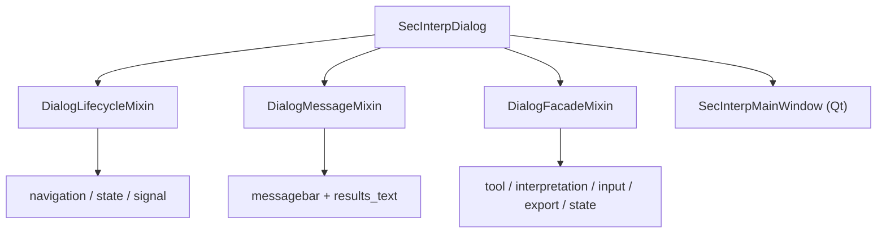

---
tags:
  - secinterp
  - code-walkthrough
  - gui
  - main-dialog
  - mixins
aliases:
  - dialog_message_mixin.py
  - dialog_lifecycle_mixin.py
  - dialog_facade_mixin.py
  - SecInterpDialog
cssclass: secinterp-note
---

# `gui/main_dialog.py` — mixins

> [!abstract] Resumen en una línea
> El antiguo `main_dialog.py` de 481 líneas se descompuso (2026-09-20) en tres mixins; `SecInterpDialog` queda como **composition root** de 193 líneas con `__init__`, `_init_managers`, `show_dialog`, `open_help` y `validate_inputs`.

**Ruta**: `gui/main_dialog.py` (193 líneas) + `gui/dialog_message_mixin.py` (78), `gui/dialog_lifecycle_mixin.py` (64), `gui/dialog_facade_mixin.py` (164)
**Clase**: `SecInterpDialog(DialogLifecycleMixin, DialogMessageMixin, DialogFacadeMixin, SecInterpMainWindow)`
**Capa**: GUI · Mixins
**Tags**: #secinterp #gui #main-dialog #mixins

---

## 🎯 ¿Por qué existe este archivo?

| Problema | Solución |
|----------|----------|
| Un archivo de 481 líneas mezclaba mensajería, limpieza y delegación | Tres mixins con una responsabilidad cada uno |
| El diálogo era un "god object" difícil de testear | `SecInterpDialog` conserva solo composición y API pública |

> [!important] MRO
> Los mixins van **antes** de `SecInterpMainWindow`, así `super()` encadena hasta la base Qt y `SecInterpDialog` sigue siendo un `QDialog`.

---

## 🧬 Diagrama de relaciones

---

## 🧱 Los tres mixins

| Mixin | Métodos clave | Responsabilidad |
|-------|---------------|-----------------|
| `DialogMessageMixin` | `push_message`, `handle_error` | Barra QGIS + HTML en resultados; `SecInterpError`→warning, resto→critical |
| `DialogLifecycleMixin` | `wheelEvent`, `closeEvent`, `_cleanup_*` | Navegación con rueda y limpieza determinista |
| `DialogFacadeMixin` | `toggle_*`, `interpretations`, `get_*`, `*_handler` | Proxies finos hacia los managers |

`DialogLifecycleMixin._cleanup_resources` llama en orden a `_cleanup_map_tools` (reset de `measure_tool`/`interpretation_tool`), `_cleanup_managers` (`save_interpretations` + `preview_manager.cleanup`) y `_cleanup_signals_and_components` (`signal_manager.disconnect_all` + `legend_widget.cleanup`), cada una tolerante vía `contextlib.suppress`. `DialogFacadeMixin` expone además `get_selected_values`, `get_preview_options`, `reject_handler`, `clear_cache_handler`, `reset_defaults_handler`, proxies de capa, `_load/_save_interpretations` y `_load/_save_user_settings`.

---

## 🏛️ Patrones de diseño presentes

| Patrón | Dónde | Propósito |
|--------|-------|-----------|
| **Mixin composition** | Las tres bases | Repartir responsabilidades sin herencia rígida |
| **Facade** | `DialogFacadeMixin` | Proxies finos hacia los managers |
| **Null Object** | `_NoOpMessageBar` | Diálogo testeable sin `iface` |

---

## 👀 Observaciones y notas

> [!success] Fortalezas
> - `main_dialog.py` pasa de 481 a 193 líneas; cada mixin es testeable por separado.
> - El MRO preserva la cadena `super()` hacia Qt.

> [!warning] Puntos de atención
> - Los mixins asumen atributos (`messagebar`, `tool_manager`, `preview_widget`) creados en `SecInterpDialog`.
> - `DialogFacadeMixin` acumula proxies "por compatibilidad", candidatos a limpieza.

---

## 🔗 Notas relacionadas

- [[Index]] — índice de la bóveda
- [[main_dialog]] — la clase que compone estos mixins
- [[sec_interp_plugin]] — crea el diálogo
- [[ui_pages]] — `SecInterpMainWindow` (UI programática)

---

*Nota de la bóveda SecInterp Code Walkthrough — v3.8.0*
