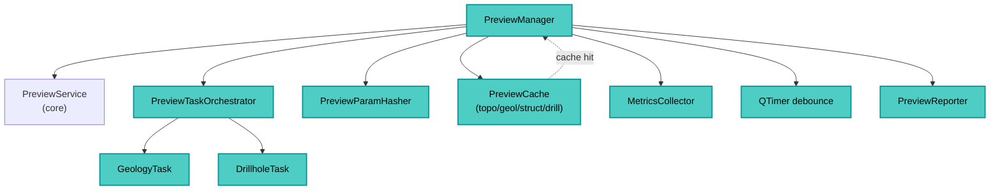

---
tags:
  - secinterp
  - code-walkthrough
  - gui
  - preview-manager
  - orchestrator
aliases:
  - dialog_preview_manager.py
  - PreviewManager
cssclass: secinterp-note
---

# 21 — `gui/dialog_preview_manager.py`

> [!abstract] Resumen en una línea
> Es el **orquestador del preview**: genera datos síncronos, lanza tareas asíncronas, gestiona caché, LOD y render — todo lo que ocurre tras pulsar *Generate Preview*.

> [!info] Refactor 2026-09-20
> Este manager de 434 líneas se descompuso en mixins ([[preview_mixins]]); `PreviewManager` es ahora una clase de **231 líneas**.

**Ruta**: `gui/dialog_preview_manager.py` (231 líneas; antes 434)
**Clase**: `PreviewManager(TranslatableMixin)`
**Capa**: GUI · Managers
**Tags**: #secinterp #gui #preview-manager #orchestrator

---

## 🎯 ¿Por qué existe este archivo?

El preview combina **caché, validación, servicios core, tareas QgsTask, debounce de zoom y render**. Este manager centraliza:

| Responsabilidad | Cómo |
|-----------------|------|
| Generación síncrona | `generate_preview()` + `PreviewService.generate_all` |
| Caché + hash | `PreviewCache` + `PreviewParamHasher` |
| Tareas asíncronas | `PreviewTaskOrchestrator` (geología/drillholes) |
| Render | Delegación a `plugin.draw_preview()` |
| LOD adaptativo | `QTimer` debounce + `canvas.extentsChanged` |
| Mensajes/métricas | `PreviewReporter` + `MetricsCollector` |

> [!important] Thin controller, thick manager
> El `SecInterpDialog` solo delega `preview_manager.generate_preview()`. La lógica vive aquí.

---

## 🧬 Componentes internos



---

## 🧱 `__init__` — cableado

```python
def __init__(self, dialog, preview_service=None, cache=None):
    self.dialog = dialog
    self.preview_service = preview_service or PreviewService(self.dialog.plugin_instance.controller)
    self.metrics = MetricsCollector()
    self.orchestrator = PreviewTaskOrchestrator(self)
    self.hasher = PreviewParamHasher()
    self.cached_data = cache if cache is not None else PreviewCache()
    self.last_params_hash: str | None = None
    self.last_result: PreviewResult | None = None
    self._on_interpretations_cleared: Callable | None = None
    self.debounce_timer = QTimer()
    self.debounce_timer.setSingleShot(True)
    self.connect_signals()
```

### Señales

```python
def connect_signals(self):
    self.debounce_timer.timeout.connect(self._update_lod_for_zoom)
    self.dialog.preview_widget.canvas.extentsChanged.connect(self._on_extents_changed)
```

> [!tip] Debounce
> `extentsChanged` se dispara en cada píxel de zoom/pan. El `QTimer` agrupa eventos y solo re-renderiza tras `ZOOM_DEBOUNCE_MS`.

---

## 🧱 `generate_preview()` — entrada principal

```python
def generate_preview(self) -> tuple[bool, str]:
    self.metrics.clear()
    try:
        with PerformanceTimer("Total Preview Generation", self.metrics):
            params = self.dialog.plugin_instance._get_and_validate_inputs()
            if not params:
                return False, self.tr("Invalid configuration")

            result = self._process_preview_data(params)
            self._update_ui_state(params, result)

    except SecInterpError as e:
        self.dialog.handle_error(e, self.dialog.tr("Preview Error"))
        return False, str(e)
    except (AttributeError, TypeError, ValueError) as e:
        logger.exception("Unexpected UI error")
        self.dialog.handle_error(e, self.dialog.tr("Unexpected Preview Error"))
        return False, str(e)
    except Exception as e:
        logger.exception("Critical unexpected error")
        self.dialog.handle_error(e, self.dialog.tr("Critical Error"))
        return False, str(e)
    else:
        return True, self.tr("Preview generated successfully")
```

| Paso | Qué hace |
|------|----------|
| 1 | Limpia métricas |
| 2 | Valida `PreviewParams` vía `plugin._get_and_validate_inputs()` |
| 3 | `_process_preview_data` (caché/compute + async trigger) |
| 4 | `_update_ui_state` (CRS + render + mensaje) |

> [!note] Jerarquía de errores
> `SecInterpError` → dialog warning; errores UI → loguea y dialoga; críticos → crítico.

---

## 🧱 `_process_preview_data()` — caché y disparo

```python
def _process_preview_data(self, params: PreviewParams) -> PreviewResult:
    if self._is_data_unchanged(params):
        logger.info("Using cached data (params unchanged)")
        return self.last_result

    self._handle_geometric_changes(params)
    transform_context = self._get_transform_context()

    result = self.preview_service.generate_all(params, transform_context)

    self._update_cache_and_metrics(result)
    self._cancel_active_tasks()
    self._trigger_async_updates(params)

    self.last_result = result
    return result
```

| Método | Rol |
|--------|-----|
| `_is_data_unchanged` | Compara `hasher.calculate_hash(params)` con `last_params_hash` |
| `_handle_geometric_changes` | Detecta cambio de geometría de sección → limpia interpretaciones vía callback |
| `_get_transform_context` | `mapCanvas().mapSettings().transformContext()` |
| `_trigger_async_updates` | `orchestrator.start_geology_task` + `start_drillhole_task` |

---

## 🧱 `_update_ui_state()` y render

```python
def _update_ui_state(self, params: PreviewParams, result: PreviewResult) -> None:
    line_lyr = resolve_layer(params.line_layer)
    self._update_crs_label(line_lyr)
    self._run_render_pipeline(result)
    result_msg = PreviewReporter.format_results_message(result, self.metrics)
    self.dialog.preview_widget.results_text.setPlainText(result_msg)
```

```python
def _run_render_pipeline(self, result: PreviewResult) -> None:
    with PerformanceTimer("Rendering", self.metrics):
        self._render_cached_data()

def _render_cached_data(self, preserve_extent=False):
    opts = self.dialog.get_preview_options()
    max_points = PreviewService.calculate_max_points(
        canvas_width=self.dialog.preview_widget.canvas.width(),
        manual_max=opts["max_points"], auto_lod=opts["auto_lod"],
    )
    self.dialog.plugin_instance.draw_preview(
        self.cached_data["topo"], self.cached_data.get("geol"),
        self.cached_data["struct"], drillhole_data=self.cached_data["drillhole"],
        max_points=max_points, preserve_extent=preserve_extent,
        use_adaptive_sampling=opts["use_adaptive_sampling"],
    )
```

> [!tip] `preserve_extent`
> En `_update_lod_for_zoom` se pasa `True` para no mover el canvas al re-renderizar por zoom.

---

## 🧱 `update_from_checkboxes()` y async

```python
def update_from_checkboxes(self) -> None:
    if not self.last_result:
        return
    self._render_cached_data()
```

```python
def _on_geology_finished(self, results):
    if results and isinstance(results, list):
        self.cached_data["geol"] = results
    self.update_from_checkboxes()
    self._update_results_display()
    self.orchestrator.remove_task(self.orchestrator.geology_task)
```

---

## 🏛️ Patrones de diseño presentes

| Patrón | Dónde | Propósito |
|--------|-------|-----------|
| **Orchestrator** | clase completa | Coordina cache, tasks, render |
| **Cache + Hasher** | `PreviewParamHasher` | Evita recomputar |
| **Debounce** | `QTimer` + `extentsChanged` | LOD sin spam |
| **Callback decoupling** | `set_interpretations_cleared_handler` | Preview ↔ Interpretaciones |

---

## 🧾 Resumen de la API (extracto)

| Método | Rol |
|--------|-----|
| `generate_preview()` | Flujo completo (validate → process → UI) |
| `_process_preview_data` | Cache/compute + async trigger |
| `_run_render_pipeline` / `_render_cached_data` | Render del caché |
| `update_from_checkboxes` | Re-render por visibilidad |
| `_on_extents_changed` / `_update_lod_for_zoom` | LOD por zoom |

---

## 👀 Observaciones y notas

> [!success] Fortalezas
> - Caché por hash evita trabajo repetido.
> - Limpieza de interpretaciones al cambiar geometría.
> - Manejo de errores por niveles.

> [!warning] Puntos de atención
> - Depende de `dialog.plugin_instance._get_and_validate_inputs` (acoplamiento al composition root).
> - `last_result` y `cached_data` duplican estado (sincronización).

---

## 🔗 Notas relacionadas

- [[Index]] — índice de la bóveda
- [[controller]] — core que genera datos
- [[domain]] — `PreviewParams`, `PreviewResult`, `ProfileData`
- [[main_dialog]] — crea y cablea este manager
- `gui/preview_task_orchestrator.py` — tareas en background

---

*Nota 21 de la bóveda SecInterp Code Walkthrough — v3.8.0*
