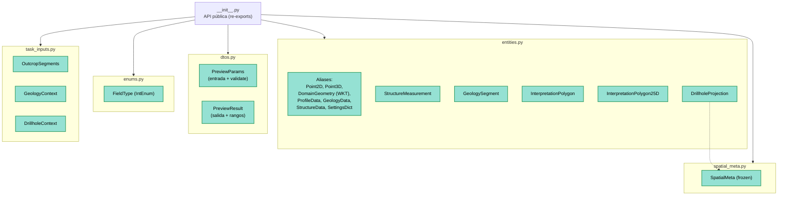

---
tags:
  - secinterp
  - code-walkthrough
  - core
  - domain
  - dto
  - entities
aliases:
  - core/domain
  - Domain Layer
  - DTOs SecInterp
cssclass: secinterp-note
---

# `core/domain/`

> [!abstract] Resumen en una línea
> Es la **capa de dominio**: define los DTOs, entidades, enums y tipos que sirven de **contrato de datos** entre GUI, core y exporters.

**Ruta**: `core/domain/` (paquete)
**Módulos**: `entities.py`, `dtos.py`, `enums.py`, `spatial_meta.py`, `task_inputs.py`, `__init__.py`
**Capa**: Core (QGIS-agnóstico)
**Tags**: #secinterp #core #domain #dto #entities

---

## 🎯 ¿Por qué existe este archivo?

En la arquitectura *Extract-then-Compute*, las capas se comunican **solo con datos puros**, nunca con objetos QGIS. `core/domain/` es donde viven esos datos.

| Problema | Solución del dominio |
|----------|----------------------|
| GUI y core deben intercambiar datos sin acoplarse | DTOs y entidades dataclass |
| Evitar `QgsGeometry` en el core | `DomainGeometry = str` (WKT) |
| Evitar `QVariant`/PyQt en validación | `FieldType(IntEnum)` |
| Transportar datos 3D/2D entre renderers | `SpatialMeta` (frozen) |
| Empaquetar entradas para cálculo puro | `GeologyContext`, `DrillholeContext` |

> [!important] Extract-then-Compute
> Los *contexts* (`GeologyContext`, `DrillholeContext`) son **totalmente desacoplados**: los produce la GUI (adapters) y los consume el core puro. Sin objetos QGIS vivos.

---

## 🧬 Mapa del paquete



---

## 🧱 `entities.py` — entidades y aliases

### Aliases de tipos

```python
ProfilePoints   = list[tuple[float, float]]
GeologyPoints   = list[tuple[float, float, str]]
StructurePoints = list[tuple[float, float]]

SettingsDict    = dict[str, Any]
ExportSettings  = dict[str, Any]
ValidationResult = tuple[bool, str]

Point2D = tuple[float, float]
Point3D = tuple[float, float, float]
DomainGeometry = str          # ← WKT, NO QgsGeometry
PointList = list[Point2D]

StructureData = list[StructureMeasurement]
GeologyData   = list[GeologySegment]
ProfileData   = list[tuple[float, float]]
```

> [!important] `DomainGeometry = str`
> El alias clave del desacoplamiento: la geometría viaja como **WKT** (string), no como `QgsGeometry`.
> Es la regla de oro del core.

### Entidades (`@dataclass`)

| Entidad | Campos clave | Propósito |
|---------|--------------|-----------|
| `StructureMeasurement` | distance, elevation, apparent_dip, original_dip/strike, attributes | Medición estructural proyectada |
| `GeologySegment` | unit_name, geometry_wkt, attributes, points, points_3d, points_3d_projected | Segmento geológico en el perfil |
| `InterpretationPolygon` | id, name, type, vertices_2d, color, created_at | Polígono 2D digitizado |
| `InterpretationPolygon25D` | id, name, type, geometry_wkt, crs_authid | Interpretación georreferenciada |
| `DrillholeProjection` | hole_id, distance, elevation, offset, total_depth, points_3d, segments | Sondaje proyectado |

> [!tip] `GeologySegment` sirve doble uso
> Representa tanto un **outcrop** proyectado como un **intervalo de sondaje**
> (vía `points_3d` / `points_3d_projected`). Reduce duplicación de tipos.

---

## 🧱 `dtos.py` — objetos de transferencia complejos

### `PreviewParams` — la entrada unificada

```python
@dataclass
class PreviewParams:
    raster_layer: Any
    line_layer: Any
    band_num: int
    buffer_dist: float = 100.0
    # Geology / Structure / Drillhole ...
    max_points: int = 1000
    canvas_width: int = 800
    auto_lod: bool = True

    def validate(self) -> None:
        if not isinstance(self.buffer_dist, int | float) or self.buffer_dist < 0:
            raise ValueError("Buffer distance must be a non-negative number")
        if not isinstance(self.band_num, int) or self.band_num < 1:
            raise ValueError("Band number must be a positive integer")
```

| Detalle | Explicación |
|---------|-------------|
| **Agrupa ~30 campos** | DEM, geología, estructura, sondajes y LOD en un solo objeto |
| **`validate()`** | Solo valida **primitivos** (buffer, band) |
| **Capas** | Se guardan como `Any` (objetos resueltos); su validación se delega a la GUI |

> [!warning] Excepción pragmática
> `PreviewParams` contiene **referencias a capas** (`raster_layer`, `line_layer`, …) tipadas como `Any`.
> Es una fuga controlada: el DTO transporta la referencia, pero **la lógica que las usa** vive en los adapters.
> La validación de capas se hace en la GUI (`ProjectValidator` + `LayerMetadata`).

### `PreviewResult` — la salida unificada

```python
@dataclass
class PreviewResult:
    topo: ProfileData | None = None
    geol: GeologyData | None = None
    struct: StructureData | None = None
    drillhole: Any | None = None
    metrics: MetricsCollector = field(default_factory=MetricsCollector)
    buffer_dist: float = 0.0

    def get_elevation_range(self) -> tuple[float, float]: ...
    def get_distance_range(self) -> tuple[float, float]: ...
```

| Método | Devuelve |
|--------|----------|
| `get_elevation_range()` | `(min_elev, max_elev)` global de todas las capas |
| `get_distance_range()` | `(min_dist, max_dist)` según la topografía |

> [!tip] Helpers de rango
> Los renderers usan estos métodos para calcular la extensión/ejes del perfil
> sin recalcular mínimos y máximos manualmente. Delegan en `_get_*_elevations`.

---

## 🧱 `enums.py` — `FieldType`

```python
class FieldType(IntEnum):
    NULL = 0
    BOOL = 1
    INT = 2
    DOUBLE = 6
    STRING = 10
    LONG_LONG = 4
    DATE = 14
    DATE_TIME = 16
```

> [!important] Core-safe
> Los valores numéricos **coinciden con `QVariant.Type`** de Qt.
> Así el core puede validar tipos **sin importar PyQt**.
> Es un ejemplo perfecto de "enum espejo" para mantener el desacoplamiento.

---

## 🧱 `spatial_meta.py` — `SpatialMeta` (frozen)

```python
@dataclass(frozen=True)
class SpatialMeta:
    hole_id: str | None = None
    dist_along: float = 0.0
    offset: float = 0.0
    z: float = 0.0
    x_3d: float | None = None
    y_3d: float | None = None
    x_proj: float | None = None
    y_proj: float | None = None
    norm_x: float | None = None
    norm_y: float | None = None
    attributes: dict[str, Any] | None = None

    def to_vec3(self) -> tuple[float, float, float]:
        return (self.x_3d or 0.0, self.y_3d or 0.0, self.z)

    def to_vec2_profile(self) -> tuple[float, float]:
        return (self.dist_along, self.z)
```

| Característica | Detalle |
|----------------|---------|
| **`frozen=True`** | Inmutable → seguro para hilos y caché |
| **Puente 2D/3D** | Coordenadas globales (`x_3d/y_3d`) + de perfil (`dist_along, z`) |
| **Vectores normalizados** | `norm_x/norm_y` para orientación |
| **Conversores** | `to_vec3()` y `to_vec2_profile()` |

> [!tip] DTO universal
> Un solo objeto sirve tanto al motor 2D (perfil) como al 3D, evitando tipos paralelos.

---

## 🧱 `task_inputs.py` — contextos de cálculo puro

```python
@dataclass
class OutcropSegments:
    unit_name: str
    attributes: dict[str, Any]
    segments: list[tuple[float, float, DomainGeometry]]

@dataclass
class GeologyContext:
    master_profile_data: list[Point2D]
    master_grid_dists: list[tuple[float, Point2D, float]]
    outcrops: list[OutcropSegments]
    tolerance: float = 0.001

@dataclass
class DrillholeContext:
    line_points: list[Point2D]
    section_azimuth: float
    buffer_width: float
    collar_id_field: str
    collar_z_field: str
    collar_depth_field: str
    collar_data: list[dict[str, Any]]
    survey_data: dict[Any, list[tuple[float, float, float]]]
    interval_data: dict[Any, list[tuple[float, float, str]]]
    pre_sampled_z: dict[Any, float] = field(default_factory=dict)
```

> [!important] Frontera Extract → Compute
> Estos contextos son el **contrato** entre los adapters GUI y los servicios core:
> - GUI: `GeologyExtractor.extract_context(...)` → `GeologyContext`
> - Core: `GeologyService.build_segments(context)`
>
> Ver [[controller]] para el flujo completo.

---

## 🧱 `__init__.py` — superficie de importación

El paquete **re-exporta** todo en un único punto y define `__all__`:

```python
from .dtos import PreviewParams, PreviewResult
from .entities import (
    DomainGeometry, DrillholeProjection, ExportSettings, GeologyData, GeologyPoints,
    GeologySegment, InterpretationPolygon, InterpretationPolygon25D, Point2D, Point3D,
    PointList, ProfileData, ProfilePoints, SettingsDict, StructureData,
    StructureMeasurement, StructurePoints, ValidationResult,
)
from .enums import FieldType
from .spatial_meta import SpatialMeta
from .task_inputs import DrillholeContext, GeologyContext, OutcropSegments

__all__ = [...]
```

> [!tip] Import estable
> Gracias al `__init__`, el resto del código hace `from sec_interp.core.domain import PreviewParams`
> sin conocer la estructura interna de archivos. Refactorizar el paquete **no rompe** a los consumidores.

---

## 🏛️ Patrones de diseño presentes

| Patrón | Dónde | Propósito |
|--------|-------|-----------|
| **DTO (Data Transfer Object)** | `PreviewParams`, `PreviewResult`, contexts | Transportar datos entre capas |
| **Entity** | `GeologySegment`, `DrillholeProjection`… | Modelar conceptos del dominio |
| **Value Object (frozen)** | `SpatialMeta` | Objeto inmutable seguro |
| **Type Alias / Newtype** | `Point2D`, `DomainGeometry`… | Legibilidad y desacoplamiento |
| **Enum Bridge** | `FieldType` | Espejo de `QVariant.Type` sin PyQt |
| **Facade de imports** | `__init__.py` | Superficie de importación estable |

---

## 🧾 Resumen de tipos exportados

| Grupo | Tipos |
|-------|-------|
| **Geometría** | `DomainGeometry` (WKT), `Point2D`, `Point3D`, `PointList` |
| **Datos de perfil** | `ProfileData`, `ProfilePoints`, `GeologyData`, `GeologyPoints`, `StructureData`, `StructurePoints` |
| **Entidades** | `GeologySegment`, `StructureMeasurement`, `DrillholeProjection`, `InterpretationPolygon`, `InterpretationPolygon25D` |
| **DTOs** | `PreviewParams`, `PreviewResult` |
| **Contextos** | `GeologyContext`, `DrillholeContext`, `OutcropSegments` |
| **Infra** | `FieldType`, `SpatialMeta`, `SettingsDict`, `ExportSettings`, `ValidationResult` |

---

## 👀 Observaciones y notas

> [!success] Fortalezas
> - Contrato de datos claro y **QGIS-agnóstico** (WKT, tuples, dataclasses).
> - `FieldType` evita PyQt en el core mediante un enum espejo.
> - `SpatialMeta` inmutable → thread-safe.
> - Superficie de import estable con `__all__`.

> [!warning] Puntos de atención
> - `PreviewParams` contiene objetos de capa (`Any`): fuga pragmática de tipos GUI al core.
> - `entities.py` mezcla **aliases** y **entidades**; podría separarse si crece.
> - `PreviewResult.drillhole: Any` (no tipado como `list[DrillholeProjection]`).
> - Algunos tipos usan `Any` en atributos (`dict[str, Any]`) — inevitable pero débil para validación.

> [!question] Preguntas abiertas
> - ¿Migrar `PreviewParams` a un builder/validador dedicado en `core/validation/`?
> - ¿Separar aliases a `core/domain/types.py`?

---

## 🔗 Notas relacionadas

- [[Index]] — índice de la bóveda
- [[controller]] — consume `PreviewParams` y produce los contextos
- [[exceptions]] — excepciones del dominio
- [[validation]] — validación de parámetros y capas
- [[adapters]] — productores de `GeologyContext` / `DrillholeContext`
- [[ARCHITECTURE_EN]] — arquitectura general

---

*Nota de la bóveda SecInterp Code Walkthrough — v3.8.0*
