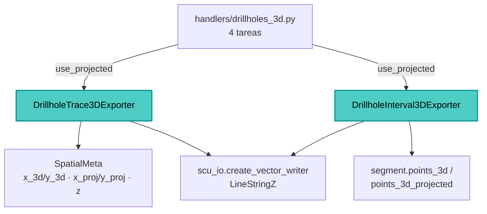

---
tags:
  - secinterp
  - code-walkthrough
  - exporters
  - 3d
aliases:
  - drillhole_3d_exporter.py
  - DrillholeTrace3DExporter
cssclass: secinterp-note
---

# `exporters/drillhole_3d_exporter.py`

> [!abstract] Resumen en una línea
> Exporta **trazas e intervalos 3D de sondajes** como `LineStringZ`, eligiendo entre coordenadas reales (`x_3d/y_3d`) y proyectadas (`x_proj/y_proj`) según el flag `use_projected`.

**Ruta**: `exporters/drillhole_3d_exporter.py` (243 líneas)
**Clases**: `DrillholeTrace3DExporter`, `DrillholeInterval3DExporter`
**Capa**: Exporters (QGIS · Estrategias de formato)
**Tags**: #secinterp #exporters #3d

---

## 🎯 ¿Por qué existe este archivo?

La representación 2D (`dist_along`, `z`) pierde la posición real en el espacio. Este módulo emite geometría **Z real** para visualización 3D y permite la variante "proyectada" (sobre el plano de sección) con el mismo código.

| Problema | Solución |
|----------|----------|
| El 2D no sitúa el sondaje en el espacio global | `QgsPoint(x, y, z)` → `QgsLineString` → `LineStringZ` |
| Un sondeo tiene coordenadas reales y proyectadas | `use_projected` selecciona `x_proj/y_proj` o `x_3d/y_3d` |
| El orquestador genera 4 tareas (traza/intervalo × real/proyectado) | Un flag booleano reutiliza la misma clase |
| Formatos legacy de 5 elementos | `_get_trace_points` los desempaqueta |

> [!important] Geometría 3D explícita
> A diferencia del módulo 2D, aquí **sí** se importa `QgsWkbTypes` para declarar `LineStringZ` y `QgsLineString`/`QgsPoint` para construir la Z.

---

## 🧬 Diagrama de relaciones



---

## 📦 Imports — lectura arquitectónica

`QgsWkbTypes.Type.LineStringZ` se pasa a `create_vector_writer`: el 3D es una decisión de tipo WKB. `QgsLineString(points)` + `QgsGeometry(...)` es el patrón de construcción Z. Solo hay 3 constantes: `NEW_DATA_LENGTH = 3`, `LEGACY_DATA_LENGTH = 5`, `MIN_POINTS_FOR_INTERVAL = 2`.

---

## 🧱 `DrillholeTrace3DExporter` — elegir el sistema de coordenadas

`export()` extrae `use_projected` y delega en helpers:

```python
drillhole_data = data.get("drillhole_data")
crs = data.get("crs")
use_projected = data.get("use_projected", False)
if not drillhole_data or not crs:
    return False

writer = scu_io.create_vector_writer(
    str(output_path), crs, fields,
    QgsWkbTypes.Type.LineStringZ, layer_name=layer_name,
)
for hole_data in drillhole_data:
    self._process_hole_trace(writer, fields, hole_data, use_projected)
```

`_extract_hole_spatial_data` reconoce el DTO y las dos longitudes de tupla:

```python
if isinstance(hole_data, DrillholeProjection):
    return hole_data.hole_id, hole_data.points_3d
if isinstance(hole_data, list | tuple):
    hole_id = hole_data[0]
    if len(hole_data) == NEW_DATA_LENGTH:
        return hole_id, hole_data[1]
    if len(hole_data) == LEGACY_DATA_LENGTH:
        return hole_id, hole_data
    logger.warning(f"Unexpected hole data format (length {len(hole_data)}) ...")
return None
```

Y `_get_trace_points` decide el origen de coordenadas:

```python
if isinstance(spatial_data, list | tuple) and len(spatial_data) == LEGACY_DATA_LENGTH:
    _, _, traces_3d, traces_3d_proj, _ = spatial_data
    points_source = traces_3d_proj if use_projected else traces_3d
    return [QgsPoint(x, y, z) for x, y, z in points_source]

if use_projected:
    return [QgsPoint(p.x_proj or 0.0, p.y_proj or 0.0, p.z)
            for p in spatial_data if p.x_proj is not None]
return [QgsPoint(p.x_3d or 0.0, p.y_3d or 0.0, p.z)
        for p in spatial_data if p.x_3d is not None]
```

> [!warning] Filtrado por `is not None`
> Los puntos sin la coordenada del modo elegido se descartan (`if p.x_proj is not None` / `x_3d is not None`). Un sondaje mal proyectado puede quedar reducido o vacío.

---

## 🧱 `DrillholeInterval3DExporter` — tramos con Z

No hay DTO intermedio: el intervalo se lee del segmento, y `segments` es siempre el último elemento de la tupla.

```python
if isinstance(hole_data, DrillholeProjection):
    hole_id, segments = hole_data.hole_id, hole_data.segments
elif isinstance(hole_data, list | tuple):
    # segments are always the last element in both 3 and 5 element formats
    hole_id, segments = hole_data[0], hole_data[-1]
else:
    return
```

```python
points_source = segment.points_3d_projected if use_projected else segment.points_3d
if not points_source or len(points_source) < MIN_POINTS_FOR_INTERVAL:
    return
points = [QgsPoint(x, y, z) for x, y, z in points_source]
geom = QgsGeometry(QgsLineString(points))
```

| Campo | Tipo | Origen |
|-------|------|--------|
| `hole_id` | `QString` | `hole_id` del sondeo |
| `from_depth` | `Double` | `segment.attributes["from"]` |
| `to_depth` | `Double` | `segment.attributes["to"]` |
| `unit` | `QString` | `segment.unit_name` |

> [!note] `PolygonZ` no, `LineStringZ` sí
> Ambas clases exportan **líneas 3D**, no polígonos. El `PolygonZ` de la bóveda pertenece a `interpretation_3d_exporter`.

---

## 🏛️ Patrones de diseño presentes

| Patrón | Dónde | Propósito |
|--------|-------|-----------|
| **Template Method** | `BaseExporter` | Contrato y validación comunes |
| **Strategy por modo** | `use_projected` | Real vs proyectado sin duplicar clases |
| **Adapter** | `_extract_hole_spatial_data` | DTO y tuplas legacy |
| **Fail-safe** | `try/except` + `logger.exception` | Registra y devuelve `False` |

---

## 🧾 Resumen de la API

| Símbolo | Firma / Hereda | Uso típico |
|---------|----------------|------------|
| `DrillholeTrace3DExporter` | `BaseExporter` | Trazas 3D reales o proyectadas |
| `DrillholeInterval3DExporter` | `BaseExporter` | Intervalos 3D reales o proyectados |
| `use_projected` | clave de `data` | `True` → `*_proj`, `False` → `*_3d` |
| `_prepare_fields()` | `-> QgsFields` | Traza: `hole_id`; intervalo: `+from/to/unit` |
| `get_supported_extensions()` | `-> list[str]` | `[".shp", ".gpkg", ".dxf"]` |

---

## 👀 Observaciones y notas

> [!success] Fortalezas
> - Un único flag `use_projected` cubre las 4 combinaciones del orquestador.
> - Construcción Z explícita y correcta (`QgsPoint`, `QgsLineString`, `LineStringZ`).

> [!warning] Puntos de atención
> - Los puntos con la coordenada del modo elegido a `None` se eliminan: puede cambiar el número de vértices.
> - No hay validación de CRS más allá de exigir que `crs` sea truthy.

> [!question] Preguntas abiertas
> - ¿Conviene unificar `drillhole_exporters` y `drillhole_3d_exporter` bajo una sola abstracción?

---

## 🔗 Notas relacionadas

- [[Index]] — índice de la bóveda
- [[base_exporter]] — contrato heredado
- [[drillhole_exporters]] — variante 2D
- [[drillhole_service]] — origen de los datos
- [[export_package]] — orquestador (`handlers/drillholes_3d.py`, 4 tareas)

---

*Nota de la bóveda SecInterp Code Walkthrough — v3.8.0*
