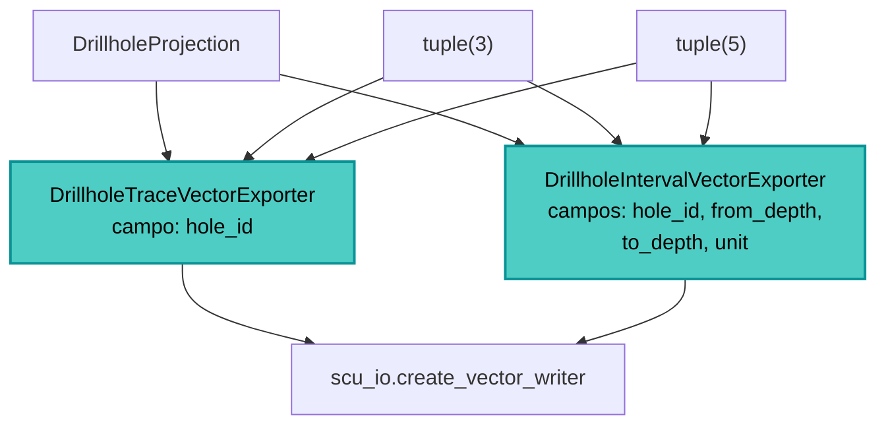

---
tags:
  - secinterp
  - code-walkthrough
  - exporters
  - drillhole
aliases:
  - drillhole_exporters.py
  - DrillholeTraceVectorExporter
cssclass: secinterp-note
---

# `exporters/drillhole_exporters.py`

> [!abstract] Resumen en una línea
> Exporta **trazas e intervalos 2D de sondajes** a SHP/GPKG/DXF como `LineString`, normalizando a la vez el DTO `DrillholeProjection` y los formatos tupla legacy de 3 y 5 elementos.

**Ruta**: `exporters/drillhole_exporters.py` (239 líneas)
**Clases**: `DrillholeTraceVectorExporter`, `DrillholeIntervalVectorExporter`
**Capa**: Exporters (QGIS · Estrategias de formato)
**Tags**: #secinterp #exporters #drillhole

---

## 🎯 ¿Por qué existe este archivo?

Los sondajes llegan al exporter con dos representaciones distintas: el DTO limpio `DrillholeProjection` y tuplas de longitud variable que arrastran compatibilidad con tests de integración. Este módulo absorbe ambas.

| Problema | Solución |
|----------|----------|
| El DTO y las tuplas legacy no comparten interfaz | `_write_traces` / `_write_intervals` detectan el tipo |
| Las tuplas pueden tener 3 o 5 elementos | `NEW_DATA_LENGTH = 3`, `LEGACY_DATA_LENGTH = 5` |
| Una traza llega como `SpatialMeta` o como par | `_create_feature` prueba `dist_along/z` y luego `p[0]/p[1]` |
| Una traza de 1 punto no es geometría válida | `MIN_REQUIRED_TRACE_POINTS = 2` |

> [!important] Sin QGIS en los DTOs
> El exporter recibe DTOs de `core.domain` (`DrillholeProjection`, `SpatialMeta`) y solo **construye QGIS al final**, en `QgsGeometry.fromPolylineXY`.

---

## 🧬 Diagrama de relaciones



---

## 📦 Imports — lectura arquitectónica

`DrillholeProjection` viene de `core.domain` y es el primer tipo que se intenta detectar; no se usa `QgsWkbTypes` porque `fromPolylineXY` fija `LineString`; las constantes documentan los formatos de tupla soportados.

| Constante | Valor | Significado |
|-----------|:-----:|-------------|
| `MIN_REQUIRED_TRACE_POINTS` | `2` | Mínimo para una traza |
| `LEGACY_DATA_LENGTH` | `5` | Tupla legacy/test de integración |
| `NEW_DATA_LENGTH` | `3` | Tupla nueva con `SpatialMeta` |
| `MIN_POINTS_FOR_INTERVAL` | `2` | Mínimo para un intervalo |
| `COORD_PAIR_LENGTH` | `2` | Longitud de un par `(x, y)` |

---

## 🧱 `DrillholeTraceVectorExporter` — normalizar la entrada

`_write_traces` resuelve las tres formas posibles antes de crear la feature:

```python
for item in drillhole_data:
    if isinstance(item, DrillholeProjection):
        hole_id, traces = item.hole_id, item.points_3d
    elif isinstance(item, list | tuple):
        if len(item) == NEW_DATA_LENGTH:
            hole_id, traces, _ = item
        elif len(item) >= LEGACY_DATA_LENGTH:
            hole_id, traces, _traces_3d, _traces_3d_proj, _ = item
        else:
            continue
    else:
        continue
    if not traces or len(traces) < MIN_REQUIRED_TRACE_POINTS:
        continue
```

La conversión de puntos tolera tanto `SpatialMeta` como tuplas:

```python
for p in traces:
    if hasattr(p, "dist_along") and hasattr(p, "z"):
        points.append(QgsPointXY(p.dist_along, p.z))
    elif isinstance(p, list | tuple) and len(p) >= COORD_PAIR_LENGTH:
        points.append(QgsPointXY(p[0], p[1]))
```

> [!note] El campo de la traza
> `_prepare_fields()` crea una única columna `hole_id` (`QString`). La geometría es la traza completa y la profundidad no se guarda en 2D.

---

## 🧱 `DrillholeIntervalVectorExporter` — intervalos litológicos

El esquema sí es rico: identifica el sondeo y el tramo.

```python
def _prepare_fields(self) -> QgsFields:
    fields = QgsFields()
    fields.append(QgsField("hole_id", QMetaType.Type.QString))
    fields.append(QgsField("from_depth", QMetaType.Type.Double))
    fields.append(QgsField("to_depth", QMetaType.Type.Double))
    fields.append(QgsField("unit", QMetaType.Type.QString))
    return fields
```

La localización de `segments` explota que **siempre es el último elemento** de la tupla:

```python
if len(item) == NEW_DATA_LENGTH or len(item) >= LEGACY_DATA_LENGTH:
    hole_id = item[0]
    segments = item[-1]
else:
    continue
```

Cada feature toma sus atributos de `segment`: `attrs.get("from", 0.0)`, `attrs.get("to", 0.0)` y `segment.unit_name`.

| Campo | Origen |
|-------|--------|
| `hole_id` | `item.hole_id` / `item[0]` |
| `from_depth` | `segment.attributes["from"]` (default `0.0`) |
| `to_depth` | `segment.attributes["to"]` (default `0.0`) |
| `unit` | `segment.unit_name` |

---

## 🏛️ Patrones de diseño presentes

| Patrón | Dónde | Propósito |
|--------|-------|-----------|
| **Template Method** | `BaseExporter` | Contrato y validación comunes |
| **Adapter** | `_write_traces` / `_write_intervals` | Unifica DTO y tuplas legacy |
| **Fail-safe** | `try/except/else` | Registra y devuelve `False` ante error |
| **Tolerant reader** | `hasattr` / `isinstance` | Acepta varias formas de punto |

---

## 🧾 Resumen de la API

| Símbolo | Firma / Hereda | Uso típico |
|---------|----------------|------------|
| `DrillholeTraceVectorExporter` | `BaseExporter` | Trazas 2D → `LineString` con `hole_id` |
| `DrillholeIntervalVectorExporter` | `BaseExporter` | Intervalos → `LineString` con `from/to/unit` |
| `_write_traces(writer, data, fields)` | privado | Recorre y normaliza los sondajes |
| `_write_intervals(writer, data, fields)` | privado | Recorre segmentos por sondaje |
| `get_supported_extensions()` | `-> list[str]` | `[".shp", ".gpkg", ".dxf"]` |

---

## 👀 Observaciones y notas

> [!success] Fortalezas
> - Acepta el DTO moderno y los formatos tupla sin ramas frágiles: `isinstance` primero, longitud después.
> - `item[-1]` para segmentos evita duplicar la lógica de 3 vs 5 elementos.

> [!warning] Puntos de atención
> - Las trazas 2D usan `(dist_along, z)` del `SpatialMeta`; si esos campos vienen a `None`/`0`, la geometría pierde la trayectoria real.
> - En tuplas legacy de 5 elementos, `_traces_3d` y `_traces_3d_proj` se descartan con `_` (aquí solo interesa la traza 2D).

> [!question] Preguntas abiertas
> - ¿Conviene deprecar formalmente las tuplas legacy y quedarse solo con `DrillholeProjection`?

---

## 🔗 Notas relacionadas

- [[Index]] — índice de la bóveda
- [[base_exporter]] — contrato heredado
- [[drillhole_3d_exporter]] — variante 3D de estos mismos datos
- [[drillhole_service]] — servicio que produce los sondajes
- [[export_package]] — orquestador (`handlers/drillholes.py`)

---

*Nota de la bóveda SecInterp Code Walkthrough — v3.8.0*
