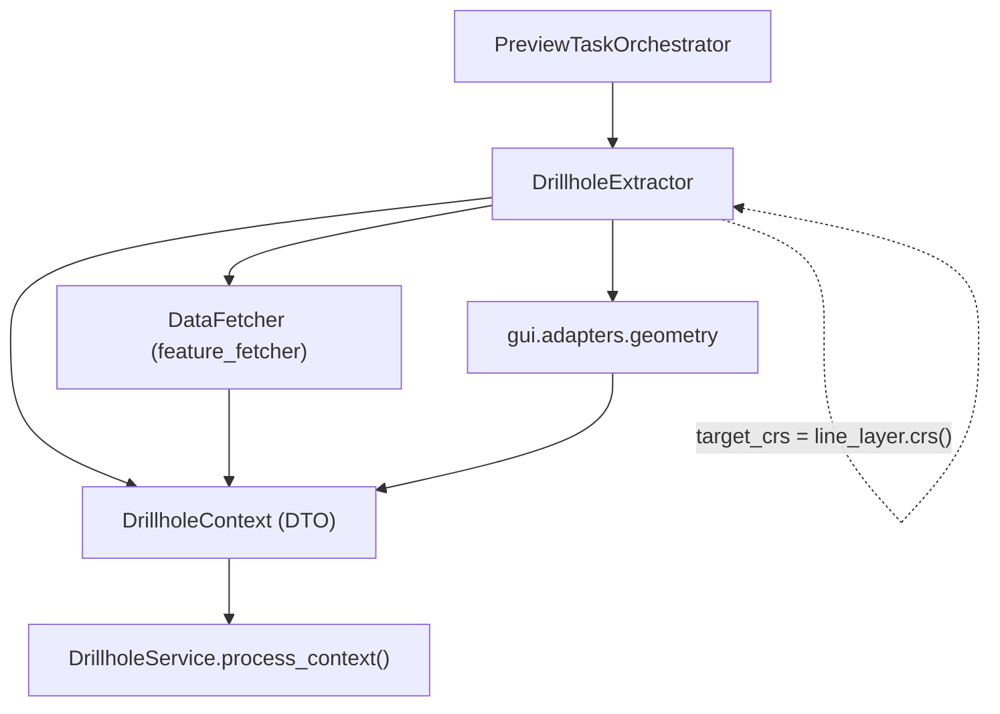

---
tags:
  - secinterp
  - code-walkthrough
  - gui
  - adapters
  - drillhole
aliases:
  - drillhole_extractor.py
  - DrillholeExtractor
  - DrillholeContext
cssclass: secinterp-note
---

# `gui/adapters/drillhole_extractor.py`

> [!abstract] Resumen en una línea
> Adapter **Extract** de sondajes: bufferea la línea, separa los collares dentro del buffer, pre-muestrea su Z desde el DEM y hace fetch masivo de surveys/intervalos → `DrillholeContext` desacoplado.

**Ruta**: `gui/adapters/drillhole_extractor.py` (369 líneas)
**Clase**: `DrillholeExtractor`
**Constante**: `DEFAULT_BUFFER_SEGMENTS = 8`
**Capa**: GUI · Adapters (Extract phase)
**Tags**: #secinterp #gui #adapters #drillhole

---

## 🎯 ¿Por qué existe este archivo?

| Problema | Solución |
|----------|----------|
| `DrillholeService` (core) no puede tocar `QgsVectorLayer` | Todo se convierte a dicts/tuplas desacoplados |
| Hay que decidir qué collares entran en la sección | `line_geom.buffer(buffer_width, 8)` + filtro bbox + `intersects()` |
| Las capas hijas pueden estar en otro CRS | `_prepare_feature_request` aplica `setDestinationCrs` con el `transformContext` del proyecto |
| Los surveys deben leerse de una sola pasada | `DataFetcher.fetch_bulk_data` con expresión `IN (...)` |
| Faltan Z en los collares | Pre-muestreo desde el DEM (`_pre_sample_z`) |

> [!important] Frontera Extract
> El único módulo de sondajes que toca QGIS. `DrillholeContext` contiene IDs, tuplas `(depth, azim, incl)`, `(from, to, lith)`, puntos `(x, y)` y atributos saneados.

---

## 🧬 Diagrama de relaciones



---

## 📦 Imports — lectura arquitectónica

```python
from qgis.core import (QgsCoordinateReferenceSystem, QgsFeatureRequest, QgsGeometry,
                       QgsProject, QgsRasterLayer, QgsVectorLayer)
from qgis.PyQt.QtCore import QCoreApplication
from sec_interp.core import utils as scu
from sec_interp.core.domain.task_inputs import DrillholeContext
from sec_interp.core.exceptions import DataMissingError, ValidationError
from sec_interp.gui.adapters import geometry
```

| # | Observación |
|---|-------------|
| ① | `QgsProject` solo se usa para obtener el `transformContext` de la reproyección. |
| ② | `DataFetcher` se **inyecta** por constructor (no se instancia aquí): testeable y desacoplado. |
| ③ | `scu.extract_feature_attributes` sanea atributos a primitivas. |
| ④ | `geometry.sample_point_elevation` se delega en el adapter compartido. |

---

## 🧱 `DrillholeContext` — el DTO de salida

```python
@dataclass
class DrillholeContext:
    line_points: list[Point2D]
    section_azimuth: float
    buffer_width: float
    collar_id_field: str
    collar_z_field: str
    collar_depth_field: str
    collar_data: list[dict[str, Any]]          # {"id", "point", "attributes"}
    survey_data: dict[Any, list[tuple[float, float, float]]]  # id -> (depth, azim, incl)
    interval_data: dict[Any, list[tuple[float, float, str]]]  # id -> (from, to, lith)
    pre_sampled_z: dict[Any, float] = field(default_factory=dict)
```

> [!note] Sin QGIS
> Ninguno de estos campos referencia objetos QGIS: el contexto es seguro para cruzar a un hilo de fondo.

---

## 🧱 `extract_context()` — firma extensa, responsabilidad única

```python
def extract_context(self, line_layer, buffer_width, collar_layer, collar_id_field,
                    use_geometry, collar_x_field, collar_y_field, collar_z_field,
                    collar_depth_field, survey_layer, survey_fields, interval_layer,
                    interval_fields, dem_layer=None, band_num=1) -> DrillholeContext | None:
    if buffer_width <= 0:
        raise ValidationError(self.tr("Buffer width must be positive"))
    self._validate_fields(...)
    line_geom = self._read_line_geometry(line_layer)
    if line_geom is None:
        return None
    line_points = self._extract_line_points(line_geom)
    section_azimuth = self._calculate_azimuth(line_points)
    ...
```

| Fase | Método |
|------|--------|
| 1. Validar buffer | guarda `buffer_width <= 0` |
| 2. Validar campos | `_validate_fields` → `_validate_collar_fields` + `_validate_child_fields` |
| 3. Leer línea | `_read_line_geometry`, `_extract_line_points`, `_calculate_azimuth` |
| 4. Detachar collares | `_detach_collars` |
| 5. Fetch hijos | `data_fetcher.fetch_bulk_data` (solo si `collar_ids` y `data_fetcher`) |
| 6. Construir DTO | `DrillholeContext(...)` |

---

## 🧱 `_detach_collars()` — buffer, CRS y pre-muestreo

```python
line_buffer = self._create_line_buffer(line_geom, buffer_width)
req = self._prepare_feature_request(line_geom, line_buffer, collar_layer, target_crs)
for feat in collar_layer.getFeatures(req):
    if line_buffer and not feat.geometry().intersects(line_buffer):
        continue
    hid = feat[id_field]
    collar_ids.add(hid)
    attrs = scu.extract_feature_attributes(feat)
    point = self._extract_point(feat, attrs, use_geom, x_field, y_field)
    if point is None:
        continue
    collar_data.append({"id": hid, "point": point, "attributes": attrs})
    z = self._pre_sample_z(feat, attrs, hid, z_field, point, dem_layer)
    if z is not None:
        pre_sampled_z[hid] = z
```

| Detalle | Comportamiento |
|---------|----------------|
| `_create_line_buffer` | `buffer(buffer_width, DEFAULT_BUFFER_SEGMENTS)`; si falla, `None` |
| `_prepare_feature_request` | bbox del buffer + `setDestinationCrs(target_crs)` si el CRS difiere |
| `_extract_point` | Geometría si `use_geometry`; si no, campos X/Y (con `float()`) |
| `_pre_sample_z` | Z del campo; si es `0.0` y hay DEM, muestrea el raster |

> [!warning] Dos matices importantes
> 1. El `hid` se añade a `collar_ids` **antes** de comprobar `point is None`, así que IDs sin punto pueden llegar al fetch.
> 2. `pre_sampled_z` solo almacena valores **muestreados del DEM**: si la Z venía del campo, `_pre_sample_z` devuelve `None` y no se guarda.

---

## 🧱 Validación de campos — 3 niveles

```python
def _validate_collar_fields(self, ...):
    collar_names = [f.name() for f in collar_layer.fields()]
    self._check_field(collar_id_field, collar_names, "Collar ID")
    if not use_geometry:
        self._check_field(collar_x_field, collar_names, "Collar X")
        self._check_field(collar_y_field, collar_names, "Collar Y")
    if collar_z_field: self._check_field(collar_z_field, collar_names, "Collar Z")
    if collar_depth_field: self._check_field(collar_depth_field, collar_names, "Collar Depth")
```

| Capa | Qué valida |
|------|------------|
| Collar | ID siempre; X/Y solo si no se usa geometría; Z/Depth si están definidos |
| Survey | Todos los campos de `survey_fields.values()` |
| Interval | Todos los campos de `interval_fields.values()` |

---

## 🧱 Azimut y buffer

```python
def _calculate_azimuth(self, points) -> float:
    MIN_REQUIRED_POINTS = 2
    if len(points) < MIN_REQUIRED_POINTS:
        return 0.0
    p1, p2 = points[0], points[1]
    azimuth = math.degrees(math.atan2(p2[0] - p1[0], p2[1] - p1[1]))
    return azimuth + 360 if azimuth < 0 else azimuth
```

> [!note] `buffer_width` en unidades de la capa
> Al igual que `StructureExtractor`, el buffer se interpreta en las unidades de la línea. En EPSG:4326 serían grados, no metros.

---

## 🏛️ Patrones de diseño presentes

| Patrón | Dónde | Propósito |
|--------|-------|-----------|
| **Adapter / Bridge** | clase completa | QGIS → DTO |
| **Dependency injection** | `__init__(data_fetcher)` | Inyectar el fetcher (mockeable) |
| **Bulk fetch** | `DataFetcher.fetch_bulk_data` | Una sola consulta por capa hija |
| **CRS transform** | `_prepare_feature_request` | Comparar capas en distinto CRS |
| **Fail-fast** | `_validate_fields` | Errores antes de leer features |
| **Graceful degradation** | DEM opcional, fallbacks | Sin DEM también funciona |

---

## 🧾 Resumen de la API

| Símbolo | Firma | Uso |
|---------|-------|-----|
| `DrillholeExtractor` | `__init__(data_fetcher=None)` | Extractor con fetcher inyectado |
| `extract_context` | `(line_layer, buffer_width, collar_layer, ... , band_num=1) -> DrillholeContext \| None` | Punto de entrada |
| `_read_line_geometry` | `(line_lyr) -> QgsGeometry \| None` | Primera feature |
| `_detach_collars` | `(...) -> (set, list, dict)` | Collares + IDs + Z pre-muestreada |
| `_prepare_feature_request` | `(...) -> QgsFeatureRequest` | bbox + reproyección |
| `_extract_point` | `(...) -> tuple[float, float] \| None` | Punto del collar |
| `_pre_sample_z` | `(...) -> float \| None` | Z desde campo o DEM |
| `_sample_elevation` | `(dem_layer, point) -> float` | Delega en `geometry` |
| `DEFAULT_BUFFER_SEGMENTS` | `= 8` | Segmentos de aproximación del buffer |

---

## 👀 Observaciones y notas

> [!success] Fortalezas
> - Maneja reproyección de capas hijas con el `transformContext` del proyecto.
> - Fetch masivo por expresión `IN`, no N consultas por hoyo.
> - DEM opcional y degradación elegante.

> [!warning] Puntos de atención
> - La firma de `extract_context` tiene **14 parámetros**; un dataclass de configuración lo haría más legible.
> - `collar_ids` puede incluir IDs sin punto válido (ver arriba).
> - `pre_sampled_z` no guarda la Z que ya venía en el campo (se relee en el servicio).
> - La expresión `IN` se construye interpolando strings: válida para IDs numéricos/texto, pero conviene vigilar comillas.

> [!question] Preguntas abiertas
> - ¿Debería `_detach_collars` añadir el ID solo tras validar el punto?
> - ¿Conviene un `DrillholeExtractionParams` para reducir la firma?

---

## 🔗 Notas relacionadas

- [[drillhole_service]] — consume `DrillholeContext`
- [[adapters]] — visión de conjunto de la fase Extract
- [[domain]] — definición de `DrillholeContext`
- [[tasks]] — `DrillholeGenerationTask` transporta este contexto
- [[drillhole_page]] — formulario que origina los parámetros
- [[Index]] — índice de la bóveda

---

*Nota de la bóveda SecInterp Code Walkthrough — v3.8.0*
