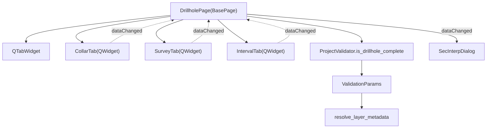

---
tags:
  - secinterp
  - code-walkthrough
  - gui
  - ui-pages
aliases:
  - drillhole_page.py
  - DrillholePage
cssclass: secinterp-note
---

# `gui/ui/pages/drillhole_page.py`

> [!abstract] Resumen en una línea
> Página de configuración de **sondajes** (Collar / Survey / Interval) que actúa como **coordinador**: posee el `QTabWidget`, delega cada formulario a [[drillhole_tabs]] y valida con `ProjectValidator.is_drillhole_complete`.

> [!info] Refactor 2026-09-20
> Esta página de 451 líneas se descompuso en tabs ([[drillhole_tabs]]); `DrillholePage` es ahora un **coordinador de 130 líneas** que no conoce los widgets de campo de cada tab.

**Ruta**: `gui/ui/pages/drillhole_page.py` (130 líneas; antes 451)
**Clase**: `DrillholePage(BasePage)`
**Capa**: GUI · UI Pages
**Tags**: #secinterp #gui #ui-pages

---

## 🎯 ¿Por qué existe este archivo?

| Problema (antes) | Solución (hoy) |
|------------------|----------------|
| 451 líneas mezclando 3 formularios + validación + coordinación | Un `QTabWidget` + 3 tabs en `gui/ui/pages/drillhole/` |
| Un cambio en Collar obligaba a tocar un módulo gigante | Cada tab es un `QWidget` aislado |
| Señales difíciles de rastrear | Cada tab expone su `dataChanged`; el page la reemite |
| Validación acoplada a widgets concretos | `get_data()` → `ValidationParams` → `ProjectValidator` |
| Persistencia dispersa | Protocolo `dump()/load()/reset()` delegado a cada tab |

> [!important] Coordinador, no formulario
> `DrillholePage` solo orquesta: agrega `get_data`/`dump`/`load`/`reset` de los tabs y traduce a validación de core. No construye `QgsFieldComboBox` ni `QgsMapLayerComboBox`.

---

## 🧬 Diagrama de relaciones



> [!tip] Cómo leer
> Flecha sólida = composición/importa; punteada = señal reemitida por el coordinador. La validación cruza a `core/validation`.

---

## 📦 Imports — lectura arquitectónica

```python
# drillhole_page.py
import contextlib
from typing import Any

from qgis.PyQt.QtCore import QCoreApplication, pyqtSignal
from qgis.PyQt.QtWidgets import QTabWidget, QVBoxLayout, QWidget

from sec_interp.core.validation.project_validator import (
    ProjectValidator, ValidationParams,
)
from sec_interp.gui.adapters.validation_extractor import resolve_layer_metadata
from sec_interp.logger_config import get_logger

from .base_page import BasePage
from .drillhole import CollarTab, IntervalTab, SurveyTab
```

| # | Observación |
|---|-------------|
| ① | El page importa `core.validation` (regla pura) y un adapter Extract — patrón correcto. |
| ② | `resolve_layer_metadata` convierte capas QGIS en metadatos serializables antes de validar. |
| ③ | Los tabs se importan del subpaquete `drillhole`; el page no toca `qgis.gui`. |

---

## 🧱 Clase y metadatos

```python
class DrillholePage(BasePage):
    """Configuration page for Drillhole data (Collar, Survey, Intervals)."""

    dataChanged = pyqtSignal()
    layer_keys = frozenset({"dh_collar_layer", "dh_survey_layer", "dh_interval_layer"})

    def __init__(self, parent: QWidget | None = None) -> None:
        super().__init__(
            QCoreApplication.translate("DrillholePage", "Drillhole Data"), parent
        )
```

| Símbolo | Rol |
|---------|-----|
| `dataChanged` | Señal reemitida al diálogo cuando cambia cualquier tab. |
| `layer_keys` | Claves de persistencia que representan capas (usadas por el guardado del diálogo). |
| `BasePage` | Aporta `group_box`, `main_layout` y el protocolo `get_data/validate/...`. |

---

## 🧱 `_setup_ui()` — montar el tab container

```python
def _setup_ui(self) -> None:
    super()._setup_ui()

    layout = self.group_box.layout()
    if layout is None:
        layout = QVBoxLayout(self.group_box)
        self.group_box.setLayout(layout)

    self.tab_widget = QTabWidget()
    layout.addWidget(self.tab_widget)

    self.collar_tab = CollarTab()
    self.tab_widget.addTab(self.collar_tab, self.tr("Collars"))

    self.survey_tab = SurveyTab()
    self.tab_widget.addTab(self.survey_tab, self.tr("Survey"))

    self.interval_tab = IntervalTab()
    self.tab_widget.addTab(self.interval_tab, self.tr("Intervals"))

    layout.addStretch()
```

| Tab | Contenido (delegado) |
|-----|----------------------|
| `collar_tab` | Capa de collars, ID, X/Y/Z, profundidad total, `use_geometry`. |
| `survey_tab` | Capa survey + ID/depth/azimut/inclinación. |
| `interval_tab` | Capa intervalos + ID/from/to/litología. |

> [!note] Sin widgets propios
> El page no expone `self.c_id` ni similares: para *aliases* retrocompatibles se consultaría `self.collar_tab.c_id`. Esto mantiene la descomposición limpia.

---

## 🧱 Protocolo de datos — `get_data` / `dump` / `load` / `reset`

```python
def get_data(self) -> dict[str, Any]:
    data: dict[str, Any] = {}
    data.update(self.collar_tab.get_data())
    data.update(self.survey_tab.get_data())
    data.update(self.interval_tab.get_data())
    return data

def dump(self) -> dict[str, Any]:
    data: dict[str, Any] = {}
    data.update(self.collar_tab.dump())
    data.update(self.survey_tab.dump())
    data.update(self.interval_tab.dump())
    return data

def load(self, data: dict[str, Any]) -> None:
    self.collar_tab.load(data)
    self.survey_tab.load(data)
    self.interval_tab.load(data)

def reset(self) -> None:
    self.collar_tab.reset()
    self.survey_tab.reset()
    self.interval_tab.reset()
```

| Método | Claves | Uso |
|--------|--------|-----|
| `get_data()` | `collar_*`, `survey_*`, `interval_*` | Validación y extracción hacia core. |
| `dump()` | `dh_*` | Persistencia del estado del diálogo. |
| `load(data)` | `dh_*` | Restaurar al abrir. |
| `reset()` | — | Valores por defecto. |

> [!tip] Fusión por `update`
> Como cada tab usa un espacio de claves distinto, `dict.update` compone el diccionario sin colisiones. Es el patrón Composite aplicado a formularios.

---

## 🧱 `is_complete()` — validación contra core

```python
def is_complete(self) -> bool:
    data = self.get_data()
    params = ValidationParams(
        collar_layer=resolve_layer_metadata(data["collar_layer"]),
        collar_id=data["collar_id"],
        collar_use_geom=data["use_geometry"],
        collar_x=data["collar_x"],
        collar_y=data["collar_y"],
        survey_layer=resolve_layer_metadata(data["survey_layer"]),
        survey_id=data["survey_id"],
        survey_depth=data["survey_depth"],
        survey_azim=data["survey_azim"],
        survey_incl=data["survey_incl"],
        interval_layer=resolve_layer_metadata(data["interval_layer"]),
        interval_id=data["interval_id"],
        interval_from=data["interval_from"],
        interval_to=data["interval_to"],
        interval_lith=data["interval_lith"],
    )
    return ProjectValidator.is_drillhole_complete(params)
```

| Paso | Detalle |
|------|---------|
| 1 | `get_data()` reúne los 3 tabs. |
| 2 | `resolve_layer_metadata()` extrae metadatos serializables de cada capa. |
| 3 | Se construye un `ValidationParams` inmutable. |
| 4 | `ProjectValidator.is_drillhole_complete(params)` (core, sin QGIS) decide. |

> [!important] Extract-then-Compute
> La validación **no** ocurre en la GUI: esta solo extrae y delega en `core/validation/project_validator.py`.

---

## 🧱 `connect_signals()` / `disconnect_signals()`

```python
def connect_signals(self) -> None:
    for tab in (self.collar_tab, self.survey_tab, self.interval_tab):
        tab.dataChanged.connect(self.dataChanged.emit)
        tab.connect_signals()

def disconnect_signals(self) -> None:
    for tab in (self.collar_tab, self.survey_tab, self.interval_tab):
        tab.disconnect_signals()
        with contextlib.suppress(TypeError, RuntimeError):
            tab.dataChanged.disconnect(self.dataChanged.emit)

    with contextlib.suppress(TypeError, RuntimeError):
        self.dataChanged.disconnect()
```

| Fase | Acción |
|------|--------|
| Conectar | Reenvía el `dataChanged` de cada tab y conecta los widgets internos del tab. |
| Desconectar | Desconecta los tabs, el reenvío y la propia señal del page. |
| Tolerancia | `contextlib.suppress` evita errores si ya estaba desconectado. |

---

## 🏛️ Patrones de diseño presentes

| Patrón | Dónde | Propósito |
|--------|-------|-----------|
| **Composite / Coordinator** | `DrillholePage` | Un page sobre 3 tabs homogéneos. |
| **Observer** | `dataChanged` reemitida | El diálogo reacciona a cualquier cambio. |
| **Protocol (dump/load/reset/get_data)** | tabs + page | Persistencia uniforme. |
| **Adapter (Extract)** | `resolve_layer_metadata` | Capa QGIS → metadatos para core. |
| **Delegation** | `ProjectValidator` | Validación fuera de la GUI. |

---

## 🧾 Resumen de la API

| Símbolo | Firma / Hereda | Uso típico |
|---------|----------------|------------|
| `dataChanged` | `pyqtSignal()` | Aviso de cambio al diálogo. |
| `layer_keys` | `frozenset[str]` | Claves de capa persistibles. |
| `DrillholePage` | `BasePage` | Página de sondajes. |
| `get_data()` | `() -> dict[str, Any]` | Datos para validación/extracción. |
| `dump()` / `load(data)` | `dict[str, Any]` | Persistencia (`dh_*`). |
| `reset()` | `() -> None` | Defaults. |
| `is_complete()` | `() -> bool` | Validación vía `ProjectValidator`. |
| `connect_signals()` / `disconnect_signals()` | `() -> None` | Ciclo de vida de señales. |

---

## 👀 Observaciones y notas

> [!success] Fortalezas
> - Coordinador de 130 líneas: la descomposición dejó el page legible y enfocado.
> - La validación vive en core y recibe un DTO (`ValidationParams`), no widgets.
> - Cada tab puede evolucionar sin tocar a los demás.

> [!warning] Puntos de atención
> - `is_complete()` accede por clave directa (`data["collar_layer"]`): si un tab cambiara sus claves, rompería silenciosamente.
> - El page no expone *aliases* de widgets; el código que antes usaba `page.c_id` debe migrar a `page.collar_tab.c_id`.

> [!question] Preguntas abiertas
> - ¿Debería `is_complete()` devolver también un mensaje de error por tab para guiar al usuario?
> - ¿Conviene mover el protocolo `dump/load/reset` a una interfaz común de tab?

---

## 🔗 Notas relacionadas

- [[Index]] — índice de la bóveda
- [[drillhole_tabs]] — paquete de tabs (`CollarTab`, `SurveyTab`, `IntervalTab`)
- [[drillhole_service]] — consume los datos extraídos
- [[drillhole_extractor]] — adapter Extract
- [[ui_pages]] — catálogo de páginas
- [[layer_gui_ui_pages]] — capa de páginas de la GUI

---

*Nota de la bóveda SecInterp Code Walkthrough — v3.8.0*
