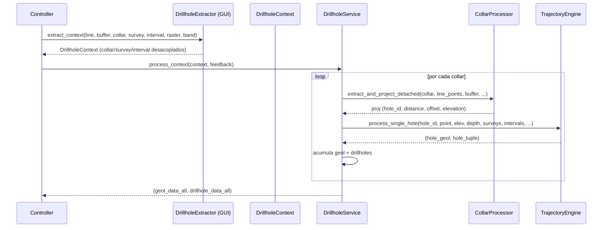

---
tags:
  - secinterp
  - code-walkthrough
  - core
  - drillhole
  - services
aliases:
  - drillhole_service.py
  - DrillholeService
cssclass: secinterp-note
---

# `core/services/drillhole_service.py`

> [!abstract] Resumen en una línea
> Es el **orquestador de sondajes** (fase *Compute*): a partir de un `DrillholeContext` desacoplado, proyecta collares, calcula trayectorias e interpola intervalos — **sin tocar QGIS**.

**Ruta**: `core/services/drillhole_service.py` (113 líneas)
**Clase**: `DrillholeService(IDrillholeService, TranslatableMixin)`
**Interface**: `IDrillholeService` → `process_context(context, feedback=None) -> tuple[list[GeologySegment], list[DrillholeProjection]] | None`
**Capa**: Core · Services
**Tags**: #secinterp #core #drillhole #services

---

## 🎯 ¿Por qué existe este archivo?

Los sondajes llegan como **tres tablas QGIS** (collar, survey, interval). El adapter `DrillholeExtractor` ya las desacopló en un `DrillholeContext`. Este servicio **orquesta** cuatro procesadores especializados:

| Procesador | Rol |
|------------|-----|
| `CollarProcessor` | Proyecta collar a la sección y filtra por buffer |
| `SurveyProcessor` | Normaliza/valida surveys `(depth, azim, incl)` |
| `IntervalProcessor` | Normaliza intervalos `(from, to, lith)` |
| `TrajectoryEngine` | Calcula trayectoria 3D y proyección 2D + segmenta geología |

> [!important] QGIS-agnóstico total
> No importa `qgis.*`. Solo opera sobre `DrillholeContext` y delega a procesadores puros.

---

## 🧬 Relación Extract → Compute



---

## 🧱 Interface — `IDrillholeService`

```python
class IDrillholeService(ABC):
    @abstractmethod
    def process_context(self, context: DrillholeContext, feedback: Any | None = None) -> Any:
        """Process drillholes from a detached context."""
```

| Parámetro | Rol |
|-----------|-----|
| `context` | Salida de `DrillholeExtractor` (sin QGIS) |
| `feedback` | `isCanceled()` / `setProgress()` (QgsFeedback) |

---

## 🧱 Servicio — `__init__` (DI de procesadores)

```python
def __init__(
    self,
    collar_processor: CollarProcessor | None = None,
    survey_processor: SurveyProcessor | None = None,
    interval_processor: IntervalProcessor | None = None,
    data_fetcher: Any | None = None,
    trajectory_engine: TrajectoryEngine | None = None,
) -> None:
    self.collar_processor   = collar_processor or CollarProcessor()
    self.survey_processor   = survey_processor or SurveyProcessor()
    self.interval_processor = interval_processor or IntervalProcessor()
    self.data_fetcher = data_fetcher  # compatibilidad, no se usa
    self.trajectory_engine  = trajectory_engine or TrajectoryEngine()
```

> [!tip] Composición
> Cada procesador es **inyectable** (tests lo mockean). `data_fetcher` se mantiene solo por compatibilidad histórica.

---

## 🧱 `process_context()` — bucle por collar

```python
def process_context(self, context: DrillholeContext, feedback=None):
    geol_data_all: list[GeologySegment] = []
    drillhole_data_all: list[DrillholeProjection] = []
    total = len(context.collar_data)

    for i, collar in enumerate(context.collar_data):
        if feedback and feedback.isCanceled():
            return None

        proj = self.collar_processor.extract_and_project_detached(
            collar, context.line_points, context.buffer_width,
            context.collar_id_field, context.collar_z_field,
            context.collar_depth_field, context.pre_sampled_z,
        )
        if proj:
            hole_id = proj.hole_id
            point = collar.get("point")
            surveys   = context.survey_data.get(hole_id, [])
            intervals = context.interval_data.get(hole_id, [])

            try:
                hole_geol, hole_tuple = self.trajectory_engine.process_single_hole(
                    hole_id, point, proj.elevation, proj.total_depth,
                    surveys, intervals, context.line_points,
                    context.buffer_width, context.section_azimuth,
                )
                geol_data_all.extend(hole_geol)
                drillhole_data_all.append(hole_tuple)
            except (ValueError, TypeError, KeyError) as e:
                logger.exception(self.tr("Data error in hole {0}: {1}").format(hole_id, e))
            except SecInterpError as e:
                logger.exception(self.tr("Processing error in hole {0}: {1}").format(hole_id, e))

        if feedback:
            feedback.setProgress((i / total) * 100)

    return geol_data_all, drillhole_data_all
```

### Paso a paso

| # | Qué hace |
|---|----------|
| 1 | Itera `collar_data` del contexto |
| 2 | `feedback.isCanceled()` → aborta si cancelan |
| 3 | `CollarProcessor` proyecta y filtra por buffer; si `None` (fuera de buffer), salta |
| 4 | Recupera `surveys` e `intervals` por `hole_id` |
| 5 | `TrajectoryEngine.process_single_hole` calcula trayectoria + segmentos geológicos |
| 6 | Errores por pozo se **loguean** pero no abortan el resto |
| 7 | `setProgress(i/total)` |

> [!important] Resiliencia por pozo
> Si un sondaje tiene datos rotos, se loguea y se continúa con el siguiente. Nunca se pierde todo el lote.

---

## 🏛️ Patrones de diseño presentes

| Patrón | Dónde | Propósito |
|--------|-------|-----------|
| **Facade / Orchestrator** | `process_context` | Coordina 4 procesadores |
| **Dependency Injection** | `__init__` | Procesadores mockeables |
| **Strategy pura (Compute)** | `TrajectoryEngine` | Cálculo 3D→2D sin QGIS |
| **Fail-soft** | `try/except` por pozo | Un pozo malo no tumba el lote |

---

## 🧾 Resumen de la API

| Símbolo | Firma |
|---------|-------|
| `IDrillholeService.process_context` | `(context: DrillholeContext, feedback?) -> tuple[geol, drill] | None` |
| `DrillholeService.process_context` | igual, con loop, proyección y trayectoria |

---

## 👀 Observaciones y notas

> [!success] Fortalezas
> - Orquestador **mínimo** (113 líneas) y delegante.
> - Sin QGIS → testeable con `DrillholeContext` fabricado.
> - Resiliente por pozo + cancelable.

> [!warning] Puntos de atención
> - `survey_processor` / `interval_processor` se inyectan pero **no se usan** directamente (los usa `TrajectoryEngine` internamente).
> - `feedback` es `Any`.
> - `data_fetcher` residual (no se usa) → confusión histórica.

> [!question] Preguntas abiertas
> - ¿Eliminar `data_fetcher` o documentar su deprecación?
> - ¿Exponer métricas por pozo (tiempo, puntos)?

---

## 🔗 Notas relacionadas

- [[Index]] — índice de la bóveda
- [[controller]] — orquesta `_process_drillholes` (cache + Extract/Compute)
- [[domain]] — `DrillholeContext`, `DrillholeProjection`, `GeologySegment`
- [[adapters]] — `DrillholeExtractor` (productor del contexto)
- `core/services/drillhole/` — `CollarProcessor`, `SurveyProcessor`, `IntervalProcessor`, `TrajectoryEngine`

---

*Nota de la bóveda SecInterp Code Walkthrough — v3.8.0*
