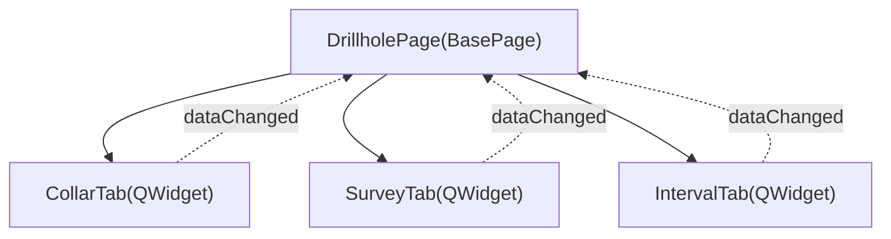

---
tags:
  - secinterp
  - code-walkthrough
  - gui
  - ui-pages
  - drillhole-tabs
aliases:
  - drillhole/
  - CollarTab
  - SurveyTab
  - IntervalTab
cssclass: secinterp-note
---

# `gui/ui/pages/drillhole/`

> [!abstract] Resumen en una línea
> Paquete de tabs del formulario de **sondajes**: `CollarTab`, `SurveyTab` e `IntervalTab`, descompuestos el **2026-09-20** del antiguo `drillhole_page.py` (451 líneas).

**Ruta**: `gui/ui/pages/drillhole/` (collar_tab 180 · survey_tab 144 · interval_tab 144 · `__init__` 9 líneas)
**Clase principal**: `CollarTab`, `SurveyTab`, `IntervalTab` (`QWidget`)
**Capa**: GUI · UI Pages
**Tags**: #secinterp #gui #ui-pages #drillhole-tabs

---

## 🎯 ¿Por qué existe este paquete?

| Problema | Solución |
|----------|----------|
| `drillhole_page.py` tenía 451 líneas mezclando 3 formularios + coordinación | Descomposición Widget/Composite (2026-09-20) |
| Un cambio en Collar obligaba a tocar un módulo gigante | Cada tab es un `QWidget` aislado |
| Señales difíciles de rastrear | Cada tab expone su propio `dataChanged` |

> [!important] Coordinador, no formulario
> `DrillholePage` (130 líneas) solo posee el `QTabWidget` y delega: no conoce los widgets de campos de cada tab.

---

## 🧬 Diagrama de relaciones



> [!tip] Cómo leer
> Flecha sólida = composición/importa; punteada = señal reemitida por el coordinador.

---

## 🧱 Sección principal — `CollarTab`

```python
class CollarTab(QWidget):
    dataChanged = pyqtSignal()

    def _toggle_xy_fields(self, checked: bool) -> None:
        enabled = not checked
        self.lbl_x.setEnabled(enabled)
        self.c_x.setEnabled(enabled)
```

| Símbolo | Rol |
|---------|-----|
| `chk_use_geom` | Si está activo, deshabilita X/Y vía `_toggle_xy_fields`. |
| `get_data()` | Devuelve `collar_layer/id/x/y/z/depth` + `use_geometry`. |
| `dump()/load()/reset()` | Protocolo de persistencia con claves `dh_*`. |

---

## 🧱 `SurveyTab` e `IntervalTab`

- **`SurveyTab`**: layer + id/depth/azimuth/inclination; `setFilters` moderno (`Qgis.LayerFilters`) con *fallback* legacy (`QgsMapLayerProxyModel.Filter`).
- **`IntervalTab`**: layer + id/from/to/lithology; mismo patrón de *fallback* de filtros.

> [!tip] Compatibilidad QGIS
> El `try/except (AttributeError, TypeError)` mantiene soporte entre versiones de la API de filtros.

---

## 🏛️ Patrones de diseño presentes

| Patrón | Dónde | Propósito |
|--------|-------|-----------|
| **Widget decomposition / Composite** | `DrillholePage` | Un coordinador + 3 tabs |
| **Observer** | `dataChanged` | Cada tab reemite cambios al page |
| **Protocol (dump/load/reset)** | tabs + page | Persistencia vía `dialog_settings_persistence` |

> [!warning] Punto de atención
> `_toggle_xy_fields(True)` se invoca al conectar; el estado inicial deshabilita X/Y.

---

## 🔗 Notas relacionadas

- [[drillhole_page]] — coordinador `DrillholePage`
- [[drillhole_service]] — consume los datos extraídos
- [[drillhole_extractor]] — adapter Extract
- [[ui_pages]] — catálogo de páginas
- [[Index]] — índice de la bóveda

---

*Nota de la bóveda SecInterp Code Walkthrough — v3.8.0*
