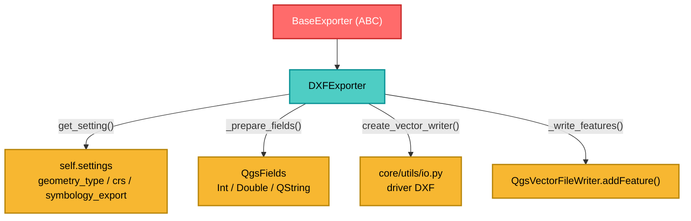

---
tags:
  - secinterp
  - code-walkthrough
  - exporters
  - dxf
  - vector
  - cad
aliases:
  - dxf_exporter.py
  - DXFExporter
cssclass: secinterp-note
---

# `exporters/dxf_exporter.py`

> [!abstract] Resumen en una línea
> Exporta **features a DXF** (formato CAD) con `QgsVectorFileWriter`, infiriendo el esquema de campos desde el primer feature y soportando exportación de simbología.

**Ruta**: `exporters/dxf_exporter.py` (126 líneas)
**Clase**: `DXFExporter(BaseExporter)`
**Capa**: Exporters (QGIS · Vector)
**Tags**: #secinterp #exporters #dxf #vector #cad

---

## 🎯 ¿Por qué existe este archivo?

El DXF es el formato que consumen los softwares CAD (AutoCAD, QCAD) para revisar secciones geológicas. Tiene particularidades que un shapefile/GPKG no tiene: capas CAD, simbología exportable y nombres de campos reservados.

| Problema | Solución |
|----------|----------|
| CAD no entiende atributos arbitrarios de QGIS | `_prepare_fields()` infiere tipos `Int`/`Double`/`QString` |
| El usuario quiere colores/simbología en CAD | `symbology_export` configurable en `create_vector_writer` |
| CRS ausente en los datos | Default `EPSG:4326` vía `get_setting("crs", ...)` |
| Escritores que quedan abiertos y bloquean el archivo | `del writer` para forzar el cierre |

> [!important] Nota arquitectónica
> Aunque `DXFExporter` existe, la **factory** `get_exporter()` mapea `.dxf` a `VectorExporter`. Ambos comparten casi el mismo código; `DXFExporter` queda como especialización directa (ver “Puntos de atención”).

---

## 🧬 Diagrama de relaciones



---

## 📦 Imports — lectura arquitectónica

```python
from qgis.core import (
    QgsCoordinateReferenceSystem, QgsFeature, QgsField,
    QgsFields, QgsVectorFileWriter, QgsWkbTypes,
)
from qgis.PyQt.QtCore import QMetaType

from sec_interp.core.utils import io as scu_io
from sec_interp.logger_config import get_logger
from .base_exporter import BaseExporter
```

| # | Observación |
|---|-------------|
| ① | `QgsVectorFileWriter` se importa **solo para comprobar errores** (`WriterError.NoError`) |
| ② | `QMetaType` (Qt6) reemplaza a `QVariant` para declarar tipos de campo |
| ③ | `scu_io.create_vector_writer` centraliza la creación del writer (driver `DXF`) |
| ④ | A diferencia de CSV/SVG, este módulo **sí** depende de QGIS |

---

## 🧱 `export()` — creación del writer y escritura

```python
def export(self, output_path, features_data, layer_name=None) -> bool:
    if not features_data:
        return False
    try:
        geometry_type = self.get_setting("geometry_type", QgsWkbTypes.Type.LineString)
        crs = self.get_setting("crs", QgsCoordinateReferenceSystem("EPSG:4326"))
        symb_mode = self.get_setting(
            "symbology_export", QgsVectorFileWriter.SymbologyExport.NoSymbology)

        fields = self._prepare_fields(features_data)
        writer = scu_io.create_vector_writer(
            output_path, crs, fields, geometry_type,
            layer_name=layer_name, symbology_export=symb_mode)

        if writer.hasError() != QgsVectorFileWriter.WriterError.NoError:
            logger.error(f"Failed to create DXF writer: {writer.errorMessage()}")
            return False

        self._write_features(writer, features_data, fields)
        del writer  # writer is closed when object is deleted or goes out of scope
    except Exception:
        logger.exception(f"DXF export failed for {output_path}")
        return False
    else:
        return True
```

| Setting | Default | Rol |
|---------|---------|-----|
| `geometry_type` | `QgsWkbTypes.Type.LineString` | Tipo de geometría del DXF |
| `crs` | `EPSG:4326` | Sistema de referencia |
| `symbology_export` | `NoSymbology` | Exportar simbología (colores) a CAD |

> [!warning] El writer se cierra con `del writer`
> `QgsVectorFileWriter` **no** tiene un `close()` explícito útil: se cierra al destruirse. `del writer` decrementa el refcount y fuerza el cierre antes de retornar `True`, evitando que el archivo quede bloqueado.

---

## 🧱 `_write_features()` y `_prepare_fields()`

```python
def _write_features(self, writer, features_data, fields) -> None:
    for data in features_data:
        feature = QgsFeature(fields)
        if "geometry" in data:
            feature.setGeometry(data["geometry"])
        if "attributes" in data:
            attrs = data["attributes"]
            feature.setAttributes([attrs.get(f.name()) for f in fields])
        writer.addFeature(feature)

def _prepare_fields(self, features_data) -> QgsFields:
    fields = QgsFields()
    if not features_data or not isinstance(features_data, list):
        return fields
    first_item = features_data[0]
    if not isinstance(first_item, dict) or "attributes" not in first_item:
        return fields
    for key, value in first_item["attributes"].items():
        if isinstance(value, int):
            fields.append(QgsField(key, QMetaType.Type.Int))
        elif isinstance(value, float):
            fields.append(QgsField(key, QMetaType.Type.Double))
        else:
            fields.append(QgsField(key, QMetaType.Type.QString))
    return fields
```

| Detalle | Comportamiento |
|---------|----------------|
| `setAttributes([...])` | Mapea por **nombre de campo**, en el orden de `fields`; ausentes → `None` |
| `addFeature()` | Retorno booleano **ignorado** (un feature fallido no aborta el resto) |
| Tipos inferidos | `int`→`Int`, `float`→`Double`, resto→`QString` |
| Fuente del esquema | Solo el **primer** feature (asume esquema homogéneo) |

> [!important] Para DXF, `create_vector_writer` ignora estos fields
> En `core/utils/io.py` (líneas 76-82), para `.dxf` se hace `effective_fields = QgsFields()` para evitar conflictos con nombres CAD reservados. Los atributos **no** se materializan en el DXF; la geometría sí.

---

## 🏛️ Patrones de diseño presentes

| Patrón | Dónde | Propósito |
|--------|-------|-----------|
| **Template Method** | `BaseExporter` | Contrato común + `get_setting()` |
| **Strategy** | `DXFExporter` | Estrategia vectorial específica de CAD |
| **Factory Method** | `scu_io.create_vector_writer` | Elige driver por extensión |
| **Schema Inference** | `_prepare_fields` | Deriva el esquema del primer registro |
| **Fail-safe** | `try/except` + `logger.exception` | No propaga errores de escritura |

---

## 🧾 Resumen de la API

| Símbolo | Firma / Hereda | Uso típico |
|---------|----------------|------------|
| `DXFExporter` | `class DXFExporter(BaseExporter)` | Exportador CAD |
| `get_supported_extensions()` | `-> [".dxf"]` | Validación de extensión |
| `export(output_path, features_data, layer_name=None)` | `-> bool` | Escribe lista de features |
| `_write_features(writer, features_data, fields)` | privado | Itera y añade features |
| `_prepare_fields(features_data)` | privado | Infiere `QgsFields` |

---

## 👀 Observaciones y notas

> [!success] Fortalezas
> - **Esquema automático**: no exige declarar campos a mano.
> - **Tolerante a features sin geometría o sin atributos**.
> - **Simbología CAD** opcional y **cierre explícito** del writer.

> [!warning] Puntos de atención
> - **Duplicación con `VectorExporter`** (126 vs 122 líneas, casi idénticas).
> - La factory `get_exporter('.dxf')` devuelve `VectorExporter`, no `DXFExporter`; este se instancia de forma directa. Deuda técnica a consolidar.
> - El retorno de `writer.addFeature(feature)` se descarta: features pueden perderse en silencio.
> - No valida `output_path`; delega en `validate_export_path()` del orquestador.
> - `except Exception` silencia errores de programación devolviendo `False`.

> [!question] Preguntas abiertas
> - ¿Unificar `DXFExporter` y `VectorExporter` en una sola clase con `symbology_export` opcional?
> - ¿Contar features escritos y avisar si `addFeature` falla?

---

## 🔗 Notas relacionadas

- [[Index]] — índice de la bóveda
- [[base_exporter]] — contrato abstracto
- [[vector_exporter]] — implementación genérica casi idéntica
- [[layer_exporters]] — capa de exporters especializados
- [[export_package]] — orquestador que enruta `.dxf`
- [[controller]] — produce las geometrías

---

*Nota de la bóveda SecInterp Code Walkthrough — v3.8.0*
