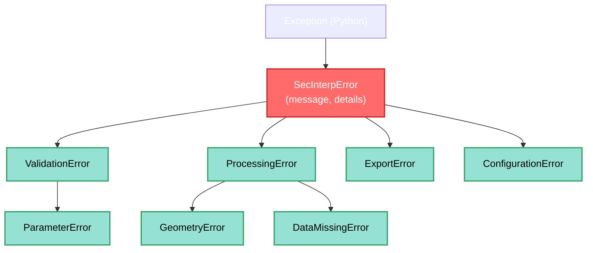
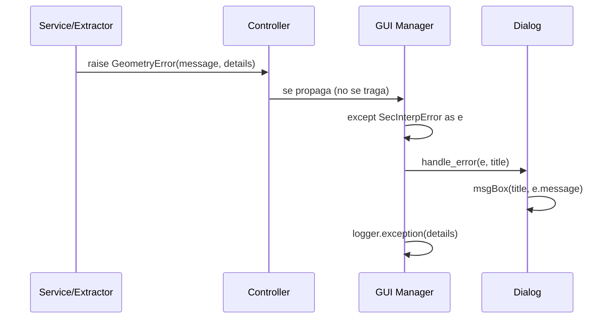

---
tags:
  - secinterp
  - code-walkthrough
  - core
  - exceptions
  - error-handling
aliases:
  - exceptions.py
  - SecInterpError
  - Exception Hierarchy
cssclass: secinterp-note
---

# 12 — `core/exceptions.py`

> [!abstract] Resumen en una línea
> Define la **jerarquía de excepciones** del plugin: una raíz `SecInterpError` con mensaje + detalles y 7 subclases tipadas para distinguir validación, procesamiento, geometría, datos y configuración.

**Ruta**: `core/exceptions.py` (52 líneas)
**Clase raíz**: `SecInterpError(Exception)`
**Capa**: Core · Domain
**Tags**: #secinterp #core #exceptions #error-handling

---

## 🎯 ¿Por qué existe este archivo?

Sin jerarquía, todo son `ValueError`/`RuntimeError` genéricos. Este módulo resuelve:

| Problema | Solución de la jerarquía |
|----------|--------------------------|
| No sabes si un error es de validación o de procesamiento | Tipos específicos (`ValidationError` vs `ProcessingError`) |
| Quieres atrapar solo errores de geometría | `except GeometryError:` sin tragar el resto |
| Falta contexto para diagnosticar | `details: dict` con capa, campo, valor |
| Mensajes no traducibles | `message` pasa por `self.tr()` en el raise |

> [!important] Separación de responsabilidades
> Las excepciones **no muestran diálogos**. Solo transportan `message + details`. La UI (`PreviewManager`, `ExportManager`) decide cómo presentarlas.

---

## 🧬 Jerarquía



---

## 🧱 Clase raíz — `SecInterpError`

```python
class SecInterpError(Exception):
    """Base class for all SecInterp-specific exceptions."""

    def __init__(self, message: str, details: dict | None = None) -> None:
        super().__init__(message)
        self.message = message
        self.details = details or {}
```

| Atributo | Propósito |
|----------|-----------|
| `message` | Texto ya traducible, listo para UI |
| `details` | Dict opcional con contexto (p. ej. `{"layer": "geology", "field": "dip"}`) |
| `super().__init__(message)` | Mantiene compatibilidad con `str(e)` |

> [!tip] Patrón Rich Exception
> `message` para el usuario + `details` para el log/diagnóstico. Ejemplo:
> ```python
> raise GeometryError(
>     self.tr("Line geometry is not valid"),
>     {"layer": line_lyr.name()}   # ← diagnóstico
> )
> ```

---

## 🧱 Subclases

| Excepción | Padre | Cuándo se lanza | Ejemplos |
|-----------|-------|-----------------|----------|
| `ValidationError` | `SecInterpError` | Validación de entrada falla | `PreviewParams.validate()`, `GeologyExtractor` (band < 1) |
| `ParameterError` | `ValidationError` | Parámetro de servicio inválido | Parámetros de sonda/extracción |
| `ProcessingError` | `SecInterpError` | Fallo en generación de perfil | `controller._process_topography` sin capas |
| `GeometryError` | `ProcessingError` | Geometría nula/inválida | `profile_extractor`, `geometry.py` |
| `DataMissingError` | `ProcessingError` | Datos requeridos ausentes | Capa sin features, campo no encontrado |
| `ExportError` | `SecInterpError` | Export a disco falla | `interpretation_3d_exporter`, writer error |
| `ConfigurationError` | `SecInterpError` | Config/settings rotos | `ConfigService` |

> [!note] `ParameterError` vs `ValidationError`
> En la práctica ambas se usan para params. `ParameterError` es un refinamiento
> de `ValidationError` para distinguir "parámetro de servicio" de "entrada de UI".

> [!important] Granularidad de captura
> ```python
> try:
>     params.validate()
> except ValidationError as e:      # solo validación
>     dlg.handle_error(e, self.tr("Configuration Error"))
> except ProcessingError as e:       # solo procesamiento
>     logger.warning(f"Processing failed: {e.message} {e.details}")
> except SecInterpError as e:        # cualquier error del plugin
>     dlg.handle_error(e, self.tr("Unexpected Error"))
> except Exception as e:             # no-SecInterp (bug)
>     logger.exception("Unexpected error")
> ```
> Ver [[controller]] para el `try` de 4 niveles en `_get_and_validate_inputs`.

---

## 🔄 Ciclo de propagación



> [!tip] Por qué no se tragan en el core
> El core **no conoce** la UI. Debe propagar. La GUI decide si muestra `critical`,
> `warning` o solo loguea.

---

## 🏛️ Patrones de diseño presentes

| Patrón | Dónde | Propósito |
|--------|-------|-----------|
| **Exception Hierarchy** | 7 subclases | Captura por granularidad |
| **Rich Exception** | `message + details` | Usuario vs diagnóstico |
| **Sentinel Root** | `SecInterpError` | Distinguir errores propios vs Python |

---

## 🧾 Resumen de la API

| Símbolo | Hereda | Uso típico |
|---------|--------|------------|
| `SecInterpError` | `Exception` | `except SecInterpError` (cualquiera del plugin) |
| `ValidationError` | `SecInterpError` | Validación de `PreviewParams` / extractors |
| `ParameterError` | `ValidationError` | Parámetro de servicio |
| `ProcessingError` | `SecInterpError` | Fallo de generación (controller) |
| `GeometryError` | `ProcessingError` | Geometría inválida |
| `DataMissingError` | `ProcessingError` | Datos/capa faltante |
| `ExportError` | `SecInterpError` | Fallo de export |
| `ConfigurationError` | `SecInterpError` | Config corrupta |

---

## 👀 Observaciones y notas

> [!success] Fortalezas
> - Jerarquía clara y **tipada** → `except` preciso.
> - `details` evita tener que parsear `str(e)`.
> - Raíz común simplifica catch-all.

> [!warning] Puntos de atención
> - `details` es `dict[str, Any]` libre — conviene tiparlo o documentar claves comunes (`layer`, `field`, `value`).
> - Algunas subclases son `pass` (sin comportamiento) — correcto pero no aportan metadata extra.
> - `ConfigurationError` apenas se usa; podría crecer con el sistema de settings.

> [!question] Preguntas abiertas
> - ¿Añadir `code: str` (código de error i18n) para mapear a `self.tr()`?
> - ¿Normalizar `details` con una dataclass `ErrorDetails`?

---

## 🔗 Notas relacionadas

- [[Index]] — índice de la bóveda
- [[controller]] — donde estas excepciones se lanzan y propagan
- [[domain]] — `PreviewParams.validate()` (origen de `ValidationError`)
- [[validation]] — validadores que lanzan `ValidationError` / `ParameterError`
- [[sec_interp_plugin]] — manejo final en la UI

---

*Nota 12 de la bóveda SecInterp Code Walkthrough — v3.8.0*
