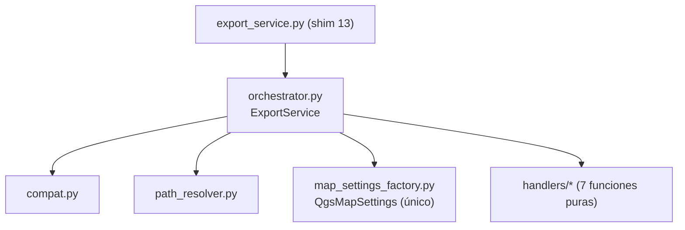

---
tags:
  - secinterp
  - code-walkthrough
  - core
  - export-package
  - orchestrator
aliases:
  - export/ package
  - Paquete export
  - ExportService
cssclass: secinterp-note
---

# `core/services/export/`

> [!abstract] Resumen en una línea
> Paquete que **descompone** la antigua exportación monolítica en un orquestador + resolutor de rutas + handlers por tipo de dato, con `export_service.py` como shim de compatibilidad.

**Ruta**: `core/services/export/` (paquete, 11 módulos · ~920 líneas)
**Clase principal**: `ExportService` (`orchestrator.py`, 207 líneas)
**Capa**: Core · Services
**Tags**: #secinterp #core #export-package #orchestrator

---

## 🎯 ¿Por qué existe este archivo?

El 2026-09-20 se dividió el antiguo `export_service.py` de **645 líneas**. Hoy `core/services/export_service.py` es un **shim de 13 líneas** que solo re-exporta `ExportService` para no romper los imports existentes.

| Problema (antes) | Solución (paquete `export/`) |
|------------------|------------------------------|
| Un archivo hacía orquestación + rutas + QGIS + 12 exporters | Un módulo por responsabilidad |
| Imposible testear sin arrastrar todo | Handlers puros + factory aislada |
| API privada usada por tests | `compat.py` con wrappers `_export_*` |

> [!important] Frontera Core
> Los handlers **no importan `qgis`**. El único módulo que importa `QgsMapSettings` es `map_settings_factory.py`, aislándolo del resto.

---

## 🧬 Diagrama de relaciones



---

## 🧱 `orchestrator.py` — la fachada

`ExportService(ExportServiceCompatMixin)` valida opciones (`any()`), exige `profile_data` y `line_layer` (`_resolve_layers`), deriva `.shp`/`.gpkg`/`.dxf` de `default_format` y enruta con un **dict de routing** por opción `exp_*`:

```python
handlers = {  # routing dict: exp_topo, exp_geol, exp_struct,
    "exp_topo": topo_handler,   #  exp_drill, exp_drill_3d, exp_interp
    "exp_geol": lambda: geo_h.export_geology(...),
}
for opt, handler in handlers.items():
    if options.get(opt, True):
        handler()
```

---

## 🧩 Módulos y handlers

| Módulo | Líneas | Responsabilidad |
|--------|:------:|-----------------|
| `path_resolver.py` | 60 | `get_profile_name()` sanea `/` y `\`; `resolve_export_path()` aplica `naming_pattern` y decide GPKG (`profile.gpkg`) vs carpeta contenedora |
| `map_settings_factory.py` | 34 | Único import de `qgis.core.QgsMapSettings`; `create_map_settings()` |
| `compat.py` | 129 | Mixin con wrappers legacy `_export_*` y `_get_export_path` para tests |
| `handlers/topography.py` | 63 | `export_topography` → CSV `topo_profile` + vector `profile_line` |
| `handlers/geology.py` | 66 | `export_geology` → CSV + `GeologyVectorExporter` |
| `handlers/structures.py` | 77 | `export_structures` → CSV + `StructureVectorExporter` |
| `handlers/drillholes.py` | 70 | `export_drillholes` → trazas + intervalos 2D |
| `handlers/drillholes_3d.py` | 82 | `export_drillholes_3d` → tabla declarativa de 4 tareas (real/proyectado) |
| `handlers/interpretations.py` | 93 | `export_interpretations` → 2D + 3D gated por `AccessControlService.can_export_3d()` |
| `handlers/axes.py` | 39 | `export_axes` → `AxesVectorExporter` |

---

## 🏛️ Patrones de diseño presentes

| Patrón | Dónde | Propósito |
|--------|-------|-----------|
| **Facade / Orchestrator** | `ExportService` | Una API sobre 7 handlers |
| **Strategy por formato** | `*.export(...)` | SHP/GPKG/DXF/CSV intercambiables |
| **Registry / routing dict** | `handlers` | Dispatch declarativo por `exp_*` |
| **Backward-compat shim** | `export_service.py` + `compat.py` | No romper imports ni tests |

---

## 🔗 Notas relacionadas

- [[export_service]] — nota del antiguo monolito (contexto histórico)
- [[base_exporter]] / [[vector_exporter]] — contrato e implementaciones
- [[access_control_service]] — gate del 3D
- [[controller]] — origen de datos y settings
- [[Index]] — índice de la bóveda

---

*Nota de la bóveda SecInterp Code Walkthrough — v3.8.0*
