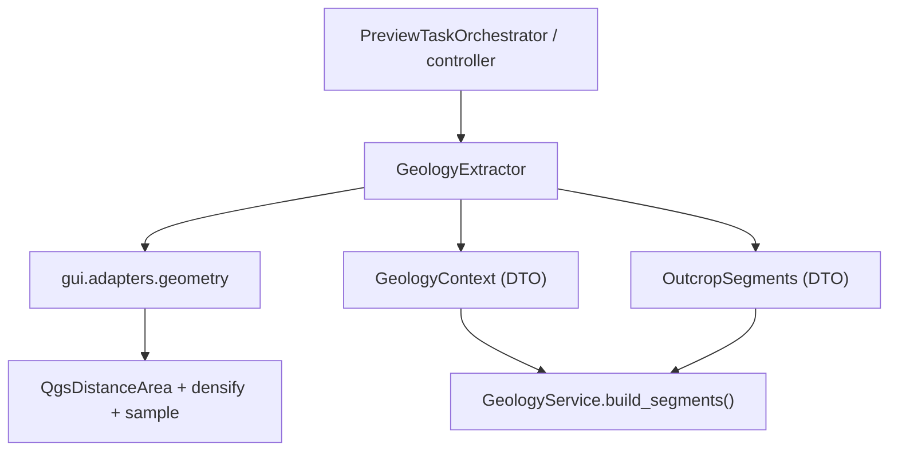

---
tags:
  - secinterp
  - code-walkthrough
  - gui
  - adapters
  - geology
aliases:
  - geology_extractor.py
  - GeologyExtractor
  - GeologyContext
cssclass: secinterp-note
---

# `gui/adapters/geology_extractor.py`

> [!abstract] Resumen en una línea
> Adapter **Extract** de geología: lee línea + DEM + outcrops, densifica el perfil maestro e intersecta los polígonos de afloramiento con la línea → `GeologyContext` 100 % desacoplado.

**Ruta**: `gui/adapters/geology_extractor.py` (235 líneas)
**Clase**: `GeologyExtractor`
**Capa**: GUI · Adapters (Extract phase)
**Tags**: #secinterp #gui #adapters #geology

---

## 🎯 ¿Por qué existe este archivo?

| Problema | Solución |
|----------|----------|
| `GeologyService` (core) no puede tocar `QgsGeometry` | El adapter produce WKT + tuplas |
| Hay que muestrear topografía con resolución del raster | `_generate_master_profile` densifica por `rasterUnitsPerPixelX()` y muestrea con `dataProvider().sample()` |
| Hay que conocer qué tramos de la línea cruzan cada unidad | `line_geom.intersection(outcrop_geom)` → segmentos con distancias |
| Los errores deben ser claros antes de computar | `_validate_inputs` lanza `DataMissingError` / `ValidationError` |

> [!important] Frontera Extract
> El único módulo de geología que importa `qgis.core`. El resultado, `GeologyContext`, solo contiene tuplas `(dist, elev)`, `(x, y)` y WKT.

---

## 🧬 Diagrama de relaciones



> [!tip] Cómo leer
> `GeologyExtractor` combina la geometría (adapter `geometry`) con las capas y devuelve dos DTOs que el servicio puro consume.

---

## 📦 Imports — lectura arquitectónica

```python
from qgis.core import (QgsDistanceArea, QgsFeatureRequest, QgsGeometry,
                       QgsPointXY, QgsRasterLayer, QgsVectorLayer)
from qgis.PyQt.QtCore import QCoreApplication
from sec_interp.core import utils as scu
from sec_interp.core.domain import DomainGeometry
from sec_interp.core.domain.task_inputs import GeologyContext, OutcropSegments
from sec_interp.core.exceptions import DataMissingError, GeometryError, ValidationError
from sec_interp.gui.adapters import geometry
```

| # | Observación |
|---|-------------|
| ① | Importa los DTOs de `core.domain.task_inputs`, no los redefine. |
| ② | Usa `gui.adapters.geometry` como caja de herramientas geométricas compartida. |
| ③ | `scu.extract_feature_attributes` sanea los atributos de cada outcrop. |
| ④ | `QCoreApplication` se usa en `tr()` para i18n. |

---

## 🧱 `extract_context()` — orquestación de la extracción

```python
def extract_context(self, line_lyr, raster_lyr, outcrop_lyr,
                    outcrop_name_field, band_number=1) -> GeologyContext:
    self._validate_inputs(line_lyr, raster_lyr, outcrop_lyr, outcrop_name_field, band_number)
    line_geom, line_start = self._extract_line_info(line_lyr)
    crs = line_lyr.crs()
    da = geometry.create_distance_area(crs)
    master_profile_data, master_grid_dists_raw = self._generate_master_profile(...)
    master_grid_dists = [(d, (pt.x(), pt.y()), e) for d, pt, e in master_grid_dists_raw]
    outcrops = [OutcropSegments(unit_name=..., attributes=..., segments=...) ...]
    return GeologyContext(master_profile_data=..., master_grid_dists=..., outcrops=..., tolerance=0.001)
```

| Salida | Contenido |
|--------|-----------|
| `master_profile_data` | `[(distancia, elevación)]` del perfil topográfico |
| `master_grid_dists` | `[(distancia, (x, y), elevación)]` para interpolación |
| `outcrops` | Lista de `OutcropSegments` con tramos `(d0, d1, wkt)` |
| `tolerance` | `0.001` fijo para el muestreo de intersecciones |

---

## 🧱 `_validate_inputs()` — fail-fast

| Comprobación | Excepción |
|--------------|-----------|
| Línea y raster válidos | `DataMissingError` |
| Outcrop (si existe) válido | `DataMissingError` |
| `band_number >= 1` | `ValidationError` |
| `band_number <= raster.bandCount()` | `ValidationError` |
| `outcrop_name_field` existe (`indexFromName != -1`) | `ValidationError` |

> [!tip] Validación temprana
> Todos los errores de entrada se detectan **antes** de densificar o intersectar, evitando trabajo costoso e inútil.

---

## 🧱 `_generate_master_profile()` — densificar y muestrear

```python
interval = raster_lyr.rasterUnitsPerPixelX()
master_densified = geometry.densify_line_by_interval(line_geom, interval)
grid_points = geometry.get_line_vertices(master_densified)
...
for i, pt in enumerate(grid_points):
    if i > 0:
        current_dist += da.measureLine(grid_points[i - 1], pt)
    val, ok = raster_lyr.dataProvider().sample(pt, band_number)
    elev = val if ok else 0.0
```

| Detalle | Valor |
|---------|-------|
| Intervalo | Resolución nativa del raster (`rasterUnitsPerPixelX`) |
| Fallback | Si densificar falla (`AttributeError/ValueError/TypeError`) usa los vértices originales |
| Distancia | Acumulada con `QgsDistanceArea.measureLine` (elipsoidal) |
| Elevación | `sample()`; si falla, `0.0` |

---

## 🧱 `_extract_outcrop_data()` + `_intersect_outcrop()`

```python
request = QgsFeatureRequest().setFilterRect(line_geom.boundingBox())
for feature in outcrop_lyr.getFeatures(request):
    attrs = scu.extract_feature_attributes(feature)
    unit_name = str(feature[outcrop_name_field])  # except KeyError -> "Unknown"
    outcrop_data.append({"wkt": feature.geometry().asWkt(), "attrs": attrs, "unit_name": unit_name})
```

```python
outcrop_geom = QgsGeometry.fromWkt(item["wkt"])
intersection = line_geom.intersection(outcrop_geom)
if intersection.isEmpty():
    return []
for seg_geom in geometry.extract_lines_from_geometry(intersection):
    dist_start, dist_end = geometry.calculate_segment_range(seg_geom, line_start, da)
    segments.append((dist_start, dist_end, seg_geom.asWkt()))
```

> [!note] WKT como moneda de cambio
> El polígono se convierte a WKT al extraer y de vuelta a `QgsGeometry` solo para intersectar; el resultado vuelve a WKT. El core nunca ve geometría QGIS.

---

## 🏛️ Patrones de diseño presentes

| Patrón | Dónde | Propósito |
|--------|-------|-----------|
| **Adapter / Bridge** | `GeologyExtractor` | QGIS → DTOs |
| **Facade** | `extract_context` | Un solo punto de entrada |
| **Fail-fast** | `_validate_inputs` | Errores antes de computar |
| **Graceful degradation** | fallback de densificación | Robusto ante rasters raros |
| **Template method** | `_generate_master_profile` | Pasos fijos de muestreo |

---

## 🧾 Resumen de la API

| Símbolo | Firma | Uso |
|---------|-------|-----|
| `extract_context` | `(line_lyr, raster_lyr, outcrop_lyr, outcrop_name_field, band_number=1) -> GeologyContext` | Punto de entrada |
| `tr` | `(message) -> str` | i18n |
| `_validate_inputs` | `(...) -> None` | Validación fail-fast |
| `_extract_line_info` | `(line_lyr) -> (QgsGeometry, QgsPointXY)` | Línea + inicio |
| `_generate_master_profile` | `(...) -> (profile, grid)` | Perfil maestro |
| `_extract_outcrop_data` | `(line_geom, outcrop_lyr, field) -> list[dict]` | Outcrops en bbox |
| `_intersect_outcrop` | `(...) -> list[tuple[float, float, str]]` | Tramos por outcrop |

---

## 👀 Observaciones y notas

> [!success] Fortalezas
> - `GeologyContext` es totalmente serializable (tuplas/WKT).
> - Validación temprana y mensajes traducibles.
> - Fallback si la densificación falla.

> [!warning] Puntos de atención
> - `tolerance=0.001` está **hardcodeado** en `extract_context`; no viene de `params`.
> - La intersección se hace con `QgsGeometry` real; en polígonos enormes el coste puede subir.
> - `unit_name` cae a `"Unknown"` solo ante `KeyError`; valores nulos se vuelven `"None"` en texto.

> [!question] Preguntas abiertas
> - ¿Debería `tolerance` ser configurable desde `PreviewParams`?
> - ¿Conviene filtrar outcrops con `intersects` exacto además del bbox?

---

## 🔗 Notas relacionadas

- [[geology_service]] — consume `GeologyContext` y `OutcropSegments`
- [[adapters]] — visión de conjunto de la fase Extract
- [[domain]] — definición de `GeologyContext` / `OutcropSegments`
- [[tasks]] — `GeologyGenerationTask` transporta este contexto al hilo
- [[controller]] — orquesta extracción + servicio
- [[Index]] — índice de la bóveda

---

*Nota de la bóveda SecInterp Code Walkthrough — v3.8.0*
