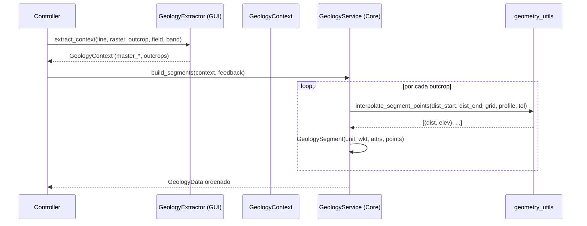

---
tags:
  - secinterp
  - code-walkthrough
  - core
  - geology
  - services
aliases:
  - geology_service.py
  - GeologyService
cssclass: secinterp-note
---

# 14 — `core/services/geology_service.py`

> [!abstract] Resumen en una línea
> Es el **servicio puro de geología** (fase *Compute*): a partir de un `GeologyContext` desacoplado, interpola elevaciones y construye `GeologySegment`s ordenados — **sin tocar QGIS**.

**Ruta**: `core/services/geology_service.py` (87 líneas)
**Clase**: `GeologyService(IGeologyService)`
**Interface**: `IGeologyService` → `build_segments(context, feedback=None) -> GeologyData`
**Capa**: Core · Services
**Tags**: #secinterp #core #geology #services

---

## 🎯 ¿Por qué existe este archivo?

La geología llega como **polígonos QGIS** que intersectan la línea de sección. El adapter `GeologyExtractor` ya hizo el trabajo sucio (densificar, intersectar, extraer atributos). Este servicio solo **interpola** y **arma** los segmentos:

| Entrada (adapter) | Salida (core) |
|-------------------|---------------|
| `GeologyContext` con `master_profile_data`, `master_grid_dists`, `outcrops: list[OutcropSegments]` | `GeologyData = list[GeologySegment>` ordenados por distancia |

> [!important] QGIS-agnóstico total
> No importa `qgis.*`. Solo usa `interpolate_segment_points` y `interpolate_elevation` (matemática pura) + `performance_monitor`.

---

## 🧬 Relación Extract → Compute



---

## 🧱 Interface — `IGeologyService`

```python
class IGeologyService(ABC):
    @abstractmethod
    def build_segments(self, context: GeologyContext, feedback: Any | None = None) -> Any:
        """Build geological segments from a detached context."""
```

| Parámetro | Rol |
|-----------|-----|
| `context` | Salida de `GeologyExtractor` (sin QGIS) |
| `feedback` | Objeto opcional con `isCanceled()` / `setProgress()` (QgsFeedback en producción) |

> [!tip] Abstracción para tests
> Mockeas `IGeologyService.build_segments` y el controller no lo nota.

---

## 🧱 Servicio — `build_segments()`

```python
class GeologyService(IGeologyService):
    @performance_monitor
    def build_segments(self, context: GeologyContext, feedback: Any | None = None) -> GeologyData:
        segments: list[GeologySegment] = []
        total = len(context.outcrops)

        for i, outcrop in enumerate(context.outcrops):
            if feedback and feedback.isCanceled():
                return []

            for dist_start, dist_end, wkt in outcrop.segments:
                segment_points = interpolate_segment_points(
                    dist_start, dist_end,
                    context.master_grid_dists,
                    context.master_profile_data,
                    context.tolerance,
                )
                segments.append(
                    GeologySegment(
                        unit_name=outcrop.unit_name,
                        geometry_wkt=wkt,
                        attributes=outcrop.attributes,
                        points=[(float(d), float(e)) for d, e in segment_points],
                    )
                )

            if feedback:
                feedback.setProgress((i / total) * 100)

        segments.sort(key=lambda x: x.points[0][0] if x.points else 0)
        return segments
```

### Paso a paso

| # | Qué hace |
|---|----------|
| 1 | Itera `outcrops` del contexto |
| 2 | Verifica `feedback.isCanceled()` → aborta si el usuario canceló |
| 3 | Por cada `(dist_start, dist_end, wkt)` interpola puntos con `interpolate_segment_points` |
| 4 | Crea `GeologySegment` con WKT original y puntos `(dist, elev)` |
| 5 | Notifica progreso `setProgress(i/total)` |
| 6 | Ordena por distancia inicial |

> [!note] `wkt` se preserva tal cual
> El servicio **no modifica** la geometría WKT; solo añade `points` para render.

### Helper — `interpolate_segment_points()`

En `core/utils/geometry_utils/processing.py`:

```python
def interpolate_segment_points(
    dist_start, dist_end, master_grid_dists, master_profile_data, tolerance
) -> list[tuple[float, float]]:
    inner_points = [
        (d, e) for d, _, e in master_grid_dists
        if dist_start + tolerance < d < dist_end - tolerance
    ]
    elev_start = interpolate_elevation(master_profile_data, dist_start)
    elev_end   = interpolate_elevation(master_profile_data, dist_end)
    return [(dist_start, elev_start), *inner_points, (dist_end, elev_end)]
```

| Entrada | Deriva de |
|---------|-----------|
| `master_profile_data` | `[(dist, elev)]` del perfil maestro |
| `master_grid_dists` | `[(dist, (x,y), elev)]` de la grilla densificada |
| `tolerance` | `0.001` desde el contexto |

> [!tip] Idea
> Copia los puntos de grilla que caen dentro, y coloca start/end interpolados.
> Así el segmento **sigue la topografía** sin recalcularla.

---

## 🏛️ Patrones de diseño presentes

| Patrón | Dónde | Propósito |
|--------|-------|-----------|
| **Strategy pura (Compute)** | `build_segments` | Cálculo sin QGIS |
| **Template de progreso** | `feedback` | Cancelación y % |
| **Value Object** | `GeologyContext` / `OutcropSegments` | Datos inmutables de entrada |
| **Decorator** | `@performance_monitor` | Trazas sin ensuciar la lógica |

---

## 🧾 Resumen de la API

| Símbolo | Firma |
|---------|-------|
| `IGeologyService.build_segments` | `(context: GeologyContext, feedback?) -> GeologyData` |
| `GeologyService.build_segments` | igual, con interpolación y sort |
| `interpolate_segment_points` | `(dist_start, dist_end, grid, profile, tol) -> list[(dist,elev)]` |

---

## 👀 Observaciones y notas

> [!success] Fortalezas
> - Core **mínimo** (87 líneas) y focalizado.
> - Sin QGIS → testeable con `GeologyContext` fabricado.
> - Respeta feedback de cancelación.

> [!warning] Puntos de atención
> - No valida `context` (asume que el extractor ya lo hizo).
> - `feedback` es `Any` (acoplado a la interfaz QGIS `QgsFeedback`).
> - Ordenar solo por `points[0][0]` podría colisionar si hay segmentos con misma distancia.

> [!question] Preguntas abiertas
> - ¿Añadir `tolerance` como parámetro configurable del proyecto?
> - ¿Enriquecer `GeologySegment` con `dist_start/dist_end` además de `points`?

---

## 🔗 Notas relacionadas

- [[Index]] — índice de la bóveda
- [[controller]] — orquesta `_process_geology` (cache + Extract/Compute)
- [[domain]] — `GeologyContext`, `GeologySegment`, `GeologyData`
- [[profile_service]] — extracción del perfil maestro (base topográfica)
- [[adapters]] — `GeologyExtractor` (productor del contexto)
- `core/utils/geometry_utils/processing.py` — densificación/interpolación

---

*Nota 14 de la bóveda SecInterp Code Walkthrough — v3.8.0*
