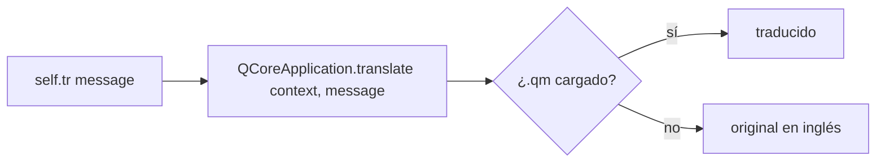

---
tags:
  - secinterp
  - code-walkthrough
  - core
  - utils
  - i18n
aliases:
  - i18n.py
  - TranslatableMixin
cssclass: secinterp-note
---

# `core/utils/i18n.py`

> [!abstract] Resumen en una línea
> Helper de **internacionalización** QGIS-agnóstico: un `TranslatableMixin` que expone `self.tr()` sin heredar de `QObject`.

**Ruta**: `core/utils/i18n.py` (30 líneas)
**Clase**: `TranslatableMixin`
**Capa**: Core · Utils
**Tags**: #secinterp #core #utils #i18n

---

## 🎯 ¿Por qué existe este archivo?

Traducir en QGIS se hace con `QCoreApplication.translate(context, message)`. Pero:

| Problema | Solución de `TranslatableMixin` |
|----------|---------------------------------|
| Clases del core **no heredan** de `QObject` → no tienen `self.tr()` | El mixin lo provee |
| Context repetido y propenso a error | Usa `self.__class__.__name__` como contexto automáticamente |
| Importar `QCoreApplication` en cada clase | Centralizado en un solo lugar |

> [!important] QGIS-agnóstico (casi)
> Importa `qgis.PyQt.QtCore.QCoreApplication` solo para `translate()`. No toca widgets ni `Qgs*`.

---

## 🧱 La clase — `TranslatableMixin`

```python
class TranslatableMixin:
    """Mixin to provide a standardized tr() method for translations."""

    def tr(self, message: str) -> str:
        return QCoreApplication.translate(self.__class__.__name__, message)
```

| Detalle | Explicación |
|---------|-------------|
| **`self.__class__.__name__`** | Context = nombre de la clase concreta (p. ej. `"GeologyService"`, `"SecInterp"`) |
| **`QCoreApplication.translate`** | Entry point estándar de Qt para traducciones |
| **`# type: ignore[no-any-return]`** | Silencia a mypy (firma de Qt) |

> [!tip] Context por clase
> Permite traducciones **específicas por clase** sin colisiones. El `.ts` agrupa por ese context.
> ```python
> # Extract de Qt Linguist
> <context>
>     <name>GeologyService</name>
>     <message><source>No topographic profile data</source></message>
> </context>
> ```

### Uso típico

```python
from sec_interp.core.utils.i18n import TranslatableMixin

class ProfileController(TranslatableMixin):
    def _process_topography(self, params, ...):
        if not line_lyr:
            raise ProcessingError(self.tr("Required layers for topography are missing."))
```

```python
class DrillholeService(TranslatableMixin):
    except (ValueError, TypeError) as e:
        logger.exception(self.tr("Data error in hole {0}: {1}").format(hole_id, e))
```

### Alternativa en adapters GUI

Los adapters **sí** heredan de `QObject` o tocan `Qgs*`, así que pueden usar `QCoreApplication.translate` directo:

```python
# gui/adapters/profile_extractor.py
def tr(self, message: str) -> str:
    return QCoreApplication.translate("ProfileExtractor", message)
```

> [!note] Mismo efecto, distinta vía
> GUI adapters usan un `tr()` local; las clases del core usan el mixin. Ambos llegan al mismo `translate`.

---

## 🔄 Ciclo de traducción



> [!tip] Dónde se cargan los `.qm`
> Ver [[sec_interp_plugin]]: `QTranslator.load(SecInterp_<locale>.qm)` en `SecInterp.__init__`.

---

## 🏛️ Patrones de diseño presentes

| Patrón | Dónde | Propósito |
|--------|-------|-----------|
| **Mixin** | `TranslatableMixin` | Añade `tr()` sin herencia múltiple de Qt |
| **Template (context)** | `self.__class__.__name__` | Context automático por subclase |

---

## 🧾 Resumen de la API

| Símbolo | Firma | Uso |
|---------|-------|-----|
| `TranslatableMixin.tr(message: str)` | `-> str` | `self.tr("...")` en cualquier clase core |

---

## 👀 Observaciones y notas

> [!success] Fortalezas
> - Evita duplicar `translate` en cada clase core.
> - Context por clase → `.ts` limpio.

> [!warning] Puntos de atención
> - Si una clase cambia de nombre, las traducciones se **huérfanas** (nuevo context).
> - No soporta pluralización ni `QObject.tr()` con gestión de `QMetaObject`.

> [!question] Preguntas abiertas
> - ¿Añadir `tr_plural(singular, plural, n)` como helper?

---

## 🔗 Notas relacionadas

- [[Index]] — índice de la bóveda
- [[sec_interp_plugin]] — `SecInterp(TranslatableMixin)` y carga de `.qm`
- [[controller]] — `ProfileController(TranslatableMixin)` usa `self.tr()` en excepciones
- [[exceptions]] — mensajes traducibles que viajan en excepciones

---

*Nota de la bóveda SecInterp Code Walkthrough — v3.8.0*
