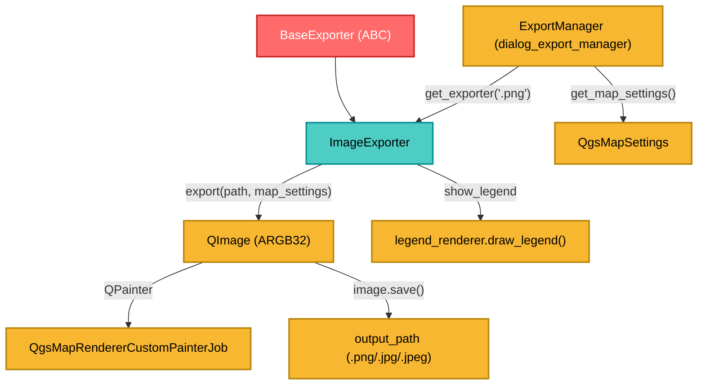

---
tags:
  - secinterp
  - code-walkthrough
  - exporters
  - image
  - png
  - raster
  - render
aliases:
  - image_exporter.py
  - ImageExporter
cssclass: secinterp-note
---

# `exporters/image_exporter.py`

> [!abstract] Resumen en una línea
> Renderiza un `QgsMapSettings` a **PNG/JPG** usando `QImage` + `QgsMapRendererCustomPainterJob`, con color de fondo, antialiasing y leyenda opcional.

**Ruta**: `exporters/image_exporter.py` (72 líneas)
**Clase**: `ImageExporter(BaseExporter)`
**Capa**: Exporters (QGIS · Raster/Render)
**Tags**: #secinterp #exporters #image #png #raster #render

---

## 🎯 ¿Por qué existe este archivo?

La ventana de preview muestra la sección interpretada en un canvas. El usuario necesita **guardarla como imagen** para informes. Ese flujo no exporta datos: exporta **píxeles**.

| Problema | Solución |
|----------|----------|
| Reproducir el render del canvas fuera de la UI | `QgsMapRendererCustomPainterJob` sobre un `QPainter` |
| Bordes dentados / texto pixelado | `RenderHint.Antialiasing` + `SmoothPixmapTransform` |
| Imagen transparente/negra por defecto | `image.fill(background_color)` (blanco por defecto) |
| Falta la leyenda de capas | `legend_renderer.draw_legend()` opcional |
| Incompatibilidad de enums Qt5/Qt6 | `getattr(QImage, "Format", QImage).Format_ARGB32` |

> [!important] Frontera de capa
> A diferencia de `CSVExporter`, este exporter **depende de QGIS** (render). Recibe un `QgsMapSettings` ya construido por `ExportService.get_map_settings()`; no extrae datos ni conoce el modelo geológico.

---

## 🧬 Diagrama de relaciones



---

## 📦 Imports — lectura arquitectónica

```python
from qgis.core import QgsMapRendererCustomPainterJob, QgsMapSettings
from qgis.PyQt.QtCore import QRectF, QSize
from qgis.PyQt.QtGui import QColor, QImage, QPainter

from sec_interp.logger_config import get_logger
from .base_exporter import BaseExporter
```

| # | Observación |
|---|-------------|
| ① | `QgsMapSettings` es solo **anotación de tipo**: el objeto llega inyectado desde el manager |
| ② | `QImage`, `QPainter`, `QColor`, `QSize`, `QRectF` → render Qt puro |
| ③ | `QgsMapRendererCustomPainterJob` es el puente QGIS: dibuja capas en cualquier `QPainter` |
| ④ | No hay `QgsProject`: la capa se configura externamente (sin estado global) |

---

## 🧱 `get_supported_extensions()` — formatos raster

```python
def get_supported_extensions(self) -> list[str]:
    """Get supported image extensions."""
    return [".png", ".jpg", ".jpeg"]
```

`.png` para informes (sin pérdida, admite transparencia); `.jpg`/`.jpeg` para presentaciones (comprimido, sin alfa).

---

## 🧱 `export()` — render a imagen

```python
def export(self, output_path: Path, map_settings: QgsMapSettings) -> bool:
    try:
        width = self.get_setting("width", 800)
        height = self.get_setting("height", 600)
        background_color = self.get_setting("background_color", QColor(255, 255, 255))

        # Create image (Qt5/Qt6 compatibility for enum)
        img_format = getattr(QImage, "Format", QImage).Format_ARGB32
        image = QImage(QSize(width, height), img_format)
        image.fill(background_color)

        painter = QPainter(image)
        painter.setRenderHint(QPainter.RenderHint.Antialiasing)
        painter.setRenderHint(QPainter.RenderHint.SmoothPixmapTransform)

        job = QgsMapRendererCustomPainterJob(map_settings, painter)
        job.start()
        job.waitForFinished()

        show_legend = self.get_setting("show_legend", True)
        legend_renderer = self.get_setting("legend_renderer")
        if legend_renderer and show_legend:
            legend_renderer.draw_legend(painter, QRectF(0, 0, width, height))

        painter.end()
        return image.save(str(output_path))
    except Exception:
        logger.exception(f"Image export failed for {output_path}")
        return False
```

| Setting | Default | Rol |
|---------|---------|-----|
| `width` / `height` | `800` / `600` | Dimensiones en píxeles |
| `background_color` | `QColor(255, 255, 255)` | Relleno inicial |
| `show_legend` | `True` | Activar/desactivar leyenda |
| `legend_renderer` | `None` | Objeto con `draw_legend(painter, rect)` |

> [!tip] Compatibilidad Qt5/Qt6
> `getattr(QImage, "Format", QImage).Format_ARGB32` evita el warning de enums scoped en PyQt6: si existe `QImage.Format`, lo usa; si no, cae al `QImage` clásico.

> [!warning] Firma incompatible con el contrato base y sin `finally`
> `export` define **solo dos** parámetros (sin `layer_name`): funciona por duck typing pero rompe Liskov (un caller con `layer_name=` obtiene `TypeError`). Además, `painter.end()` **no** está en `finally`: si el job lanza, el painter no se cierra.

---

## 🏛️ Patrones de diseño presentes

| Patrón | Dónde | Propósito |
|--------|-------|-----------|
| **Template Method** | `BaseExporter` | Contrato y settings |
| **Strategy** | `ImageExporter` | Estrategia raster concreta |
| **Job / Command** | `QgsMapRendererCustomPainterJob` | Encapsula el render de QGIS |
| **Decorator (informal)** | `legend_renderer.draw_legend` | Superpone la leyenda tras el render |
| **Fail-safe** | `try/except` + `logger.exception` | Devuelve `False` ante fallo |

---

## 🧾 Resumen de la API

| Símbolo | Firma / Hereda | Uso típico |
|---------|----------------|------------|
| `ImageExporter` | `class ImageExporter(BaseExporter)` | Exportador de imágenes |
| `get_supported_extensions()` | `-> [".png", ".jpg", ".jpeg"]` | Validación de extensión |
| `export(output_path, map_settings)` | `-> bool` | Renderiza y guarda |
| `get_setting(key, default)` | heredado | Acceso a settings |

---

## 👀 Observaciones y notas

> [!success] Fortalezas
> - **Render fiel**: usa el mismo motor que QGIS.
> - **Calidad**: antialiasing + suavizado de pixmaps.
> - **Sin estado global** y **leyenda opcional** desacoplada vía settings.

> [!warning] Puntos de atención
> - **No cierra el painter en `finally`** (a diferencia de PDF/SVG).
> - Firma distinta al contrato base (`layer_name` ausente) → riesgo de `TypeError`.
> - `image.save()` infiere el formato por extensión; una extensión no soportada devuelve `False` sin log.
> - `legend_renderer` acopla el exporter a la GUI.
> - Render **sincrónico**: bloquea el hilo que llama.

> [!question] Preguntas abiertas
> - ¿Mover `painter.end()` a un bloque `finally` para garantizar limpieza?
> - ¿Unificar la firma de `export` para respetar el contrato base?

---

## 🔗 Notas relacionadas

- [[Index]] — índice de la bóveda
- [[base_exporter]] — contrato abstracto
- [[pdf_exporter]] / [[svg_exporter]] — mismo job de render, distinto destino
- [[dialog_export_manager]] — construye `QgsMapSettings` y llama a `export()`
- [[export_package]] — `ExportService.get_map_settings()`
- [[controller]] — flujo de datos del preview

---

*Nota de la bóveda SecInterp Code Walkthrough — v3.8.0*
