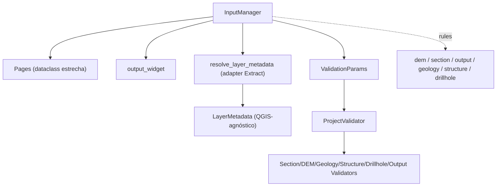

---
tags:
  - secinterp
  - code-walkthrough
  - gui
  - input-manager
aliases:
  - dialog_input_manager.py
  - InputManager
cssclass: secinterp-note
---

# `gui/dialog_input_manager.py`

> [!abstract] Resumen en una línea
> **Adaptador Extract** del diálogo: recolecta las entradas de las páginas, las convierte en `LayerMetadata` desacoplada y las valida con `ProjectValidator` (core), además de decidir `can_preview`/`can_export`.

**Ruta**: `gui/dialog_input_manager.py` (200 líneas)
**Clase**: `InputManager`
**Capa**: GUI · Managers (Adapter)
**Tags**: #secinterp #gui #input-manager

---

## 🎯 ¿Por qué existe este archivo?

El diálogo necesita dos cosas distintas de la misma fuente: un **dict plano** para el pipeline (`PreviewParams`) y un **`ValidationParams` desacoplado** para el validador de core.

| Problema | Solución |
|----------|----------|
| Cada página expone sus valores con nombres propios | `get_all_values()` aplana a un dict con claves estables |
| El core no puede recibir objetos QGIS | `resolve_layer_metadata()` → `LayerMetadata` (solo datos) |
| Reglas de UI ("¿puedo previsualizar?") mezcladas con validación de negocio | `rules` locales + `ProjectValidator` de core |
| El diálogo no debe conocer el pipeline de validadores | `validate_inputs()` devuelve `(bool, str)` |

> [!important] Extract-then-Compute
> Este archivo es la fase **Extract**: toma widgets QGIS y produce DTOs (`LayerMetadata`, `ValidationParams`). El **Compute** ocurre en `core/validation/project_validator.py`, 100% QGIS-agnóstico.

---

## 🧬 Diagrama de relaciones



Amarillo conceptual: el adapter `resolve_layer_metadata` es la frontera hacia el core.

---

## 📦 Imports — lectura arquitectónica

```python
from __future__ import annotations
from collections.abc import Callable
from typing import Any
from sec_interp.core.exceptions import ValidationError
from sec_interp.core.validation.project_validator import ProjectValidator, ValidationParams
from sec_interp.gui.adapters.validation_extractor import resolve_layer_metadata
from .dialog_dependencies import Pages
```

Importa **core** y **un adapter GUI** (el único que toca QGIS). `Pages` es un `@dataclass` con 6 campos (dependencia estrecha); `Callable[[str], str]` tipa `tr` sin acoplarse a Qt.

---

## 🧱 Recorrido del código — `InputManager`

### `__init__(pages, output_widget, translate)`

```python
def __init__(self, pages: Pages, output_widget: Any,
             translate: Callable[[str], str]) -> None:
    self.pages = pages
    self.output_widget = output_widget
    self.tr = translate
    self._setup_validation_rules()
```

### `_setup_validation_rules()` — reglas locales

```python
self.rules = {
    "dem": {"check": lambda p: bool(p.raster_layer),
            "message": self.tr("Raster DEM layer is required")},
    "section": {"check": lambda p: bool(p.line_layer),
                "message": self.tr("Cross-section line layer is required")},
    "output": {"check": lambda p: bool(p.output_path),
               "message": self.tr("Output directory path is required")},
    "geology": {"check": lambda p: (
        ProjectValidator.is_geology_complete(p) if p.outcrop_layer else True),
        "message": self.tr("Geology configuration is incomplete")},
    # structure y drillhole análogos
}
```

| Regla | Comprueba | Semántica |
|-------|-----------|-----------|
| `dem` / `section` / `output` | `bool(...)` | Obligatorios |
| `geology` / `structure` / `drillhole` | `is_*_complete(p)` **si** hay capa | Opcionales pero completos si existen |

Las reglas reciben un `ValidationParams`, no widgets: la lambda trabaja sobre DTOs.

### `get_all_values()` — dict plano para el pipeline

```python
dem = self.pages.dem.get_data();  sect = self.pages.section.get_data()
geol = self.pages.geology.get_data();  stru = self.pages.structure.get_data()
dh = self.pages.drillhole.get_data()

return {
    "raster_layer": dem["raster_layer"], "selected_band": dem["selected_band"],
    "crossline_layer": sect["crossline_layer"], "buffer_distance": sect["buffer_distance"],
    "outcrop_layer": geol["outcrop_layer"], "outcrop_name_field": geol["outcrop_name_field"],
    "structural_layer": stru["structural_layer"], "dip_field": stru["dip_field"],
    "collar_layer_obj": dh["collar_layer"], "collar_id_field": dh["collar_id"],
    # ... survey_*, interval_*
    "output_path": self.output_widget.filePath(),
    **(self.pages.settings.get_data() if self.pages.settings is not None else {}),
}
```

### `get_validation_params()` — construir el DTO de core

```python
return ValidationParams(
    raster_layer=resolve_layer_metadata(dem["raster_layer"]),
    band_number=dem["selected_band"],
    line_layer=resolve_layer_metadata(sect["crossline_layer"]),
    output_path=self.output_widget.filePath(),
    scale=dem["scale"], vert_exag=dem["vertexag"],
    buffer_dist=sect["buffer_distance"],
    outcrop_layer=resolve_layer_metadata(geol["outcrop_layer"]),
    struct_layer=resolve_layer_metadata(stru["structural_layer"]),
    # ... collar/survey/interval con resolve_layer_metadata
)
```

Cada capa QGIS se convierte en `LayerMetadata` (nombre, validez, tipo, campos, CRS) antes de cruzar a core.

### Validación y decisiones de UI

```python
def validate_inputs(self) -> tuple[bool, str]:
    try:
        ProjectValidator.validate_all(self.get_validation_params())
        return True, ""
    except ValidationError as e:
        return False, str(e)

def is_section_valid(self, section: str) -> bool:
    if section not in self.rules:
        return True
    return self.rules[section]["check"](self.get_validation_params())

def get_section_error(self, section: str) -> str:
    return "" if self.is_section_valid(section) else self.rules[section]["message"]

def can_preview(self) -> bool:
    return self.is_section_valid("dem") and self.is_section_valid("section")

def can_export(self) -> bool:
    return self.can_preview() and self.is_section_valid("output")
```

`validate_preview_requirements()` usa `ProjectValidator.validate_preview_requirements` (solo DEM + sección). `validate_all` ejecuta el pipeline completo (6 validadores) y lanza `ValidationError`; `is_section_valid`/`can_preview`/`can_export` son consultas **baratas** que no lanzan.

---

## 🏛️ Patrones de diseño presentes

| Patrón | Dónde | Propósito |
|--------|-------|-----------|
| **Adapter (Extract)** | `resolve_layer_metadata` | QGIS → `LayerMetadata` |
| **DTO** | `ValidationParams`, `LayerMetadata` | Datos puros hacia core |
| **Strategy/Registry** | `self.rules` (dict) | Reglas de UI declarativas |
| **Facade** | `validate_inputs` | `(bool, str)` sobre el pipeline core |
| **Composition container** | `Pages` dataclass | Dependencia estrecha |

---

## 🧾 Resumen de la API

| Símbolo | Firma | Uso típico |
|---------|-------|------------|
| `InputManager(pages, output_widget, tr)` | `__init__` | Composition root |
| `get_all_values()` | `-> dict[str, Any]` | Alimentar `PreviewParams` |
| `get_validation_params()` | `-> ValidationParams` | DTO para core |
| `validate_inputs()` / `validate_preview_requirements()` | `-> tuple[bool, str]` | Validación completa / mínima |
| `is_section_valid(section)` / `get_section_error(section)` | `-> bool` / `-> str` | Habilitar widgets / tooltip |
| `can_preview()` / `can_export()` | `-> bool` | Botón preview / export-save |

---

## 👀 Observaciones y notas

> [!success] Fortalezas
> - Frontera core limpia: **cero objetos QGIS** cruzan a `ProjectValidator`.
> - Consultas baratas separadas de la validación completa.
> - `Pages` estrecho: no depende de todo el diálogo.

> [!warning] Puntos de atención
> - `get_validation_params()` se reconstruye en **cada** `is_section_valid`: `update_preview_checkbox_states` puede invocarlo 5+ veces por refresco.
> - `get_all_values()` asume que cada página tiene `get_data()` y que las claves existen: un rename rompe silenciosamente.
> - `validate_inputs()` solo captura `ValidationError`; otras excepciones propagan a la UI.

> [!question] Preguntas abiertas
> - ¿Merecería un caché de `ValidationParams` invalidado por `dataChanged`?

---

## 🔗 Notas relacionadas

- [[main_dialog]] — crea el manager y llama `validate_inputs()`
- [[validation]] — `ProjectValidator`/`LayerMetadata`/`ValidationParams`
- [[adapters]] — `resolve_layer_metadata` (Extract)
- [[ui_status_manager]] — consume `is_section_valid`/`can_preview`/`can_export`
- [[state_manager]] — estado del diálogo
- [[Index]] — índice de la bóveda

---

*Nota de la bóveda SecInterp Code Walkthrough — v3.8.0*
