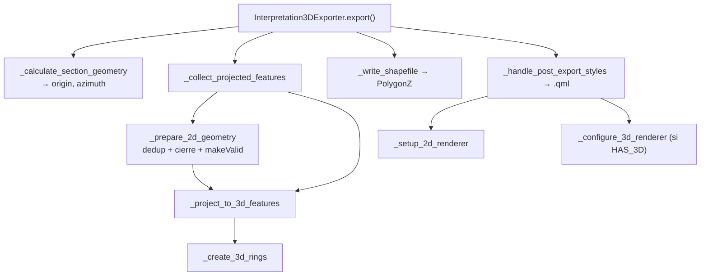

---
tags:
  - secinterp
  - code-walkthrough
  - exporters
  - 3d
aliases:
  - interpretation_3d_exporter.py
  - Interpretation3DExporter
cssclass: secinterp-note
---

# `exporters/interpretation_3d_exporter.py`

> [!abstract] Resumen en una línea
> Proyecta las interpretaciones 2D `(distancia, elevación)` al espacio real usando el **origen y el azimut del plano de sección**, escribe un `PolygonZ` 2.5D y genera un **QML** con simbología 2D categorizada y renderer 3D por reglas.

**Ruta**: `exporters/interpretation_3d_exporter.py` (465 líneas)
**Clase**: `Interpretation3DExporter(BaseExporter)`
**Capa**: Exporters (QGIS · Estrategias de formato)
**Tags**: #secinterp #exporters #3d

---

## 🎯 ¿Por qué existe este archivo?

Es el exporter más complejo de la capa. No solo escribe geometría: reconstruye la posición 3D de cada vértice a partir de la línea de sección y deja preparado el estilo para que la capa se vea igual en 2D y en 3D.

| Problema | Solución |
|----------|----------|
| Un vértice `(dist, elev)` no tiene X/Y globales | `_create_3d_rings` rota `dist` por el azimut desde el origen |
| Los polígonos pueden ser multiparte o inválidos | `_project_to_3d_features` + `makeValid()` |
| Vértices duplicados o anillos abiertos | `_get_unique_vertices` + `_ensure_closed_polygon` |
| El estilo debe viajar con la capa | `_generate_qml_style` guarda un `.qml` |
| QGIS puede no tener el módulo 3D | `try: import qgis._3d` → flag `HAS_3D` |

> [!important] Conversión al espacio real
> `east = origin_x + dist·cos(az)`, `north = origin_y + dist·sin(az)`, `elev = elev / vert_exag`. La rotación por `azimuth` sitúa el punto sobre el plano de sección en el mundo; `dist` es la distancia a lo largo de la sección y `elev` la elevación.

---

## 🧬 Diagrama de relaciones



---

## 🧱 `export()` — orquestación del pipeline

```python
if not self._validate_export_input(interpretations, section_line):
    return False
fields, sorted_keys = self._prepare_fields(interpretations)
try:
    origin_x, origin_y, azimuth = self._calculate_section_geometry(section_line)
except Exception as e:
    raise ExportError(f"Failed to calculate section geometry: {e}") from e

features = self._collect_projected_features(
    interpretations, fields, sorted_keys, origin_x, origin_y, azimuth
)
success = self._write_shapefile(
    output_path, features, fields,
    QgsWkbTypes.Type.PolygonZ, src_crs, layer_name=layer_name,
)
if success:
    self._handle_post_export_styles(output_path, interpretations, fields, src_crs)
return success
```

> [!warning] Falla ruidosamente, no en silencio
> `_validate_export_input` **lanza** `ExportError` si falta `section_line` (no se puede proyectar sin plano). En cambio, el fallo al generar el QML solo se registra como `warning` y no aborta el export.

---

## 🧱 Plano de sección y proyección 3D

`_calculate_section_geometry` toma `p1` y `p2` de la línea (soporta multiparte) y devuelve `p1.x()`, `p1.y()` y `azimuth = atan2(dy, dx)` **en radianes**. `_create_3d_rings` aplica esa rotación:

```python
def _create_3d_rings(self, poly_2d, origin_x, origin_y, azimuth, vert_exag):
    cos_a, sin_a = math.cos(azimuth), math.sin(azimuth)
    rings_3d = []
    for ring_2d in poly_2d:
        points_3d = [
            QgsPoint(origin_x + (p.x() * cos_a),
                     origin_y + (p.x() * sin_a),
                     p.y() / vert_exag)
            for p in ring_2d
        ]
        rings_3d.append(QgsLineString(points_3d))
    return rings_3d
```

`vert_exag` permite atenuar la Z; hoy `_collect_projected_features` siempre pasa `vert_exag=1.0`, así que la elevación se conserva.

---

## 🧱 Validación y limpieza geométrica

```python
def _prepare_2d_geometry(self, polygon):
    vertices = self._ensure_closed_polygon(
        self._get_unique_vertices(polygon.vertices_2d)
    )
    if not vertices or len(vertices) < MIN_VALID_POLYGON_VERTICES:
        logger.warning(f"Polygon {polygon.id} has insufficient unique vertices. Skipping.")
        return None
    polygon_2d = QgsPolygon()
    polygon_2d.setExteriorRing(QgsLineString([QgsPoint(x, y, 0.0) for x, y in vertices]))
    geom_2d = QgsGeometry(polygon_2d)
    return geom_2d if geom_2d.isGeosValid() else geom_2d.makeValid()
```

---

## 🧱 `_generate_qml_style()` — estilo 2D + 3D

```python
qml_path = Path(shp_path).with_suffix(".qml")
layer = QgsVectorLayer(f"Polygon?crs={crs.authid()}&z=yes", "temp_style", "memory")
layer.dataProvider().addAttributes(fields)
layer.updateFields()
self._setup_2d_renderer(layer, interpretations)
if HAS_3D:
    self._configure_3d_renderer(layer, interpretations)
msg, ok = layer.saveNamedStyle(str(qml_path))
```

| Renderer | Mecanismo | Detalle |
|----------|-----------|---------|
| 2D | `QgsCategorizedSymbolRenderer("name", categories)` | Color por unidad, alpha 180, borde `darker(150)` |
| 3D | `QgsRuleBased3DRenderer` | Regla `"name" = '<unidad>'` con material Phong (`setDiffuse` + `setAmbient`) |

El `.qml` se genera como archivo hermano aunque el destino sea `.shp`/`.gpkg`/`.dxf`.

---

## 🏛️ Patrones de diseño presentes

| Patrón | Dónde | Propósito |
|--------|-------|-----------|
| **Template Method** | `BaseExporter` | Contrato y validación comunes |
| **Pipeline / step methods** | `export()` | Validar → proyectar → escribir → estilar |
| **Adapter DTO→feature** | `_project_to_3d_features` | `InterpretationPolygon` → `QgsFeature` 3D |
| **Graceful degradation** | `HAS_3D` | Si falta `qgis._3d`, aún genera el QML 2D |

---

## 🧾 Resumen de la API

| Símbolo | Firma / Hereda | Uso típico |
|---------|----------------|------------|
| `Interpretation3DExporter` | `BaseExporter` | Polígonos 3D 2.5D + QML |
| `_calculate_section_geometry(line)` | `-> (x, y, azimuth)` | Origen y azimut del plano |
| `_create_3d_rings(poly_2d, ...)` | `-> list[QgsLineString]` | Rotación perfil → mundo |
| `_prepare_2d_geometry(polygon)` | `-> QgsGeometry \| None` | Dedup, cierre y `makeValid` |

---

## 👀 Observaciones y notas

> [!success] Fortalezas
> - Proyección geométrica correcta y bien aislada en `_create_3d_rings`.
> - Manejo explícito de multiparte, anillos interiores y geometrías inválidas.

> [!warning] Puntos de atención
> - `makeValid()` puede alterar la topología del polígono sin avisar al usuario.

> [!question] Preguntas abiertas
> - ¿Debería `vert_exag` exponerse como opción de exportación en lugar de fijarse en `1.0`?

---

## 🔗 Notas relacionadas

- [[Index]] — índice de la bóveda
- [[base_exporter]] — contrato heredado
- [[interpretation_exporters]] — variante 2D
- [[interpretation_manager]] — origen de los DTOs
- [[access_control_service]] — gate `can_export_3d()` que habilita este exporter

---

*Nota de la bóveda SecInterp Code Walkthrough — v3.8.0*
