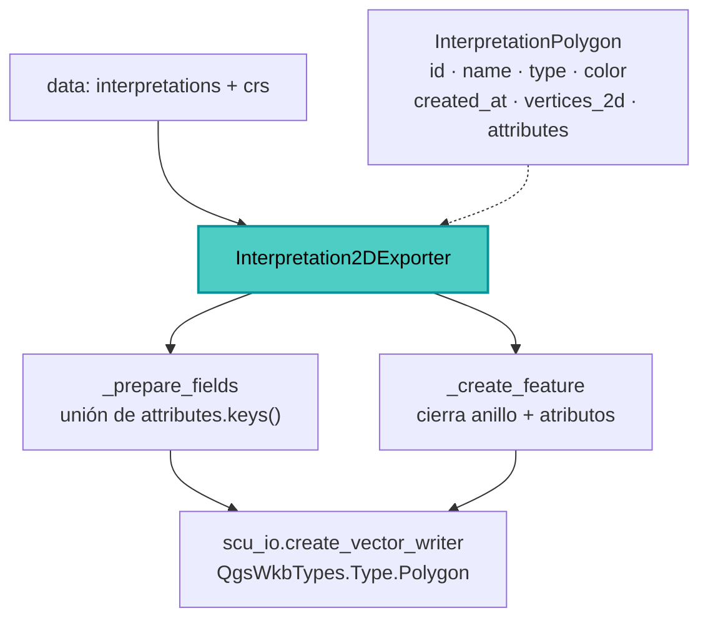

---
tags:
  - secinterp
  - code-walkthrough
  - exporters
  - interpretation
aliases:
  - interpretation_exporters.py
  - Interpretation2DExporter
cssclass: secinterp-note
---

# `exporters/interpretation_exporters.py`

> [!abstract] Resumen en una línea
> Exporta **interpretaciones 2D** (polígonos en coordenadas `distancia/elevación`) a SHP/GPKG/DXF, con un esquema fijo (`id`, `name`, `type`, `color`, `created_at`) más los atributos personalizados que aparezcan en los DTOs.

**Ruta**: `exporters/interpretation_exporters.py` (146 líneas)
**Clase**: `Interpretation2DExporter(BaseExporter)`
**Capa**: Exporters (QGIS · Estrategias de formato)
**Tags**: #secinterp #exporters #interpretation

---

## 🎯 ¿Por qué existe este archivo?

Las interpretaciones digitalizadas en el perfil (`InterpretationPolygon`) tienen identidad y metadatos, no solo geometría. Este exporter materializa tanto la forma como esa identidad en la capa resultante.

| Problema | Solución |
|----------|----------|
| El polígono puede no venir cerrado | `_create_feature` añade el primer punto al final si falta |
| Los atributos personalizados varían entre polígonos | `_prepare_fields` recolecta la **unión** de claves y las ordena |
| Hay que distinguir "sin datos" de "fallo de escritura" | Guarda explícita + `writer.hasError()` |
| El esquema base debe ser estable | 5 campos fijos antes de los personalizados |

> [!important] Geometría `Polygon` en coordenadas de perfil
> El CRS que se pasa a `create_vector_writer` es el del proyecto, pero los vértices son `(distancia, elevación)`: la capa es "de sección", no geográfica.

---

## 🧬 Diagrama de relaciones



---

## 📦 Imports — lectura arquitectónica

Es el único de los cuatro que usa **import absoluto** `sec_interp.exporters.base_exporter` en lugar de relativo. `QgsWkbTypes.Type.Polygon` fija el tipo geométrico y `QgsVectorFileWriter` solo se usa para comparar `writer.hasError()` con `WriterError.NoError`. Define un `__init__(settings)` explícito que solo delega en `super()`.

---

## 🧱 `export()` — flujo completo

```python
interpretations = data.get("interpretations", [])
if not interpretations:
    logger.warning("No interpretations to export.")
    return False

try:
    crs = data.get("crs")
    fields, sorted_keys = self._prepare_fields(interpretations)
    writer = scu_io.create_vector_writer(
        str(output_path), crs, fields,
        geometry_type=QgsWkbTypes.Type.Polygon, layer_name=layer_name,
    )
    if writer.hasError() != QgsVectorFileWriter.WriterError.NoError:
        logger.error(f"Failed to create writer for {output_path}: {writer.errorMessage()}")
        return False
    for interp in interpretations:
        feat = self._create_feature(interp, fields, sorted_keys)
        if feat:
            writer.addFeature(feat)
    del writer  # Flushes and closes the file
    logger.info(f"Successfully exported to {output_path}")
    return True
except Exception:
    logger.exception(f"Failed to export interpretations to {output_path}")
    return False
```

> [!note] Dos rutas de fallo
> "Sin datos" devuelve `False` con un `warning` (no es un error). Un fallo de escritura pasa por `hasError()` o por el `except`, registrándose con `logger.error` / `logger.exception`.

---

## 🧱 `_prepare_fields()` — esquema fijo + unión de atributos

```python
all_attr_keys = set()
for interp in interpretations:
    if interp.attributes:
        all_attr_keys.update(interp.attributes.keys())

sorted_keys = sorted(all_attr_keys)
fields = QgsFields()
fields.append(QgsField("id", QMetaType.Type.QString, len=50))
fields.append(QgsField("name", QMetaType.Type.QString, len=100))
fields.append(QgsField("type", QMetaType.Type.QString, len=50))
fields.append(QgsField("color", QMetaType.Type.QString, len=10))
fields.append(QgsField("created_at", QMetaType.Type.QString, len=30))

for key in sorted_keys:
    fields.append(QgsField(key, QMetaType.Type.QString, len=255))
return fields, sorted_keys
```

| Campo | Tipo | Longitud |
|-------|------|:--------:|
| `id` / `name` / `type` | `QString` | 50 / 100 / 50 |
| `color` / `created_at` | `QString` | 10 / 30 |
| personalizados | `QString` | 255 |

> [!tip] Unión, no intersección
> Al usar `set.update`, una clave presente en cualquier polígono entra al esquema. Los polígonos que no la tengan reciben `""` en `_create_feature`.

---

## 🧱 `_create_feature()` — cerrar el anillo y volcar atributos

```python
points = [QgsPointXY(x, y) for x, y in interp.vertices_2d]
if points and points[0] != points[-1]:
    points.append(points[0])
geom = QgsGeometry.fromPolygonXY([points])

feature = QgsFeature(fields)
feature.setGeometry(geom)

attrs = [interp.id, interp.name, interp.type, interp.color, interp.created_at]
for key in sorted_keys:
    attrs.append(str(interp.attributes.get(key, "")))
feature.setAttributes(attrs)
return feature
```

> [!warning] Orden de atributos acoplado
> `attrs` debe seguir exactamente el orden de `_prepare_fields`: los 5 fijos y luego `sorted_keys`. Añadir un campo fijo sin actualizar ambos rompe la correspondencia.

---

## 🏛️ Patrones de diseño presentes

| Patrón | Dónde | Propósito |
|--------|-------|-----------|
| **Template Method** | `BaseExporter` | Contrato y validación de rutas |
| **Schema union** | `_prepare_fields` | Esquema completo a partir de atributos dispersos |
| **Fail-safe** | `try/except` + `hasError()` | Nunca propaga errores de I/O |
| **DTO → feature** | `_create_feature` | `InterpretationPolygon` → `QgsFeature` |

---

## 🧾 Resumen de la API

| Símbolo | Firma / Hereda | Uso típico |
|---------|----------------|------------|
| `Interpretation2DExporter` | `BaseExporter` | Polígonos 2D → capa `Polygon` |
| `_prepare_fields(interpretations)` | `-> (QgsFields, list[str])` | Esquema + claves ordenadas |
| `_create_feature(interp, fields, keys)` | `-> QgsFeature` | Una interpretación por feature |
| `get_supported_extensions()` | `-> list[str]` | `[".shp", ".gpkg", ".dxf"]` |

---

## 👀 Observaciones y notas

> [!success] Fortalezas
> - Esquema determinista: los 5 campos base siempre están presentes.
> - Cierra el polígono automáticamente si el DTO no lo trae cerrado.
> - Distingue "sin datos" (`warning`) de "fallo de escritura" (`error`).

> [!warning] Puntos de atención
> - Los atributos personalizados se guardan como `str`, incluso si son numéricos.

> [!question] Preguntas abiertas
> - ¿Debería validarse un mínimo de 3 vértices únicos antes de construir el polígono?

---

## 🔗 Notas relacionadas

- [[Index]] — índice de la bóveda
- [[base_exporter]] — contrato heredado
- [[interpretation_3d_exporter]] — variante 3D con plano de sección
- [[interpretation_manager]] — origen de los DTOs
- [[export_package]] — orquestador (`handlers/interpretations.py`)

---

*Nota de la bóveda SecInterp Code Walkthrough — v3.8.0*
