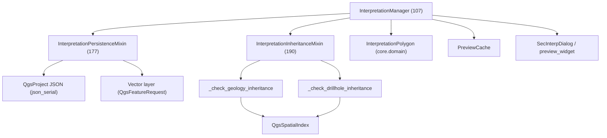

---
tags:
  - secinterp
  - code-walkthrough
  - gui
  - interpretation
aliases:
  - dialog_interpretation_manager.py
  - InterpretationManager
cssclass: secinterp-note
---

# `gui/dialog_interpretation_manager.py`

> [!abstract] Resumen en una línea
> **Fachada** que gestiona los polígonos de interpretación: ciclo de vida y diálogo de propiedades en la clase base, con la persistencia dual y la herencia de atributos delegadas a dos mixins.

> [!info] Refactor 2026-09-20
> Este manager de 444 líneas se descompuso en mixins ([[interpretation_mixins]]); `InterpretationManager` es ahora una clase de **107 líneas** que hereda `InterpretationPersistenceMixin` + `InterpretationInheritanceMixin`.

**Ruta**: `gui/dialog_interpretation_manager.py` (107 líneas; antes 444)
**Clase**: `InterpretationManager(InterpretationPersistenceMixin, InterpretationInheritanceMixin)`
**Capa**: GUI · Managers
**Tags**: #secinterp #gui #interpretation

---

## 🎯 ¿Por qué existe este archivo?

| Problema | Solución |
|----------|----------|
| `main_dialog` acumularía drag, `QgsSpatialIndex`, JSON y `QgsProject` | Un manager dedicado, separado del diálogo |
| Persistencia e herencia en un archivo de 444 líneas | Dos mixins por responsabilidad |
| Deuda: `feat_id += 1` manual y `getFeatures()` sin filtro | Corregido el 2026-09-20 (qgis-analyzer: **0 issues**) |
| La UI debía re-renderizarse tras añadir un polígono | Callback `_on_preview_update` |

> [!important] Cache compartida
> Recibe `PreviewCache` (inyectada por el diálogo) para leer `geol`/`drillhole` sin recalcular.

---

## 🧬 Diagrama de relaciones



> [!tip] Cómo leer
> Flecha sólida = importa/hereda; la fachada compone los mixins y usa `self.dialog` + `self._preview_cache` como contexto compartido.

---

## 📦 Imports — lectura arquitectónica

```python
# dialog_interpretation_manager.py
from collections.abc import Callable
from typing import TYPE_CHECKING

from sec_interp.core.domain import InterpretationPolygon
from sec_interp.gui.interpretation_inheritance_mixin import InterpretationInheritanceMixin
from sec_interp.gui.interpretation_persistence_mixin import InterpretationPersistenceMixin
from sec_interp.logger_config import get_logger, log_critical_operation

from .preview_state import PreviewCache

if TYPE_CHECKING:
    from .main_dialog import SecInterpDialog
```

| # | Observación |
|---|-------------|
| ① | `TYPE_CHECKING` evita import circular con `main_dialog` en runtime. |
| ② | `InterpretationPropertiesDialog` se importa **dentro** del método (import diferido). |
| ③ | La fachada no importa `QgsProject`/`QgsSpatialIndex`: eso vive en los mixins. |

---

## 🧱 `__init__` — contexto compartido

```python
class InterpretationManager(InterpretationPersistenceMixin, InterpretationInheritanceMixin):
    """Manages interpretation polygons and their business logic."""

    def __init__(self, dialog: SecInterpDialog, cache: PreviewCache | None = None) -> None:
        self.dialog = dialog
        self.interpretations: list[InterpretationPolygon] = []
        self._preview_cache = cache if cache is not None else PreviewCache()
        self._on_preview_update: Callable[[], None] | None = None
```

| Miembro | Rol |
|---------|-----|
| `self.dialog` | Diálogo propietario (acceso a `page_interpretation`, `preview_widget`, `project`, `layer_factory`). |
| `self.interpretations` | Lista de polígonos vivos. |
| `self._preview_cache` | Cache compartida (o una nueva si no se inyecta). |
| `self._on_preview_update` | Callback de re-render, opcional. |

> [!note] Mixins sin `__init__`
> Los mixins asumen que `self.dialog`, `self.interpretations` y `self._preview_cache` existen: la fachada los provee. Es composición por contrato implícito.

---

## 🧱 Ciclo de vida — `set_preview_update_handler` y `clear_interpretations`

```python
def set_preview_update_handler(self, handler: Callable[[], None]) -> None:
    self._on_preview_update = handler

def clear_interpretations(self) -> None:
    self.interpretations = []
    self.save_interpretations()      # delega en el mixin de persistencia
```

| Método | Detalle |
|--------|---------|
| `set_preview_update_handler` | Inyección de dependencia: el diálogo registra `preview_manager.update_from_checkboxes`. |
| `clear_interpretations` | Vacía la lista y **persiste** el vacío de inmediato. |

> [!tip] Inversión de dependencia
> El manager no conoce al preview manager: recibe un `Callable` y lo invoca. Facilita testear sin UI real.

---

## 🧱 `handle_interpretation_finished()` — el flujo completo

```python
def handle_interpretation_finished(self, interpretation: InterpretationPolygon) -> None:
    from .dialogs.interpretation_properties_dialog import (
        InterpretationPropertiesDialog,
    )

    log_critical_operation(
        logger, "handle_interpretation_finished",
        polygon_id=interpretation.id, vertices=len(interpretation.vertices_2d),
    )

    interp_config = self.dialog.page_interpretation.get_data()

    if interp_config.get("inherit_geology") or interp_config.get("inherit_drillholes"):
        self.apply_attribute_inheritance(interpretation, interp_config)   # mixin

    dlg = InterpretationPropertiesDialog(
        interpretation, interp_config.get("custom_fields"), self.dialog
    )

    if dlg.exec() != 1:
        self.dialog.preview_widget.btn_interpret.setChecked(False)
        return

    self.interpretations.append(interpretation)
    self.save_interpretations()      # mixin
    ...
    self.dialog.preview_widget.results_text.setHtml(msg)
    self.dialog.preview_widget.results_group.setCollapsed(False)
    self.dialog.preview_widget.btn_interpret.setChecked(False)

    if self._on_preview_update:
        self._on_preview_update()
```

| Paso | Detalle |
|------|---------|
| 1 | Import diferido del diálogo de propiedades. |
| 2 | `log_critical_operation` con id y nº de vértices. |
| 3 | Herencia opcional vía `apply_attribute_inheritance` (mixin). |
| 4 | Diálogo modal; si cancela (`exec() != 1`) desmarca el botón y sale. |
| 5 | Añade, persiste, actualiza el texto de resultados y re-renderiza. |

> [!important] Delegación real
> El "cerebro" de la persistencia y la herencia **no** está aquí: la fachada solo orquesta el orden de las llamadas a los mixins.

---

## 🧱 Mixin de persistencia — `InterpretationPersistenceMixin`

```python
def load_interpretations(self) -> None:
    interp_config = self.dialog.page_interpretation.get_data()
    if interp_config.get("source_type") == "layer":
        target_layer = QgsProject.instance().mapLayer(interp_config.get("target_layer_id"))
        if target_layer and target_layer.isValid():
            self.sync_from_layer(target_layer)
            return
    json_data, ok = self.dialog.project.readEntry("SecInterp", "interpretations", "[]")
    ...

def sync_from_layer(self, layer: Any) -> None:
    request = QgsFeatureRequest().setFilterRect(layer.extent())   # índice espacial
    for feature in layer.getFeatures(request):
        ...
```

| Método | Rol |
|--------|-----|
| `load_interpretations` | Fuente elegida: capa (`source_type == "layer"`) o JSON de proyecto. |
| `save_interpretations` | `json.dumps` con `json_serial` para `QVariant` de PyQGIS. |
| `sync_from_layer` | `QgsFeatureRequest().setFilterRect(...)` → usa el índice espacial, no escaneo total. |
| `save_to_layer` | `startEditing`/`deleteFeatures`/`addFeatures`/`commitChanges`. |

> [!note] Deuda saldada (2026-09-20)
> El `getFeatures()` sin filtro pasó a usar `QgsFeatureRequest` con `setFilterRect(layer.extent())`. Ver [[interpretation_mixins]].

---

## 🧱 Mixin de herencia — `InterpretationInheritanceMixin`

```python
def apply_attribute_inheritance(self, interpretation, config) -> None:
    ring = [QgsPointXY(x, y) for x, y in interpretation.vertices_2d]
    poly_geom = QgsGeometry.fromPolygonXY([ring])
    ref_point = poly_geom.centroid().asPoint()

    if config.get("inherit_geology"):
        best_match, min_dist = self._check_geology_inheritance(ref_point, min_dist, best_match)
    if config.get("inherit_drillholes"):
        best_match, min_dist = self._check_drillhole_inheritance(ref_point, min_dist, best_match)
    ...
```

| Método | Detalle |
|--------|---------|
| `apply_attribute_inheritance` | Centroide → compara geología y/o sondajes, aplica nombre/tipo/attrs/color. |
| `_check_geology_inheritance` | Indexa segmentos de `_preview_cache["geol"]` y consulta `nearestNeighbor`. |
| `_check_drillhole_inheritance` | `enumerate(self._iter_drillhole_interval_geoms(dh_data))` + `QgsSpatialIndex`. |
| `_iter_drillhole_interval_geoms` | Generador `(interval, geom)` de cada intervalo con puntos. |
| `_extract_intervals_from_dh_data` | Soporta formato legacy (tupla) y objetos con `.intervals`. |

> [!note] Deuda saldada (2026-09-20)
> El contador manual `feat_id += 1` se reemplazó por `enumerate`. `qgis-analyzer` reporta **0 issues**.

---

## 🏛️ Patrones de diseño presentes

| Patrón | Dónde | Propósito |
|--------|-------|-----------|
| **Facade** | `InterpretationManager` | Orquesta sin implementar persistencia/herencia. |
| **Mixin composition** | Dos bases | Separar dominios por responsabilidad. |
| **Strategy** | `_check_geology` vs `_check_drillhole` | Elegir la fuente de atributos más cercana. |
| **Spatial Index** | `QgsSpatialIndex` | Vecino más próximo eficiente. |
| **Dependency Injection** | `PreviewCache` + `_on_preview_update` | Testeable y desacoplado. |

---

## 🧾 Resumen de la API

| Símbolo | Firma / Hereda | Uso típico |
|---------|----------------|------------|
| `InterpretationManager` | `(PersistenceMixin, InheritanceMixin)` | Fachada de interpretaciones. |
| `__init__(dialog, cache=None)` | — | Crea lista, cache y callback. |
| `set_preview_update_handler(handler)` | `Callable` | Registrar re-render. |
| `clear_interpretations()` | `() -> None` | Vaciar y persistir. |
| `handle_interpretation_finished(polygon)` | `InterpretationPolygon` | Alta completa. |
| `load/save_interpretations()` | mixin | Persistencia dual. |
| `sync_from_layer(layer)` / `save_to_layer(layer)` | mixin | Capa externa. |
| `apply_attribute_inheritance(...)` | mixin | Herencia por cercanía. |

---

## 👀 Observaciones y notas

> [!success] Fortalezas
> - Fachada de 107 líneas: orquesta, no acumula lógica.
> - Mixins cohesivos y testeables; deuda de qgis-analyzer saldada (0 issues).
> - `QgsSpatialIndex` y `enumerate` idiomáticos en la herencia.

> [!warning] Puntos de atención
> - `sync_from_layer` no rellena `attributes` (queda `{}`); solo sincroniza geometría y campos base.
> - `save_to_layer` borra y reescribe **todas** las features de la capa.
> - Los mixins dependen de atributos de la fachada (`dialog`, `_preview_cache`): contrato implícito.

> [!question] Preguntas abiertas
> - ¿Debería `save_to_layer` usar edición transaccional incremental en lugar de delete+add?
> - ¿Conviene mover la herencia a `core/` recibiendo geometrías como WKT?

---

## 🔗 Notas relacionadas

- [[Index]] — índice de la bóveda
- [[interpretation_mixins]] — los dos mixins de esta fachada
- [[interpretation_tool]] — produce los polígonos vía `polygonFinished`
- [[main_dialog]] — crea y cablea el manager
- [[domain]] — `InterpretationPolygon`
- [[ui_pages]] — `InterpretationPage` (formulario de configuración)

---

*Nota de la bóveda SecInterp Code Walkthrough — v3.8.0*
