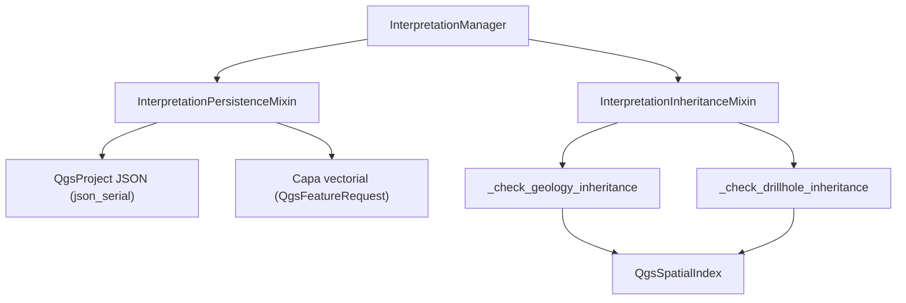

---
tags:
  - secinterp
  - code-walkthrough
  - gui
  - interpretation
  - mixins
aliases:
  - interpretation_persistence_mixin.py
  - interpretation_inheritance_mixin.py
  - InterpretationManager
cssclass: secinterp-note
---

# `gui/dialog_interpretation_manager.py` — mixins

> [!abstract] Resumen en una línea
> El antiguo `dialog_interpretation_manager.py` de 445 líneas se descompuso (2026-09-20); `InterpretationManager` es ahora una clase de 107 líneas con `__init__`, `set_preview_update_handler`, `clear_interpretations` y `handle_interpretation_finished`.

**Ruta**: `gui/dialog_interpretation_manager.py` (107 líneas) + `gui/interpretation_persistence_mixin.py` (177), `gui/interpretation_inheritance_mixin.py` (190)
**Clase**: `InterpretationManager(InterpretationPersistenceMixin, InterpretationInheritanceMixin)`
**Capa**: GUI · Managers
**Tags**: #secinterp #gui #interpretation #mixins

---

## 🎯 ¿Por qué existe este archivo?

| Problema | Solución |
|----------|----------|
| Persistencia, herencia y ciclo de vida en un archivo de 445 líneas | Dos mixins por responsabilidad |
| `QgsSpatialIndex` y JSON mezclados con la UI | Cada mixin agrupa su dominio |
| Deuda: `feat_id += 1` manual y `getFeatures()` sin filtro | Corregido el 2026-09-20 (qgis-analyzer: 0 issues) |

---

## 🧬 Diagrama de relaciones

---

## 🧱 `InterpretationPersistenceMixin` — persistencia dual

| Método | Rol |
|--------|-----|
| `load_interpretations` | Lee de capa (`source_type == "layer"`) o del JSON de `QgsProject` |
| `save_interpretations` | Escribe JSON con `json_serial` para valores `QVariant` |
| `sync_from_layer` | `layer.getFeatures(QgsFeatureRequest().setFilterRect(layer.extent()))` → usa el índice espacial |
| `save_to_layer` | `QgsFeature`s + `startEditing`/`deleteFeatures`/`addFeatures`/`commitChanges` |

---

## 🧱 `InterpretationInheritanceMixin` — herencia por cercanía

| Método | Detalle |
|--------|---------|
| `apply_attribute_inheritance` | Centroide del polígono → delega en `_check_geology` y/o `_check_drillhole` según `config` |
| `_check_geology_inheritance` | Indexa los segmentos de `_preview_cache["geol"]` y consulta `nearestNeighbor` |
| `_check_drillhole_inheritance` | `enumerate(self._iter_drillhole_interval_geoms(dh_data))` + `QgsSpatialIndex` |
| `_iter_drillhole_interval_geoms` | Generador `(interval, geom)` de cada intervalo con puntos |
| `_extract_intervals_from_dh_data` | Soporta formato legacy (tuple) y objetos con `.intervals` |

> [!note] Deuda saldada (2026-09-20)
> El contador manual `feat_id += 1` se reemplazó por `enumerate`, y `getFeatures()` pasó a usar un `QgsFeatureRequest` configurado. `qgis-analyzer` reporta **0 issues**.

---

## 🏛️ Patrones de diseño presentes

| Patrón | Dónde | Propósito |
|--------|-------|-----------|
| **Mixin composition** | Dos bases | Separar persistencia de herencia |
| **Strategy** | `_check_geology` vs `_check_drillhole` | Elegir la fuente de atributos más cercana |
| **Spatial index** | `QgsSpatialIndex` | Vecino más próximo eficiente |

---

## 👀 Observaciones y notas

> [!success] Fortalezas
> - Manager de 445 → 107 líneas; mixins cohesivos.
> - Uso de índice espacial y `enumerate` idiomático.

> [!warning] Puntos de atención
> - `sync_from_layer` no sincroniza `attributes` (queda `{}`).
> - `save_to_layer` borra y reescribe todas las features.

---

## 🔗 Notas relacionadas

- [[Index]] — índice de la bóveda
- [[interpretation_manager]] — la clase que compone los mixins
- [[main_dialog]] — crea y cablea el manager
- [[domain]] — `InterpretationPolygon`
- [[ui_pages]] — `InterpretationPage`

---

*Nota de la bóveda SecInterp Code Walkthrough — v3.8.0*
