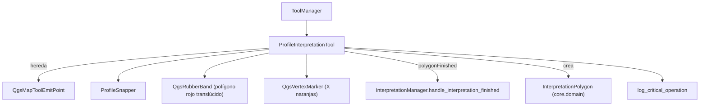

---
tags:
  - secinterp
  - code-walkthrough
  - gui
  - tools
aliases:
  - interpretation_tool.py
  - ProfileInterpretationTool
cssclass: secinterp-note
---

# `gui/tools/interpretation_tool.py`

> [!abstract] Resumen en una línea
> `QgsMapTool` para **digitizar polígonos** de interpretación sobre el preview: añade/quita vértices con snap, previsualiza el polígono y emite un `InterpretationPolygon` completo (uuid, color aleatorio, timestamp).

**Ruta**: `gui/tools/interpretation_tool.py` (269 líneas)
**Clase**: `ProfileInterpretationTool(QgsMapToolEmitPoint)`
**Capa**: GUI · Tools
**Tags**: #secinterp #gui #tools

---

## 🎯 ¿Por qué existe este archivo?

| Problema | Solución |
|----------|----------|
| El usuario necesita delimitar litologías/unidades sobre el perfil | Tool de digitización de polígonos vértice a vértice |
| Los clics lentos duplicaban vértices | Guarda `compare(point, 1e-6)` en `_add_point` |
| La UI no debe construir el DTO de dominio | `finalize_polygon()` crea el `InterpretationPolygon` |
| Borrar un vértice mal puesto debe ser inmediato | Clic derecho → `_remove_last_point()` |
| Crashes de canvas al activar/resetear tools | `log_critical_operation` en cada operación sensible |

> [!important] Frontera Core
> El tool importa `InterpretationPolygon` de `core.domain` y produce el DTO; la persistencia y herencia quedan en [[interpretation_manager]]. No hay lógica de negocio aquí.

---

## 🧬 Diagrama de relaciones



> [!tip] Cómo leer
> Flecha sólida = importa/compone; `polygonFinished` cruza del tool al manager y de ahí al diálogo de propiedades.

---

## 📦 Imports — lectura arquitectónica

```python
# interpretation_tool.py
import contextlib, datetime, random, uuid
from typing import Any

from qgis.core import QgsPointXY, QgsWkbTypes
from qgis.gui import (
    QgsMapCanvas, QgsMapToolEmitPoint, QgsRubberBand, QgsVertexMarker,
)
from qgis.PyQt.QtCore import QCoreApplication, Qt, pyqtSignal
from qgis.PyQt.QtGui import QColor

from sec_interp.core.domain import InterpretationPolygon
from sec_interp.gui.tools.snapper import ProfileSnapper
from sec_interp.logger_config import get_logger, log_critical_operation
```

| # | Observación |
|---|-------------|
| ① | `uuid`, `datetime` y `random` construyen la identidad y estética del DTO en el borde GUI. |
| ② | `log_critical_operation` envuelve las operaciones que tocan el canvas (riesgo de segfault). |
| ③ | `InterpretationPolygon` es la única importación de `core` — el tool no calcula, solo materializa. |

---

## 🧱 Estado, señal y ciclo de vida

```python
class ProfileInterpretationTool(QgsMapToolEmitPoint):
    polygonFinished = pyqtSignal(InterpretationPolygon)

    def __init__(self, canvas: QgsMapCanvas) -> None:
        super().__init__(canvas)
        self.canvas = canvas
        self.points: list[QgsPointXY] = []
        self.rubber_band: QgsRubberBand | None = None
        self.vertex_markers: list[QgsVertexMarker] = []
        self.snapper = ProfileSnapper(canvas)
        self.cursor = Qt.CursorShape.CrossCursor

    def activate(self) -> None:
        log_critical_operation(logger, "activate_interpretation_tool")
        super().activate()
        self.canvas.setCursor(self.cursor)

    def deactivate(self) -> None:
        log_critical_operation(logger, "deactivate_interpretation_tool")
        self.reset()                     # a diferencia de measure_tool
        super().deactivate()
```

| Miembro | Rol |
|---------|-----|
| `polygonFinished` | Emite el `InterpretationPolygon` terminado. |
| `points` | Vértices en construcción. |
| `rubber_band` / `vertex_markers` | Polígono provisional y marcas de vértice. |
| `is_drawing` | Bandera de estado usada por `reset()`. |

> [!note] `deactivate` limpia
> Aquí sí se llama `reset()` al desactivar (lo contrario que [[measure_tool]]): el polígono en curso se descarta y el canvas se refresca.

---

## 🧱 `reset()` — limpieza segura del canvas

```python
def reset(self) -> None:
    log_critical_operation(logger, "reset_interpretation_tool",
                           points=len(self.points) if self.points else 0)
    self.points = []

    if self.rubber_band:
        with contextlib.suppress(Exception):
            self.rubber_band.reset(QgsWkbTypes.GeometryType.PolygonGeometry)
            self.canvas.scene().removeItem(self.rubber_band)
        self.rubber_band = None

    for marker in self.vertex_markers:
        with contextlib.suppress(Exception):
            self.canvas.scene().removeItem(marker)
    self.vertex_markers = []

    self.is_drawing = False
    if self.canvas:
        self.canvas.refresh()
```

| Detalle | Valor |
|---------|-------|
| Log crítico | Incluye `points=<n>` para correlacionar en el log. |
| Rubber band | Se resetea a `PolygonGeometry` antes de removerlo. |
| Refresh | `self.canvas.refresh()` tras limpiar. |

---

## 🧱 Eventos de ratón y teclado

```python
def canvasReleaseEvent(self, event: Any) -> None:
    if event.button() == Qt.MouseButton.RightButton:
        if self.points:
            self._remove_last_point()
        return
    snapped_point = self.snapper.snap(event.pos())
    self._add_point(snapped_point)

def canvasMoveEvent(self, event: Any) -> None:
    if not self.points:
        return
    current_point = self.snapper.snap(event.pos())
    self._update_rubber_band(current_point)

def canvasDoubleClickEvent(self, event: Any) -> None:
    MIN_POLYGON_POINTS = 3
    if len(self.points) >= MIN_POLYGON_POINTS:
        self.finalize_polygon()

def keyPressEvent(self, event: Any) -> None:
    if event.key() in (Qt.Key.Key_Return, Qt.Key.Key_Enter):
        MIN_POLYGON_POINTS = 3
        if len(self.points) >= MIN_POLYGON_POINTS:
            self.finalize_polygon()
            event.accept()
        return
    if event.key() == Qt.Key.Key_Escape:
        self.reset()
        event.accept()
        return
    super().keyPressEvent(event)
```

| Entrada | Acción |
|---------|--------|
| Clic izquierdo | Añade vértice con snap. |
| Clic derecho | Elimina el último vértice (`_remove_last_point`). |
| Doble clic | Finaliza si hay ≥ 3 puntos. |
| Enter / Return | Finaliza si hay ≥ 3 puntos. |
| Escape | `reset()`. |

> [!important] Doble clic + Enter
> Dos caminos de finalización conviven: `canvasDoubleClickEvent` y `keyPressEvent`. Ambos exigen `MIN_POLYGON_POINTS = 3`.

---

## 🧱 `_add_point` / `_remove_last_point`

```python
def _add_point(self, point: QgsPointXY) -> None:
    # Evita el mismo punto dos veces seguidas (clic lento)
    if self.points and self.points[-1].compare(point, 1e-6):
        return
    self.points.append(point)
    self._ensure_rubber_band()
    self.rubber_band.addPoint(point, True)
    self._add_vertex_marker(point)

def _remove_last_point(self) -> None:
    if not self.points:
        return
    self.points.pop()
    if self.vertex_markers:
        marker = self.vertex_markers.pop()
        self.canvas.scene().removeItem(marker)

    if not self.points:
        if self.rubber_band:
            self.canvas.scene().removeItem(self.rubber_band)
            self.rubber_band = None
    else:
        self.rubber_band.reset(QgsWkbTypes.GeometryType.PolygonGeometry)
        for p in self.points:
            self.rubber_band.addPoint(p, False)
```

> [!tip] Tolerancia 1e-6
> `QgsPointXY.compare(point, 1e-6)` descarta duplicados consecutivos. Sin este guard, un doble clic lento insertaría dos vértices casi idénticos.

---

## 🧱 `finalize_polygon()` — construir el DTO

```python
def finalize_polygon(self) -> None:
    log_critical_operation(logger, "finalize_polygon", points=len(self.points))
    MIN_POLYGON_POINTS = 3
    if len(self.points) < MIN_POLYGON_POINTS:
        return

    vertices_2d = [(p.x(), p.y()) for p in self.points]

    hue = random.randint(0, 359)          # nosec B311
    sat = random.randint(200, 255)        # nosec B311
    val = random.randint(150, 255)        # nosec B311
    color_hex = QColor.fromHsv(hue, sat, val).name()

    interp = InterpretationPolygon(
        id=str(uuid.uuid4()),
        name=QCoreApplication.translate("ProfileInterpretationTool", "New Interpretation"),
        type="lithology",
        vertices_2d=vertices_2d,
        attributes={},
        color=color_hex,
        created_at=datetime.datetime.now().isoformat(),
    )
    self.polygonFinished.emit(interp)
    # NO se llama reset() aquí: el diálogo desactiva el tool y eso resetea limpio.
```

| Campo del DTO | Origen |
|---------------|--------|
| `id` | `uuid.uuid4()` |
| `name` | Traducción "New Interpretation" |
| `type` | `"lithology"` (editable luego en el diálogo de propiedades) |
| `vertices_2d` | `(x, y)` = `(distancia, elevación)` en unidades de perfil |
| `color` | HSV aleatorio (hue 0-359, sat 200-255, val 150-255) |
| `created_at` | `datetime.now().isoformat()` |

> [!warning] No resetear tras emitir
> `finalize_polygon()` **no** limpia el tool: el manejador del diálogo lo desactivará, y `deactivate()` llama a `reset()`. Hacerlo aquí rompería el flujo.

---

## 🧱 Helpers visuales

```python
def _add_vertex_marker(self, point: QgsPointXY) -> None:
    marker = QgsVertexMarker(self.canvas)
    marker.setCenter(point)
    marker.setColor(QColor(255, 165, 0))          # naranja
    marker.setIconSize(10)
    marker.setIconType(QgsVertexMarker.IconType.ICON_X)
    marker.setPenWidth(2)
    self.vertex_markers.append(marker)

def _ensure_rubber_band(self) -> None:
    if self.rubber_band:
        return
    self.rubber_band = QgsRubberBand(self.canvas, QgsWkbTypes.GeometryType.PolygonGeometry)
    color = QColor(255, 0, 0, 100)                # rojo semitransparente
    self.rubber_band.setColor(color)
    self.rubber_band.setFillColor(color)
    self.rubber_band.setWidth(2)
```

> [!tip] Estética distintiva
> Los vértices son `ICON_X` naranjas (10 px) y el polígono un rojo translúcido relleno — distinto del rojo/verde de [[measure_tool]], para que el usuario identifique cada modo.

---

## 🏛️ Patrones de diseño presentes

| Patrón | Dónde | Propósito |
|--------|-------|-----------|
| **Builder** | `_add_point` → `finalize_polygon` | Construir un `InterpretationPolygon` paso a paso. |
| **Delegation** | `ProfileSnapper` | Aislar el snapping. |
| **Command / Observer** | `polygonFinished` | Entregar el DTO al manager. |
| **Fail-safe** | `contextlib.suppress` + `log_critical_operation` | Sobrevivir a operaciones de canvas. |
| **Guard Clause** | `compare(..., 1e-6)` | Evitar vértices duplicados. |

---

## 🧾 Resumen de la API

| Símbolo | Firma / Hereda | Uso típico |
|---------|----------------|------------|
| `polygonFinished` | `pyqtSignal(InterpretationPolygon)` | El manager lo consume. |
| `ProfileInterpretationTool` | `QgsMapToolEmitPoint` | Tool de digitización. |
| `activate()` / `deactivate()` | `() -> None` | Ciclo de vida; `deactivate` resetea. |
| `reset()` | `() -> None` | Limpiar polígono en curso. |
| `_remove_last_point()` | `() -> None` | Clic derecho. |
| `finalize_polygon()` | `() -> None` | Crea y emite el DTO. |
| `disconnect_signals()` | `() -> None` | Evitar fugas. |

---

## 👀 Observaciones y notas

> [!success] Fortalezas
> - `finalize_polygon` encapsula identidad, color y timestamp: DTO listo para persistir.
> - Guard de duplicados con tolerancia evita vértices degenerados.
> - `log_critical_operation` cubre activate/deactivate/reset/finalize (operaciones de canvas).

> [!warning] Puntos de atención
> - `deactivate()` resetea; si se quiere conservar el dibujo habría que cambiarlo (hoy se pierde).
> - `type="lithology"` y `attributes={}` son valores por defecto; la herencia real ocurre en [[interpretation_manager]].
> - Los colores aleatorios usan `random` (marcado `nosec B311`): no es criptografía, es estética.

> [!question] Preguntas abiertas
> - ¿Debería el tool permitir mover/editar vértices ya colocados antes de finalizar?
> - ¿Conviene limitar el número de vértices para interpretaciones muy complejas?

---

## 🔗 Notas relacionadas

- [[Index]] — índice de la bóveda
- [[tool_manager]] — lo activa/desactiva
- [[measure_tool]] — tool hermano de medición
- [[interpretation_manager]] — consume `polygonFinished` y persiste
- [[interpretation_mixins]] — herencia y persistencia de interpretaciones
- [[domain]] — `InterpretationPolygon`

---

*Nota de la bóveda SecInterp Code Walkthrough — v3.8.0*
