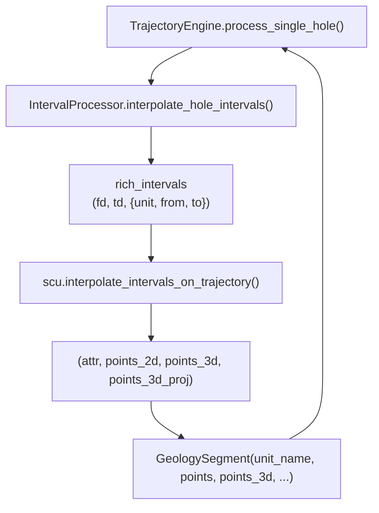

---
tags:
  - secinterp
  - code-walkthrough
  - core
  - drillhole
aliases:
  - interval_processor.py
  - IntervalProcessor
cssclass: secinterp-note
---

# `core/services/drillhole/interval_processor.py`

> [!abstract] Resumen en una línea
> Interpola **intervalos litológicos** a lo largo de la trayectoria proyectada y los envuelve en `GeologySegment` listos para render/export.

**Ruta**: `core/services/drillhole/interval_processor.py` (50 líneas)
**Clase**: `IntervalProcessor`
**Capa**: Core · Drillhole (QGIS-agnóstico)
**Tags**: #secinterp #core #drillhole

---

## 🎯 ¿Por qué existe este archivo?

`TrajectoryEngine` ya tiene la trayectoria proyectada `(depth, x, y, z, dist_along, offset, nx, ny)` y los intervalos crudos `(from, to, lith)`. Falta **muestrear la geología a lo largo de la traza** y convertirla al DTO que consumen renderers y exporters.

| Problema | Solución |
|----------|----------|
| Los intervalos vienen como tuplas crudas | Se enriquecen a dicts `{unit, from, to}` |
| La interpolación matemática es compleja | Se delega en `scu.interpolate_intervals_on_trajectory` |
| Render/export esperan un DTO común | Se empaqueta en `GeologySegment` |
| Sondaje sin intervalos | Early return `[]` |

> [!important] Frontera Core
> Solo usa `core.utils` (matemática pura) y `core.domain` (DTO). No hay QGIS, ni Qt, ni acceso a capas.

---

## 🧬 Diagrama de relaciones



> [!tip] Cómo leer
> `IP` es un **adaptador de forma**: convierte el contrato de `scu` en el contrato de `GeologySegment`.

---

## 📦 Imports — lectura arquitectónica

```python
from sec_interp.core import utils as scu
from sec_interp.core.domain import GeologySegment
```

| # | Observación |
|---|-------------|
| ① | `scu` es el *namespace* de utilidades puras de `core/utils` (`__init__.py` re-exporta la API). |
| ② | `GeologySegment` es el DTO de salida; el processor **no** construye WKT ni geometrías QGIS. |
| ③ | `from __future__ import annotations` presente → convención obligatoria de `core/`. |

---

## 🧱 `interpolate_hole_intervals()` — el único método

```python
def interpolate_hole_intervals(
    self,
    traj: list[tuple[float, float, float, float, float, float, float, float]],
    intervals: list[tuple[float, float, str]],
    buffer_width: float,
) -> list[GeologySegment]:
    """Interpolate intervals along a trajectory and return GeologySegments."""
    if not intervals:
        return []

    rich_intervals = [
        (fd, td, {"unit": lith, "from": fd, "to": td}) for fd, td, lith in intervals
    ]
    # Scu returns (attr, points_2d, points_3d, points_3d_proj)
    tuples = scu.interpolate_intervals_on_trajectory(traj, rich_intervals, buffer_width)

    segments = []
    for attr, points_2d, points_3d, points_3d_proj in tuples:
        segments.append(
            GeologySegment(
                unit_name=str(attr.get("unit", "Unknown")),
                geometry_wkt=None,
                attributes=attr,
                points=points_2d,
                points_3d=points_3d,
                points_3d_projected=points_3d_proj,
            )
        )
    return segments
```

| Parámetro | Rol |
|-----------|-----|
| `traj` | Trayectoria proyectada: `(depth, x, y, z, dist_along, offset, nx, ny)` por vértice |
| `intervals` | Intervalos crudos `(from, to, lith)` |
| `buffer_width` | Ancho de banda de sección (lo usa `scu` para recortar) |
| **Retorno** | `list[GeologySegment]` — un segmento por intervalo interpolado |

### Flujo en dos fases

| Fase | Qué ocurre |
|------|------------|
| 1. Enriquecer | `rich_intervals` transforma `(from, to, lith)` en `(from, to, {unit, from, to})` |
| 2. Delegar | `scu.interpolate_intervals_on_trajectory(...)` devuelve 4-tuplas `(attr, p2d, p3d, p3d_proj)` |
| 3. Empaquetar | Cada 4-tupla se convierte en un `GeologySegment` |

> [!note] `geometry_wkt=None`
> El segmento no lleva WKT: su geometría vive en `points` (2D perfil) y `points_3d` (espacio real). El WKT se materializa más tarde, en la capa de export/render.

---

## 🏛️ Patrones de diseño presentes

| Patrón | Dónde | Propósito |
|--------|-------|-----------|
| **Adapter / Mapper** | `interpolate_hole_intervals` | Contrato de `scu` → contrato de `GeologySegment` |
| **Delegation** | `scu.interpolate_intervals_on_trajectory` | Mantener la matemática fuera del processor |
| **Guard Clause** | `if not intervals: return []` | Evita trabajo y errores en sondajes vacíos |
| **DTO Wrapping** | `GeologySegment(...)` | Unificar la salida con geología de superficie |

---

## 🧾 Resumen de la API

| Símbolo | Firma / Hereda | Uso típico |
|---------|----------------|------------|
| `IntervalProcessor` | `class` (sin herencia) | Inyectado en `TrajectoryEngine` |
| `interpolate_hole_intervals` | `(traj: list[tuple], intervals: list[tuple[float, float, str]], buffer_width: float) -> list[GeologySegment]` | Paso 3 de `process_single_hole` |

---

## 👀 Observaciones y notas

> [!success] Fortalezas
> - **Cohesión alta**: solo adapta datos; toda la matemática está en `core/utils`.
> - **Salida homogénea**: los intervalos de sondaje y la geología de superficie comparten DTO.
> - **Sin QGIS**: testeable con listas de tuplas.

> [!warning] Puntos de atención
> - `unit_name` cae a `"Unknown"` si el atributo `unit` falta; no se loguea el caso.
> - El formato de 8 componentes de `traj` es un **contrato posicional implícito** compartido con `scu`.
> - `geometry_wkt=None` obliga a los consumidores a manejar segmentos sin WKT.

> [!question] Preguntas abiertas
> - ¿Debería validarse la longitud de las tuplas de `traj` antes de delegar?
> - ¿Conviene un `TypedDict`/`NamedTuple` para `traj` en lugar de tuplas posicionales?

---

## 🔗 Notas relacionadas

- [[Index]] — índice de la bóveda
- [[trajectory_engine]] — lo invoca en `process_single_hole`
- [[survey_processor]] — comparte las listas de intervalos/surveys
- [[drillhole_service]] — orquestador de nivel superior
- [[domain]] — define `GeologySegment`
- [[layer_core_utils_geometry_utils]] — utilidades geométricas puras
- [[layer_core_services_drillhole]] — subcapa del pipeline

---

*Nota de la bóveda SecInterp Code Walkthrough — v3.8.0*
