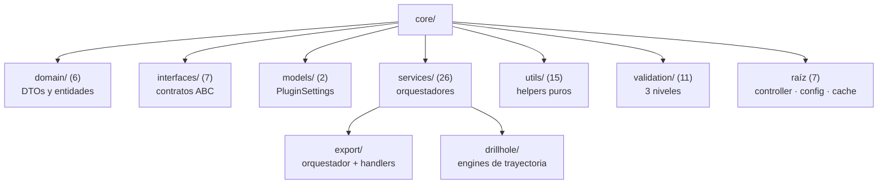

---
tags:
  - secinterp
  - code-walkthrough
  - layer
  - core
aliases:
  - core/
  - Core layer
cssclass: secinterp-layer
---

# `core/` — Core

> [!abstract] Resumen en una línea
> Capa de lógica de negocio **100% QGIS-agnóstica y thread-safe** que convierte primitivos y WKT en DTOs de dominio, sin señales Qt ni objetos QGIS.

**Ruta**: `core/` (74 módulos, ~7.163 líneas)
**Capa**: Core (QGIS-agnóstico)
**Tags**: #secinterp #layer #core

---

## 🎯 Rol de la capa

| Problema | Solución |
|----------|----------|
| La lógica geológica estaba acoplada a QGIS y no se podía testear sin instalarlo | Servicios puros que reciben WKT/dicts y devuelven DTOs |
| Extracción, cálculo y presentación mezclados impedían el testing aislado | **Extract-then-Compute**: la GUI extrae, el core computa |
| Procesos pesados bloqueaban la UI | Core thread-safe: sin `QObject` ni estado compartido mutable |
| Errores silenciosos y difíciles de rastrear | Jerarquía propia `SecInterpError`, con logging antes de re-lanzar |

> [!important] Reglas de la capa
> - ❌ `from qgis.core` / `from qgis.gui` → **PROHIBIDO**
> - ❌ `QgsProject.instance()` / `iface.mapCanvas()` → **PROHIBIDO**
> - ❌ `import PyQt5` / `PyQt6` → **PROHIBIDO** (solo stdlib)
> - ✅ **Thread-safe**: sin señales Qt ni widgets
> - ✅ **Anotaciones de tipo obligatorias** (`from __future__ import annotations`)
> - ✅ WKT/dicts a la entrada, DTOs a la salida

> [!warning] Excepciones pragmáticas conocidas
> `config.py` importa `QgsSettings`/`QCoreApplication` y `data_cache.py` importa `QCoreApplication` para `tr()`. Son fugas de frontera aisladas que el resto de `core/` no replica.

---

## 🧬 Mapa de capas / subcapas

---

## 🧱 Inventario de módulos

| Módulo | Rol |
|--------|-----|
| `controller.py` → [[controller]] | `ProfileController`: orquesta topo, geología, estructuras y sondajes con caché granular |
| `config.py` → [[config]] | `ConfigService`: carga/persiste ajustes en `PluginSettings` |
| `data_cache.py` → [[data_cache]] | `DataCache`: caché en memoria por buckets (`topo`/`geol`/`struct`/`drill`) con TTL |
| `exceptions.py` → [[exceptions]] | Base `SecInterpError` → `ValidationError`, `ProcessingError`, `ExportError` |
| `performance_metrics.py` → [[performance_metrics]] | `MetricsCollector`, `PerformanceTimer` y decorador `@performance_monitor` |
| `algorithms.py` | Reservado para algoritmos puros (el plugin vive en `sec_interp_plugin.py`) |
| `__init__.py` | Docstring del paquete core |
| `domain/` (6) | `[[layer_core_domain]]`: DTOs, entidades, enums y contextos |
| `interfaces/` (7) | `[[layer_core_interfaces]]`: contratos ABC |
| `models/` (2) | `[[layer_core_models]]`: modelo de ajustes |
| `services/` (26) | `[[layer_core_services]]`: geología, estructura, sondajes, preview, export |
| `utils/` (15) | `[[layer_core_utils]]`: geometría, muestreo, IO y parsing |
| `validation/` (11) | `[[layer_core_validation]]`: validación de campo, capa, ruta y proyecto |

---

## 🏛️ Patrones de diseño presentes

| Patrón | Dónde | Propósito |
|--------|-------|-----------|
| **Extract-then-Compute** | `controller.py` | Separar extracción QGIS del cálculo puro |
| **Facade / Orchestrator** | `ProfileController` | Una API sobre varios servicios |
| **Strategy** | `services/`, `validation/` | Intercambiar algoritmos sin tocar el llamador |
| **Dependency Injection** | `ProfileController.__init__` | Inyectar adapters GUI desde el composition root |
| **Lazy Loading + Safe fallback** | `[[safe_loader]]` | Degradar sin romper el plugin |
| **Custom Exception Hierarchy** | `[[exceptions]]` | Errores tipados y localizables |

---

## 🔗 Notas relacionadas

- [[Index]] — índice de la bóveda
- [[layer_core_domain]] · [[layer_core_interfaces]] · [[layer_core_models]] · [[layer_core_services]] · [[layer_core_utils]] · [[layer_core_validation]]
- [[controller]] · [[domain]] · [[exceptions]] · [[config]] · [[data_cache]] · [[performance_metrics]] · [[safe_loader]]
- [[layer_gui]] — capa que extrae y presenta
- [[layer_exporters]] — consumidores de los DTOs

---

*Nota de la bóveda SecInterp Code Walkthrough — v3.8.0*
