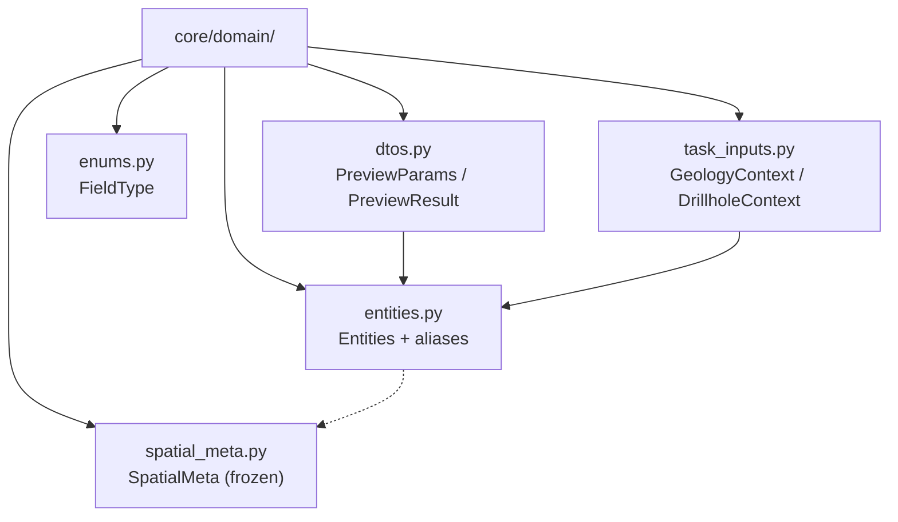

# `core/domain/` — Capa de Dominio

> [!abstract] Resumen en una línea
> Capa que define los DTOs, entidades, enums y contextos que sirven de **contrato de datos** QGIS-agnóstico entre GUI, core y exporters.

**Ruta**: `core/domain/` (6 módulos, ~577 líneas)
**Capa**: Core (QGIS-agnóstico)
**Tags**: #secinterp #layer #core

---

## 🎯 Rol de la capa

| Aspecto | Detalle |
|---------|---------|
| **Qué** | Modelo de dominio puro: entidades, aliases y DTOs |
| **Entrada** | Primitivos y WKT provenientes de los adapters GUI |
| **Salida** | `PreviewParams`, `PreviewResult`, `GeologyContext`, `DrillholeContext` |
| **Depende de** | Solo stdlib (`dataclasses`, `enum`, `typing`) |
| **Consumido por** | `core/services/`, `exporters/`, renderers |

> [!important] Reglas de la capa
> Core = QGIS-agnóstico, thread-safe, `from __future__ import annotations`, tipado estricto, sin `qgis.core/gui/PyQt`.

---

## 🧬 Mapa de capas / subcapas

---

## 🧱 Inventario de módulos

| Módulo | Rol |
|--------|-----|
| `__init__.py` | Fachada de imports; re-exporta todo con `__all__` |
| `entities.py` | Entidades (`GeologySegment`, `DrillholeProjection`…) y aliases (`DomainGeometry = str`) |
| `dtos.py` | `PreviewParams` (entrada + `validate()`) y `PreviewResult` (salida + rangos) |
| `enums.py` | `FieldType(IntEnum)`: espejo de `QVariant.Type` sin PyQt |
| `spatial_meta.py` | `SpatialMeta(frozen)`: puente 2D/3D inmutable |
| `task_inputs.py` | `OutcropSegments`, `GeologyContext`, `DrillholeContext` |

---

## 🏛️ Patrones de diseño presentes

| Patrón | Dónde | Propósito |
|--------|-------|-----------|
| **DTO** | `dtos.py`, `task_inputs.py` | Transportar datos entre capas |
| **Entity** | `entities.py` | Modelar conceptos geológicos |
| **Value Object** | `SpatialMeta` | Inmutabilidad y thread-safety |
| **Enum Bridge** | `FieldType` | Validar tipos sin PyQt |
| **Type Alias** | `DomainGeometry`, `Point2D` | Desacoplar QGIS (WKT) |
| **Import Facade** | `__init__.py` | Superficie de import estable |

---

## 🔗 Notas relacionadas

- [[Index]] — índice de la bóveda
- [[layer_core]] — capa padre
- [[domain]] — nota de archivo del paquete
- [[layer_core_interfaces]] — contratos que consumen estos tipos
- [[layer_core_services]] — servicios que procesan estos DTOs
- [[controller]] — produce los contextos desde la GUI

---

*Nota de la bóveda SecInterp Code Walkthrough — v3.8.0*
