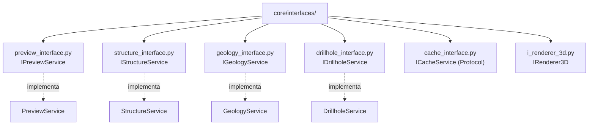

# `core/interfaces/` — Contratos y Puertos

> [!abstract] Resumen en una línea
> Capa de **contratos** (ABCs y un `Protocol`) que define los puertos que implementan los servicios del core y que consumen los adapters de la GUI.

**Ruta**: `core/interfaces/` (7 módulos, ~210 líneas)
**Capa**: Core (QGIS-agnóstico)
**Tags**: #secinterp #layer #core

---

## 🎯 Rol de la capa

| Aspecto | Detalle |
|---------|---------|
| **Qué** | Puertos abstractos (interfaces) para servicios y renderers |
| **Entrada** | Definiciones `@abstractmethod` sin implementación |
| **Salida** | Contratos `IPreviewService`, `IStructureService`, `IGeologyService`… |
| **Depende de** | `abc`, `typing` y DTOs de `core/domain/` |
| **Consumido por** | `core/services/` (implementa), GUI y renderers (usan) |

> [!important] Reglas de la capa
> Core = QGIS-agnóstico, thread-safe, `from __future__ import annotations`, tipado estricto, sin `qgis.core/gui/PyQt`.

---

## 🧬 Mapa de capas / subcapas

---

## 🧱 Inventario de módulos

| Módulo | Rol |
|--------|-----|
| `__init__.py` | Marcador de paquete (solo docstring + `from __future__`) |
| `preview_interface.py` | `IPreviewService.generate_all()` — orquestación del preview |
| `structure_interface.py` | `IStructureService.project_structures()` — proyección estructural |
| `geology_interface.py` | `IGeologyService.build_segments()` — segmentos geológicos |
| `drillhole_interface.py` | `IDrillholeService.process_context()` — procesado de sondajes |
| `cache_interface.py` | `ICacheService` (`Protocol` + `@runtime_checkable`) |
| `i_renderer_3d.py` | `IRenderer3D.render_3d()` / `clear()` — motores 3D |

---

## 🏛️ Patrones de diseño presentes

| Patrón | Dónde | Propósito |
|--------|-------|-----------|
| **Port / Adapter** | Todas las interfaces | Invertir dependencias hacia abstracciones |
| **Abstract Base Class** | `IPreviewService`, `IGeologyService`… | Forzar implementación de contratos |
| **Protocol (structural)** | `ICacheService` | Tipado estructural sin herencia |
| **Dependency Inversion** | Consumo desde services | El core depende de interfaces, no de detalles |

---

## 🔗 Notas relacionadas

- [[Index]] — índice de la bóveda
- [[layer_core]] — capa padre
- [[layer_core_services]] — implementaciones de estos puertos
- [[domain]] — DTOs usados en las firmas
- [[preview_service]] / [[geology_service]] / [[structure_service]] / [[drillhole_service]]
- [[adapters]] — adapters que consumen los contratos

---

*Nota de la bóveda SecInterp Code Walkthrough — v3.8.0*
