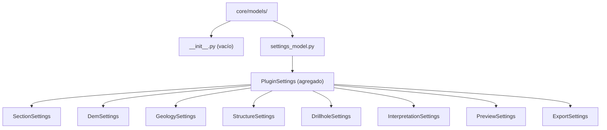

# `core/models/` — Modelo de Configuración

> [!abstract] Resumen en una línea
> Capa que modela la configuración del plugin como **dataclasses validadas** agrupadas en un `PluginSettings` serializable a/desde diccionario.

**Ruta**: `core/models/` (2 módulos, ~178 líneas)
**Capa**: Core (QGIS-agnóstico)
**Tags**: #secinterp #layer #core

---

## 🎯 Rol de la capa

| Aspecto | Detalle |
|---------|---------|
| **Qué** | Modelo de settings tipado por página de la GUI |
| **Entrada** | Dicts planos cargados por `ConfigService` desde `QgsSettings` |
| **Salida** | `PluginSettings` (agregado) y sus sub-modelos por dominio |
| **Depende de** | `dataclasses` y `core/validation/validators` |
| **Consumido por** | `core/config.py`, GUI (`StateManager`, páginas) |

> [!important] Reglas de la capa
> Core = QGIS-agnóstico, thread-safe, `from __future__ import annotations`, tipado estricto, sin `qgis.core/gui/PyQt`.

---

## 🧬 Mapa de capas / subcapas

---

## 🧱 Inventario de módulos

| Módulo | Rol |
|--------|-----|
| `__init__.py` | Marcador vacío; el paquete se importa por ruta completa |
| `settings_model.py` | Define `PluginSettings` y 8 sub-modelos con validación `__post_init__` |

---

## 🏛️ Patrones de diseño presentes

| Patrón | Dónde | Propósito |
|--------|-------|-----------|
| **Settings Object** | Cada sub-dataclass | Agrupar opciones por página |
| **Aggregate / Composition** | `PluginSettings` | Componer todos los grupos con `default_factory` |
| **Validating Constructor** | `__post_init__` + `validate_and_clamp` | Evitar valores fuera de rango |
| **Serialization** | `from_dict()` / `to_dict()` | Persistencia y restauración |

---

## 🔗 Notas relacionadas

- [[Index]] — índice de la bóveda
- [[layer_core]] — capa padre
- [[config]] — `ConfigService` carga y persiste este modelo
- [[settings_page]] — página que edita los settings
- [[state_manager]] — conserva el estado de la UI

---

*Nota de la bóveda SecInterp Code Walkthrough — v3.8.0*
