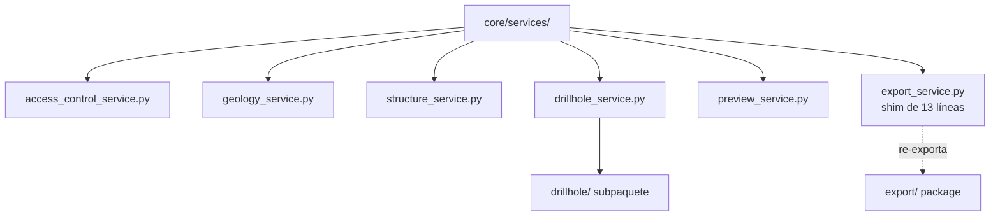

# `core/services/` — Servicios de Negocio

> [!abstract] Resumen en una línea
> Capa de **orquestadores de negocio** que procesan datos ya extraídos (WKT, dicts, primitivos) y devuelven DTOs del dominio, sin tocar QGIS.

**Ruta**: `core/services/` (7 módulos, ~630 líneas)
**Capa**: Core (QGIS-agnóstico)
**Tags**: #secinterp #layer #core

---

## 🎯 Rol de la capa

| Aspecto | Detalle |
|---------|---------|
| **Qué** | Un servicio por dominio: geología, estructura, sondajes, preview, export |
| **Entrada** | Contextos/`PreviewParams` desacoplados producidos por los adapters GUI |
| **Salida** | `GeologyData`, `StructureData`, `DrillholeProjection`, `PreviewResult` |
| **Depende de** | `core/domain/`, `core/interfaces/`, `core/utils/` |
| **Consumido por** | `controller`, tareas GUI y exporters |

> [!important] Reglas de la capa
> Core = QGIS-agnóstico, thread-safe, `from __future__ import annotations`, tipado estricto, sin `qgis.core/gui/PyQt`.

---

## 🧬 Mapa de capas / subcapas

---

## 🧱 Inventario de módulos

| Módulo | Rol |
|--------|-----|
| `__init__.py` | Re-exporta `DrillholeService`, `GeologyService`, `StructureService` |
| `access_control_service.py` | Gate de features restringidas vía `QgsSettings` (`can_export_3d`) |
| `geology_service.py` | `build_segments()`: interpola y ordena segmentos geológicos |
| `structure_service.py` | `project_structures()`: proyecta y calcula dip aparente |
| `drillhole_service.py` | `process_context()`: orquesta el pipeline de sondajes |
| `preview_service.py` | `generate_all()`: orquesta topografía y estructuras del preview |
| `export_service.py` | **Shim de 13 líneas** que re-exporta `ExportService` desde [[layer_core_services_export]] |

---

## 🏛️ Patrones de diseño presentes

| Patrón | Dónde | Propósito |
|--------|-------|-----------|
| **Service Layer** | Todos los `*Service` | Encapsular reglas de negocio |
| **Orchestrator** | `PreviewService`, `DrillholeService` | Componer sub-pasos en un flujo |
| **Facade** | `ExportService` (shim) | API estable sobre el paquete `export/` |
| **Dependency Injection** | Constructores de servicios | Inyectar procesadores/extractores |
| **Backward-compat Shim** | `export_service.py` | No romper imports existentes |
| **Port / Adapter** | Implementan `core/interfaces/` | Depender de contratos |

---

## 🔗 Notas relacionadas

- [[Index]] — índice de la bóveda
- [[layer_core]] — capa padre
- [[layer_core_services_drillhole]] — subcapa del pipeline de sondajes
- [[layer_core_services_export]] — subcapa de exportación
- [[controller]] — invoca y expone estos servicios
- [[geology_service]] / [[drillhole_service]] / [[structure_service]] / [[preview_service]] / [[access_control_service]]

---

*Nota de la bóveda SecInterp Code Walkthrough — v3.8.0*
