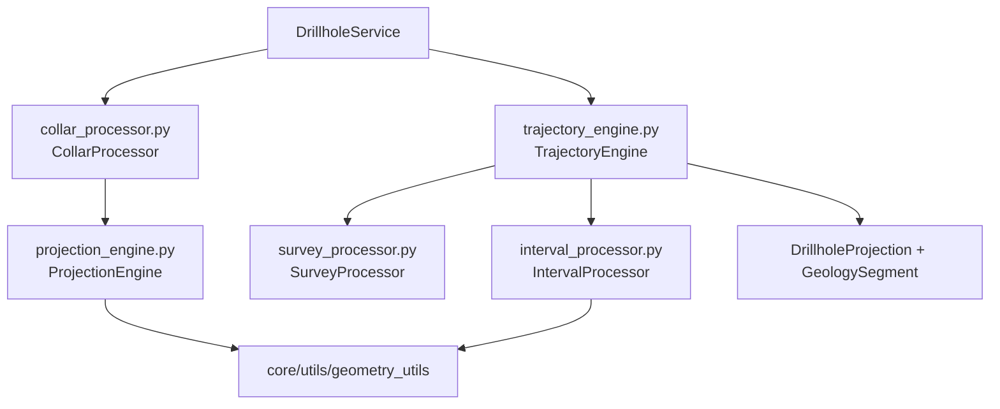

# `core/services/drillhole/` — Pipeline de Sondajes

> [!abstract] Resumen en una línea
> Subcapa de **procesadores puros** que descompone el pipeline de sondajes en collar, survey, trayectoria, intervalos y proyección geométrica.

**Ruta**: `core/services/drillhole/` (6 módulos, ~309 líneas)
**Capa**: Core (QGIS-agnóstico)
**Tags**: #secinterp #layer #core

---

## 🎯 Rol de la capa

| Aspecto | Detalle |
|---------|---------|
| **Qué** | Procesadores especializados del dominio de sondajes |
| **Entrada** | Collar, surveys e intervalos ya desacoplados (`DrillholeContext`) |
| **Salida** | `DrillholeProjection` + `GeologySegment` por intervalo |
| **Depende de** | `core/domain/`, `core/utils/` (geometría) |
| **Consumido por** | `drillhole_service.DrillholeService` |

> [!important] Reglas de la capa
> Core = QGIS-agnóstico, thread-safe, `from __future__ import annotations`, tipado estricto, sin `qgis.core/gui/PyQt`.

---

## 🧬 Mapa de capas / subcapas

---

## 🧱 Inventario de módulos

| Módulo | Rol |
|--------|-----|
| `__init__.py` | Marcador de paquete (docstring + `from __future__`) |
| `collar_processor.py` | Proyecta el collar al perfil y filtra por `buffer_width` |
| `survey_processor.py` | `determine_final_depth()`: máxima profundidad survey/intervalo |
| `interval_processor.py` | Interpola intervalos sobre la trayectoria → `GeologySegment` |
| `trajectory_engine.py` | Orquesta trayectoria, proyección e intervalos por sondaje |
| `projection_engine.py` | `project_point_to_line()`: proyección geométrica pura |

---

## 🏛️ Patrones de diseño presentes

| Patrón | Dónde | Propósito |
|--------|-------|-----------|
| **Pipeline / Chain** | `process_single_hole` | Encadenar pasos por sondaje |
| **Facade** | `TrajectoryEngine` | Ocultar la secuencia de sub-pasos |
| **Strategy / DI** | Procesadores inyectados | Intercambiar implementaciones |
| **Static Utility** | `ProjectionEngine` | Cálculo geométrico sin estado |
| **Decomposition** | 6 módulos | Una responsabilidad por archivo |

---

## 🔗 Notas relacionadas

- [[Index]] — índice de la bóveda
- [[layer_core_services]] — capa padre
- [[drillhole_service]] — servicio orquestador de esta subcapa
- [[collar_processor]] / [[survey_processor]] / [[interval_processor]]
- [[trajectory_engine]] / [[projection_engine]]
- [[layer_core_domain]] — `DrillholeProjection`, `GeologySegment`, `SpatialMeta`

---

*Nota de la bóveda SecInterp Code Walkthrough — v3.8.0*
